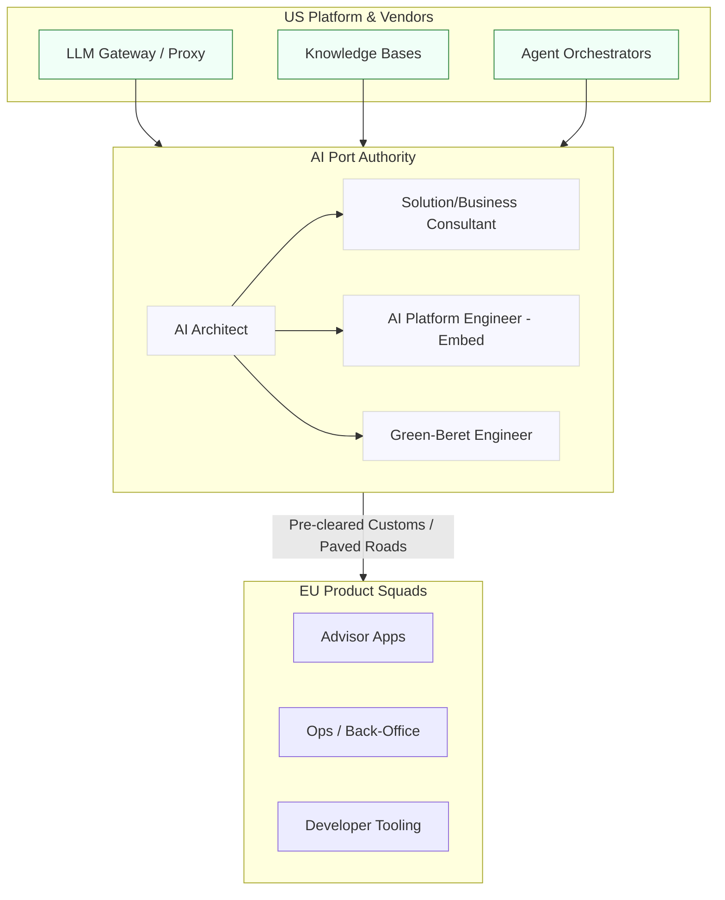
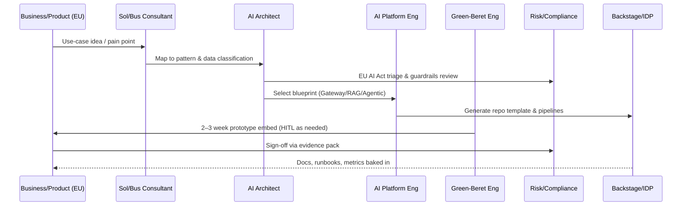
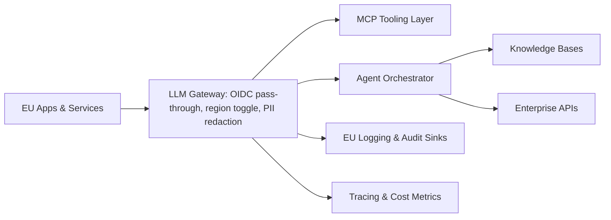
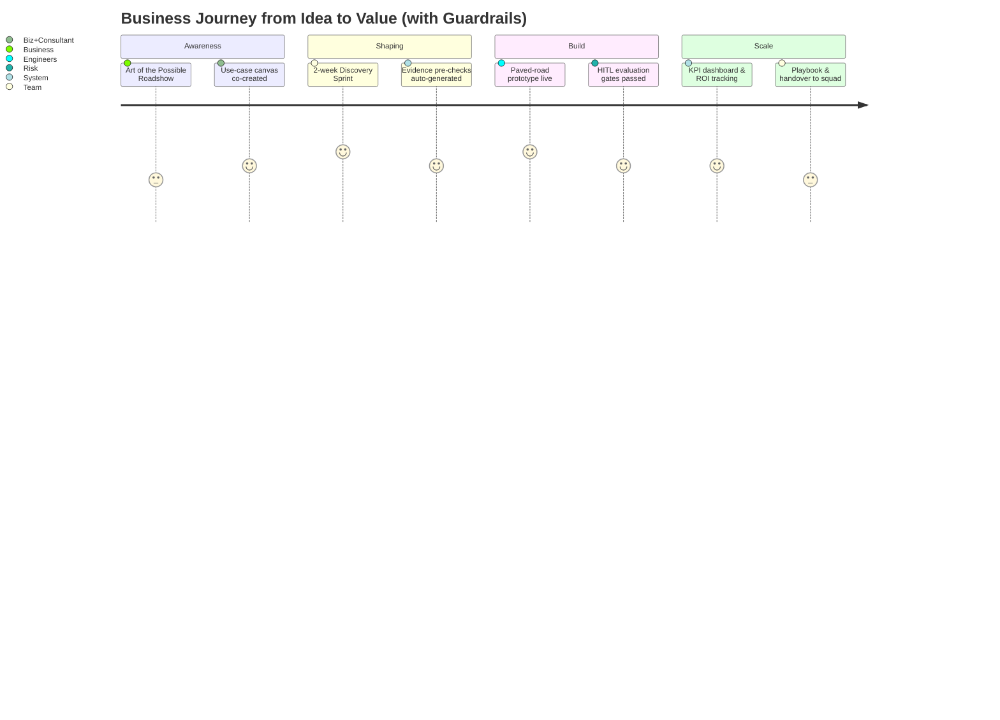
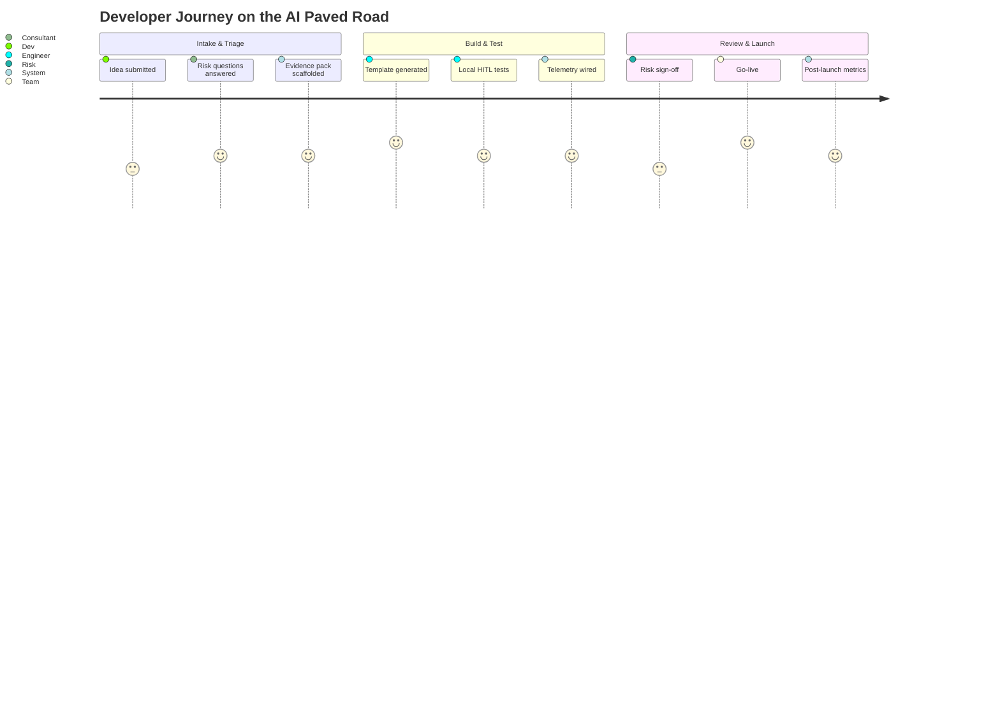
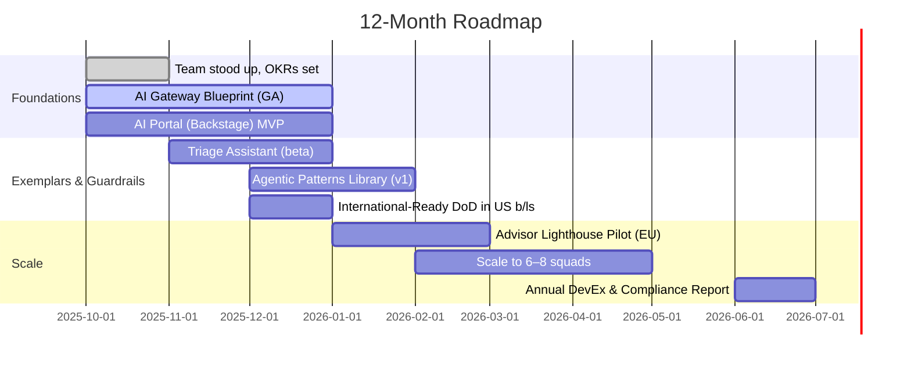

# AI Enablement Team (Europe) — Proposal v2

> **Audience:** Senior IT & Platform Executives  
> **Author:** Head of Architecture & Platform Engineering (Europe)

---

## 0) Elevator Pitch & Analogy

**One‑liner:** Europe needs AI that’s **international‑ready by default**—not N+1. A small **AI Enablement Team** inside Architecture & Platform Engineering turns fragmented efforts into **paved roads** that are fast, compliant, and reusable.

**Analogy — _Port Authority for AI_:** AI capabilities are like container ships arriving from global vendors and US platform teams. Today, our port is ad‑hoc: ships wait offshore, berths are improvised, and customs (compliance) is last‑minute. The **AI Enablement Team** is our **Port Authority**—it standardises **shipping lanes** (paved roads), pre‑clears **customs** (evidence packs, data residency, audit), and sends **tugboats** (Green‑Beret engineers) to help product squads berth quickly. Result: **faster throughput, lower risk, no grey‑market piers.**



---

## 1) Executive Summary

**Ask:** Stand up a **3–4 person AI Enablement Team** within **Architecture & Platform Engineering (Europe)** to make enterprise AI tools **international‑ready by default**, accelerate compliant adoption, and unblock squads with hands‑on exemplars and embedded support.

**12‑month outcomes:**

- ≥ **80%** of new enterprise AI features ship **international‑ready at GA** (identity pass‑through, region selection, EU logging, consent & audit).
    
- **Time‑to‑adopt** AI capability in Europe **↓ 50%** (first request → squad integration).
    
- **Compliance lead‑time ↓ 40%** via standards, intake triage, and automated evidence packs.
    

---

## 2) The Narrative — Our Blockers & The Two‑Sided Risk

### Blockers today

- **International lag:** EU/International requirements land post‑GA → rework, parallel tooling, audit risk.
    
- **DIY developer experience:** No single **paved road** for gateway/MCP, RAG, agentic workflows, telemetry, cost controls.
    
- **Late compliance:** EU obligations (AI, privacy, operational resilience) assessed late, not embedded as code.
    
- **Signal gaps:** Weak metrics for adoption, latency, reliability, and cost to guide investment.
    

### The two‑sided risk we must balance

- **Regulatory/operational risk if we rush:** Shadow integrations, missing audit trails, unclear model & data lineage.
    
- **Strategic risk if we stall:** We miss the **innovation window** (advisor productivity, ops automation, hyper‑personalisation), talent morale declines, and the **region tax** persists on every AI initiative.
    

### The move

Create a small, high‑leverage **AI Enablement Team** that:

1. **Embeds upstream** with US platform teams so **international‑ready** is the default, not an afterthought.
    
2. Publishes **paved roads** (IDP templates, blueprints, runbooks) for gateways, RAG, agentic patterns, evals, and telemetry.
    
3. **Co‑pilots squads** via short embeds to land exemplars that are compliant from day zero.
    
4. Operates an **intake & triage** funnel that auto‑generates evidence packs to **speed approvals**—guardrails, not gates.
    

---

## 3) Team Shape, Roles & Cadence

**Team (3–4 FTE):**

- **AI Architect (L4)** — Pattern owner & exemplar lead; MCP/A2A standards; identity pass‑through; security & telemetry envelopes; reference designs.
    
- **Solution/Business Consultant (L3–L4)** — Rapid discovery, stakeholder alignment, value hypotheses; compliance liaison; executive‑ready materials.
    
- **AI Platform Engineer (L3)** — Embed with US platform teams; international‑ready by default (region, tenancy, logs, i18n); IDP templates.
    
- **AI Specialist “Green‑Beret” Engineer (L3)** — Short embeds with squads; hands‑on agentic/RAG delivery; performance tuning; teach‑backs.
    

> **Optional:** **PO/PM (L3)** across Architecture, Platform Eng, and AI Enablement to manage OKRs, backlog, and comms.



---

## 4) Ways of Working

- **Embedded & rotating:** 4–8‑week embeds in US platform teams (gateway, Bedrock, knowledge bases) to land EU requirements at source.
    
- **Paved roads > tickets:** Golden examples + templates in **Backstage** (TechDocs, scaffolder, service catalog).
    
- **Agentic from day one:** Standardise **MCP** for tool access; support Bedrock Agents and reliable multi‑agent patterns (e.g., LangGraph/AutoGen).
    
- **Evidence by default:** Every blueprint emits an **audit artefact set** (purpose, data flow, DPIA hooks, model provenance, logs).
    
- **Measure DevEx:** Quarterly developer experience survey and live telemetry (adoption, latency, reliability, cost/1000 calls).
    



### 4.1) Business Co‑Enablement & Change (Not Tech‑Only)

AI enablement is **not a technology initiative in isolation**. It must be a **joint venture with the business, Risk/Compliance, and Operations** to both shape demand and ensure responsible, value‑led delivery.

**Objectives:**

- **Inspire & educate** – communicate the _art of the possible_ with concrete, regulated exemplars.
    
- **Co‑shape demand** – turn vague ideas into **investable use‑cases** with clear ROI hypotheses.
    
- **De‑risk early** – embed guardrails and evidence packs from the first conversation (guardrails, not gates).
    
- **Scale capability** – create a repeatable playbook and a community of AI champions across LOBs.
    

**Enablement menu (for Business & Ops):**

- **Art‑of‑the‑Possible Roadshow (60–90 min):** executive brief + live demo on our paved roads.
    
- **Use‑Case Ideation Workshop (90 min):** value mapping, feasibility, compliance pre‑checks.
    
- **Discovery Sprint (2 weeks):** problem framing → prototype on paved roads → value & risk evidence.
    
- **Lighthouse Program:** 2–3 early adopters per quarter; publish results & templates back to the portal.
    
- **AI Champions Network:** nominated SMEs in each LOB; monthly clinic, shared playbook.
    
- **Office Hours & Drop‑ins:** weekly; staffed by the Green‑Beret engineer + consultant.
    

**Role-by-role in business enablement:**

- **Architect:** Thought leadership, playbooks, exec briefings; ensures patterns & guardrails are consumable by non‑tech audiences.
    
- **Solution/Business Consultant:** Facilitates workshops, captures value hypotheses, owns the discovery sprint backlog, and translates risk guidance.
    
- **Platform Engineer:** Turns outcomes into **click‑to‑start** templates; ensures telemetry/cost tags are baked in.
    
- **Green‑Beret Engineer:** Live demos, hands‑on embeds during discovery; coaches AI Champions.
    

**Business‑facing KPIs:** #people trained, #workshops/sprints, idea→pilot conversion rate, **time from idea → pilot**, business CSAT/NPS, and _realised_ hours saved or revenue/prospect lift from lighthouses.



**Comms & cadence:** monthly exec brief; bi‑monthly showcase; Slack channel for AI Champions; quarterly impact report.

---

## 5) Initial Projects (90–120 Days) — With Role‑by‑Role Actions

### A) **International‑Ready AI Gateway Blueprint (MCP + Bedrock Agents)**

**Goal:** One standard path for apps to call LLMs/tools with identity pass‑through, audit, region selection, and consent logging.

- **Architect:** Define auth flows, tenancy model, logging schema; select MCP tool spec & agent orchestration; publish reference design.
    
- **Solution Consultant:** Gather biz/ops needs (latency SLOs, redaction, residency), align evidence requirements with compliance.
    
- **Platform Eng:** Embed with US gateway team to add region toggles, OIDC claims pass‑through, trace IDs, EU logging sinks; publish Backstage template.
    
- **Green‑Beret:** Build a **hello‑world** app + load test; “day‑0 → day‑1” runbook; sample CI/CD.
    

### B) **AI Use‑Case Triage Assistant (EU AI Act)**

**Goal:** Reduce compliance cycle time; classify risk and auto‑generate evidence packs (purpose, data, DPIA hooks, model disclosures).

- **Architect:** Map risk questions to obligations (prohibited/high‑risk/GPAI) and required artefacts.
    
- **Solution Consultant:** Rapid discovery with Legal/Risk; define SLAs and acceptance criteria.
    
- **Platform Eng:** Backstage plugin; ticketing integration; immutable storage for outputs.
    
- **Green‑Beret:** Add provenance and explainability prompts; wire traces to telemetry.
    

### C) **Agentic Patterns Library (LangGraph/AutoGen)**

**Goal:** Three production‑ready exemplars: (a) **RAG+Tools**, (b) **Planner→Executor** case handling, (c) **Batch back‑office agent**.

- **Architect:** Choose orchestration, standardise HITL and guardrails; define eval harness.
    
- **Solution Consultant:** Select two **lighthouse squads**; quantify value hypotheses.
    
- **Platform Eng:** Repo templates with tests, tracing, secrets policy, **golden CI/CD**.
    
- **Green‑Beret:** Pair with squads; tune performance; document gotchas.
    

### D) **Backstage “AI Portal” (IDP)**

**Goal:** One home for blueprints, docs‑as‑code, component catalog, and golden pipelines.

- **Architect:** Information architecture & governance model.
    
- **Solution Consultant:** Exec‑friendly guides; “which pattern when”.
    
- **Platform Eng:** Stand up plugins, auth, scaffolder templates; integrate gateway scaffolds.
    
- **Green‑Beret:** 10‑minute build‑along videos; adoption analytics.
    

### E) **Developer AI Toolkit v1 (Copilot + PromptOps)**

**Goal:** Standardise IDE copilot, repo hygiene, prompt registry, PR guardrails (secrets/PII lint).

- **Architect:** Policy & metrics (quality, speed).
    
- **Solution Consultant:** Capture pain points; track time‑savings & quality.
    
- **Platform Eng:** VS Code/JetBrains configs; pre‑commit hooks; org settings.
    
- **Green‑Beret:** Workshops & office hours.
    

### F) **Advisor‑Facing Lighthouse Pilot**

**Goal:** Notes→actions summarisation for one EU adviser workflow **on our compliant stack**.

- **Architect:** Stack choice (gateway + KB + agent workflow) & evaluation plan.
    
- **Solution Consultant:** Rapid discovery; ROI (minutes saved, CRM completeness).
    
- **Engineers:** Build the pilot; deliver the audit pack; publish a reusable template.
    

### G) **International‑Ready Definition of Done (DoD)**

**Goal:** Ensure new enterprise AI features ship **EU‑ready at GA**, not N+1.

- **Architect/Platform Eng (embed):** Codify DoD in US team pipelines (region, identity, logs, i18n); add to PR checks.
    

### H) **Business Co‑Enablement Starter Pack**

**Goal:** Bring the business on the journey; demystify AI; rapidly identify high‑value, compliant use‑cases.

- **Architect:** Build an exec‑ready _Art‑of‑the‑Possible_ deck plus 3 regulated exemplars.
    
- **Solution Consultant:** Run **use‑case ideation** (value mapping, risk prompts); lead a **2‑week discovery sprint** playbook.
    
- **Platform Eng:** Publish a _Discovery Sprint Template_ (repo, CI/CD, logging, cost tags); wire a light **business sandbox** on the AI Portal.
    
- **Green‑Beret:** Live demo + prototype during sprint; capture lessons into the portal; coach **AI Champions**.
    
- **Deliverables:** Roadshow kit, workshop canvas, discovery sprint report (value & risk), prototype repo, and adoption metrics dashboard.
    

---

## 6) Concrete Use Cases/Examples (EU Focus)

1. **Advisor Meeting Copilot** — real‑time note capture, action extraction, CRM auto‑update; **human‑in‑the‑loop** approval.
    
2. **Ops Reconciliation Agent** — triages trade breaks, drafts remediation steps, learns from past resolutions.
    
3. **Marketing Compliance Assistant** — pre‑checks disclosures, flags risky claims, produces an evidence trail.
    
4. **AML/KYC Triage Helper** — surfaces risk signals, drafts enhanced due diligence checklists (handoff to analysts).
    
5. **Dev PromptOps** — prompt registry, reusable tool adapters (MCP), evaluation harness with telemetry.
    

> Each use case ships as a **Backstage template** with: code, pipeline, runbook, logging, cost tags, and an **audit artefact bundle**.



---

## 7) KPIs, Governance & RACI

**Leading indicators:**

- % enterprise AI features **international‑ready at GA**
    
- **Time‑to‑adopt** AI capability (request → first production use)
    
- squads onboarded to paved roads; **AI Portal** usage
    
- DevEx survey delta (quarterly)
    

**Lagging indicators:**

- Audit findings closed
    
- Incidents due to AI misconfiguration
    
- **Compliance lead‑time** per use‑case
    

**RACI (summary)**

|Activity|Architect|Sol/Bus Consultant|AI Platform Eng|Green‑Beret Eng|Risk/Compliance|
|---|--:|--:|--:|--:|--:|
|Patterns & Standards|**R**|C|C|C|C|
|Intake & Discovery|C|**R**|C|C|C|
|International‑Ready Enablement|C|C|**R**|C|C|
|Prototyping & Exemplars|**A**|C|**R**|**R**|C|
|Evidence Packs (EU AI Act)|C|**R**|C|C|**A**|

---

## 8) Roadmap & Cadence



---

## 9) Operating Model & Interfaces

**Cadence:** Weekly triage; bi‑weekly standards forum; monthly risk sync; quarterly DevEx survey.  
**Interfaces:** Architecture Council; US Platform Leads; Risk & Compliance; Product & LOB CTOs; DevEx/DPE.

**Backstage AI Portal — skeleton**

```
ai-portal/
├─ templates/
│  ├─ gateway-international-ready/
│  ├─ agentic-langgraph-exemplar/
│  ├─ triage-assistant/
├─ docs/
│  ├─ patterns/
│  ├─ guardrails/
│  └─ which-pattern-when.md
├─ plugins/
│  ├─ triage-assistant/
│  └─ telemetry-dashboard/
└─ policies/
   ├─ identity-pass-through.md
   ├─ pii-redaction.md
   └─ audit-artifacts.md
```

---

## 10) Investment & Rationale

- **Year 1:** **3–4 FTEs** (mix of L3–L4) + optional **PO/PM (L3)**.
    
- **Cost offset:** Lower rework (EU at GA), faster compliant adoption, reduced compliance cycle time, higher reuse via templates, measurable DevEx gains.
    
- **Strategic upside:** Earlier value realisation (advisor productivity, ops automation), improved developer satisfaction, stronger audit posture.
    

---

## 11) Risks & Mitigations

- **Scope creep** → **PO/PM** enforces OKRs; intake guardrails.
    
- **Tool sprawl** → MCP‑based adapters; supported tool matrix; deprecation policy.
    
- **Compliance ambiguity** → Living evidence checklist; monthly risk syncs; “compliance as code” in templates.
    

---

## 12) Slide‑Friendly Openers

- **15s:** “We’re creating a **Port Authority for AI** in Europe—standard lanes, pre‑cleared customs, and tugboats on call—so every AI capability docks fast, safely, and audit‑ready.”
    
- **30s:** “EU enablement lands last. The AI Enablement Team embeds upstream to make **international‑ready the default**, publishes paved roads, and turns compliance into code—balancing regulatory risk with the risk of missing the innovation window.”
    
- **90s:** “US platforms ship fast; Europe pays a region tax later. We fix this with a small team in Architecture & Platform Eng. They embed with US teams to land EU needs at GA, ship an AI Portal of paved roads, run short squad embeds, and auto‑generate evidence packs. Outcome: faster adoption, lower risk, measurable productivity and business impact—without sacrificing governance.”
    

---

## 13) Appendix — Glossary

- **MCP (Model Context Protocol):** Standard way to expose tools/data to LLMs.
    
- **Agentic orchestration:** Multi‑agent workflows (planner/executor, HITL) with guardrails.
    
- **Backstage/IDP:** Internal developer portal for templates, catalogs, docs, and golden pipelines.
    
- **HITL:** Human‑in‑the‑loop reviews for safety, quality, and accountability.