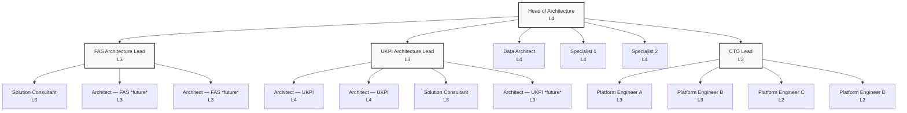
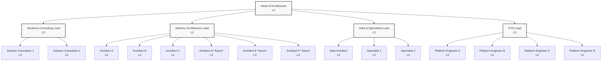
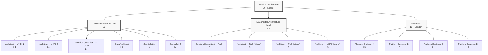

Below are three self-contained Mermaid definitions—one per re-org option.  
Paste each block into any Mermaid-enabled viewer (e.g. Markdown preview, mermaid.live) to see the chart.

---

### 1 · Two LOB-Aligned Leads (present → post-hire)

---

### 2 · Capability-Based Leads (matrix model)

---

### 3 · Hybrid Location / LOB Leads (London + Manchester)

_Legend_

- **Gray boxes** = first-line managers (Level 3)
    
- “_(future)_” nodes represent approved yet-to-hire roles
    
- Each platform engineer counts as 0.5 FTE for managerial span, though shown individually for clarity.