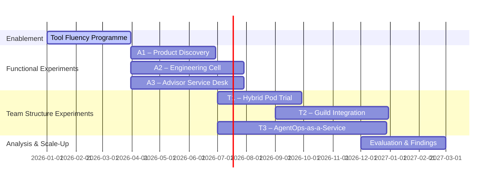

## Title: Hybrid Experimentation Charter — 2026  
Author: Head of Architecture & CTO (EU)  
Audience: ExCo, AI Enablement Council, Product & Technology Leadership  
Version: v1.0

# 1. Purpose & Vision

To design the **next-generation hybrid human+agent organisation**, we will execute a structured programme of experiments combining AI functionality pilots and organisational design trials. Our goal is to obtain **empirical evidence** on how teams, roles, and workflows evolve when augmented by AI — and to identify the tools, skills, and operating structures that yield measurable improvements in speed, quality, safety, and employee engagement.

---

# 2. Strategic Context

- The European business is in a **high-growth phase**; increasing product team capacity safely will accelerate client and advisor adoption of our portfolios and platforms.
    
- The US business is **mature and efficiency-focused**; insights from our experiments will also inform global standards, tooling, and governance.
    
- This programme aligns to the broader technology vision of creating an **AI-ready organisation** that is compliant by design, agent-enabled, and human-accountable.
    

---

# 3. Guiding Principles

1. **Humans Stay Accountable** – agents draft and automate, humans sign and own.
    
2. **Capacity Dividend ≠ Headcount Reduction** – efficiency gains create more teams, not redundancies.
    
3. **Policy Lives in the Pipeline** – rules and regulatory controls embedded as policy-as-code.
    
4. **Evidence by Default** – every agent interaction produces logged proof of compliance and performance.
    
5. **Prototype First, Scale with Proof** – experimentation precedes industrialisation.
    
6. **Co-Design Across Business + Tech** – business and technology jointly own outcomes.
    
7. **Career Evolution, Not Obsolescence** – roles evolve toward higher cognitive and design value.
    

---

# 4. Programme Structure

The programme runs across **two integrated workstreams**:

### A. AI Functionality Experiments — _What We Build_

Three production-facing pilots leveraging enterprise AI platforms.

|ID|Name|Objective|Core Tools|Key Roles|Primary Metric|
|---|---|---|---|---|---|
|A1|**AI-Augmented Product Discovery**|Reduce time and ambiguity in product discovery and documentation.|Microsoft Copilot, Writer, Bedrock|PM (Problem Framer), Designer, Agent Wrangler|-40% BRD creation time|
|A2|**Agentic Engineering Cell**|Measure developer productivity & quality impact using coding and testing agents.|Claude Code, GitHub Copilot, Bedrock EvalOps|Tech Lead, Builder-Curators, Scenario Engineer|+20% story throughput|
|A3|**AI-Enhanced Advisor Service Desk**|Improve advisor experience and service efficiency with hybrid workflows.|Writer, Microsoft Copilot, Bedrock Guardrails|Advisor Coach, Ops Analyst, Agent Trainer|+10% FCR, -15% AHT|

### B. Team & Role Structure Experiments — _How We Work_

Organisational pilots focused on the composition, leadership, and enabling infrastructure for hybrid pods.

|ID|Name|Objective|Scope|Success Metric|
|---|---|---|---|---|
|T1|**Hybrid Pod Structure Trial**|Compare 7-person vs. 4-person+agents pod efficiency.|FAS and UKPI product teams|Lead time ↓20%; engagement ↑10pp|
|T2|**Cross-Functional Guild Integration**|Validate the value of central Green-Beret Guild support.|Architecture, Platform, and Product pods|Rework ↓25%; incident rate ↓30%|
|T3|**AgentOps-as-a-Service Model**|Test centralised governance and monitoring of production agents.|Platform CoE|MTTR <24h; 0 critical policy violations|

---

# 5. Tool Fluency & Enablement (Precursor Phase)

To prepare participants, a **Tool Fluency Programme** will run in Q1–Q2 2026, ensuring hands-on familiarity with the core AI tools.

|Tool|Focus|Target Roles|Intro Method|Maturity Goal|
|---|---|---|---|---|
|**Amazon Bedrock**|Enterprise LLM/agent foundation, guardrails, orchestration|Architects, Platform Eng, Data/ML Eng|Guided labs on internal LLM Gateway|Deploy agents safely with audit logs|
|**Claude Code**|Reasoning-driven coding assistant|Engineers, Tech Leads, QA|Pair-programming workshops|Refactor/test with <5% rework|
|**GitHub Copilot**|IDE-integrated code & doc generation|Engineers, QA|IDE enablement + metrics dashboard|80% repos using Copilot daily|
|**Microsoft Copilot**|Productivity and documentation assistant|PMs, Ops, HR, Finance|Use in BRD, meeting, Excel tasks|BRD draft time ↓40%|
|**Writer**|Controlled-language content generation|Marketing, Advisor Support, Compliance|Pilot fund factsheet creation|2x faster doc review cycle|

**Fluency format:**

1. **Foundations (2 weeks)** – training modules and practice labs.
    
2. **Applied Playgrounds (4 weeks)** – guided challenges per role.
    
3. **Role Clinics (monthly)** – internal demos of real-world uses.
    
4. **Telemetry Dashboard** – track adoption, sentiment, and performance.
    

---

# 6. Experiment Timeline (Illustrative)

---

# 7. Data, Metrics & Governance

|Dimension|Metric|Target|Owner|
|---|---|---|---|
|Delivery|Lead time for change|↓ ≥20%|Product & Eng Leads|
|Quality|Change-fail rate|≤ baseline|QA & Scenario Eng|
|Adoption|Tool usage rate|≥60%|AI Enablement Team|
|Engagement|Employee sentiment (survey)|↑10pp|HR & PMO|
|Compliance|Policy violations|Zero critical|Risk & Compliance|
|Learning|Documented role evolution|≥3 new validated roles|Architecture & HR|

Governance handled through the **Hybrid Operating Council (HOC)** chaired by COO with CPO, CTO, CHRO, and CCO representation. Quarterly reviews decide _scale, pivot, or sunset_ per experiment.

---

# 8. Expected Role Evolution

|Emerging Role|Origin|Description|
|---|---|---|
|**Agent Wrangler**|Tech Lead / Architect|Designs and orchestrates multi-agent workflows.|
|**Scenario Engineer**|QA|Builds evaluation suites and safety tests for AI.|
|**Prompt Curator**|Senior Engineer / BA|Maintains prompt libraries and benchmarks.|
|**Evidence Lead**|Compliance / Risk|Oversees audit packs, model cards, and guardrails.|
|**Agent SRE**|Platform Ops|Manages AgentOps runtime, cost, and drift.|
|**AI Advisor Coach**|Advisor Services|Uses copilots to augment advisor productivity and insight.|

---

# 9. Success Criteria

- Hard data on role evolution, performance, and satisfaction.
    
- Proven ROI of agent augmentation (time saved, quality maintained).
    
- Playbooks for policy-as-code, eval harnesses, and role-based enablement.
    
- Final report with recommendations for **2027 organisation design** and **scaling strategy**.
    

---

# 10. Narrative Anchor (for storytelling)

> _“From Pacioli’s ledgers to joint-stock voyages, from London’s clearinghouses to Jack Bogle’s index funds — each leap made finance faster, safer, and more scalable.  
> Our hybrid human+agent transformation is the next leap: a way to double our product teams and enhance advisor service, not by replacing people, but by giving them digital colleagues who extend their reach.  
> These experiments are our modern voyages — governed ports, proven routes, and new opportunities ahead.”_