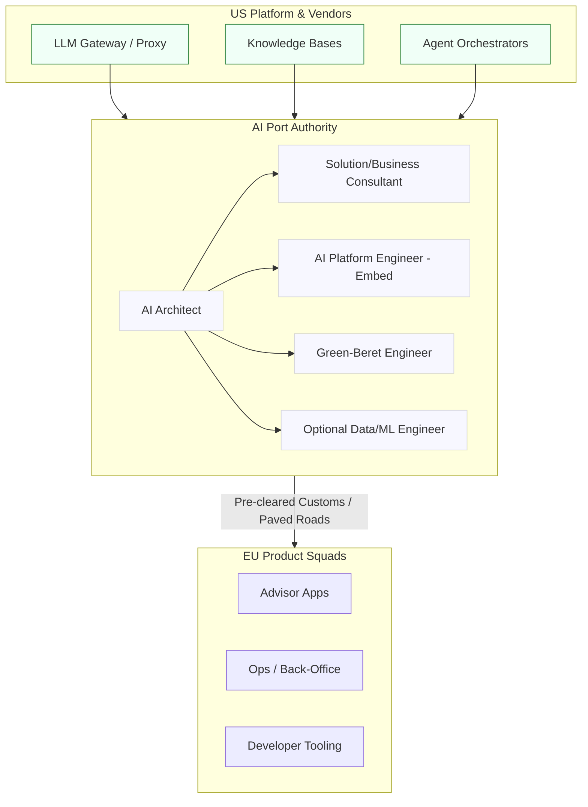
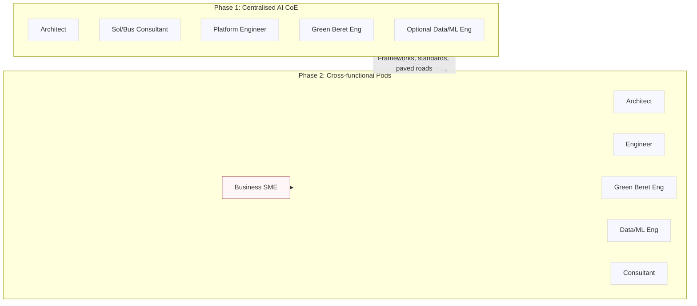
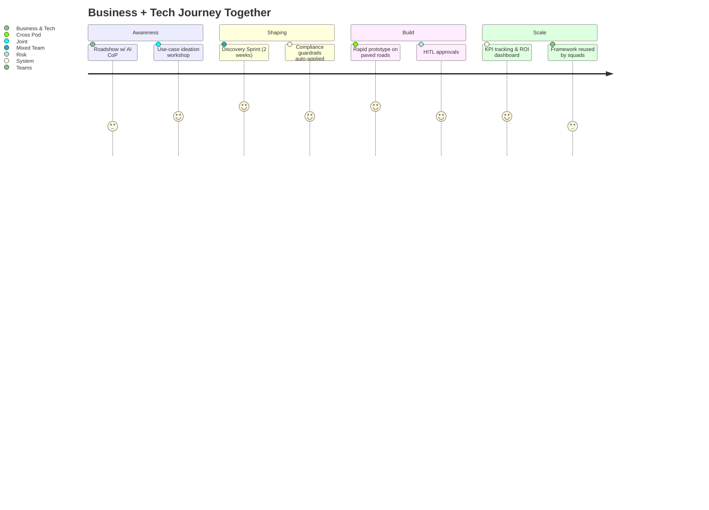
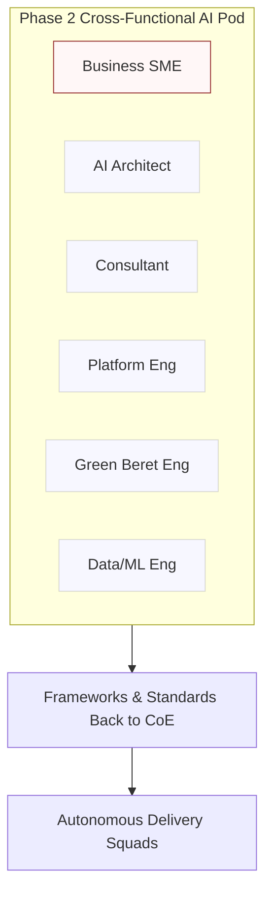

# AI Enablement Team (Europe) — Proposal v3

> **Audience:** Senior IT & Platform Executives  
> **Author:** Head of Architecture & Platform Engineering (Europe)

---

## 0) Elevator Pitch & Analogy

**One‑liner:** Europe needs AI that’s **international‑ready by default**—not N+1. A small **AI Enablement Team** inside Architecture & Platform Engineering turns fragmented efforts into **paved roads** that are fast, compliant, and reusable.

**Analogy — _Port Authority for AI_:** AI capabilities are like container ships arriving from global vendors and US platform teams. Today, our port is ad‑hoc: ships wait offshore, berths are improvised, and customs (compliance) is last‑minute. The **AI Enablement Team** is our **Port Authority**—it standardises **shipping lanes** (paved roads), pre‑clears **customs** (evidence packs, data residency, audit), and sends **tugboats** (Green‑Beret engineers) to help product squads berth quickly. Result: **faster throughput, lower risk, no grey‑market piers.**

---

## 1) Executive Summary

**Ask:** Stand up a **3–5 person AI Enablement Team** within **Architecture & Platform Engineering (Europe)** to make enterprise AI tools **international‑ready by default**, accelerate compliant adoption, and unblock squads with hands‑on exemplars and embedded support.

**12‑month outcomes:**

- ≥ **80%** of new enterprise AI features ship **international‑ready at GA**.
    
- **Time‑to‑adopt** AI capability in Europe **↓ 50%**.
    
- **Compliance lead‑time ↓ 40%** via standards, intake triage, and automated evidence packs.
    
- **Business adoption ↑** through partnership with the **AI Center of Practice (CoP)** and early lighthouse use‑cases.
    

---

## 2) The Narrative — Our Blockers & The Two‑Sided Risk

### Blockers today

- **International lag:** EU/International requirements land post‑GA → rework, parallel tooling, audit risk.
    
- **DIY developer experience:** No single **paved road** for gateway/MCP, RAG, agentic workflows, telemetry, cost controls.
    
- **Late compliance:** EU obligations (AI, privacy, operational resilience) assessed late, not embedded as code.
    
- **Signal gaps:** Weak metrics for adoption, latency, reliability, and cost to guide investment.
    

### The two‑sided risk we must balance

- **Regulatory/operational risk if we rush:** Shadow integrations, missing audit trails, unclear model & data lineage.
    
- **Strategic risk if we stall:** We miss the **innovation window** (advisor productivity, ops automation, hyper‑personalisation), talent morale declines, and the **region tax** persists on every AI initiative.
    

### The move

Create a small, high‑leverage **AI Enablement Team** that:

1. **Embeds upstream** with US platform teams so **international‑ready** is the default.
    
2. Partners directly with the **Business AI Center of Practice (CoP)** to bring business and technology on the journey together.
    
3. Publishes **paved roads** for gateways, RAG, agentic patterns, evals, and telemetry.
    
4. **Co‑pilots squads** via short embeds to land exemplars that are compliant from day zero.
    
5. Acts as a **Center of Excellence (CoE)** initially, building frameworks and standards that delivery teams can later self‑serve.
    

---

## 3) Team Shape, Roles & Cadence

**Phase 1 (Centralised CoE):**

- **AI Architect (L4)** — Standards, patterns, exemplars.
    
- **Solution/Business Consultant (L3–L4)** — Business discovery, value mapping, compliance liaison.
    
- **AI Platform Engineer (L3)** — Embedded with US teams; ensures EU readiness.
    
- **AI Specialist “Green‑Beret” Engineer (L3)** — Hands‑on embeds; rapid prototyping.
    
- **Optional: Data/ML Engineer (L3)** — Data pipelines, fine‑tuning, model monitoring, ML ops.
    
- **Optional: PO/PM (L3)** — Backlog & comms.
    

**Phase 2 (Cross‑functional teams):**

- Business SMEs join forces with the AI Enablement Team to deliver **rapid pilots** and **innovative solutions** in mixed pods.
    
- Team becomes less centralised, with frameworks enabling **delivery teams to run autonomously**.
    
- AI Enablement pivots towards **emerging tech, trends, and standards**, keeping the frontier sharp.
    

---

## 4) Business Co‑Enablement & Change (Not Tech‑Only)

AI enablement is **not a technology initiative in isolation**. It must be a **joint venture with the Business AI CoP, Risk/Compliance, and Operations** to both shape demand and ensure responsible, value‑led delivery.

**Phase 1 focus:**

- Operate as a **Center of Excellence** with strong partnership to the **AI CoP**.
    
- Run **Art‑of‑the‑Possible roadshows** and **Discovery Sprints** jointly with business.
    
- Build **frameworks, standards, and paved roads** for compliance, telemetry, and DevEx.
    
- Coach **AI Champions** across LOBs.
    

**Phase 2 focus:**

- Mature into **cross‑functional pods** mixing technologists and business SMEs.
    
- Deliver **rapid pilots and innovative solutions** side‑by‑side.
    
- Enable **decentralised adoption**; AI Enablement pivots to frontier tech and emerging trends.
    

---

## 5) Initial Projects (90–120 Days) — With Role‑by‑Role Actions

[Content unchanged from v2, except each project is now delivered **in partnership with the Business AI CoP**.]

---

## 6) Phase 2 Vision — Notional Cross‑Team Setup

**Cross‑functional pod composition (per pilot):**

- **Business SME(s):** Domain knowledge, ROI measurement, adoption champion.
    
- **AI Architect:** Guardrails, exemplars, technical patterns.
    
- **Solution/Business Consultant:** Facilitates discovery, ensures compliance and business value.
    
- **AI Platform Engineer:** Build integration, ensure EU readiness.
    
- **Green‑Beret Engineer:** Hands‑on prototype lead.
    
- **Data/ML Engineer:** Model fine‑tuning, data prep, evaluation, monitoring.
    

**Pod cadence:** 2–4 week discovery + prototype → business pilot → feedback into frameworks.

**Outcome:** By Phase 2, we will have **cross‑functional pods delivering value with business SMEs in tandem**. Frameworks and paved roads enable scale. AI Enablement pivots toward **emerging tech, agentic trends, and horizon scanning**.

---

## 7) Rest of Proposal

[Content unchanged from v2: Ways of working, Initial Projects detail, KPIs, Use Cases, Roadmap, etc., now updated to note **business partnership** and **CoE→Pods evolution**.]

---

## 8) Appendix — Glossary

- **AI CoP (Center of Practice):** Business‑side community for ideation and adoption.
    
- **AI CoE (Center of Excellence):** Technology‑led central team driving standards, frameworks, exemplars.
    
- **Phase 2 Pods:** Mixed business + tech teams delivering rapid pilots.
    
- **MCP:** Model Context Protocol.
    
- **HITL:** Human‑in‑the‑loop reviews for safety, quality, accountability.