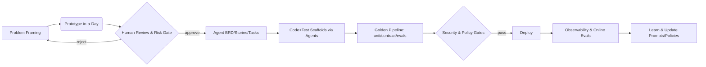

# Hybrid Humans + Agents: A Target State for the EU Digital Product & Engineering Org (2026–2028)

## Executive summary

AI agents will **reshape** how we discover, design, build, test, secure, and operate software. The right outcome isn’t a smaller org—it’s a **higher-throughput org** where _hybrid human–agent teams_ ship safer products faster. In Europe—where the business is scaling rapidly—this lets us **double the number of product teams** (via agent-augmented pods) without doubling cost. In the mature US business, the emphasis shifts toward **cost, safety, and reliability**, not headcount growth.

Evidence is clear that AI is changing developer work patterns (adoption is widespread; measured productivity impacts are nuanced and context-dependent). The direction of travel is unmistakable; the winners are building the **platform, controls, and org design** to harness agents—safely. ([Stack Overflow](https://survey.stackoverflow.co/2024/ai?utm_source=chatgpt.com "AI | 2024 Stack Overflow Developer Survey"))

---

## Why now (and why this design)

- **Adoption is mainstream, trust remains measured.** Most developers report using AI tools, yet trust and effectiveness vary by task—underscoring the need for _guardrails and evaluation_, not blind automation. ([Stack Overflow](https://survey.stackoverflow.co/2024/ai?utm_source=chatgpt.com "AI | 2024 Stack Overflow Developer Survey"))
    
- **Productivity upside is situational.** Controlled studies show substantial speedups for some tasks; longitudinal field research shows subjective improvements but mixed objective signals. Translation: _optimize the system_, not just the tool. ([Visual Studio Magazine](https://visualstudiomagazine.com/articles/2024/09/17/another-report-weighs-in-on-github-copilot-dev-productivity.aspx?utm_source=chatgpt.com "Another Report Weighs In on GitHub Copilot Dev Productivity"))
    
- **Agent tech is maturing.** Standardized tool/knowledge connectivity (MCP), enterprise agent runtimes (e.g., LangGraph), and coding-agent benchmarks (SWE-bench) are converging—making production-grade agent patterns feasible. ([OpenAI Platform](https://platform.openai.com/docs/mcp?utm_source=chatgpt.com "Building MCP servers for ChatGPT and API integrations"))
    
- **Regulatory deadlines are real.** EU AI Act is staged through **2026–2027**; **DORA** is already in force (Jan **2025**). We need _built-in_ controls, logging, and testing for AI-enabled SDLC. ([Digital Strategy](https://digital-strategy.ec.europa.eu/en/policies/regulatory-framework-ai?utm_source=chatgpt.com "AI Act | Shaping Europe's digital future - European Union"))
    

---

## North-star target state (end-2027)

### 1) Org design: hybrid pods and a few critical “guilds”

- **Agent-Augmented Product Pods (EU):**  
    _Trio + agents_ becomes _Quartet + platform_. Product + Design + Eng lead **plus** an **Agent Wrangler** (owns agent orchestration, prompts, evals, and incident playbooks). Pods use a **shared agent platform** and bring “loanable” specialist agents (e.g., perf, security, data-profiling) as needed.
    
- **Green-Beret Guild (Global):** 10–15 elite “deep coders” who (a) raise agent standards (patch generation quality, repo hygiene, test oracles), (b) build exemplars and reference implementations, and (c) handle gnarly edge cases. They also run **agent red-team** drills and maintain the “golden repo” of **exemplars**.
    
- **AgentOps & EvalOps (Platform):** A central team providing the **LLM/Agent gateway**, **MCP tool registry**, **policy-as-code guardrails**, **eval harnesses**, **telemetry**, and **cost controls**. (Think: a product for _other teams + their agents_.)
    
- **Shared-Service Extensions (EU & US):** Infra/SRE/Sec/Cloud/IDP/QA teams expose **self-service APIs** _and_ **local “service agents”** (ticket triage, policy lookup, config linting, sandbox creation)—reducing today’s queue-based dependencies.
    

### 2) SDLC reimagined (prototype-first + eval-driven)

**Then (human-only):** weeks of discovery → BRDs → epics/stories → code → tests → QA → release.  
**Next (human+agent):** _day-zero prototypes_ clarify scope; **agents draft BRDs, slice epics/stories/tasks**, scaffold code & tests; humans curate, set acceptance criteria, and enforce safety.

Key lanes:

1. **Discovery → Prototype**
    

- Rapid “**Prototype-in-a-Day**” using design+code agents to reduce requirement ambiguity.
    
- Agents produce **BRD/MRD** drafts, **journey maps**, and **story/task trees**; humans review for intent & risk.
    

2. **Build → Verify**
    

- “Golden pipelines” require **policy, tests, and evals** to pass.
    
- Agents generate/maintain unit/contract/property tests; humans own **oracles** and **hard requirements**.
    

3. **Secure → Govern**
    

- LLM security controls (prompt-injection defenses, output filtering), data minimization, and **DORA** operational resilience. **Bedrock Guardrails** or equivalent for content & PII policies; **OWASP LLM Top 10** threats covered in the gateway. ([AWS Documentation](https://docs.aws.amazon.com/bedrock/latest/userguide/guardrails.html?utm_source=chatgpt.com "Detect and filter harmful content by using Amazon Bedrock ..."))
    

4. **Operate → Learn**
    

- Every agent interaction is **observable**; **EvalOps** runs regression suites (e.g., task boards, thin SWE-bench-style internal tasks, safety tests). Results drive **scorecards** by team and use case. ([SWE-bench](https://www.swebench.com/?utm_source=chatgpt.com "SWE-bench Leaderboards"))
    

### 3) Platform blueprint (reference)

- **LLM/Agent Gateway**: identity pass-through, PII redaction, rate/cost control, safety policies, approval workflows.
    
- **MCP Tooling Layer**: standard way to expose **systems, data, and tools** to agents; catalog + permissions. ([OpenAI Platform](https://platform.openai.com/docs/mcp?utm_source=chatgpt.com "Building MCP servers for ChatGPT and API integrations"))
    
- **Agent Runtime**: resilient graphs, checkpoints, human-in-the-loop, rollback (e.g., **LangGraph** or equivalent). ([LangChain Blog](https://blog.langchain.com/building-langgraph/?utm_source=chatgpt.com "Building LangGraph: Designing an Agent Runtime from ..."))
    
- **EvalOps**: offline evals, canary evals in CI/CD, online shadow evals; model & prompt versioning.
    
- **Observability**: traces, prompt logs, redaction proofs, and **DORA** compliance artifacts. ([EIOPA](https://www.eiopa.europa.eu/digital-operational-resilience-act-dora_en?utm_source=chatgpt.com "Digital Operational Resilience Act (DORA) - EIOPA"))
    

**Mermaid — SDLC with agents & controls**



---

## Roles: how work changes (2026)

- **Product Manager → Problem Framer.** Curates _questions_, orchestrates prototypes, and steers **agent-generated** BRDs/epics.
    
- **Architect → Systems & Safety Architect.** Maintains **interactive, executable** design docs tied to exemplars and tests (docs-as-code + living diagrams).
    
- **Tech Lead → Agent Wrangler.** Owns orchestration graphs, tool selection, and **agent incident** playbooks.
    
- **Engineers → Builder-Curators.** Pair with agents, write **hard requirements**, build test oracles, and handle edge-case coding.
    
- **QA → Scenario Engineer.** Authors **property tests**, contracts, and **eval suites**; tunes guardrails.
    
- **SRE/Sec/Platform → Service-as-API + Local Agents.** Publish platform capabilities _and_ “sidecar” agents to unblock squads.
    

> Note: **Team size ↓ per pod** ≠ **headcount ↓ overall**. EU growth uses the capacity dividend to **add pods** and pursue more bets; the US uses it to **improve safety, quality, and cost** on a steady portfolio.

---

## 2026: Experiments & pilots (evidence over opinion)

Each experiment runs with: **control vs. treatment**, clear **success metrics**, **risk guardrails**, and a **retrospective**. Where possible, use **paired teams** (EU vs US) to reflect different business contexts.

### A. Product discovery & planning

1. **Prototype-in-a-Day**
    
    - _Hypothesis:_ Early prototypes cut requirement churn ≥30%.
        
    - _Metric:_ Churn (story rework), time-to-first-demo, stakeholder clarity score.
        
2. **Agent-Drafted BRD/Epics/Tasks**
    
    - _Hypothesis:_ PM/BA time reallocation to interviews/validation; same or better quality.
        
    - _Metric:_ Time spent per BRD, defect-from-requirements rate (pre-/post-pilot).
        

### B. Build, test, and review

3. **Coding Agent for Small Fixes** (PR triage & patch recommendations)
    
    - _Hypothesis:_ Lead time drops; code review stays healthy.
        
    - _Metric:_ Lead time for change; review comments per PR; escape defect rate.
        
    - _Notes:_ Track agent reliability; benchmark with internal SWE-bench-style tasks. ([SWE-bench](https://www.swebench.com/?utm_source=chatgpt.com "SWE-bench Leaderboards"))
        
4. **Test Synthesis Agent**
    
    - _Hypothesis:_ Coverage ↑, flaky tests ↓.
        
    - _Metric:_ Effective coverage (statements + contracts), flake rate.
        
5. **Legacy Modernization Copilot**
    
    - _Hypothesis:_ Boilerplate migration speedups; no quality regression.
        
    - _Metric:_ Story points / sprint on migration epics; post-deployment incident rate.
        

### C. Sec, risk, and compliance

6. **LLM Gateway + Guardrails** (prompt filtering, output moderation, PII masks)
    
    - _Hypothesis:_ Zero PII leakage in logs; low false-positive rate.
        
    - _Metric:_ Redaction coverage, policy violations per 1k calls, latency overhead. ([AWS Documentation](https://docs.aws.amazon.com/bedrock/latest/userguide/guardrails.html?utm_source=chatgpt.com "Detect and filter harmful content by using Amazon Bedrock ..."))
        
7. **EU AI Act Readiness Pack**
    
    - _Hypothesis:_ We can evidence obligations with logs, evals, and model cards.
        
    - _Metric:_ % of required artifacts generated automatically; audit pass rate. ([Digital Strategy](https://digital-strategy.ec.europa.eu/en/policies/regulatory-framework-ai?utm_source=chatgpt.com "AI Act | Shaping Europe's digital future - European Union"))
        
8. **DORA-Aligned Ops for Agents**
    
    - _Hypothesis:_ Agent outages & misfires handled like microservice incidents.
        
    - _Metric:_ MTTR for agent incidents; control efficacy in post-mortems. ([EIOPA](https://www.eiopa.europa.eu/digital-operational-resilience-act-dora_en?utm_source=chatgpt.com "Digital Operational Resilience Act (DORA) - EIOPA"))
        

### D. Data & analytics

9. **Analyst-in-the-Loop** (agents prepare datasets, charts, and “first reads”)
    
    - _Hypothesis:_ Cycle time from question→insight ↓; fewer “tribal knowledge” blockers.
        
    - _Metric:_ Time-to-insight; re-use rate of analysis playbooks.
        

### E. Shared-service extensions

10. **Local Service Agents for Platform/Cloud** (env bootstrap, policy lookup, quota requests)
    
    - _Hypothesis:_ Ticket-to-service time ↓ 50%; fewer interruptions for platform teams.
        
    - _Metric:_ TTS (ticket-to-service), reopen rate, developer NPS.
        

> **Success gates to scale (H2-2026):**
> 
> - No increase in change-fail rate; lead time ↓ ≥20% on target flows.
>     
> - Zero critical safety breaches (per OWASP LLM Top 10 categories). ([OWASP Foundation](https://owasp.org/www-project-top-10-for-large-language-model-applications/?utm_source=chatgpt.com "OWASP Top 10 for Large Language Model Applications"))
>     

---

## Options & timelines (pick per region)

### Option 1 — **EU “Accelerate & Multiply” (preferred)**

- **H1-2026**: Prototypes + BRD agents across 4 pods; coding/test agents on 2 pods.
    
- **H2-2026**: Double to 8–10 pods; add Shared-Service Agents; start Green-Beret Guild.
    
- **2027**: 16+ pods, 70–80% of teams on gateway+evals; infra for cross-pod component marketplaces.
    

### Option 2 — **US “Harden & Optimize”**

- **H1-2026**: Focus on gateway, guardrails, and EvalOps; limit agents to non-prod + internal tools.
    
- **H2-2026**: Roll into select portfolio teams; emphasize reliability, cost, and compliance.
    
- **2027**: Broader rollout once safety & ROI case is strong.
    

### Option 3 — **Balanced**

- Mix the two: 6–8 EU pods scaling fast; 3–4 US pods emphasizing safety/ops economics first.
    

---

## Controls, risks, and new attack surfaces

- **Threats to manage:** prompt injection, tool-use escalation, data exfiltration via outputs, eval drift, supply-chain risks in models/tools. **Mitigations:** LLM gateway policies, content filters, tool whitelists, data minimization, red-team prompts, approval steps, reproducible runs. ([OWASP Foundation](https://owasp.org/www-project-top-10-for-large-language-model-applications/?utm_source=chatgpt.com "OWASP Top 10 for Large Language Model Applications"))
    
- **Regulatory evidence:** AI Act timelines (2025–2027 staged), GPAI obligations, and documentation trails; DORA operational resilience already in effect. Build **evidence-by-default** into the platform. ([Digital Strategy](https://digital-strategy.ec.europa.eu/en/policies/regulatory-framework-ai?utm_source=chatgpt.com "AI Act | Shaping Europe's digital future - European Union"))
    

---

## What peers are doing (signals from the market)

- **Goldman Sachs** rolled out a firmwide AI assistant to thousands of employees to boost productivity—indicative of scale moves in big finance. ([Reuters](https://www.reuters.com/business/goldman-sachs-launches-ai-assistant-firmwide-memo-shows-2025-06-23/?utm_source=chatgpt.com "Goldman Sachs launches AI assistant firmwide, memo shows"))
    
- **Morgan Stanley** is deploying domain assistants (e.g., ResearchGPT; Debrief) and emphasizes rigorous evaluation—mirrors our AgentOps/EvalOps posture. ([Morgan Stanley](https://www.morganstanley.com/press-releases/morgan-stanley-research-announces-askresearchgpt?utm_source=chatgpt.com "Morgan Stanley Research Announces AskResearchGPT"))
    
- **JPMorgan** reports AI-enabled SDLC improvements (PR review tools, LLMs in dev workflows) and broader internal AI suites. ([J.P. Morgan | Payments Developer Portal](https://developer.payments.jpmorgan.com/blog/guides/ai-software-development?utm_source=chatgpt.com "How J.P. Morgan developers leverage AI"))
    
- **Industry research** points to substantial potential _and_ cautions: productivity can rise, but monetization and reliability require disciplined product, governance, and measurement. ([Reuters](https://www.reuters.com/technology/artificial-intelligence/ai-productivity-boost-banks-making-money-it-is-challenge-2024-12-11/?utm_source=chatgpt.com "AI a productivity boost to banks but making money from it is a challenge"))
    

---

## KPIs & economics (board-friendly)

- **Throughput:** Lead time for change (DORA-friendly), flow efficiency, cycle time per epic. ([EIOPA](https://www.eiopa.europa.eu/digital-operational-resilience-act-dora_en?utm_source=chatgpt.com "Digital Operational Resilience Act (DORA) - EIOPA"))
    
- **Quality & Safety:** Change fail rate, escaped defects, policy violation rate, eval-pass rate.
    
- **Customer:** Task success, funnel conversion for digital journeys, latency & reliability SLOs.
    
- **People:** Developer/PM time regained for high-leverage work (from logs), SPACE-based sentiment.
    
- **Cost:** Cost-per-story (incl. agent calls), infra cost per user story, rework %.
    
- **Adoption:** % repos on golden pipeline, % agent calls via gateway, % artifacts with provenance.
    

---

## What we need to build (immediately)

1. **LLM/Agent Gateway** with MCP support, identity pass-through, PII redaction, cost controls, and policy-as-code guardrails (Bedrock Guardrails where applicable). ([OpenAI Platform](https://platform.openai.com/docs/mcp?utm_source=chatgpt.com "Building MCP servers for ChatGPT and API integrations"))
    
2. **EvalOps**: shared evaluation harnesses (offline/CI/online), scenario libraries, and _scorecards by use case_.
    
3. **Exemplar Repos** and **Interactive Architecture** (designs tied to running prototypes & tests).
    
4. **Green-Beret Guild** charter and hiring rubric.
    
5. **Change management**: training, prompts playbook, and a “**humans stay accountable**” policy.
    

---

## Appendix A — Team topology (illustrative)

```mermaid
graph TD
  subgraph Platform
    GW[LLM/Agent Gateway<br/>Policies, PII, Cost, Audit]
    MCP[MCP Tool Registry]
    RUNTIME[Agent Runtime<br/>LangGraph-style flows]
    EVAL[EvalOps & Telemetry]
  end

  subgraph EU Pod
    PM[Product (Problem Framer)]
    ARCH[Systems & Safety Architect]
    TL[Agent Wrangler / Tech Lead]
    ENG[Builder-Curator(s)]
    AGENTS[(Specialist Agents)]
  end

  subgraph Shared Services
    SRE[SRE/Infra]
    SEC[Security]
    IDP[IDP/DevEx]
    DATA[Data/ML]
    SSAGENTS[(Local Service Agents)]
  end

  PM -->|prototype| AGENTS
  TL --> RUNTIME
  ARCH --> GW
  EU Pod -->|self-serve| Shared Services
  Platform --> EU Pod
```

---

## Appendix B — References & further reading

- Stack Overflow Developer Survey 2024 & 2025 (AI adoption and sentiment). ([Stack Overflow](https://survey.stackoverflow.co/2024/ai?utm_source=chatgpt.com "AI | 2024 Stack Overflow Developer Survey"))
    
- GitHub Copilot productivity research (lab speedups) & field study (NAV IT longitudinal). ([Visual Studio Magazine](https://visualstudiomagazine.com/articles/2024/09/17/another-report-weighs-in-on-github-copilot-dev-productivity.aspx?utm_source=chatgpt.com "Another Report Weighs In on GitHub Copilot Dev Productivity"))
    
- Open standards & runtimes for agents: **MCP** and **LangGraph**. ([OpenAI Platform](https://platform.openai.com/docs/mcp?utm_source=chatgpt.com "Building MCP servers for ChatGPT and API integrations"))
    
- Coding-agent benchmarks: **SWE-bench** & live/verified leaderboards. ([SWE-bench](https://www.swebench.com/?utm_source=chatgpt.com "SWE-bench Leaderboards"))
    
- Security: **OWASP Top 10 for LLM Applications**. ([OWASP Foundation](https://owasp.org/www-project-top-10-for-large-language-model-applications/?utm_source=chatgpt.com "OWASP Top 10 for Large Language Model Applications"))
    
- Safety & guardrails: **Amazon Bedrock Guardrails**. ([AWS Documentation](https://docs.aws.amazon.com/bedrock/latest/userguide/guardrails.html?utm_source=chatgpt.com "Detect and filter harmful content by using Amazon Bedrock ..."))
    
- Regulation: **EU AI Act timeline** (application Aug 2026; staged obligations), **DORA** (in force Jan 2025). ([Digital Strategy](https://digital-strategy.ec.europa.eu/en/policies/regulatory-framework-ai?utm_source=chatgpt.com "AI Act | Shaping Europe's digital future - European Union"))
    
- Peer signals: **Goldman Sachs** firmwide AI assistant; **Morgan Stanley** domain assistants & evals; **JPMorgan** AI in SDLC. ([Reuters](https://www.reuters.com/business/goldman-sachs-launches-ai-assistant-firmwide-memo-shows-2025-06-23/?utm_source=chatgpt.com "Goldman Sachs launches AI assistant firmwide, memo shows"))
    

---

### Call to action

- **Approve** the 2026 experiment slate (10 pilots), the **AgentOps/EvalOps** platform build, and the **Green-Beret Guild**.
    
- **Fund** EU pod expansion (Option 1) with quarterly stop/go gates tied to the KPIs above.
    
- **Align** US rollout to Option 2 (safety & cost first), using shared platform & evals.
    

If you’d like, I can package this into a one-pager and a board-ready slide deck next.