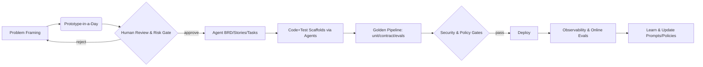

## Title: Hybrid Humans + Agents — Building the EU Digital Product & Engineering Org of the Future (2026–2028)  
Author: Head of Architecture & CTO (EU)  
Audience: ExCo, HOC (COO/CPO/CTO/CFO/CHRO/CCO), EU & US Tech/Product/Ops Leaders  
Version: v2 (with Co‑Design section + cross‑functional pilots)

# One‑Page Executive Summary (Board‑Ready)

**Thesis.** AI agents won’t shrink our organisation; they will **increase throughput per pod**. In Europe (high‑growth), we use the capacity dividend to **double the number of product teams** and accelerate market expansion. In the US (mature), we reinvest to **improve safety, reliability, and cost**. This is **not** a technology initiative; it’s a **hybrid operating‑model transformation** co‑designed by Business × Product × Tech × Ops × Risk × Finance × HR.

**Target State (end‑2027).** Agent‑augmented product pods; a small global **Green‑Beret Guild** of deep coders to set exemplars and run red‑team drills; central **AgentOps/EvalOps** platform (gateway, MCP tooling, guardrails, evals, telemetry, cost); shared services expose **APIs + local service agents** to remove queue‑based friction.

**How Work Changes.** Prototype‑first discovery; agents draft BRDs/epics/stories and scaffold code/tests; humans curate requirements, design the oracles and policy gates, and own accountability. Architects ship **interactive, executable designs** tied to exemplars (docs‑as‑code). PMs become **Problem Framers**; Tech Leads become **Agent Wranglers**; QA becomes **Scenario Engineering**; SRE/Sec/IDP run **service‑as‑API** with sidecar agents.

**Co‑Design & Governance.** Establish a **Hybrid Operating Council (HOC)** to own cross‑functional outcomes; fund by outcomes, not tools. Launch a **Business Agent Studio** for safe business‑authored workflows; create dual centres (**CoE** for enablement, **CoPs** per function) and a unified capability taxonomy. Implement “**Evidence by default**” (every agent action emits traces, redaction proofs, and eval results).

**2026 Experiments (Evidence over Opinion).** Run 10–14 **cross‑functional pilots** with control/treatment, including: Prototype‑in‑a‑Day; Agent‑drafted BRDs; Coding/Test agents; KYC/STP assistant; Reconciliation and Corporate‑Actions triage; Policy‑as‑Code assistant; Regulatory Evidence Pack generator; Support copilot; Advisor proposal copilot; FP&A rolling‑forecast copilot; HR skills graph; Local Service Agents. Success gates: no increase in change‑fail rate; ≥20% lead‑time reduction on target flows; zero critical safety breaches; measurable STP/NPS/cost‑to‑serve improvements.

**Options & Pacing.** EU = **Accelerate & Multiply** (scale pods fast, keep safety parity). US = **Harden & Optimize** (platform/guardrails first, selective rollout). Balanced option mixes both. Quarterly stop/continue/scale gates use DORA‑style metrics and evidence packs.

**Asks.** Approve the 2026 experiment slate; fund **AgentOps/EvalOps** + **Green‑Beret Guild**; endorse EU Option 1 with quarterly gates and a shared cross‑functional KPI set.

---

# Whitepaper v2 (Integrated)

## 1) Why Now

- AI adoption is widespread; gains are real but uneven—outcomes depend on **platform, method, and org design**, not tools alone.
    
- Regulation (EU AI Act staging; DORA in force) and security (LLM‑specific threats) demand **built‑in** controls and auditability.
    
- The business context differs by region: EU is in a rapid growth phase; US is scale, safety, and economics.
    

## 2) Co‑Designing the Hybrid Org (Business × Product × Tech) — _Not a Technology‑Only Change_

**Principles.** One operating model, many contexts; outcome‑funded and evidence‑gated; business owns problem framing, tech owns the platform, **both share the method**; humans stay accountable; capabilities over titles.

**Structural Moves.** (a) **Hybrid Operating Council (HOC)** led by the COO with CPO/CTO/CFO/CHRO/CCO + EU/US GMs; (b) **CoE + CoPs** for enablement and practice sharing; (c) **Business Agent Studio** (safe paved path for business‑authored workflows) with policy‑as‑code; (d) **Shared‑Service Local Agents** (policy lookup, env bootstrap, reconciliations aide, audit‑pack generator); (e) **Career architecture & incentives** updated for Agent Wrangler, Scenario Engineer, Evidence Lead; (f) **One taxonomy** (capabilities map used for budget and hiring).

**Governance & Funding.** Quarterly portfolio reviews on cross‑functional outcomes; policy‑as‑code in repos/pipelines; evidence‑by‑default (traces, redaction proofs, eval metadata) auto‑collected into audit packs.

## 3) North‑Star Target State (End‑2027)

- **Agent‑Augmented Pods.** Product + Design + Engineering + **Agent Wrangler**; access to shared specialist agents (perf, security, data profiling, migration, test synthesis).
    
- **Green‑Beret Guild (Global).** Deep coders raise agent standards, curate exemplars, run red‑team drills, and tackle edge cases.
    
- **AgentOps/EvalOps Platform.** LLM/Agent gateway (identity pass‑through, PII redaction, policy & cost controls), MCP tool registry, resilient runtimes (graph orchestration, HITL, checkpoints), eval harnesses (offline/CI/online), full observability and cost telemetry.
    
- **Shared Services as Platforms.** SRE/Sec/IDP/Data expose services via **APIs + local agents**, shifting from ticket queues to self‑service patterns.
    

## 4) SDLC Reimagined (Prototype‑First + Eval‑Driven)

- **Discovery → Prototype.** “Prototype‑in‑a‑Day” clarifies scope; agents draft BRDs/epics/tasks and journey maps; humans review for intent & risk.
    
- **Build → Verify.** Golden pipelines require unit/contract/property tests + evaluation suites to pass; humans design oracles and hard requirements.
    
- **Secure → Govern.** LLM security controls (prompt‑injection defense, output moderation), data minimization, policy gates, and DORA‑aligned operational resilience.
    
- **Operate → Learn.** Full traceability, online canary evals, and scorecards by use case feed continuous improvement.
    

## 5) Roles & Skills (2026)

- **PM → Problem Framer:** curates questions, orchestrates prototypes, validates customer value.
    
- **Architect → Systems & Safety Architect:** ships interactive designs tied to code and tests; owns safety patterns.
    
- **Tech Lead → Agent Wrangler:** orchestrates tools & flows, owns incident playbooks and evals.
    
- **Engineers → Builder‑Curators:** pair with agents, write hard requirements, build test oracles, resolve edge cases.
    
- **QA → Scenario Engineering:** contract/property tests, eval suites, guardrail tuning.
    
- **SRE/Sec/IDP → Service‑as‑API + Local Agents:** self‑serve platform + sidecar agents.
    

## 6) 2026 Experiments & Pilots (Cross‑Functional)

**Design pattern:** control vs treatment; clear hypotheses & metrics; guardrails; business + tech owners; evidence pack.

### Product & Customer

1. **Prototype‑in‑a‑Day (PM + Design + Ops)** — reduce requirement churn ≥30%.
    
2. **Agent‑Drafted BRD/Epics/Tasks (PM/BA)** — shift PM/BA time to discovery; maintain quality.
    
3. **Support Copilot** — raise FCR, reduce AHT, maintain compliance.
    

### Operations (Middle/Back Office)

4. **Onboarding/KYC Assistant** — lift STP%, faster exception triage, better audit evidence.
    
5. **Reconciliation Agent** — cut break investigation time by ~40%.
    
6. **Corporate Actions Triage** — faster, safer instruction generation with dual control.
    

### Risk, Compliance & Legal

7. **Policy‑as‑Code Assistant** — fewer violations, faster approvals.
    
8. **Regulatory Evidence Pack Generator** — ≥70% artifacts auto‑produced.
    

### Sales, Distribution & Marketing

9. **Advisor Proposal Copilot** — faster proposals with legal sign‑off baked in.
    
10. **Analyst‑in‑the‑Loop (Journey Analytics)** — halve time from question → insight; reusable playbooks.
    

### Finance & HR

11. **FP&A Rolling Forecast Copilot** — faster scenarios, clearer drivers, improved accuracy.
    
12. **Talent Copilot & Skills Graph** — better staffing; reduced time‑to‑productivity.
    

### Shared Services & Platform

13. **Local Service Agents (IDP/SRE/Sec)** — 50% faster ticket‑to‑service; fewer interrupts.
    
14. **Green‑Beret Guild Benchmarks** — higher agent patch quality; lower rework; exemplar adoption.
    

**Scale Gates (H2‑2026).** No increase in change‑fail; ≥20% lead‑time reduction on target flows; zero critical safety breaches; STP/NPS/cost‑to‑serve deltas in target ranges.

## 7) Options & Timelines (Per Region)

- **Option 1 — EU Accelerate & Multiply (preferred).** H1‑26: 4 pods on prototypes/BRD agents; 2 pods on coding/test agents. H2‑26: 8–10 pods, shared‑service agents, launch Green‑Beret Guild. 2027: 16+ pods, 70–80% on gateway+evals.
    
- **Option 2 — US Harden & Optimize.** H1‑26: gateway/guardrails/EvalOps; agents limited to internal tools. H2‑26: selective rollout; focus on reliability/cost/compliance. 2027: broaden as ROI & safety bed in.
    
- **Option 3 — Balanced.** Mix: 6–8 EU pods scaling fast; 3–4 US pods emphasising safety and ops economics.
    

## 8) Controls, Risks & New Attack Surfaces

Prompt injection, tool‑use escalation, sensitive‑data exfil, eval drift, model/tool supply‑chain. Mitigations: gateway policies & whitelists, content filters, data minimisation, red‑team prompts, approval steps, reproducible runs, provenance and audit trails.

## 9) Keeping Orgs Aligned (Practical Mechanisms)

Joint OKRs per value stream; **Org Convergence Scorecard** (adoption parity); playbook parity (tech ↔ business twins); RACI+ (draft/approve/execute/evidence); training & accreditation (Agent Driver’s Licence L1–L3); weekly “Agent Standup”; explicit ethics guardrails (areas we won’t automate without approved assist patterns).

## 10) KPIs & Economics (Board‑Friendly)

**Throughput:** Lead time, cycle time, flow efficiency. **Quality & Safety:** change‑fail rate, escaped defects, policy‑violation rate, eval‑pass rate. **Customer:** task success, funnel conversion, SLOs. **People:** time regained for high‑leverage work; SPACE metrics. **Cost:** cost‑per‑story incl. agent calls; infra cost/story; rework %. **Adoption:** % repos on golden pipeline; % calls via gateway; % artifacts with provenance.

## 11) What We Need to Build Now

1. **LLM/Agent Gateway** with identity pass‑through, PII redaction, cost controls, policy‑as‑code guardrails, MCP support. 2) **EvalOps** (offline/CI/online) with scenario libraries and scorecards. 3) **Exemplar Repos & Interactive Architecture** tied to running prototypes/tests. 4) **Green‑Beret Guild** charter and hiring rubric. 5) **Change Management** (training, prompts playbook, “humans stay accountable” policy).
    

---

# Board‑Ready Deck (Slide‑by‑Slide)

> **Format:** Title + bullets (with optional speaker notes). Copy into Slides/PowerPoint as‑is.

**1. Cover**  
_Hybrid Humans + Agents: Building the EU Digital Product & Engineering Org (2026–2028)_  
Speaker notes: Set the regional context (EU growth vs US maturity).

**2. The Ask**

- Approve 2026 cross‑functional pilots (10–14)
    
- Fund AgentOps/EvalOps + Green‑Beret Guild
    
- Endorse EU Option 1 with quarterly stop/continue/scale gates
    

**3. Why Now**

- Adoption is mainstream; gains depend on platform + method
    
- Regulation & safety require built‑in controls and evidence
    
- EU growth vs US optimisation drives different pacing
    

**4. Not a Tech‑Only Change (Co‑Design)**

- HOC governance; outcome‑funded portfolio
    
- Business Agent Studio + CoE/CoPs
    
- Evidence by default; policy‑as‑code
    

**5. Target State (End‑2027)**

- Agent‑augmented pods; Green‑Beret Guild
    
- AgentOps/EvalOps platform; shared services as APIs + local agents
    
- Interactive, executable architecture
    

**6. Org Design: Pods & Guilds**

- PM (Problem Framer) · Architect (Systems & Safety) · Tech Lead (Agent Wrangler)
    
- Builder‑Curators · Scenario Engineering · Service‑as‑API
    
- Small global guild sets standards & exemplars
    

**7. SDLC Reimagined**

- Prototype‑first discovery
    
- Agents draft BRDs/epics/stories; scaffold code/tests
    
- Golden pipelines (tests + evals) + policy gates
    

**8. Platform Blueprint**

- LLM/Agent Gateway (identity, PII, policy, cost)
    
- MCP tool registry & agent runtime (graphs, HITL, checkpoints)
    
- EvalOps + full observability
    

**9. 2026 Experiments (Cross‑Functional)**

- Product: Prototype‑in‑a‑Day; agent‑drafted BRDs
    
- Ops/Finance: KYC/STP; Recs; Corporate Actions
    
- Risk/Legal: Policy‑as‑Code; Evidence Packs
    
- Support/Sales/HR: Support copilot; Advisor proposals; Skills graph
    

**10. Metrics & Scale Gates**

- No increase in change‑fail rate
    
- ≥20% lead‑time reduction on target flows
    
- STP/NPS/cost‑to‑serve deltas in range; zero critical safety breaches
    

**11. Options & Pacing**

- **EU Accelerate & Multiply** (preferred)
    
- **US Harden & Optimize**
    
- Balanced option (mix)
    

**12. Governance & Funding**

- HOC with quarterly portfolio reviews
    
- Outcome‑funded initiatives
    
- Shared capability taxonomy and career architecture
    

**13. Risks & Controls**

- Prompt injection, data exfil, tool escalation, eval drift
    
- Mitigations: gateway policies, filters, whitelists, red‑team prompts, provenance
    

**14. 90‑Day Plan**

- Stand up HOC; stand up AgentOps/EvalOps v1
    
- Launch 6 pilots (≥3 outside tech)
    
- Training cohort (Agent Driver’s Licence L1)
    

**15. Decisions Requested**

- Budget & headcount for platform + guild
    
- EU Option 1 endorsement
    
- KPI pack approval (DORA‑style + business outcomes)
    

---

# Appendices

**A. Mermaid — SDLC with Agents & Controls** (duplicate of earlier for slide export)

**B. Example KPIs by Pilot** (cheat sheet for PMs/Owners)

- Prototype‑in‑a‑Day → churn %, time‑to‑first‑demo, stakeholder clarity
    
- BRD‑agent → time per BRD, defect‑from‑requirements rate
    
- KYC assistant → STP%, exception cycle time, audit completeness
    
- Support copilot → FCR, AHT, QA score, escalation rate
    
- FP&A copilot → forecast cycle time, variance vs actuals
    
- Local service agents → ticket‑to‑service, reopen %, Dev NPS
    

**C. Role Rubrics (v1)**  
Outline of competencies and level expectations for Agent Wrangler, Scenario Engineer, Evidence Lead, Systems & Safety Architect.