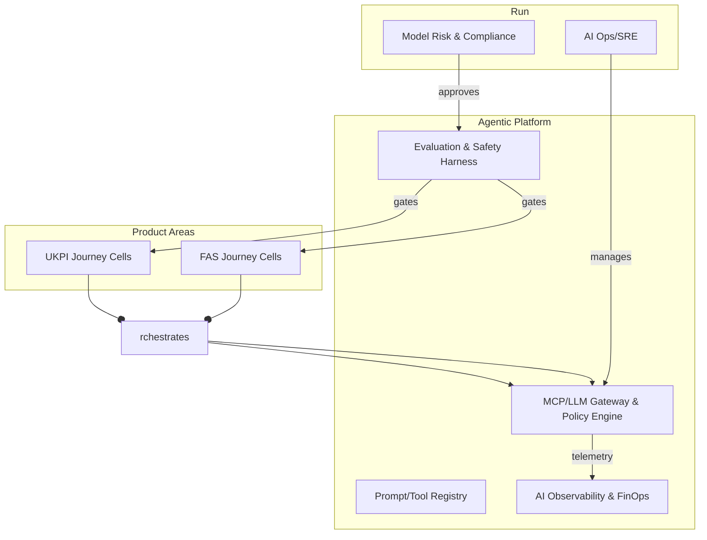
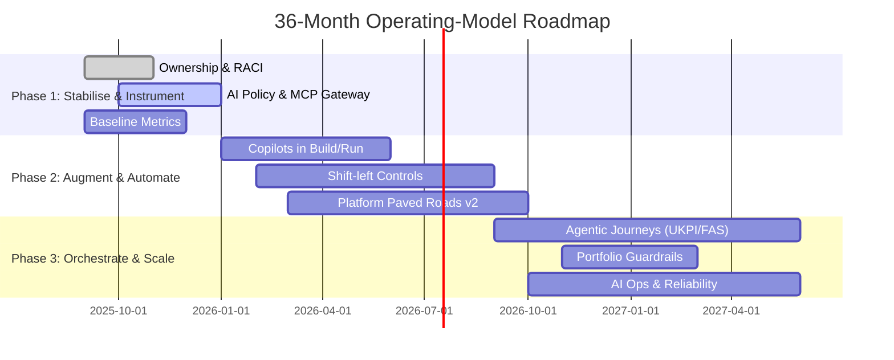

Here’s a concise, board-ready plan you can also hand to teams. It gives you **three phased themes (1–3 years)**, **two operating-model options (evolutionary vs. transformative AI)**, concrete **team structures**, **emerging vs. sunset roles**, and an **experiment playbook** with decision gates. It assumes two LOBs: **UKPI (B2C, UK-only)** and **EU FAS (advisor-led distribution)**, with a digital product org today.

# Executive one-pager (use in board decks)

**Purpose**  
Create an adaptable Target Operating Model (TOM) for Europe that scales product velocity and compliance while safely exploiting AI. **Template, not straitjacket**: patterns vary by product and org maturity.

**North-Star Outcomes (by 24–36 months)**

- 30–50% faster concept-to-launch for UKPI + FAS initiatives
    
- 20–35% lower run costs per feature via platform + AI automation
    
- Risk-aware AI adoption (governed, observable, reversible)
    
- Clear talent path: reskill > redeploy > hire (minimal redundancy)
    

**Phased Themes (3 stages, 1–3 years)**

1. **Stabilise & Instrument (0–6 months)** – clarify ownership, instrument flow, put AI behind safety rails.
    
2. **Augment & Automate (6–18 months)** – copilots everywhere; shift-left controls, golden paths, thin platforms.
    
3. **Orchestrate & Scale (18–36 months)** – agentic workflows; product+platform portfolio mgmt as a single system.
    

**Two TOM options (select per LOB)**

- **Model A – AI-Accelerated Product Org (evolutionary)**: current squads + platform enablement + embedded AI.
    
- **Model B – Agentic Platform Operating Model (transformational)**: stream-aligned squads orchestrated by an **Agentic Platform** (MCP/LLM gateway, Bedrock control plane, governance-as-code), plus **AI operations** as first-class.
    

**Decision gates** (quarterly): prove (a) value uplift, (b) control adherence, (c) cost efficiency → scale or pivot.

---

# Phases, outcomes, and governance

## Phase 1 — “Stabilise & Instrument” (0–6 months)

- **Objectives:** single backlog per LOB, product+platform RACI; deploy **MCP/LLM gateway** and **AI usage policy**; baseline flow metrics; define golden paths (IaC, DDP, SDLC).
    
- **Must-haves:** AI guardrails (PII redaction, secrets scanning), model card templates, FinOps tags, audit trails.
    
- **Deliverables:** Operating model playbook v1; engineering handbook update; AI control library; baseline KPIs.
    

## Phase 2 — “Augment & Automate” (6–18 months)

- **Objectives:** adopt **copilots** in build/run; **shift-left compliance** (EU AI Act/GDPR/DORA controls as code); platform productisation (self-serve portals, paved roads); begin **agentic workflows** for ops + service.
    
- **Deliverables:** Platform SLAs/SLOs; change-fail rate <15%; MTTR ↓; model risk register; AI FinOps dashboard.
    

## Phase 3 — “Orchestrate & Scale” (18–36 months)

- **Objectives:** orchestration of **agent teams** for end-to-end journeys (e.g., UKPI onboarding, FAS proposal-to-order); closed-loop analytics; portfolio-level capacity management; “policy by default.”
    
- **Deliverables:** TOM v3; portfolio guardrails; AI incident runbooks; LOB-specific capability scorecards.
    

---

# Operating-model options (pick per maturity)

## Model A — AI-Accelerated Product Org (evolutionary)

- **When to use:** Stable domain, higher compliance constraints, medium data maturity.
    
- **Pattern:** Stream-aligned squads + enabling platform + central architecture & risk.
    

```mermaid
flowchart LR
  subgraph UKPI
    U1[SQ: Onboarding]:::stream
    U2[SQ: Funding/Payments]:::stream
    U3[SQ: Invest & Advice]:::stream
    U4[SQ: Service & Care]:::stream
  end
  subgraph FAS (EU)
    F1[SQ: Advisor Portal]:::stream
    F2[SQ: Fund Data & Reporting]:::stream
    F3[SQ: Distribution Ops]:::stream
  end
  subgraph Platform
    P1[IDP: CI/CD, IaC, Env Mgmt]
    P2[Data Platform: Kafka/Flink/Iceberg]
    P3[AI Platform: Bedrock + MCP/LLM Gateway]
    P4[Observability & FinOps]
  end
  subgraph Governance
    G1[Architecture & Risk]
    G2[AI Risk & Model Ops]
  end

  U1--uses-->P1; U2--uses-->P1; U3--uses-->P2; U4--uses-->P4
  F1--uses-->P3; F2--uses-->P2; F3--uses-->P4
  P3--reports-->G2; P1--reports-->G1
classDef stream fill:#eef,stroke:#88f;
```

**Traits**

- Clear product ownership; **AI added inside squads** via enablement + patterns.
    
- Central **AI Platform** offers SDKs, policies, evaluation harnesses; squads opt-in by guardrails.
    

## Model B — Agentic Platform Operating Model (transformational)

- **When to use:** High data maturity, urgency to differentiate on speed/experience, appetite for org change.
    
- **Pattern:** Agentic workflows as first-class; **AI Ops/SRE**; stronger **platform product** leadership.
    



**Traits**

- Journeys run via **agent orchestration** (call center assist, ops triage, financial-advice prep).
    
- Reliability + safety are platform-run; squads configure, not rebuild.
    

---

# Ways of working (both models)

- **Team topologies:** Stream-aligned (squads), Platform (IDP, Data, AI), Enabling (DevEx, Accessibility, Testing), Complicated-subsystem (pricing/risk engines).
    
- **Backlogs:** One product backlog per area; platform has its own backlog with **published roadmaps**.
    
- **Controls as code:** Policies, data contracts, threat models, AI eval tests in CI; approval = green pipeline.
    
- **Metrics:** DORA + Flow (lead time, throughput, WIP), **AI adoption** (% flows with copilots/agents), **AI FinOps** (cost per invocation/use-case), SLOs, customer NPS, control pass-rate.
    
- **UKPI vs FAS nuance:**
    
    - UKPI: faster loops, heavy MarTech & servicing automation, consumer protection.
        
    - FAS: advisor workflows, integration with CRM/Dynamics, strong fund-data governance, SLAs to partners.
        

---

# Roles: emerging, evolving, and sunsetting

**Emerging / scaled roles**

- **AI Product Manager** (value, risk, evaluation plans per use-case)
    
- **AI Platform Owner** (MCP/LLM gateway, policy, SDKs, adoption)
    
- **Agent/Prompt Engineer** (tooling, retrieval, evals, safety)
    
- **AI Ops/SRE** (latency, drift, incident mgmt, rollbacks)
    
- **Model Risk Officer (Tech-affine)** (model inventory, controls, audit)
    
- **Data Product Owner** (domain data contracts, quality SLAs)
    
- **AI Security Engineer** (prompt-injection, data exfiltration, supply chain)
    
- **AI FinOps Analyst** (cost models, chargeback, scenario tests)
    
- **Human-in-the-Loop Designer** (review loops, UX guardrails, explainability)
    

**Evolving / merging**

- QA → **SDET & Quality in Prod** (contract tests, synthetic users, eval suites)
    
- BA → **Product Discovery & Journey Strategist** (experiments, outcomes)
    
- Data Scientist + MLE → **AI Engineer** (end-to-end with platform)
    
- Enterprise Architect → **Principal/Staff Architect with governance-as-code**
    

**Likely to sunset (as distinct roles)**

- Dedicated **Release Manager** (replaced by trunk-based delivery & change automation)
    
- Manual **Ops Runbook Executor** (replaced by agentic runbooks with approvals)
    
- Standalone **Reporting Analyst** (self-serve metrics + semantic layer)
    

---

# Experiments to set direction (template, not one-size-fits-all)

|ID|Hypothesis|LOB|Tooling|Success Metric|Gate|
|---|---|---|---|---|---|
|E-01|**Agentic Incident Triage** halves MTTR|UKPI|Bedrock + MCP, runbooks|MTTR ↓ ≥40%|Scale if ≥25%|
|E-02|**Advisor Prep Copilot** boosts FAS conversion|FAS|Dynamics Copilot + RAG|Meeting-to-proposal ↑ ≥15%|Scale if ≥10%|
|E-03|**AI Code Review + Test Gen** accelerates PRs|Both|GitHub Copilot, Bedrock|PR cycle time ↓ ≥30%|Adopt org-wide|
|E-04|**Shift-Left AI Controls** reduce approval time|Both|Policy-as-code|Time-to-approve ↓ ≥50%|Make default|
|E-05|**Self-Serve Data Products** cut rework|Both|Kafka/Flink/Iceberg|Data defects ↓ ≥50%|Fund next wave|
|E-06|**AI FinOps Guardrails** cap spend w/o value loss|Both|Cost policies & alerts|Cost/feature ↓ ≥20%|Enforce policy|

---

# Governance & risk (lightweight, continuous)

- **Policy by pipeline:** model cards, eval tests, red-team checks; gated deploys with audit metadata.
    
- **Rings of risk:** dev sandbox → limited beta → ring-fenced prod; each ring has stricter checks.
    
- **Reversibility:** safe rollbacks, feature flags, rate-limiters, kill-switch per agent.
    
- **Accountability:** Product owns value; Platform owns safety & reliability; Risk signs off on model class/use.
    

---

# Talent & change (teams pack)

**Career pathways (examples)**

- Engineer → **AI Engineer** → Staff (agentic systems)
    
- PM → **AI PM** → Portfolio PM (agent programs)
    
- SRE → **AI Ops/SRE** → Reliability Architect
    
- Analyst → **Data/Insights PM** → Journey Strategist
    

**Learning plan (90 days)**

- Secure SDLC with AI; prompt & agent patterns; data contracts; policy-as-code; AI incident mgmt; FinOps for AI.
    
- Hands-on: 3 guilds (AI, Data, DevEx) + LOB-specific clinics monthly.
    

**Communication cadence**

- Monthly **North-Star Review** (KPIs + 1 experiment spotlight)
    
- Fortnightly **Platform Office Hours** (paved-roads Q&A)
    
- Quarterly **Architecture Radar** (patterns graduating to standards)
    

---

# Roadmap view



---

# Choosing the right model per LOB

**UKPI (B2C, UK-only)**

- Start with **Model A** in Phase 1; graduate to **Model B** for service & operations (copilot + agentic triage).
    
- Focus: onboarding speed, service automation, MarTech & CRM loops, consumer-grade reliability.
    

**EU FAS (advisor distribution)**

- Begin **Model A** with strong CRM/Dynamics integration; selectively adopt **Model B** for **advisor prep** and **fund-data ops** once data contracts + retrieval quality hit thresholds.
    

---

# “No-regret” moves (start immediately)

1. Single LOB backlogs, transparent portfolio Kanban.
    
2. Platform SLOs + golden paths (IDP, data products, AI SDK).
    
3. AI policy + evaluation harness + MCP/LLM gateway behind feature flags.
    
4. AI FinOps tagging + cost dashboards.
    
5. Talent skilling plan and guilds.
    

---

If you want, I can package this into **two artifacts** next: (1) a board-style slide outline and (2) a **teams playbook** with checklists (paved road definitions, role cards, and experiment templates).