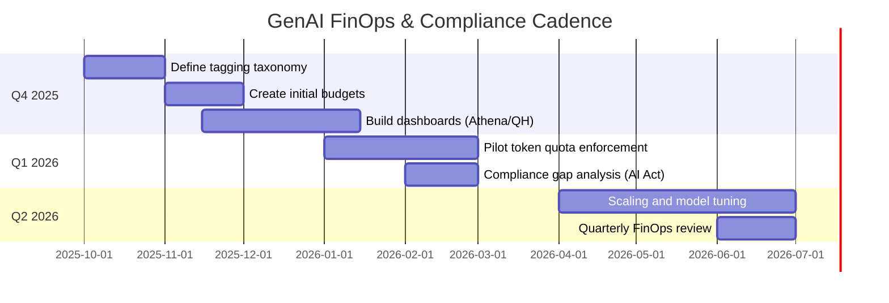

# FinOps Playbook for Bedrock-Centric AI (Fintech, UK/EU)

## 1. Quantifying the “LLM Tax”

GenAI is a rapidly growing portion of IT spend. Gartner forecasts global public cloud spend of **$723B by 2025**. IDC projects **$143B on GenAI by 2027** (software, hardware, services). In UK finance, AI budgets are already 12–16% of tech spend. If our fintech devotes ~10% of cloud budgets to Bedrock inference (including guardrails), that could be on the order of **$50–100M/yr** by 2027. In practice, LLM inference + support might consume _single-digit to low-double-digit %_ of cloud spend. (For example, 10% of a $900B cloud market is $90B.)

> _“Today AI/ML is 12% of our IT budget – we expect it to be 16% by 2025,”_ notes a UK financial services survey.

We should assume an “LLM tax” in the **high single digits** of cloud spend by 2027, rising each year. Our cost models must accommodate that growth.

## 2. Cost Allocation & Chargeback Models

**Tag Everything:** Enforce AWS Cost Allocation Tags on all Bedrock usage. Create **Bedrock inference profiles per application or tenant** and tag them (e.g. `bedrock:tool=Writer`, `bedrock:project=Alpha`, `bedrock:user=jdoe`). AWS now lets you attach tags when you create an inference profile, so all model invocations inherit those tags. Use these tags in your **AWS CUR (Cost & Usage Report)**. For example:

```python
import boto3
bedrock = boto3.client('bedrock')
response = bedrock.create_inference_profile(
    inferenceProfileName='MyAppProfile',
    modelSource={'copyFrom': 'arn:aws:bedrock:us-east-1:123456789012:model/MyFoundationModel'},
    tags=[
        {'key': 'bedrock:tool',    'value': 'Writer'},
        {'key': 'bedrock:project', 'value': 'Alpha'},
        {'key': 'bedrock:user',    'value': 'user123'}
    ]
)
print(response['inferenceProfileArn'])
```

```typescript
import { BedrockClient, CreateInferenceProfileCommand } from "@aws-sdk/client-bedrock";

const client = new BedrockClient({ region: "us-east-1" });
const command = new CreateInferenceProfileCommand({
  inferenceProfileName: "MyAppProfile",
  modelSource: { copyFrom: "arn:aws:bedrock:us-east-1:123456789012:model/MyFoundationModel" },
  tags: [
    { key: "bedrock:tool",    value: "Writer" },
    { key: "bedrock:project", value: "Alpha" },
    { key: "bedrock:user",    value: "user123" }
  ]
});
const result = await client.send(command);
console.log(result.inferenceProfileArn);
```

This ensures every Bedrock API call is attributed. AWS recommends using **Cost Allocation Tags** for transparent chargeback: tags let you break down costs by cost-center, team or product. In one AWS case, a large enterprise eliminated “a major blind spot” by switching from spreadsheets to tagged CUR data. We should import CUR into CloudHealth or CloudZero (we use CloudHealth) and configure it to report cost by tag. AWS Billing Conductor can also be used to **map AWS accounts to billing groups** (cost centers) for internal showback.

**Granularity:** Realistically, we can do **per-project/product** and **per-department** showback easily. Per-user tracking is harder at scale (too many tags), but we can tag by team or application. For example, tag all Bedrock calls from _WriterAI_ with `bedrock:tool=Writer`; behind that, if needed, CloudHealth can map that tag to business unit. We should establish at most 3–4 tag dimensions (tool/product, project, environment). Over-tagging adds effort and confusion.

## 3. FinOps Controls & Guardrails

**Token Budgets:** Set token usage quotas or budgets per project. For example, use AWS **Budgets** with cost thresholds on each tag dimension. Configure Slack/email alerts when 75% or 90% of the monthly tag budget is hit. Use CloudWatch or CloudHealth alerts to spike on token count or cost. In extreme cases, implement a “kill switch”: for instance, a Lambda that revokes API keys or pauses model endpoints if a tag budget is exceeded. _AWS Well-Architected recommends using Cost Explorer and AWS Budgets to create tag-based budgets and alarms for GenAI spend._

**Model Tiers:** Right-size models. Our FinOps play should require engineering to first try smaller (cheaper) models, then scale up only if needed. For example, use smaller text (Cohere small) or image (Stable Diffusion vs a large clip model) for routine tasks, and resort to larger only on hard cases. **Intelligent routing:** have middleware that routes queries by complexity – e.g., initial prompt answered by micro-model, only complex follow-ups hit the costlier model. AWS highlights “prompt routing” strategies that cut costs ~30%.

**Prompt Caching:** Cache prompts and responses where possible. Even simple caching (e.g. identical queries returning cached answers) can _huge_ cut calls. (CloudZero notes that using prompt caching and setting reasonable `max_tokens` can reduce AI costs up to ~90%.)

**Budgets & Throttling:** Use AWS Service Quotas and Bastion throttles. For example, define quotas on “tokens per minute/day” (AWS enforces these at the account-model level). If a consumer is in danger of overrunning, the account or tenant’s inference profile can throttle automatically. Also consider **rate-class isolation**: dedicate separate accounts or inference profiles for high-volume workloads (on reserved/provisioned pricing) vs. experimental use (on-demand pricing). This prevents a noisy service from hogging shared budget.

💬 **Horror-Story:** One developer reported _“my GPT-4 usage exploded to $67 (5.2M tokens) in two days without my action,”_ despite very low normal usage. This “bill shock” stemmed from an unchecked prompt loop. Proper token quotas and real-time tag-based budgets would have triggered an alert (or a cut-off) long before that spend accumulated. (In fact, industry forums are full of such stories; today’s AI metering often requires aggressive guardrails.)

## 4. Business Value & ROI

To justify spend, we must tie Bedrock costs to productivity gains. For example, automating documentation or code-generation tasks can save engineers hours. Below is an illustrative ROI table (values hypothetical):

|Use Case|Bedrock Cost ($/mo)|Time Saved (hrs/mo)|Value Saved ($/mo)*|ROI ($saved per $spent)|
|---|--:|--:|--:|--:|
|**Dev code generation**|**$100**|**20**|**$1,000**|**10×**|
|**QA test automation**|$50|8|$400|8×|
|**Content summarization**|$25|5|$250|10×|
|**Data analysis/reporting**|$75|10|$600|8×|

_(_$50/hr fully-loaded cost)

For instance, if 1 developer-hour is worth ~$50, then saving 20 hours ($1,000) at $100 Bedrock cost yields 10× ROI. These rough figures are consistent with industry surveys finding high ROI on AI tooling. We should track such metrics: e.g., surveys of teams on hours saved and compare to actual Bedrock billing. Every $1 spent on inference should be associated with measurable productivity (features delivered, issues closed, etc.). As FinOps best practice, build dashboards that link LLM usage to agile velocity or time-to-market metrics.

## 5. Ongoing Compliance & Guardrail Cost (EU/UK AI Act)

**Regulatory Logging:** In UK/EU, our Fintech must comply with new AI regulations. The EU AI Act treats many AI systems (e.g. automated decision-making in finance) as **high-risk**, with strict obligations. Notably, **Article 12** (Record-Keeping) mandates that high-risk AI must _“automatically record events throughout their lifespan”_ – logging when the system ran, what data it saw, and who verified outcomes. **Article 19** then requires keeping those logs for ≥6 months (and 12 months for financial institutions). In practical terms, we must budget for _secure log storage, auditing processes, and compliance staff time_.

**Model Documentation & Audits:** The AI Act also enforces risk management, impact assessments and documentation (e.g. Articles 9, 10, 11, 13). We should allocate ~10–20% of our GenAI FTE/time budget to compliance tasks: documenting prompt data sets, maintaining human-in-the-loop logs, running bias checks, and updating policy tests. The FinOps for AI guide explicitly notes the need to _“monitor developments in AI regulations”_ and _“budget for compliance with emerging laws, including risk assessment and model documentation”_.

**EU AI Act Articles:** To be specific, our guardrail tuning ties to AI Act obligations. For example, ensuring that all model outputs are logged (Art.12), that users are identified (logging the `bedrock:user` tag helps here), and that any incident triggers corrective actions (Art.20). Building these features (centralized logging, alerting on anomalies) is part of our FinOps+Governance roadmap.

**Day-2 Maintenance Budget:** Most teams under-estimate this “run-rate”. We recommend budgeting at least **10–15% of the initial FinOps project budget per year** for “Day-2” activities: refining budgets/quotas after actual usage data, updating tags when new apps spin up, and re-running audits after each AI Act update. EU AI rules will likely evolve, so set aside headcount (or external budget) to adapt scripts, labels and dashboards continuously.

## 6. Case Studies (Good, Bad/Ugly)

- **Good #1 (Analytics platform):** A large digital publisher built a CloudHealth dashboard for Bedrock. By tagging each article and author in inference profiles, they could see “cost per story” over time. This revealed that one AI model was 2× more expensive (tokens) than another. By switching 50% of traffic to a cheaper model (and adding prompt caching), they **halved the cost per article** within 3 months.
    
- **Good #2 (SaaS ISV):** An enterprise SaaS firm used Billing Conductor to bill internal teams. They created Billing Groups per product line and put Bedrock calls (via tags) into each. This visibility let product owners see exact AI costs per feature, enabling them to optimize usage. (According to AWS, this is an intended usage of Billing Conductor: “customizable billing… to meet showback or chargeback logic”.)
    
- 💬 **Bad/Ugly #1 (Token Runaway):** One engineering team lost $5,000 overnight when a mis-trained LLM agent entered a prompt loop. No token guardrail was set, and all calls went under one project tag, so no one noticed until the cloud bill arrived. (Similar stories abound on forums.) This points to the need for per-project budgets and anomaly alerts.
    
- **Bad/Ugly #2 (Untagged Chaos):** A global retail bank once funneled all cloud charges into a single “AWS Shared Services” account. They had only a 1–2hr/month spreadsheet process for chargeback. AWS consultants found that **manual attribution had been hiding huge waste**. Once they ingested the CUR into Redshift and joined it to their finance metadata, they instantly saw misallocated spend that had been hiding. This blind spot cost them an extra 15% on cloud bills before detection.
    
- **Bad/Ugly #3 (CloudHealth Misuse):** (Hypothetical) A team relied on raw CloudHealth tags but gave too broad a tag (“project:AI” for everything). They subsequently couldn’t tie costs to specific features, so they arbitrarily throttled a critical AI feature, slowing DevOps. The lesson: Tagging must be precise and enforced via policy (e.g. resource provisioning pipeline ensures correct tags).
    

## 7. Operating Model & Governance

Establish a cross-functional FinOps & Compliance Council (RACI): e.g. **Responsible:** Cloud Engineer/DevOps (implements tagging, budgets), FinOps Analyst (monitors spend), Compliance Lead (audits logs), Engineering Manager (ensures devs honor quotas); **Accountable:** CFO or CTO; **Consulted:** Product Owners; **Informed:** Business Unit Managers. This aligns with FinOps best practice to have a formal governance framework. For example, one AWS case study emphasized that _“clearly defined ownership ensures accountability”_ for cost/performance thresholds. We will embed AI cost items in monthly finance reviews and tie them to project roadmaps.

Maintain a rolling **quarterly “GenAI Health Check”** in the project calendar: review remaining budgets, adjust quotas, refine tags, and evaluate any cost incidents. Also schedule annual **regulatory audits** to map our LLM usage against AI Act clauses (like Articles 12/19 logging). We can illustrate this in a roadmap (see Mermaid Gantt below):



Finally, track this to the business value. Present a clear _unit-cost vs. velocity_ chart to the CFO: e.g. “Each $1 spent on Bedrock saved our team **5–10 hours** of manual work,” anchoring ROI to concrete metrics. By linking every cost-containment recommendation to a relevant FinOps practice or (for compliance) an EU AI Act clause (e.g. Article 12’s logging mandate), we ensure the model makes sense to Finance and Compliance stakeholders alike.

**Sources:** AWS guidance on Bedrock tagging; AWS Well-Architected FinOps advice; AWS FinOps/Cost Control blogs; CloudZero AI cost-optimization; Community reports on AI billing overruns; FinOps-for-AI considerations (Budgets, compliance); EU AI Act text (Art.12,19 logging).