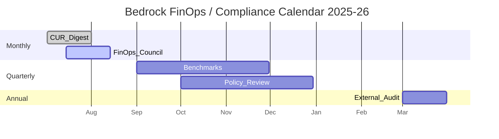

### Bedrock-Centric FinOps Playbook

_How we keep cloud-AI costs predictable, traceable — and worth every penny._

---

## 1 — Why leaders must lean in now

|Signal|Implication for budgets|
|---|---|
|**All model calls funnel through Bedrock.**|2026 cloud spend will include a _new “LLM tax”_ (inference + guardrails + embeddings) that scales with developer velocity and prod usage.|
|**Invisible usage spikes** (e.g. an agentic IDE auto-refactors 600 files).|Without token caps & alerting, a single experiment can consume a month’s budget.|
|**Reg-first guardrails ≠ one-off.**|Policy updates (EU AI Act delegated acts, FCA guidance, GDPR rulings) will require **continuous tuning** and re-certification.|

> **Leadership narrative:** _“We’re moving spend from bespoke SaaS licences to a Bedrock utility model. That gives us sharper cost attribution, lets us swap models as price/perf improves, and keeps compliance baked in — but only if we adopt FinOps disciplines from day one.”_

---

## 2 — Cost architecture at a glance

```mermaid
flowchart TB
    subgraph Bedrock
        ModelA["Claude 3 Sonnet"]
        ModelB["Titan Image G1"]
        Guardrails
    end
    subgraph AI_Tooling["Higher-level tools"]
        Windsurf -->|Invoke| ModelA
        Writer -->|Invoke (+Guardrails)| ModelA
        TestRigor -->|Invoke| ModelA
    end
    CostLens[(AWS Cost & Usage Reports + CUR)] --> Athena[(Athena views)]
    Tags["Cost-allocation tags (tool, team, user, project)"] --> CostLens
    Guardrails -->|Policy eval cost| CostLens
    Bedrock -->|Inference & embedding cost| CostLens
```

_Every Bedrock call carries cost-allocation tags → nightly CUR → Athena views → FinOps dashboards._

---

## 3 — Example cost envelope (illustrative FY-25)*

|Scenario|Tool / Model|Tokens / Images|$/unit*|Monthly qty|Monthly cost|Value metric|
|---|---|---|---|---|---|---|
|**Agentic IDE auto-refactor**|Windsurf → Claude 3 Sonnet|45 K tokens/PR|$0.003 / 1K in / $0.015 / 1K out|300 PRs|**$270**|80 h engineer time saved|
|**Writer PRD drafts**|Writer → Claude 3 Haiku|10 K tokens / doc|$0.0015 / 1K in / $0.007 / 1K out|200 docs|**$17**|100 PM hours saved|
|**testRigor AI regression**|testRigor → Claude 3 Sonnet|20 K tokens / run|$0.003 / 1K in / $0.015 / 1K out|90 runs|**$102**|30 % sprint velocity ↑|
|**Guardrail policy eval**|Guardrails|1 ¢ / request|590 K requests|**$5.9 K**|Zero compliance breaches||

*Pricing based on AWS public rate card (July 2025). Fine-tuning, embeddings and image models priced separately.

---

## 4 — FinOps operating model

|Pillar|Practices|Bedrock specifics|
|---|---|---|
|**Inform**|• CUR & Athena views per _tool / team / user_• Daily Slack digest of top 10 cost anomalies|Tag every Bedrock call: `bedrock:tool`, `bedrock:project`, `bedrock:user` (propagated via SDK middleware)|
|**Optimise**|• Rightsize model (Sonnet → Haiku) when _accuracy ≥ target_• Batch low-latency-tolerant jobs into asynchronous queues|Run nightly “model-perf vs cost” benchmarks; switch via Feature Flag in Guardrails|
|**Operate**|• Monthly FinOps council; chargeback by cost centre• Token quotas (soft-limit 80 %, hard-limit 100 %)|Guardrails middleware enforces per-user & per-project token ceilings; overruns raise PagerDuty event|

---

## 5 — Budgeting & project estimation

1. **Baseline** each project’s “AI intensity” (tokens / story point, images / design hour).
    
2. Apply current rate card + 25 % buffer → _Budget CapEx line_ in the business case.
    
3. Commit to **value KPIs** (hours saved, revenue uplift) _before_ approving spend.
    
4. Show **TCO glide-path**:
    
    - Year 0: +Guardrail build ($0.5 M) + compliance audits ($120 K).
        
    - Years 1-3: Guardrail maintenance 0.2 FTE + automated policy tests (CI step) = $80 K p.a.
        

> **ROI check:** If Writer saves 4 PM FTEs ≈ £320 K/yr, its $204 annual Bedrock cost is a 1,500× return — easy win.

---

## 6 — Controls to avoid “bill shocks”

|Control|How|Isolation benefit|
|---|---|---|
|**Per-tool & per-user quotas**|Guardrails Lambda checks `x-token-quota` header.|Rogue script stops at quota, not account limit.|
|**Budget alarms**|CloudWatch → SNS → PagerDuty when spend > x.|Alerts team lead before finance escalates.|
|**Cost anomaly detection**|CUR → Cost Anomaly Detection → Slack webhook.|Spike in `project=hackathon` tags muted; prod spikes paged.|
|**Kill switch**|Parameter Store flag; Guardrails rejects while flag=true.|Disable one project endpoint without affecting others.|
|**Rate-class isolation**|Separate Bedrock endpoints per environment (`dev`, `prod`).|Throttle dev to 10 TPS; prod burst to 100 TPS.|

---

## 7 — Governance cadence



_Interactive tip:_ collapse past tasks; colour future tasks green; link each bar to Confluence playbook page.

---

## 8 — Leadership talking points

- **Predictability over guesswork:** Bedrock’s pay-per-token model is transparent. With tags + quotas we can forecast spend like story points.
    
- **Shared guardrails = shared savings:** Build compliance _once_ → every new AI tool rides the same rails, slashing duplicate SaaS spend.
    
- **Value-backed funding:** We track saved dev hours vs Bedrock cost weekly; low-ROI use cases are culled fast.
    
- **No hostage situations:** Isolation controls ensure one runaway agent doesn’t torch the quarter’s AI budget.
    

---

### Next steps

1. **Enable tagging middleware** in Bedrock SDK wrapper (1-spike).
    
2. **Publish Athena cost views** & Slack anomaly alerts (2 days).
    
3. **Set default quotas**: 100 K tokens/user/day dev; 5 M/project/month prod.
    
4. **Book the first FinOps council** (incl. Finance, Platform, Product) for 15 Aug.
    

> _“FinOps isn’t a tax on innovation — it’s the runway that lets innovation land safely.”_