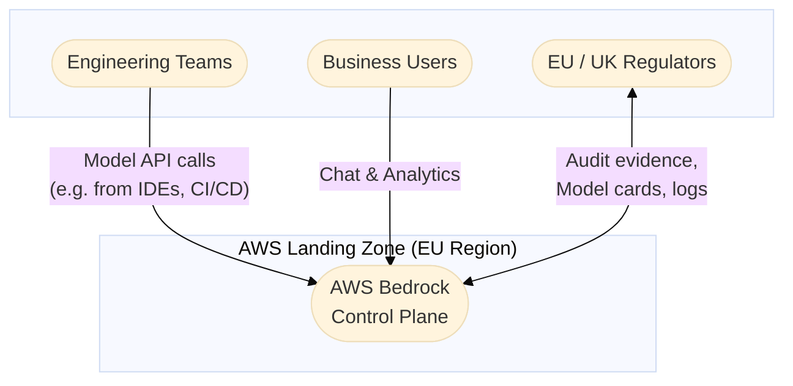
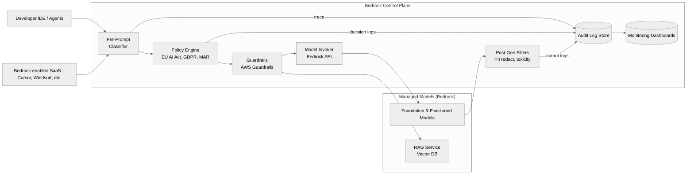
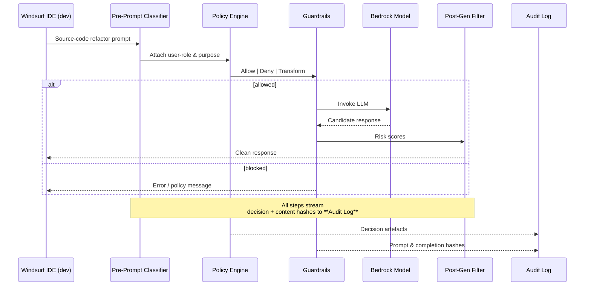
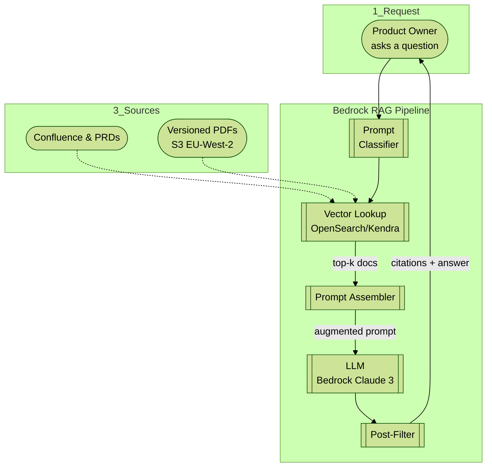
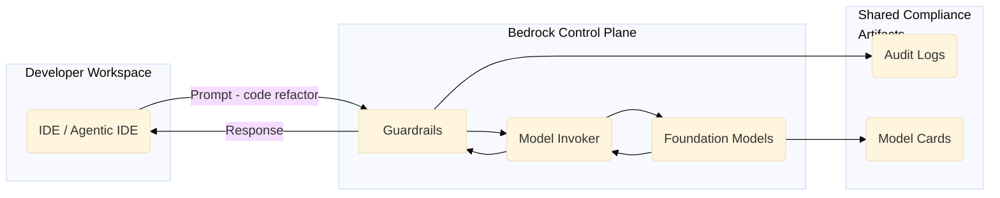
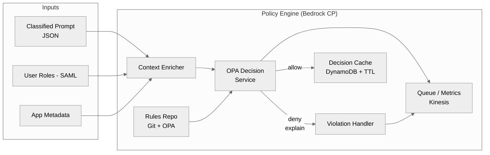
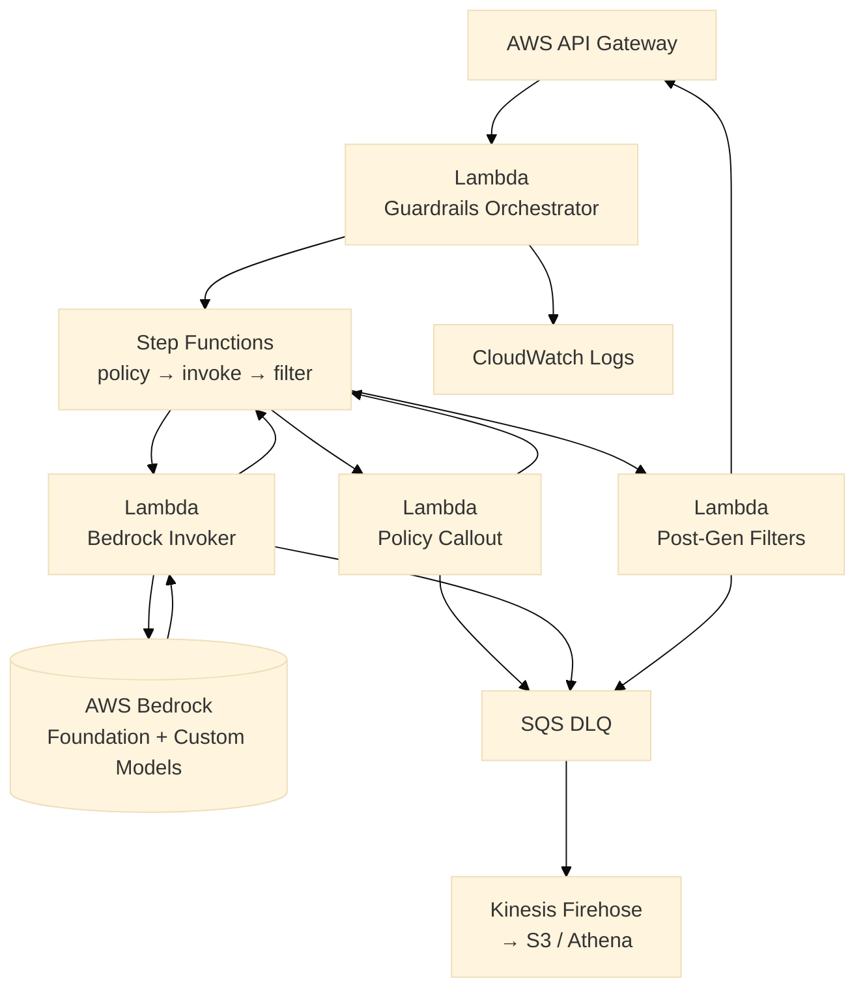
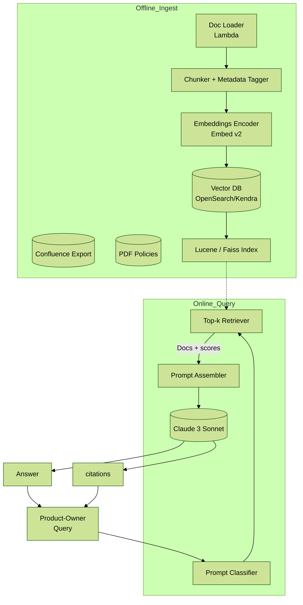
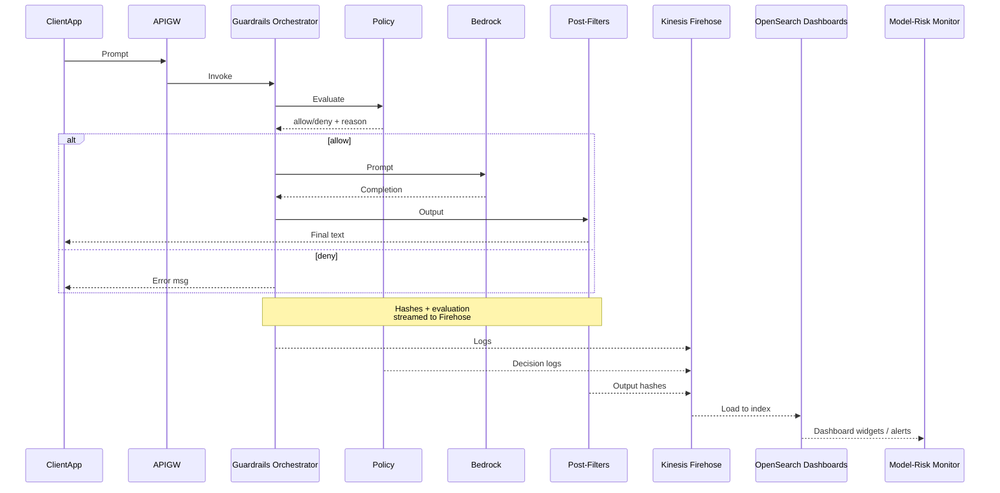
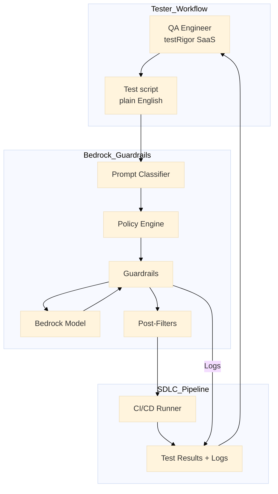

# AWS Bedrock Control-Plane Architecture — Consolidated Diagrams

Below is a single Markdown file containing every diagram (Mermaid 10-compatible) from the previous two responses. Copy-paste the whole file into any Markdown viewer or docs repo that supports Mermaid.

---

## 1 C4 Level 1 — Context



---

## 2 C4 Level 2 — Container



---

## 3 Sequence — Single Model Invocation



---

## 4 Technical Flow — RAG Pipeline



---

## 5 Plug-and-Play Pattern Catalogue



---

## 6 C4 Level 3 — Policy-Engine Internals



---

## 7 C4 Level 3 — Guardrails & Model Invoker



---

## 8 RAG — Ingestion & Query Paths



---

## 9 Sequence — End-to-End Audit & MRM



---

## 10 Detailed Flow — PII Scrub & Privacy Filter

```mermaid
%%{init:{ "theme":"neutral" } }%%
flowchart LR
    GenOut[Raw LLM<br/>Completion]
    Det[Amazon Comprehend PII Detect]
    Rdct[Redaction Lambda]
    Class[Token-Classify<br/>Regex + HeapRegex]
    Merge[Merge / Mask &lt;*&gt;]
    Hash[SHA-256 Hash<br/>Store]
    GenOut --> Det --> Rdct
    GenOut --> Class --> Merge
    Rdct --> Merge --> Hash --> "Safe Completion →\nUser / Downstream"
```

---

## 11 Swim-lane — Tester Persona with testRigor



---

**End of file**