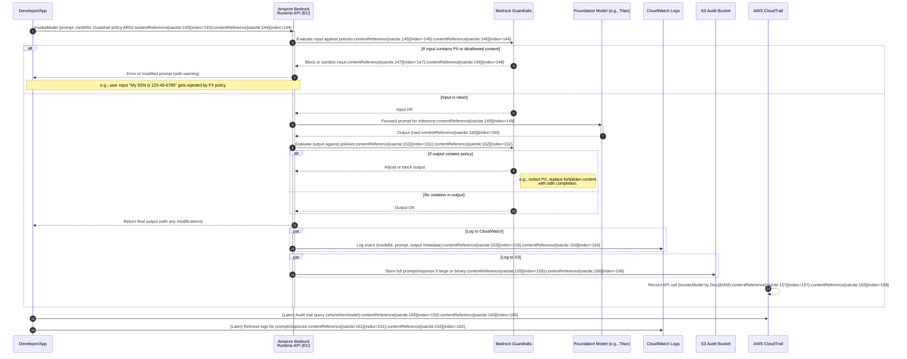
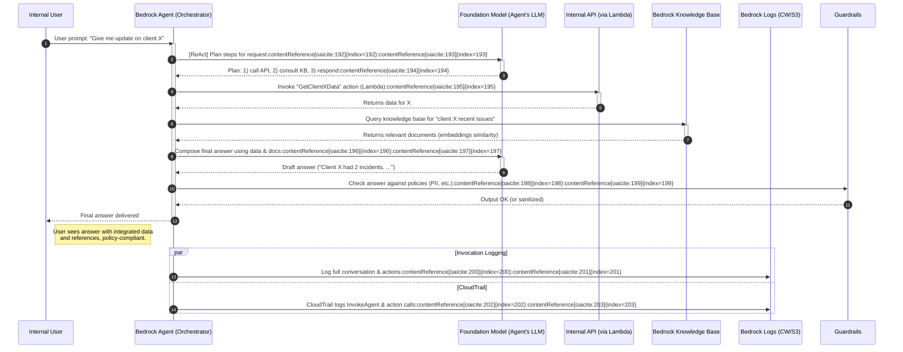

# Amazon Bedrock Rollout – Part 2: Experimentation & Enablement

**Author:** Head of Architecture & Platform Engineering  
**Audience:** Engineers, Tech Leads, Platform SRE, Risk & Security  
**Tags:** bedrock, experimentation, eu-ai-act, governance, observability, workshops

---

## Purpose

Phase 2 begins **once Amazon Bedrock is live for experimentation** in our AWS EU regions (`eu-central-1` and `eu-west-2`). This guide provides a detailed, interactive playbook for teams to:

- **Discover & trial** the foundation models (FMs) available in EU regions, mapping them to priority use cases.
    
- Build proofs-of-concept with **secure guardrails** and **cost visibility** from the start.
    
- Understand the **governance constraints** (EU AI Act, GDPR, internal security policies) and how to implement them in practice.
    
- Leverage a curated developer toolchain and dev experience layer (AWS SDK/CLI, CDK constructs, LangChain integration, starter repos).
    
- Participate in **hands-on workshops** that demonstrate the “art of the possible” for generative AI in our context, while clarifying regulatory limits.
    

Each section below corresponds to a deliverable in this rollout. **All content is Obsidian-friendly** and cross-references Part 1 as needed. Diagrams are provided in Mermaid format (no external images), and code samples are included for immediate experimentation.

> 📌 **Try This Now:** You can follow along by opening a terminal or Jupyter notebook. Ensure you have AWS CLI v2 configured and necessary Bedrock access enabled. Code blocks labeled as “CLI”, “Python”, or “TypeScript” can be copied and run with minimal modification.

---

## Contents

1. [**Overview & Setup (README.md)**](https://chatgpt.com/c/685e6063-655c-8011-84ea-9648f8f4644b#overview--setup-readmemd)
    
2. [**Model Access & Use Cases (model-access-usecases.md)**](https://chatgpt.com/c/685e6063-655c-8011-84ea-9648f8f4644b#model-access--use-cases-model-access-usecasesmd)
    
3. [**Tooling & Developer Experience (tooling-dev-experience.md)**](https://chatgpt.com/c/685e6063-655c-8011-84ea-9648f8f4644b#tooling--developer-experience-tooling-dev-experiencemd)
    
4. [**Governance & Guardrails (governance-guardrails.md)**](https://chatgpt.com/c/685e6063-655c-8011-84ea-9648f8f4644b#governance--guardrails-governance-guardrailsmd)
    
5. [**Security, Cost & Monitoring (security-cost-monitoring.md)**](https://chatgpt.com/c/685e6063-655c-8011-84ea-9648f8f4644b#security-cost--monitoring-security-cost-monitoringmd)
    
6. [**Architecture Diagrams (architecture-diagrams.md)**](https://chatgpt.com/c/685e6063-655c-8011-84ea-9648f8f4644b#architecture-diagrams-architecture-diagramsmd)
    
7. [**Workshops (workshops)**](https://chatgpt.com/c/685e6063-655c-8011-84ea-9648f8f4644b#workshops) – Interactive guides:
    
    - [Workshop 1: Rapid Document Summarizer](https://chatgpt.com/c/685e6063-655c-8011-84ea-9648f8f4644b#workshop-1-rapid-document-summarizer)
        
    - [Workshop 2: Code Review Copilot in VS Code](https://chatgpt.com/c/685e6063-655c-8011-84ea-9648f8f4644b#workshop-2-code-review-copilot-in-vs-code)
        
    - [Workshop 3: Internal Chatbot with Tiered Guardrails](https://chatgpt.com/c/685e6063-655c-8011-84ea-9648f8f4644b#workshop-3-internal-chatbot-with-tiered-guardrails)
        
8. [**Limitations & Rationale (limitations-rationale.md)**](https://chatgpt.com/c/685e6063-655c-8011-84ea-9648f8f4644b#limitations--rationale-limitations-rationalemd)
    

---

## Overview & Setup (`README.md`)

This README serves as the entry point for Part 2 of the Bedrock rollout. It outlines the objectives and links to all deliverables in this phase. Before diving in, ensure you have completed **Part 1: Pre-Release** (setup of AWS accounts, initial access requests, and knowledge of Bedrock basics).

**Prerequisites:**

- **AWS Account Access:** You have access to AWS accounts in `eu-central-1` (Frankfurt) or `eu-west-2` (London) where Bedrock is enabled. Ensure that the **Amazon Bedrock service** is available in your account and region. (As of October 2023, Bedrock went GA in Frankfurt, and it has since expanded to London and other EU regions.)
    
- **Model Access Approvals:** Bedrock requires requesting access for certain models/providers (e.g., Anthropic Claude, Meta Llama, etc.). Use the AWS Console’s _Bedrock > Model access_ section to request access where needed. Approvals are usually quick (a few minutes).
    
- **AWS CLI and SDK:** Install AWS CLI v2 and set up credentials. Ensure your IAM user/role has appropriate permissions (e.g., **AmazonBedrockFullAccess** for experimentation or fine-grained policies as defined in Part 1). For code examples, Python 3.x and `boto3` (AWS SDK for Python) should be installed.
    
- **GitHub Integration:** If using our internal GitHub stack, ensure you have the repository structure ready (this content will be added to `bedrock-rollout/part-2-experimentation`). For running notebooks, have Jupyter or VS Code with Jupyter support ready.
    

**Navigation:** Each document in this phase can be read independently, but they are organized to flow from high-level to hands-on:

- _Model Access & Use Cases:_ Start here to learn what models are available in EU regions and which use-cases they support.
    
- _Tooling & Developer Experience:_ Dive into the CLI, SDK, CDK, and integration tools that make Bedrock development easier.
    
- _Governance & Guardrails:_ Understand the compliance and policy measures (EU AI Act, data protection) and how to enforce them (Amazon Bedrock Guardrails, prompt logging, etc.).
    
- _Security, Cost & Monitoring:_ Learn how to secure Bedrock in our AWS environment (IAM, VPC endpoints) and track usage and costs (CloudWatch, CUR with tagging).
    
- _Architecture Diagrams:_ Visualize the high-level platform and an agent-mediated flow with integrated guardrails and logging (provided as Mermaid diagrams).
    
- _Workshops:_ Step-by-step guides for three practical scenarios – these are great for team lunch-and-learn sessions or hackathons.
    
- _Limitations & Rationale:_ Finally, a frank discussion of what’s _out of scope_ or restricted, with reasoning (regulatory or technical). This will manage expectations and steer teams toward safe usage.
    

Each section contains **“Try This Now”** call-outs for interactive learning, and references back to Part 1 for foundational topics. Remember that this is an iterative **experimentation** phase – encourage teams to explore creatively but also **capture lessons learned** to inform our production rollout in later phases.

> 🔖 **Related:** See **Part 1: Pre-Release** documentation for initial setup, and our internal “Generative AI Responsible Use Policy” (updated post EU AI Act) for guidelines that apply throughout experimentation.

---

## Model Access & Use Cases (`model-access-usecases.md`)

### Foundation Models in EU Regions

Amazon Bedrock provides access to a variety of third-party and Amazon’s own foundation models (text, chat, embedding, and image models). However, **not all models are available in every region**. In EU specifically (Frankfurt, London), the available FMs and providers include:

- **Amazon Titan Family:** Amazon’s native models. **Titan Text** (GPT-style text generation) and **Titan Embeddings** are available in Frankfurt (eu-central-1) and London (eu-west-2). Titan Text is a general-purpose LLM suitable for summarization, Q&A, and moderate-length content generation. Titan Embeddings produce vector embeddings for semantic search or clustering. (Note: Titan Text **G1** is the current generation; fine-tuning capabilities may be limited in this phase.)
    
- **Amazon Image & Multimodal Models:** Amazon’s **Titan Image Generator G1** is available in EU (including eu-west-2) for text-to-image generation. Also, **Titan Multimodal Embeddings G1** (for image+text embeddings) is supported in Frankfurt, Ireland, and London. These enable vision use-cases like generating or searching images, but note the EU AI Act’s limitations on biometric or sensitive image analysis.
    
- **Anthropic Claude:** Claude v2 (and Claude Instant) are **supported in EU regions** like Frankfurt. Claude 2 is a powerful conversational model, excellent for dialogue-based support, brainstorming, and moderate-length document analysis. It has a 100k token context window, making it useful for summarizing large documents or logs. (London region support for Claude may be pending or in preview; for now assume Frankfurt primary.)
    
- **AI21 Labs Jurassic-2 (J2) / Jamba:** AI21’s models (Jurassic-2 jumbo, etc.) were initially only in us-east-1. The new **Jamba 1.5** series appears US-only as well, so **not available in EU**. This means use-cases needing AI21’s specific strengths (e.g., high-quality long-form writing or multilingual capabilities) might not be directly served in-region. We’ll focus on alternatives (Claude or Llama 2) for those tasks.
    
- **Cohere**: Cohere’s models for text generation (**Command** family) and embeddings are partly available. Notably, **Cohere Embed** models (English and Multilingual) are supported in Frankfurt and London. These are great for generating sentence or document embeddings (useful in KYC document comparison or semantic search). Cohere’s generative text models (_Command, Command-Light, etc._) had limited region support; as of now, `cohere-command` is _not_ listed in EU in the public docs (only in us-east-1 and us-west-2). We will verify if Command is accessible via cross-region inference; if not, we rely on Amazon/Anthropic/Meta models for text generation in EU. Cohere **Rerank** (for search result re-ranking) is available in Frankfurt – potentially useful for building smarter search or KYC risk scoring (reordering relevant results).
    
- **Meta Llama 2 and 3:** Meta’s Llama family models are integrated into Bedrock. Llama 2 (70B and 13B) were available in Bedrock (mostly in us regions initially). **Llama 3 and 3.1** are now listed, with **Llama 3 70B Instruct** explicitly supported in London (eu-west-2). These models are fine-tuned for instructions and can be used for code generation (Llama 2 had a variant trained on code). If access is granted, Llama models could be applied to internal conversational agents or code assistants. Keep in mind these are open-models; they might require more prompt steering to get optimal results compared to Claude.
    
- **Mistral AI:** Mistral (a newer EU-based AI startup) 7B and larger models are also available in Bedrock and **supported in EU regions (London, etc.)**. Mistral’s models are smaller but efficient; a fine option for lightweight tasks or where data can’t leave EU at all (Mistral 7B is open and can be self-hosted too, but Bedrock provides a managed inference). They can handle summarization and simple Q&A but may not match Claude or Titan in quality for complex prompts.
    
- **Stability AI:** _Text-to-image models (Stable Diffusion)_ – As of now, Bedrock’s stability.ai models (Stable Diffusion XL, etc.) are only available in AWS US regions. **No EU deployment for Stability models** yet, likely due to large GPU resource needs and licensing. Therefore, image generation use-cases in EU must use Amazon’s Titan Image or possibly cross-region invocation if absolutely needed (with caution to comply with GDPR for any personal data in prompts).
    
- **Others:** Bedrock is extensible, and new models/providers keep being added. For instance, **Luma** (for video generation) is present (us-west-2 only), and **DeepSeek** (a specialized model) appears with multi-region support including Frankfurt. These are niche and not priority for our use cases, but worth knowing as the ecosystem grows. Always check the latest AWS Docs “Supported models by region” for updates.
    

**Table: Key Models Available in EU vs Use Cases**

|**Model**|**Provider**|**EU Region**|**Primary Use Cases**|**Notes**|
|---|---|---|---|---|
|Amazon **Titan Text** G1|Amazon (AWS)|✅ Frankfurt, London|General text generation (summaries, explanations, creative writing), conversational AI|Good default model; use for summarization, basic Q&A. Compliant with AWS AI policies.|
|Amazon **Titan Embeddings** G1|Amazon (AWS)|✅ Frankfurt (🟢), London (🟢)|Vector embeddings (semantic search, doc similarity)|Use for KYC document matching, knowledge search features.|
|Amazon **Titan Image** G1|Amazon (AWS)|✅ Frankfurt, London|Image generation from text (e.g., create marketing graphics)|Ensure no sensitive data in prompts (EU AI Act concerns for image misuse).|
|**Anthropic Claude 2**|Anthropic|✅ Frankfurt (Claude 2, Instant)|Conversational assistant (chatbots), long-form text, complex reasoning tasks|100k context – ideal for long docs (policy docs, code reviews). High-quality output.|
|**Meta Llama 2** (e.g., 70B)|Meta AI|✅ Frankfurt, London (via Llama 3/3.1 series)|Q&A, content generation, code assistance (with Code Llama variant)|Open model; may need prompt refinement. Use when proprietary model use is sensitive (open weights).|
|**Cohere Embed** (Eng/Multi)|Cohere|✅ Frankfurt, London|Embedding text in vector space (for search, clustering, recommendation)|Multilingual support for global KYC data. No content generation.|
|**Cohere Rerank**|Cohere|✅ Frankfurt|Re-ranking search results or document lists based on relevance|Use in KYC for ranking risk factors or relevant customer info from large lists.|
|**Cohere Command** (GPT model)|Cohere|❌ _Not in EU_ (US-only as of now)|General GPT-3-like text generation (chat, write code)|_Not directly available in EU._ Use Amazon/Claude instead.|
|**AI21 Jurassic-2** / Jamba|AI21 Labs|❌ _Not in EU_|Advanced long-form text generation, multilingual, math reasoning|_Not available in EU._ Consider cross-region with caution or use Llama/Claude as alternative.|
|**Mistral 7B / 7B Instruct**|Mistral AI|✅ Frankfurt, London|Lighter-weight text tasks, quick prototyping, cases needing EU-hosted open model|Lower quality than Titan/Claude for complex tasks; good for internal tools with low risk.|
|**Stability Stable Diffusion**|Stability AI|❌ _Not in EU_|Image generation (artwork, design)|_Use Titan Image instead._ Cross-region if absolutely required and data is non-sensitive.|

_(✅ = available, ❌ = not available in EU region)_

**Cross-Region Inference:** Amazon Bedrock supports cross-region inference profiles, which can route requests to another region’s model endpoint if not available locally. This can be used to access, say, AI21 models from EU without exposing details publicly. **However, exercise caution:** Sending data out of EU regions might raise compliance flags under GDPR and internal data residency policies. For experimentation with non-EU models, prefer to use **synthetic or non-sensitive data**, and document any such usage. We also have the option to deploy open models ourselves (e.g., via SageMaker) if needed to keep data in-region.

> 📌 **Try This Now:** To see what models are available in your region via API, use the AWS CLI. Run:
> 
> ```bash
> aws bedrock list-foundation-models --region eu-west-2  
> ```
> 
> This will return a JSON list of models and their IDs that you can use in London. You can similarly try `--region eu-central-1`. Compare the lists to see differences (e.g., you’ll notice AI21 models appear in `us-east-1` but not in EU). This aligns with our table above.

### Mapping Models to Use Cases

Now that we know which models we have at our disposal in Europe, let’s map them to the priority use cases identified:

- **Code Generation & Code Review:**  
    _Primary models:_ We will use **Anthropic Claude 2** and potentially **Meta Llama 2 Code** (if available) for code-related tasks. Claude excels at understanding code context and providing suggestions or finding bugs in a code review scenario. Titan Text can also handle code to some extent but may not be tuned for it. If we obtain access to a Code Llama variant (or if AWS integrates Amazon CodeWhisperer models into Bedrock in future), those would be ideal.  
    _Use in Workshop:_ Our _Workshop 2_ will demonstrate a “Code Review Copilot” in VS Code using Bedrock (Claude model) to suggest improvements to a code snippet.  
    _Why these models:_ Code tasks require models that understand syntax and can reason about program logic. Claude has shown strong performance in explaining code and suggesting fixes. Meta’s models (if accessible) provide open-source alternatives.
    
- **Summarization (Documents & Logs):**  
    _Primary models:_ **Amazon Titan Text** G1 and **Anthropic Claude** are both strong for summarization. Titan is readily available and fine-tuned by Amazon for quality and compliance. Claude’s larger context window makes it perfect for summarizing long documents (e.g., a 50-page policy or a large chat transcript).  
    _Use in Workshop:_ _Workshop 1_ covers a “Rapid Document Summarizer” where a lengthy document is fed to a model for a concise summary. We’ll showcase using Titan Text for a quick summary, and Claude for a more detailed summary including Q&A about the doc.  
    _Why these models:_ They produce coherent summaries and are designed to follow instructions. Titan, being an AWS model, also ensures no data leaves AWS jurisdiction. Claude’s quality is top-notch, but use it for non-sensitive docs unless we have explicit approval (since it’s third-party, albeit hosted by AWS).
    
- **KYC (Know Your Customer) & Risk Analysis:**  
    KYC involves extracting and analyzing information from various documents (IDs, financial statements, onboarding forms) and assessing risk. This is a multi-faceted use case:
    
    - _Entity Extraction:_ Use **Amazon Titan Text** or **Claude** to parse documents and extract names, addresses, etc. Titan has stable performance and can be augmented with Amazon Comprehend for specific PII extraction (though Comprehend is separate from Bedrock).
        
    - _Summarizing Customer Profiles:_ Use **Claude** to summarize a customer’s data into a risk profile. Claude’s nuanced understanding helps ensure nothing important is missed.
        
    - _Embedding & Similarity:_ Use **Cohere Embed Multilingual** to vectorize text data (e.g., a new customer’s description) and compare against known profiles or known risk cases. Since Cohere Embed is available in EU, we can do this without leaving region.
        
    - _Classification:_ We might classify customers into risk categories. If we had a fine-tuned model or could prompt an LLM with guidelines (“High risk if … else Low risk”), Titan or Llama could do it. But for consistent results, a small purpose-built model or rule-based system might complement the LLM outputs.  
        _Why these models:_ KYC is a **high-risk use-case** under EU regulations (financial and personal data). So we favor AWS-first models and ones we can tightly control. Titan and AWS services will likely be mandated for PII and regulatory reasons, with Bedrock’s guardrails for prompt filtering.
        
- **Conversational Support (Chatbots & Assistants):**  
    _Primary models:_ **Anthropic Claude Instant** (if available) and **Amazon Titan** are good choices for internal chatbots. Claude Instant is optimized for fast, dialogue-type responses and is cheaper than full Claude 2, while still very capable. Titan can handle straightforward Q&A and has the benefit of being first-party.  
    Additionally, if needed, **Meta Llama 2 Chat** (if accessible through Bedrock) could power a chatbot that stays entirely in EU and under our control (weights can be downloaded if needed). Mistral 7B could even be used for a lightweight FAQ bot that runs fully in-house if we’re concerned about data.  
    _Use in Workshop:_ _Workshop 3_ will guide building an “Internal GPT Chatbot” with _tiered guardrails_. We’ll use an Agent (via Bedrock) that can handle multi-turn dialogue, call our internal APIs (simulated), and enforce rules (e.g., it will refuse answers about disallowed topics or redact sensitive info). Likely, we use Titan or Claude for the language output, with **Bedrock Guardrails** ensuring policy compliance.  
    _Why these models:_ Chatbots need to be responsive and safe. Titan being the “house” model is heavily tested for safety. Claude provides more creativity and context handling for complex internal queries. We will integrate whichever is needed per query through an Agent that can pick or we manually switch based on query type (this is the “tiered” approach: e.g., Tier 1 questions answered by Titan by default, but if complexity > X, route to Claude, unless the topic is sensitive in which case maybe require manual approval or a filtered response).
    

**Important:** For each use-case above, consider **data confidentiality and compliance**:

- Do not send real personal data to any model without clearance. For KYC, during experimentation use synthetic anonymized data.
    
- Enable **invocation logging** (see _Security & Monitoring_) so that all prompts & responses are captured for audit.
    
- Use **Guardrails** for conversational and generative use-cases to catch disallowed content (more in Governance section). Amazon Bedrock Guardrails can block or redact PII and hate speech in model outputs, which is crucial for an internal chatbot or any customer-facing content.
    

> 📌 **Try This Now:** Let’s do a quick test of summarization vs conversation in Python. (Make sure you have `boto3` configured with credentials and region.)

> **Python Example – Summarize vs. Converse**  
> _(This example uses a pseudo-code approach since we cannot actually call Bedrock without credentials here, but it shows how you would invoke Titan vs Claude.)_
> 
> ```python
> import boto3
> bedrock = boto3.client('bedrock-runtime', region_name="eu-central-1")
> 
> # Summarize a text using Titan Text
> prompt = "Summarize the following:\n" + open('sample_document.txt').read()[:1000]
> response = bedrock.invoke_model(
>     modelId="amazon.titan-text-express-v1",  # Titan Text G1
>     contentType="application/json",
>     accept="application/json",
>     body='{"inputText": "' + prompt.replace('"','\\"') + '", "textGenerationConfig":{"maxTokenCount":200}}'
> )
> summary = response['body'].read().decode()
> print("Titan Summary:", summary)
> 
> # Have a conversation with Claude 2 (assuming access granted)
> chat_prompt = {
>   "messages": [
>       {"role": "system", "content": "You are an internal support assistant."},
>       {"role": "user", "content": "Hi, I have a question about our data retention policy."}
>   ]
> }
> response_chat = bedrock.invoke_model(
>     modelId="anthropic.claude-2",  # Model ID for Claude 2
>     contentType="application/json",
>     accept="application/json",
>     body=json.dumps(chat_prompt)
> )
> answer = response_chat['body'].read().decode()
> print("Claude says:", answer)
> ```
> 
> This script demonstrates using the Bedrock Runtime API via boto3. We call Titan for a text summary and Claude for a chat response. In practice, you would parse the JSON in `response['body']` for the actual content (`outputText` for Titan, or `completion` for Claude depending on format). Ensure you have the correct `modelId` from the earlier CLI listing (Claude’s ID might be like `anthropic.claude-v2` or similar).

### Top Use-Case Scenarios and Model Fit

To further guide teams, here are _“top picks”_ for models per scenario:

- **Generating meeting minutes or report summaries:** Use **Amazon Titan Text** (fast, reliable) or Claude if the source text is huge. Titan is sufficient for up to a few pages and ensures data stays on AWS servers.
    
- **Translating or rephrasing content (multilingual):** If needed, consider **Llama 2 70B Chat** (supports multiple languages moderately) or **Cohere Command Multilingual** (if it were available – currently likely not in EU). This is less of a focus now, but some teams might ask. AWS might integrate something like **Amazon Translate + Bedrock** pipeline in future.
    
- **Generating code snippets or config templates:** If an internal tool needs to suggest Infrastructure-as-Code or code fixes, **Claude** (with an agent possibly) is ideal. Alternatively, **Bedrock Agents** can call AWS CodeWhisperer, but that’s outside Bedrock proper. So we’ll stick to Claude or Titan with good prompting for code (e.g., “Given this Terraform snippet, suggest improvements…”).
    
- **Customer support chatbot (internal knowledge):** Use **Bedrock Agent** with Titan or Claude as underlying model, plus a **Knowledge Base** integration for company FAQs. Bedrock has a feature to create knowledge bases and do retrieval augmented generation (RAG). For instance, we can load a set of internal FAQs or policies into a Bedrock knowledge base, and the agent can automatically fetch relevant info to ground its answers. The model (Titan/Claude) will then give an answer citing that info, reducing hallucinations. We will explore this in Workshop 3.
    

By mapping the right model to each task, teams can **experiment effectively** and avoid dead-ends (e.g., not trying to use a tiny model for a very complex task, or not accidentally using an unavailable model). This mapping also sets the stage for **governance**: using simpler or AWS-native models for higher-risk tasks reduces compliance burden, whereas more capable third-party models can be used on lower-risk or test data to maximize innovation.

Finally, keep an eye on AWS announcements – Bedrock is evolving quickly. (It even gained new features like **Agents** and expanded model list within months of launch). For example, AWS announced Bedrock in new EU regions like Zurich, Milan, Spain in 2024, which might bring more local availability. We will update this guide as new models become available or if any models get restricted or deprecated (AWS has a model lifecycle policy – unlikely to affect us in Phase 2, but something to monitor in production).

---

## Tooling & Developer Experience (`tooling-dev-experience.md`)

This section covers the tools, SDKs, and templates that make developing with Bedrock easier. Our goal is to ensure engineers have a **frictionless experience** when spinning up prototypes: from command-line invocations to fully automated CI pipelines deploying Bedrock-integrated apps. We also highlight how to integrate Bedrock with our GitHub-based workflow.

### AWS CLI and Bedrock CLI Usage

The AWS CLI is the quickest way to experiment with Bedrock. After configuring your AWS credentials:

- **Listing Models:** Use `aws bedrock list-foundation-models` (as shown earlier) to see what’s available in your region. This confirms access and model IDs.
    
- **Invoking a Model (Text Generation):** The Bedrock runtime API can be called via CLI using `aws bedrock-runtime invoke-model`. For example, to prompt the Titan Text model:
    
    ```bash
    aws bedrock-runtime invoke-model \
      --model-id amazon.titan-text-express-v1 \
      --content-type application/json \
      --accept application/json \
      --body '{
        "inputText": "Hello, Bedrock!",
        "textGenerationConfig": { "maxTokenCount": 50 }
      }' \
      --region eu-central-1 \
      --cli-binary-format raw-in-base64-out \
      output.json
    ```
    
    This will send the prompt and save the response JSON to `output.json`. The use of `--cli-binary-format raw-in-base64-out` is required when passing JSON in the body to avoid quoting issues. The output file will contain fields like `outputText` (for text models) or `results` (for other types).
    
- **Converse for Chat Models:** Bedrock provides a `Converse` operation (and corresponding CLI command `aws bedrock-runtime converse`) which simplifies multi-turn conversations by handling the message history for you. Use it when available (currently Titan and maybe Claude support it). E.g.:
    
    ```bash
    aws bedrock-runtime converse \
      --model-id anthropic.claude-instant-v1 \
      --region eu-central-1 \
      --messages '[{"role":"user","content":[{"text":"Hi Claude, how are you?"}]}]'
    ```
    
    The output will be a JSON with Claude’s reply. The advantage of `converse` is that it standardizes the prompt format across models and retains context on the service side for multi-turn chats. (Not all models support `Converse`; Titan does and presumably Claude does, but if not, one can manage history manually with `invoke-model` calls).
    
- **Bedrock vs Bedrock-Runtime CLI:** Note that AWS CLI has both `bedrock` (control plane, e.g., ListFoundationModels, etc.) and `bedrock-runtime` (data plane, actual inference calls). Also, for Agents (discussed below) there are `bedrock-agent` commands. Make sure to use the correct namespace: `invoke-model` is under `bedrock-runtime` as shown above.
    

**Developer Tip:** Use AWS CloudShell or AWS SSO if you prefer not to configure local credentials. AWS CloudShell in an EU region can run these CLI commands in the browser securely. There’s also a CLI wizard in the Bedrock console to generate CLI commands for given prompts.

### Boto3 (Python SDK) and AWS SDK for JavaScript/TypeScript

For developers writing code, AWS provides SDK support:

- **Python (boto3):** Using `boto3.client('bedrock-runtime')` as we did in the example, you can integrate Bedrock calls in any Python app or notebook. This is great for data scientists experimenting in Jupyter. In our internal platform, we can provide a shared JupyterHub environment with boto3 pre-configured. We showed a Python example above for summarization. Another example:
    
    ```python
    # Example: embedding text via Cohere using boto3
    bedrock = boto3.client('bedrock-runtime')
    text_to_embed = "Acme Corp is based in London and specializes in finance."
    response = bedrock.invoke_model(
        modelId="cohere.embed-english-v2.0",  # hypothetical model ID for demonstration
        contentType="application/json",
        accept="application/json",
        body=f'{{"text": "{text_to_embed}"}}'
    )
    embedding = json.loads(response['body'].read())['embedding']
    ```
    
    This would yield a vector (embedding) for the input text, which you could then feed into downstream tasks (like similarity search with our vector DB, if any). Python SDK also allows streaming responses (for models that support it, e.g., streaming large outputs token by token). This is done via the `InvokeModelWithResponseStream` API – boto3 would handle it with a streaming iterator on the response. We won’t delve deep here, but know it’s possible (useful for real-time chat streaming).
    
- **JavaScript/TypeScript (AWS SDK v3):** If building front-end or Node.js apps, the AWS SDK for JavaScript supports Bedrock. The module is typically `@aws-sdk/client-bedrock-runtime` (and similar for bedrock proper). Using it in Node:
    
    ```ts
    import { BedrockRuntimeClient, InvokeModelCommand } from "@aws-sdk/client-bedrock-runtime";
    const client = new BedrockRuntimeClient({ region: "eu-west-2" });
    const command = new InvokeModelCommand({
        modelId: "amazon.titan-text-express-v1",
        contentType: "application/json",
        accept: "application/json",
        body: Buffer.from(JSON.stringify({
          inputText: "Generate a one-line tagline for our product.",
          textGenerationConfig: { temperature: 0.7 }
        }))
    });
    const response = await client.send(command);
    const resultJson = JSON.parse(new TextDecoder().decode(response.body));
    console.log(resultJson.outputText);
    ```
    
    In TypeScript, because of the binary body, we wrap JSON in a Buffer. The SDK returns a `ReadableStream` or `Uint8Array` for the body; above we decoded it into text. This could be integrated in a Node backend or even run in a browser (if CORS and creds were handled, though we likely won’t expose Bedrock directly to browsers due to security).
    
- **Java/.NET/Go:** AWS has SDKs in many languages. If teams prefer Java (for an internal service) or .NET, they can use similar patterns. We can provide starter code examples if needed, but Python/JS cover most of our use cases in this phase.
    

**Error handling:** All SDK calls can throw errors (e.g., if modelId is wrong or access denied). Look for specific error messages; e.g., “Model not found or not authorized” means you might not have access to that model – go to AWS Console’s Bedrock Model Access page to request it.

**Using Async Workflows:** For larger jobs or batch requests, consider using AWS Step Functions or AWS Lambda to orchestrate calls. Bedrock doesn’t have asynchronous job submission for on-demand models (it’s real-time only, except for fine-tuning jobs). But you can build a Step Function that, say, splits a large document into chunks and calls Bedrock for each chunk summarization, then aggregates results. AWS Step Functions can call Bedrock via its SDK integration. There’s even mention that Step Functions can integrate Bedrock for generating text.

> 📌 **Try This Now:** Test a quick Bedrock call in your preferred language. For example, open a Python REPL (or use our provided Jupyter notebook in the repo) and try a simple `bedrock.invoke_model` call as shown. Or, if you like JavaScript, use Node.js to run the TypeScript snippet (you'll need to `npm install @aws-sdk/client-bedrock-runtime`). This will build confidence that your environment is set up correctly.

### AWS CDK Constructs for Bedrock

To integrate Bedrock into our infrastructure-as-code, AWS offers a **CDK (Cloud Development Kit)** library for Bedrock. This is particularly useful for deploying **Bedrock Agents** or setting up **PrivateLink** via code.

- **L1 Constructs:** The CDK `aws-cdk-lib.aws_bedrock` module provides low-level (L1) constructs, basically auto-generated from AWS CloudFormation spec. For example, you can define a `CfnKnowledgeBase`, `CfnModelCustomizationJob`, etc., as resources. These are a bit raw, but they allow deploying Bedrock features (like an Agent) repeatably.
    
- **L2 Constructs (Generative AI Constructs):** AWS Labs has introduced higher-level patterns (L2) for Gen AI. The **AWS Generative AI CDK Constructs** library includes patterns for typical architectures. For instance, a construct might deploy a Bedrock Agent, plus a Lambda and API Gateway to expose it as an endpoint. Or a construct to set up a RAG pipeline with minimal code. We should leverage these where possible to reduce boilerplate.
    
    - One example: a construct that creates a Bedrock Agent resource with specified allowed actions (maybe integrating our corporate APIs as API actions the agent can call).
        
    - Another: constructs to easily attach a Bedrock model to a Lambda, so that the Lambda code can call it with proper IAM permissions.
        
- **Endpoint and IAM with CDK:** We can use CDK to create the **VPC Endpoints** for Bedrock (which are critical for security – see Security section). For example, in CDK (TypeScript):
    
    ```ts
    new InterfaceVpcEndpoint(this, 'BedrockVPCEndpoint', {
      service: InterfaceVpcEndpointAwsService("bedrock.runtime"), // pseudo-code, actual may differ
      vpc,
      securityGroups: [bedrockEndpointSG],
      subnets: { subnetType: SubnetType.PRIVATE_ISOLATED }
    });
    ```
    
    Actually, AWS might soon have a pre-defined service for Bedrock in CDK as `InterfaceVpcEndpointAwsService.BEDROCK_RUNTIME` etc., given it’s in AWS PrivateLink list. We could also define an endpoint policy via CDK to restrict usage (e.g., only allow specific IAM principals or only `bedrock:InvokeModel` actions).
    
- **GitHub Actions with CDK:** Since we use GitHub for our stack, a typical pattern would be: developers write CDK code (TypeScript/Python) for their Bedrock-related infra (like deploying a demo app that calls Bedrock), and we have a GitHub Actions pipeline that synthesizes and deploys it. We should ensure our Actions runners have AWS creds (via OIDC or secrets) and perhaps limit deployments to a sandbox account in this phase. A starter GitHub Actions workflow could be provided, for example:
    
    ```yaml
    name: Deploy Bedrock Demo
    on: push
    jobs:
      deploy:
        runs-on: ubuntu-latest
        steps:
          - uses: actions/checkout@v3
          - uses: aws-actions/configure-aws-credentials@v2
            with:
              role-to-assume: arn:aws:iam::123456789012:role/BedrockDeployRole
              aws-region: eu-west-2
          - name: Install Dependencies
            run: npm install
          - name: CDK Deploy
            run: npx cdk deploy BedrockDemoStack --require-approval never
    ```
    
    This would automatically deploy changes. We’ll put such examples in our repo’s `/.github/workflows` if needed.
    
- **LangChain and External Tooling Integration:** While not CDK, it’s part of dev experience. For developers wanting to use higher-level abstractions, **LangChain** (Python or JS) provides integrations for Bedrock. For instance, in Python LangChain:
    
    ```python
    from langchain.chat_models import Bedrock
    chat = Bedrock(model_id="anthropic.claude-2", region_name="eu-central-1")
    response = chat.predict("How can I optimize my code for speed?")
    print(response)
    ```
    
    Under the hood, it uses boto3 with the provided region and model_id. LangChain can simplify prompt management, chain multiple calls, or do Retrieval Augmented Generation by plugging in a Bedrock model as the LLM and our data store as the vector store. We have to ensure any such use still respects our policies (LangChain itself won’t enforce guardrails – that’s on us).  
    Another interesting tool is **Smithy** – here likely referring to the AWS _Smithy_ interface definition language. Bedrock’s APIs are defined via Smithy models (which is how AWS SDKs are built). For developers interested in generating custom SDK logic or extending, knowledge of Smithy isn’t required, but if curious, the AWS Bedrock API models are accessible in AWS’s SDK repository. This is more FYI for platform engineers.
    

### Developer Experience Enhancements

We want to create a **golden path** for engineers. Some steps:

- **Starter Repositories:** We will provide template repos (likely in our GitHub Enterprise) for common patterns:
    
    - _Bedrock + Lambda API:_ Example code for a Lambda function that calls Bedrock (with appropriate IAM role having `BedrockInvokeFullAccess`), fronted by API Gateway. This could be the basis of a serverless internal app using generative AI.
        
    - _Bedrock + Streamlit (or Flask):_ A quick web UI to test prompts and see outputs (handy for demoing to stakeholders). It could allow choosing models, entering prompts, and showing responses with moderation info. This can be scaffolded easily.
        
    - _Bedrock Agent + Actions:_ A template demonstrating how to define a custom Agent (with maybe an API Action that calls a dummy internal service). Code to deploy and test it, showing how the agent breaks tasks into steps.
        
    - These repos will include CDK infrastructure, application code, and documentation.
        
- **Jupyter Notebooks:** In our `workshops/` folder, we might include notebooks for each workshop. For example, `workshop-1-doc-summariser.ipynb` that participants can run. The markdown files will have the instructions, but the notebooks can have pre-written code, which is more interactive. We’ll ensure these notebooks use small data and have placeholders for credentials (or better, if run on an EC2 in our account with an attached role, they don’t need explicit creds).
    
- **VS Code Extension:** We saw in Workshop 2 that using VS Code with Bedrock (via an extension like CodeGPT or Bedrock’s own extension) can bring the AI assistant directly into the IDE. We’ll encourage developers to try this for a more integrated experience. We might even host an internal extension or a guide for setting up CodeGPT with corporate AWS credentials (ensuring they use _temporary credentials_ or a least-privilege user as per security).
    
- **CI Templates:** If teams start building apps that use Bedrock, we must adapt CI/CD to include any validation. For instance, we might lint the prompts (ensure no hardcoded API keys, etc.), or run tests for prompt-output structure. Also, if any environment variables or secrets are needed (like model IDs or special config), our pipeline templates should account for that. One thing to monitor is **cost**: if someone writes a test that calls Bedrock repeatedly, it could generate cost unexpectedly. We might simulate or stub Bedrock calls in unit tests by using small local models or mocking boto3.
    
- **SDK/CLI Patterns:** Encourage re-use of patterns. E.g., a function to format chat history into the `messages` JSON that Bedrock expects, or a helper to chunk documents into sections and call the model sequentially. We can create a small internal library (Python package or Node module) with these helpers. For instance, a `bedrock_utils.py` that has `def summarize(text)` which does the chunking logic, calls Titan, and returns a single summary.
    
- **Observability for Devs:** Provide an easy way for developers to see logs of their Bedrock calls. CloudWatch logging for Bedrock can include input and output if turned on. We can set up a CloudWatch Log Insights query or a simple script that pulls their user’s recent invocations for debugging. In Phase 2, direct CloudWatch access or AWS Console might suffice, but a nicer DX would be a command-line like `bedrock_logs tail` that filters logs for your username or request ID.
    
- **LangChain/Smithy**: Already touched on LangChain. As for **Smithy support**, if this refers to building custom Bedrock-like interfaces using Smithy IDL, that’s likely out of scope for most devs. However, our platform team might use Smithy to define any **custom governance services**. For example, if we create a microservice that wraps Bedrock with additional audit features, we could define its API in Smithy (ensuring consistency and quick SDK generation). This is an advanced topic, so a footnote at best.
    

> 📌 **Try This Now:** Clone the `bedrock-rollout` repo and open the `part-2-experimentation` folder in VS Code. If you have the **Mermaid** extension, preview the diagrams in `architecture-diagrams.md`. Then open a terminal (or Jupyter) and run the code samples in `tooling-dev-experience.md` (you can find them by searching for “Example –”). This will verify your environment. Also, try generating a new project with CDK:
> 
> ```bash
> mkdir bedrock-demo && cd bedrock-demo
> cdk init app --language=typescript
> npm install @aws-cdk/aws-bedrock-alpha
> ```
> 
> (Imagining the CDK module might be in alpha). Write a simple stack to create a `CfnKnowledgeBase` or similar, then `cdk synth`. This is just to get a feel of deploying Bedrock resources via code. If this is too much, skip ahead to using our ready-made templates!

### Bedrock Runtime vs Agents: When to Use What

A critical piece of developer experience is knowing **which level of abstraction** to use: direct model calls (Bedrock runtime) or the higher-level **Agents**.

**Amazon Bedrock Agents** allow developers to define an **“Agent”** that can do multi-step reasoning and interact with external systems. Essentially, an Agent uses a large model behind the scenes to interpret user requests and break them into actions (using the ReAct paradigm). AWS provides an interface to define:

- **Agent Instructions:** A prompt that tells the agent its role, available actions, and what it should do.
    
- **Actions:** These can be AWS Lambda functions or API Gateway endpoints (for your own APIs) that the agent is allowed to call, as well as Knowledge Base queries. For example, an action could be “SearchCustomerDB” which triggers a Lambda to fetch data.
    
- **Flow & Memory:** Agents maintain memory (optionally) and can retain context across turns or even across separate conversations (if memory retention enabled).
    

**When to use Bedrock Runtime (direct model calls):**

- Simple requests that can be answered in one-shot by a model. E.g., “Summarize this document”, “Generate an email draft for X”. The logic is straightforward: send input, get output.
    
- When you want full control of the prompting and parsing. Direct calls let you craft the prompt precisely and you handle the response.
    
- Bulk or synchronous operations (like embedding a thousand texts) – you’d script those with direct calls.
    
- Essentially, most of our _initial experimentation_ will be direct calls, because it’s easier to reason about.
    

**When to use Agents:**

- For _complex workflows_ where the user’s query might require multiple steps or tool use. E.g., “Find all high-risk customers from last quarter and summarize their status.” An agent could: (1) call an internal API to get customers list, (2) call a knowledge base to get each profile’s risk, (3) compose an answer. Without an agent, you’d have to manually orchestrate these in code.
    
- To enforce a structured approach to tasks. Agents come with a **Chain-of-Thought trace** feature that lets developers see how the model is reasoning step by step. This is great for debugging and for compliance (you can log why it did what it did).
    
- When using **knowledge bases or retrieval** is needed. Agents can seamlessly do RAG: they can automatically inject relevant knowledge base documents into the prompt for a more accurate answer. If your use-case is Q&A over internal docs, an Agent simplifies that compared to manually vector-searching and constructing a prompt.
    
- To implement **guardrails at a higher level**. Interestingly, AWS has _Agent-level guardrails_ too. For example, you can set an agent to only respond using data from knowledge base and not from the model’s general knowledge (reducing hallucination). Agents can also likely integrate with Bedrock Guardrails (since Guardrails are configured at the application level and can intercept inputs/outputs for moderation).
    

**Developer effort difference:** Direct calls require writing more custom logic in your app. Agents require writing an agent specification (which can be done in the console or via CDK/JSON). For experimentation, the console UI is helpful: you can iteratively build an agent, test it in the playground (with the Show trace feature), and once satisfied, export it (as JSON or via the API) for use in code. In code, you’d call `InvokeAgent` instead of `InvokeModel`.

**Performance & Cost:** There is overhead to Agents – they use additional prompt tokens for the instructions and chain-of-thought. Also, currently only certain models can function as the agent’s reasoning engine (likely one of Amazon’s or Anthropic’s). For quick tasks, an agent might be overkill. But for anything with multiple API calls or steps, they shine in simplicity to implement. We also have to monitor cost: each agent step invocation is a model call, so multi-step tasks cost more. We will use CloudWatch metrics to observe this (see Monitoring section, where new Agent metrics are available).

In summary:

- Use **Runtime** for atomic, single-step interactions (most of Phase 2 POCs).
    
- Use **Agents** for integrated, multi-step workflows and when building end-to-end prototypes (like our chatbot with data lookup). We anticipate more of our effort in the later half of Phase 2 will involve Agents, as we combine simpler experiments into fuller demos.
    

> 📌 **Try This Now:** If you’re curious about Agents, log into the AWS Console, go to Bedrock, and switch to the “Agents” section. Try creating a new Agent: define a simple action like a calculator (AWS has examples). For instance, an action “AddNumbers” that calls a Lambda which adds two numbers. Give the Agent an instruction like “You can do math by calling AddNumbers.” Then test a prompt: “What is 2+2?” and view the trace – you should see it deciding to call AddNumbers with arguments and then returning the result. This hands-on use will prepare you for Workshop 3, where we build a more useful Agent.

### Integration with GitHub & CI/CD

Our engineering workflow revolves around GitHub, so let’s align Bedrock experimentation with that:

- **Repo structure:** We created a folder `bedrock-rollout/part-2-experimentation` in our central knowledge repo (Obsidian publish). For actual prototype code, teams can either use this repo or create their own. We recommend each squad to create a repo under our GitHub org (e.g., `genai-squad1-poc`) for their experiments. We will provide a template (with license, README, gitignore, and some CDK config) to bootstrap these repos quickly.
    
- **Branching & PRs:** Even though these are experiments, encourage using PRs and code reviews (especially since code might include prompts or data that need checking for secrets or PII). We’ll create a **GitHub branch protection rule** that requires a review from someone in the Architecture or Security team for any code that calls Bedrock with live data. This is to ensure compliance (e.g., no one accidentally hardcodes a customer SSN in a prompt for testing!). It’s a light check – mainly we’ll scan for obvious issues.
    
- **GitHub Actions for CI:** As shown earlier, an example Action pipeline can run `cdk deploy` or even run tests that call Bedrock. But note: running actual Bedrock calls in CI might incur cost and also require AWS creds. We likely restrict CI to static analysis and deployment, not actual inference calls (except maybe small quick calls for integration tests). If needed, we can set environment variables for model IDs and have a phase that does a dry-run (like calling Bedrock with dummy input to ensure connectivity).
    
- **Notebooks in GitHub:** Jupyter notebooks can be version-controlled, but they’re a bit messy in diffs. For sharing results, encourage teams to commit cleaned notebooks or export as Markdown (which is partly why we have the `.md` workshop guides). Possibly use tooling to strip output cells before commit. Also, consider using **GitHub Codespaces** for an integrated dev environment – a Codespace can run the notebooks and has AWS CLI installed. We could provide a devcontainer config with AWS CLI, boto3, etc., pre-installed. Since the user specifically mentioned interactive Jupyter notebooks, integrating that into Codespaces or our internal JupyterHub is key for a good DX.
    
- **Sample Data management:** If our experiments use datasets (like a sample set of customer KYC documents, or code repositories for the code assistant), we should store those in a accessible but secure location. Possibly an S3 bucket in the sandbox account, with public read for innocuous samples, or requiring the team’s IAM role. Or include small samples directly in the repo (if not sensitive). For example, for the doc summarizer workshop, include a `sample_policies/` folder with some text files to summarize (these should be generic, non-sensitive docs).
    
- **Documentation and Sharing:** Use README files and maybe GitHub Pages to share results. For example, after a workshop, a team might produce a short report or even record a demo – we should capture that. Perhaps our `README.md` in each squad’s repo should link back to this Part 2 master guide and also allow them to note lessons. We might add a section in **Limitations & Rationale** to gather feedback points from teams as they experiment.
    

### Cloud IDEs and Sandbox environment

One aspect of dev experience is ensuring everyone has a safe environment to play in:

- We have a dedicated AWS **sandbox account** for these experiments (assumed from Part 1). That account should have Bedrock access in Frankfurt/London, and perhaps relaxed policies (within reason) so teams can create resources like Lambda, API GW, etc. We will set budget alarms on this account (discussed in Cost section).
    
- Access to the sandbox should be via federated IAM roles or AWS SSO mapped from our corporate identities. This way we can track who does what (CloudTrail) and also easily revoke access if needed.
    
- If some teams can’t get access to AWS directly due to permission, we might spin up an Amazon SageMaker Studio domain or even temporary EC2 jump boxes with needed IAM roles. But ideally, direct access is given.
    

**Observability of DX:** We will regularly check if developers face friction – e.g., if model latency is an issue or if they struggle to parse JSON, etc., and provide helper solutions. Already, AWS has provided things like _Bedrock model cards_ and documentation to help choose models. (Encourage reading AWS’s model documentation for specifics like token limits, etc., often linked in the Bedrock console).

In conclusion, our toolkit for Bedrock experimentation is rich: CLI for quick tests, SDKs for integration, CDK for infrastructure, Agents for high-level orchestration, and third-party frameworks like LangChain for rapid prototyping of chains. Combined with our GitHub-centric workflow, engineers should feel empowered to try out ideas rapidly while we still maintain oversight and best practices.

We will now delve into the governance aspect – ensuring all this powerful tooling is used responsibly and within regulatory guardrails.

---

## Governance & Guardrails (`governance-guardrails.md`)

In Phase 2, as teams start using generative AI, we must enforce **responsible AI practices** and comply with regulatory requirements. The EU AI Act is front-and-center: it imposes rules based on AI system risk levels. Additionally, GDPR and our internal policies (e.g., data classification rules, FCA guidelines for financial data) shape what is allowed. This section outlines how we implement governance **in practice** using Bedrock’s features and our own processes.

### EU AI Act Overview and Impact

The **EU AI Act** (entered into force Aug 2024) categorizes AI uses by risk: **Unacceptable Risk** (banned outright), **High-Risk** (allowed with strict requirements), **Limited Risk** (some transparency obligations), and **Minimal Risk** (mostly free to use). Key points relevant to us:

- _Unacceptable:_ Examples include social scoring, real-time biometric ID for law enforcement, or anything that violates fundamental rights. We shouldn’t be anywhere near these. Our use-cases (summarization, code gen, chatbots) are not in this category. We must still be careful about **manipulative or exploitative** AI usage (e.g., a bot that emotionally manipulates users would be problematic; not our intent anyway).
    
- _High-Risk:_ Likely categories like credit scoring, employment decisions, law enforcement analysis, etc. KYC could border on high-risk if used for fraud detection or regulatory compliance decisions. If we use AI to flag a user as high-risk (possible money laundering suspect), that’s potentially high-risk AI use under the Act. High-risk systems require robust documentation, human oversight, traceability, etc.. We should design our KYC prototype to include **human-in-the-loop** and clear disclaimers (“AI-generated suggestion, not a definitive judgment”). Also, we should log all such decisions for audit (which we will via CloudTrail/Bedrock logs).
    
- _Limited-Risk:_ This includes things like chatbots that interact with people. The Act will require such systems to disclose they are AI (“I am an AI assistant”). Our internal chatbot should probably have an initial message or indicator that it’s AI, even if just used by employees. Also if our chatbot ever goes to customers, it must explicitly say it’s AI, to comply with transparency requirements. We can bake this into the system prompt.
    
- _General Purpose AI (GPAI):_ The Act has special provisions for foundation models, especially large ones like those in Bedrock. Providers (AWS, Anthropic, etc.) have obligations for robustness and risk mitigation. AWS has already committed to things like AI service cards and to not supporting prohibited uses. For us as users of Bedrock, the main thing is ensuring we configure and use the models in a compliant way (e.g., leveraging AWS’s guardrails and abiding by their acceptable use policy which disallows using AI for illicit purposes).
    

**Risk-tier gating:** How do we enforce “risk-tier gating” in practice? We interpret this as controlling model or feature usage based on the risk level of the use-case:

- We can maintain an internal register of use-cases with assigned risk (e.g., code-gen = minimal risk, chatbot = limited risk, KYC risk scoring = high risk). For any project that touches Bedrock, they should consult this and if they are high-risk, engage compliance from the start. Possibly, we require a **“risk assessment checklist”** to be filled (could be a Google form or GitHub issue template) for each experiment, which our Risk team reviews.
    
- On a technical level, gating could mean: using **IAM conditions** or separate accounts to ensure certain models are only used in approved ways. For example, if we decided that using a certain model for a high-risk scenario is not allowed, we could literally not grant access to that model’s ARN in the prod environment. In Phase 2, rather than hard enforcement, we will rely on guidelines and manual code review gating as described above.
    
- Another approach is **environment separation**: e.g., build high-risk POCs in a special “restricted” environment where extra monitoring is on, and maybe require every output to be reviewed. In practice, that could be overkill for now, but it’s on the table for production.
    

### Amazon Bedrock Guardrails

AWS anticipated these needs and released **Bedrock Guardrails** – a suite of built-in safety features we can configure. Guardrails in Bedrock cover:

- **Content filtering (toxicity, hate, violence)** – Blocks or tags outputs that contain undesirable content.
    
- **PII detection & redaction** – Finds sensitive info in model input/output and can either reject or redact it.
    
- **Topic blocking** – Using simple keywords or topics to avoid (configured in plain language). E.g., we could instruct guardrails: “avoid any guidance on investing advice” for a banking chatbot, then any user query about investments gets a refusal.
    
- **Hallucination mitigation (Automated Reasoning)** – A unique one: automatically check model output against provided reference docs for factual accuracy, using logical reasoning. This is still in preview, but extremely relevant for things like ensuring a summary only contains facts from the source text.
    

We will enable and configure Guardrails for all our critical workshops:

- For the _doc summarizer_, we’ll turn on PII detection and redaction, since a document could contain names or addresses. This way, if someone inadvertently tests with a real document, the model’s summary will have those details masked (or we’ll at least get a log alert).
    
- For the _code-review assistant_, we’ll use minimal guardrails (code may have names or URLs, but we likely don’t want those removed; however, we might enable “avoid license or credential suggestions”).
    
- For the _internal chatbot_, we’ll use full guardrails: toxic content filter (the bot should not output insults even if provoked), topic avoidance (maybe forbid it from discussing HR policies like firing advice, etc., unless we want it to), and definitely PII scrubbing for any user-provided data it might echo.
    

**Implementing Guardrails:** Guardrails can be applied via:

- The Bedrock **Console** – under each **application** (i.e., prompt template or agent) you can attach guardrail policies. You describe them in a config UI or JSON.
    
- The **Bedrock Guardrails SDK** – It seems guardrails themselves can be programmatically managed (they mention a Guardrail resource and CloudTrail logs for it). Possibly using CDK, we can define a guardrail and attach it to an Agent or something.
    
- **Inline via API** – When calling the model, one can reference a guardrail by ARN. For example, an agent invocation might include a guardrail ARN to enforce. Or a new “GuardrailManager” might orchestrate. AWS docs show a concept of guardrails in CloudTrail resource type.
    

For Phase 2, simplest is the console-based config for quick testing. For example, we might create a guardrail called “BasicContentGuard” with default content filters threshold = medium, and PII types = [Name, Address, Phone] to redact. Then we attach it to our chatbot agent. When the agent runs, if a user asks “My phone number is 12345, what do you think?”, the guardrail intercepts and the output would have the phone replaced or a refusal triggered.

We should document what guardrails we set:

- **Global Policy:** “No personal data out of system” – Achieved by PII guardrail (redact in outputs, and possibly even refuse inputs with PII if it's not needed for the task).
    
- **Compliance Phrases:** If any model output might be used publicly, ensure we add a watermark or disclaimer. Not directly a guardrail feature, but we can enforce the model to include “[AI-generated content]” tag or something if needed. The EU AI Act transparency for chatbots we handle by a static message, but for generated docs, we might tag them. Possibly implement via a simple post-processing in code or instruct the model.
    
- **Logging & Trace:** Guardrails should log events, e.g., “message blocked due to toxic content.” We’ll have those logs and we should monitor them to see if our prompts are causing issues. A part of governance is iterative: if we see frequent toxic flags in dev, maybe the prompts need adjusting (or devs are testing edge cases intentionally – still good to know).
    

### Prompt Auditing and Logging

**Prompt auditing** is crucial. We need to know _what input went into the model and what it produced_, especially for any decision-making process (like KYC risk suggestion). Amazon Bedrock provides **model invocation logging** that can capture this:

- When enabled, it logs **input, output, model ID, timestamp, and request ID**. We can store logs in CloudWatch or S3. The logs are JSON, with input and output truncated at 100KB in the log event (with larger payloads stored in S3 automatically).
    
- We have to opt-in via the Bedrock console or API (`PutModelInvocationLoggingConfiguration`). We will do this in our sandbox account: enable logging to an S3 bucket (with proper bucket policy as in AWS docs) and to CloudWatch Logs for quick access.
    
- **Data access control:** Only our team and maybe compliance officers should have access to these raw logs, because they might contain sensitive data. So the S3 bucket with logs will be restricted (perhaps encryption with a KMS key and limited principals).
    
- **CloudTrail:** Aside from payload logging, CloudTrail logs the API calls. With advanced event selectors, we can even capture the `RenderPrompt` and `InvokeAgent` data events. CloudTrail won’t give full input/output content (unless we use the invocation logging). But it will log which model was called and by which IAM user, which is great for traceability.
    
- We should configure CloudTrail to include Bedrock data events for:
    
    - `AWS::Bedrock::Prompt` (RenderPrompt actions) – if we use Bedrock’s prompt management.
        
    - `AWS::Bedrock::AgentAlias` and others for agent calls.
        
    - However, basic `InvokeModel` is a management event and is logged by default in CloudTrail.
        

The combination of CloudTrail + invocation logs = full audit trail:

- CloudTrail tells us “User X invoked model Y at time Z”.
    
- Invocation log gives us “Input was ..., Output was ...”.
    
- If something ever goes awry (say an inappropriate output or a data leak), we can trace exactly what prompt caused it and which model produced it.
    

**Storage duration:** We’ll keep these logs for at least the duration of Phase 2 plus some buffer (maybe 6 months). If KYC is considered high-risk, EU AI Act might require keeping logs for X years (not sure yet, but likely similar to other compliance logs). We can move older logs to an archive S3 after a month using lifecycle rules.

**Prompt Management:** Bedrock has a feature to create and manage prompt templates in the console (with versioning). If teams use that, we also have an audit of prompt template changes (not sure if CloudTrail logs prompt edits, but likely yes under some Bedrock resource). This could be interesting: they can design a prompt in console, test it, then save as “prompt1”. CloudTrail will log the creation of that prompt object. It’s optional but could help non-coders tweak prompts in a UI. We should note if anyone uses it to ensure version control – perhaps encourage them to export the prompt to code after (the console allows export as JSON with variables).

### PII Redaction and Data Anonymization

As mentioned, **Guardrails** covers a lot of PII aspects. Additionally, our corporate policy likely says no production personal data in these experiments. We should:

- Use fake data for experimentation whenever possible. Provide tools like a script to generate synthetic customer profiles (random names, addresses). That script can be in `assets/` maybe.
    
- If needing to use some real data (maybe an internal policy doc with some names), ensure those are anonymized (e.g., replace real names with placeholders).
    
- When feeding any data to models, double-check it’s either public or low-sensitivity. For example, code snippets are usually fine, but if a code snippet had hardcoded credentials or personal info, remove those.
    

Guardrails PII detection uses predefined sets (like US Social Security Number, Email, etc.). We should configure it with EU-centric PII types as well (they likely have a type for EU passport, etc., or at least generic patterns). We might also add custom regex if needed for any domain-specific sensitive info.

One more angle: **Pre- and Post-processing**. For example, we could implement a simple wrapper that automatically scrubs known sensitive terms from prompts before calling Bedrock (like our company’s internal project names or client identifiers). And on output, maybe scan for any [NAME] tags and ensure they’re handled properly. This may be beyond Phase 2, but worth exploring if a lot of personal info is involved.

### Model Provenance and Logging of Model Metadata

“Model provenance logs” means knowing exactly which model (and version) produced each output. This is important for accountability (if one model tends to hallucinate or has bias, we need to know it was that model’s output).

Bedrock provides model identifiers in the logs. For example, the invocation log record likely includes the `modelId` and possibly a model ARN which encodes version info. If using cross-region or an inference profile, the profile ARN is logged which maps to specific model ARNs.

We should ensure our logs and any downstream record (if we store outputs in a DB) include at least: model name/ID, version, and maybe a confidence or any scores if provided. Many models don’t give a confidence score for generated text, but some (like RAG retrieval) might give relevance scores.

Additionally, AWS’s **AI Service Cards** (mentioned in the AWS blog) provide details on each model’s intended use and limitations. We should link those in documentation for context, but for provenance, perhaps note: _If a question arises about an output, consult the service card for that model to understand if it’s a known limitation._ For example, if Titan makes a factual error, AWS’s card might say it’s not guaranteed factual without grounding.

**Model Versioning:** Models could be updated or deprecated. For instance, Claude 2 might be replaced by Claude 3 in future. If that happens mid-project, we need to know which version was used for what outputs. Bedrock’s model IDs sometimes include version (like `:v1` or a date). We should capture that. Possibly output logs from CloudTrail `eventName` or Resource ARN contain version info.

### Policy Patterns and Access Control

To enforce these governance measures, here are some **policy patterns**:

- **IAM User/Roles for Bedrock:** Instead of everyone using full admin or BedrockFullAccess, we issue scoped roles:
    
    - A role for developers that allows `bedrock:InvokeModel` and `bedrock:InvokeAgent` on the models they are allowed to use, and perhaps only in the sandbox account. We can even restrict by model arn: e.g., disallow usage of a hypothetical “unsafe” model if any existed.
        
    - A separate role for perhaps the “high-risk” experiments which requires MFA or explicit approval to assume.
        
    - For now, AWS does not label models as high-risk vs low-risk; it’s on us. But we could have something like: any use of Bedrock in a high-risk context must use a special role that also enables logging and guardrails by policy. However, guardrails config is not via IAM, but we can enforce logging via IAM? For example, one could require that the role can only call bedrock if logging is enabled – not sure that’s possible directly. Alternatively, we could just periodically check logging is on.
        
- **Endpoint Policies:** We set up VPC Interface Endpoints for Bedrock, we can attach an endpoint policy to restrict who (which principals) can use it and what actions. For instance, the default might allow all, but we could tighten to only our IAM roles. This ensures if someone somehow had AWS creds in that VPC without clearance, they still can’t call Bedrock. Also, endpoint policies can restrict actions, maybe unnecessary since we want most actions open in dev, but in prod could say e.g., only allow `InvokeModel` but not `DeleteModelCustomizationJob` or something destructive (though destructive actions are few in Bedrock).
    
- **Resource Tags for ABAC:** Bedrock supports tagging on various resources. We can tag things like prompts, custom models, or even presumably inference logs with project identifiers. Then use tag-based IAM (ABAC) to say, e.g., a role from Team A can only access Bedrock resources tagged with Team A. In Phase 2, since everything is in one account and small scale, we might not use ABAC heavily. But if multiple teams share the environment, tagging their work and isolating permissions could be helpful (ensuring one team doesn’t modify another’s agent, for example).
    
- **Acceptable Use Enforcement:** The AWS Acceptable Use Policy and our internal Responsible AI Policy disallow certain content generation (e.g., no illegal content, no personal data misuse). We use guardrails to technically enforce some (like hate speech), but also any dev using Bedrock signs off that they won’t intentionally break these. We could incorporate a check in our risk assessment form or a banner message in the CLI (maybe too fancy, but we could wrap the Bedrock CLI calls with a script that prints a reminder of policy on first use).
    

### Mermaid Diagram: Request Flow with Guardrails & Logging

Below is a **Mermaid sequence diagram** showing a detailed flow when a user (or an app) makes a request to Bedrock with guardrails and how each component interacts for governance:



In this diagram:

- The developer calls Bedrock. The request includes a reference to the guardrail policy (Bedrock knows which rules to apply).
    
- Guardrails check the input first (this can block banned user queries directly – a first line of defense).
    
- The model generates an output. Guardrails then check the output.
    
- If anything needs to be filtered or changed, guardrails do it (for instance, by replacing PII with “[REDACTED]” – our config choice).
    
- The final output goes back to the dev. Meanwhile, logging happens in parallel: CloudWatch Logs get an entry (with prompt and output up to 100KB as JSON), S3 gets full data if needed. CloudTrail logs the API call itself separately.
    
- Later, an auditor or developer can go to CloudWatch to see what was asked and answered, and CloudTrail to see usage patterns.
    

This ensures **accountability**: every request and response is recorded and can be traced to a user and time. And **safety**: guardrails intercept harmful or sensitive content.

### Compliance Checks and Workshops

In each **Workshop**, we incorporate governance checks:

- At the end of Workshop instructions, we include a **“Compliance Call-out”** section reminding participants what to watch for (e.g., “Notice how the PII was redacted in the summary – this is due to guardrails”).
    
- We also simulate a breach: e.g., we might have a step “Try asking the chatbot for a person’s SSN.” The expected outcome: the chatbot refuses, and we see a log of a blocked prompt – proving our guardrails work.
    
- For high-risk use-case like KYC, we’ll explicitly mention: _This prototype is for demonstration; any real deployment must undergo risk assessment and incorporate human review._ In fact, one might incorporate a “human approval” step in an agent flow if needed (Agents for Bedrock might allow a step where it says “awaiting approval” or we just document it as a manual process outside the system).
    

### GDPR and Data Minimization

Although not explicitly in the prompt, GDPR looms in any discussion of EU data:

- We ensure that we do not store personal data in logs longer than necessary (though during experimentation, no real personal data ideally).
    
- If any personal data is used (maybe employee data as test), we treat it under our internal GDPR policy – likely okay if it’s internal and anonymized. But any customer data use would require consent or a DPA assessment, which we likely avoid in Phase 2 entirely.
    
- Data minimization: Don’t feed more data to the model than needed for the task (e.g., if summarizing a document that contains a customer’s full record, maybe redact irrelevant personal info first if it’s not needed for summary).
    
- Right to be forgotten: If by some chance we did inference on personal data, do we have to delete it if user requests? The model might transiently hold it but doesn’t store it. Our logs would hold it though. So we’d have to delete log entries upon request possibly. This is more theoretical in experiments, but something to keep in mind for production.
    

### Internal Security Policy Alignment

Our internal security likely demands:

- All traffic stays within AWS (hence VPC endpoints, no data egress to external APIs outside AWS – which we are doing by using Bedrock in our VPC).
    
- Encryption in transit and at rest: Bedrock endpoints are TLS, logs to S3 with SSE-KMS, CloudWatch Logs with encryption – we will ensure KMS usage for logs as recommended.
    
- Principle of least privilege: as elaborated in IAM patterns.
    
- Monitoring for misuse: we might set up CloudWatch alerts if someone is hitting the API unusually often (maybe an indicator of a script gone rogue). Also Guardrails logs could be monitored: e.g., an alert if there are more than X toxic content blocks – perhaps someone is abusing the system.
    
- **FCA (Financial Conduct Authority) guidance** for AI in finance: likely emphasizes human oversight for decisions, robust model governance. We are not in production, but demonstrating that oversight (like “we log everything and have humans review outputs in these high risk POCs”) is good practice.
    

In sum, governance in Phase 2 is about building _habits_ and tooling that will carry into production:

- Always include guardrails from day 1 in design.
    
- Always enable logging.
    
- Review outputs critically, don’t blindly trust them.
    
- Document known limitations or biases observed.
    

We will compile these principles in the **limitations & rationale** doc as well, ensuring every team understands _why_ we have these guardrails. For now, Phase 2 is “safe experimentation” – which means freedom to explore but within a sandbox with guardrails so no one falls off a cliff.

Before concluding this section, let’s note that AWS itself is actively updating features to help with compliance (the AWS blog from June 2025 shows their commitment). By aligning with AWS’s approach (using their guardrails, etc.), we are future-proofing our work. Any new guardrail features or compliance tools AWS releases (like those AI Service Cards, or ISO 42001 certification that covers Bedrock) we should integrate as available.

> 📌 **Try This Now:** If you have Bedrock access, experiment with guardrails in the console. For example, set up a Content filter guardrail to block profanity. Then use the Bedrock playground to prompt a model with something containing a swear word. You should see it either refuse or return a sanitized response. Also check the CloudWatch Logs to see how the request/response got logged. This hands-on test will give you confidence that our governance configs are actually working.

Next, we proceed to Security & Cost considerations, which are closely related (especially the VPC endpoint and IAM topics we’ve touched on).

---

## Security, Cost & Monitoring (`security-cost-monitoring.md`)

This section focuses on how we secure our Bedrock usage, monitor it for anomalies or misuse, and track costs to avoid budget surprises. We want teams to experiment freely, but within a _secure, observable, and budgeted_ environment.

### Network Security: VPC Endpoints and Data Residency

**Data Residency & Sovereignty:** All our interactions with Bedrock should remain within EU infrastructure. By using the Bedrock service in `eu-central-1` and `eu-west-2`, we ensure the models are hosted in EU data centers (Frankfurt, London) per AWS’s design. But importantly, when our code (say a Lambda or EC2) calls the Bedrock endpoint, we must ensure it doesn’t traverse the public internet:

- We have set up **AWS PrivateLink (VPC Interface Endpoints)** for Bedrock in our VPC. There are four endpoints: `bedrock`, `bedrock-runtime`, `bedrock-agent`, `bedrock-agent-runtime`. By enabling Private DNS, the SDK/CLI calls (which go to `bedrock.eu-west-2.amazonaws.com` etc.) automatically resolve to these internal endpoints.
    
- This means traffic from our app to Bedrock never leaves AWS backbone, and is not exposed to the internet. It also means we can use security groups on the endpoints to restrict which subnets or instances can call Bedrock.
    
- In practice, we will deploy our dev/test compute (like EC2 for notebooks or ECS tasks if any) in the same VPC and ensure they don’t have to go out through a NAT. This also aligns with compliance: easier to assert data stayed in EU if it never left the VPC except to Bedrock’s EU endpoint.
    

We also consider **cross-region calls**: If someone accidentally tries to call a non-EU region model (like AI21 in us-east-1), two things happen:

1. If their AWS SDK region is set to us-east-1, the call will likely fail because they might not have internet egress in the VPC (since we put endpoints only for EU, but not for us-east-1 Bedrock).
    
2. If they have internet access, it would go out. We should block that by either not allowing internet egress in the sandbox or by IAM policy: for instance, deny Bedrock actions in non-approved regions. (IAM can have condition on aws:RequestedRegion).  
    We will implement a SCP (Service Control Policy) or IAM condition: e.g., `Deny bedrock:* if Aws:Region != eu-west-2 && Aws:Region != eu-central-1`. This ensures even if someone tries, it’s denied.
    

**Encryption:** All Bedrock endpoints require HTTPS, and with PrivateLink the traffic is encrypted and then goes through an encrypted tunnel to the service. The data at rest in the model is ephemeral (the model might hold it in memory to process, but AWS says it doesn’t store our prompts persistently beyond processing, outside of the logs we intentionally enable). The logs in CloudWatch and S3 we encrypt (CloudWatch uses AWS-managed encryption by default, S3 we use our KMS key). If we fine-tune models (maybe later), those artifacts can be encrypted too.

**Isolation:** The sandbox account is separate from production accounts. So any risk is contained. If an IAM credential were compromised, at worst they get access to the sandbox (which has limited data). We still protect sandbox resources though (no open S3 buckets, etc.). VPC endpoints also prevent accidentally exposing Bedrock usage to outside; e.g., if someone in sandbox launched a malicious process, it couldn’t call Bedrock except via our controlled endpoints.

### IAM Patterns: Fine-Grained Access Control

We touched some IAM concepts earlier. Here we detail how we manage access:

- **Developer Role:** Each engineer has or assumes a role, e.g., `SandboxBedrockDeveloperRole`. This role has permissions:
    
    ```json
    {
      "Effect": "Allow",
      "Action": [
        "bedrock:InvokeModel",
        "bedrock:InvokeModelWithResponseStream",
        "bedrock:InvokeAgent",
        "bedrock:InvokeAgentWithResponseStream",
        "bedrock:ListFoundationModels",
        "bedrock:ListModelCustomizationJobs",
        // etc - basically read/invoke permissions
      ],
      "Resource": "*"
    }
    ```
    
    and perhaps permission to create their own prompt/agents but not to mess with others: we could enforce by resource ARNs with their user tag. For simplicity in Phase 2, we might allow them to create things since it’s sandbox.
    
- **Admin Role:** A couple of us have broader rights including model fine-tuning (if applicable) or turning on account-wide logging config (which is `bedrock:PutModelInvocationLoggingConfiguration` action). We will use that to ensure logging stays on.
    
- **Restrict Sensitive Models:** If there were models we consider risky (maybe ones that produce images or from certain providers), we could explicitly not grant those ARNs. Right now, maybe not needed. But as a placeholder, e.g., if Stability AI’s model were in EU and we worried about its outputs, we might restrict it.
    
- **Tag-Based:** We tag resources (like an Agent or knowledge base) with `Project=XYZ`. If multiple teams, we can have an IAM condition like `Condition: {"StringEquals": {"aws:ResourceTag/Project": "${aws:PrincipalTag/Project}"}}`. But likely overkill for Phase 2 with a handful of people who all trust each other. Something to scale later.
    
- **Session Policies:** If giving cross-account access via assume role from corp account, we could attach a session policy to further restrict Bedrock usage (just a thought if needed).
    
- **No wildcard to other AWS**: Ideally, the role given to devs only allows relevant AWS services (no broad admin). E.g., allow CloudWatch logs writing, S3 write to the specific log bucket, maybe create a Lambda or two. But we must avoid them creating resources that circumvent controls (like if they launch an EC2 with wide internet). We’ll limit to what’s needed.
    

We can formalize these in our repository as IAM policy JSON files or in CDK stack for the sandbox.

### Monitoring & Alerting

**CloudWatch Metrics:** Bedrock emits metrics, and as of May 2025, especially for Agents we have detailed metrics like invocation count, latency, token usage by model and agent. We should create a CloudWatch Dashboard to monitor:

- Total invocations per day (split by model). This helps track usage trending up and which models are popular.
    
- Latency (p95) – if we see spikes, maybe something wrong or model slowness.
    
- Errors (if any API calls fail).
    
- Token consumption – some metrics might give total input/output tokens (maybe in new Agent metrics as they mentioned TTFT and token counts).
    
- Cost metrics – not directly in CloudWatch, but we can convert token usage to cost if needed (maybe not real-time accurate).
    

**Custom Metrics:** We can emit custom CloudWatch metrics for events we care about:

- A metric for “BlockedContentCount” whenever guardrails blocks something. Could be done by a CloudWatch Logs metric filter on the log group (search for “Block” in guardrail log events and count).
    
- A metric for each workshop usage, if we want (e.g., increment when someone completes a step).
    

**Alarms:** We set up alarms:

- If invocations per hour exceed a threshold (prevent runaway costs if someone accidentally puts Bedrock in a tight loop).
    
- If error rate > 0 for some time (could indicate an outage or misconfiguration).
    
- If cost (from billing data) is nearing budget.
    

**AWS Budgets & Cost Anomaly Detection:** We will use AWS Budgets with the new cost allocation tags on Bedrock usage. We tag each usage by Project via application inference profiles (discussed below). Then:

- Set a budget e.g., $500 for the whole Phase 2. If 80% hit, send email/slack alert.
    
- Also maybe a daily cost monitor – using Cost Explorer or Athena on CUR to see daily spend. In early usage, costs are expected to be modest (Bedrock pricing is per 1K tokens, something like $0.000X per token depending on model – we should check Bedrock pricing doc).
    
- AWS’s cost anomaly detection might flag if one day we spend drastically more than prior – good safety net.
    

**Tagging and Chargeback:** With **Application Inference Profiles**, we can tag on-demand model usage with custom metadata. We should create an inference profile for each workshop or team, tagging “Project: Workshop1” etc. Then when invoking via that profile, the usage records (in CUR) will carry that tag. This way, we can break down cost by project easily, and also enforce budgets per project if needed.

_Example:_ Create an Application Inference Profile in eu-west-2 that points to `amazon.titan-text-express-v1` and tag it `{Project: Workshop1}`. Then instead of calling model by ID directly, call via `bedrock:InvokeModel` on the profile ARN (with profile ID in place of modelId perhaps). That usage gets tagged.

We might not need to go that far for a small experiment, but it’s a great capability to demonstrate because in production it’s how we’ll allocate costs to departments.

**CloudTrail & Security Monitoring:** We will enable CloudTrail and consider Amazon **Security Hub** or **CloudTrail Insights**. For instance, Security Hub might generate findings if unusual Bedrock API activity (though not sure if they have rules for Bedrock yet). CloudTrail Insights could detect anomaly in API call volume.  
If someone’s credentials were stolen and used to call Bedrock at 3am 1000 times, an insight might trigger. Also GuardDuty (if integrated) could note if calls come from unusual IP addresses, but since we use PrivateLink, external IPs aren’t in play.

**VPC Flow Logs:** Since we route through VPC endpoints, we could log those flows too. But likely not needed – CloudTrail covers it.

**Penetration perspective:** Bedrock itself is a managed service. Attack surface on our side is mainly the code we write and the endpoint to call. We ensure least privilege so an engineer can’t use Bedrock to escalate privileges (I can’t think how they would, but just covering base). The responses we get from models should not be trusted blindly – e.g., a code gen could suggest a insecure code snippet. That’s more a quality issue, but we should remind: all outputs need human review, especially code, before use (that’s a guardrail of a different kind – a process guardrail).

### Cost Management

Amazon Bedrock’s pricing is based on tokens for each model (with different rates per model). We summarize a few (just hypothetical, actual numbers from AWS pricing page):

- Amazon Titan Text: ~$0.0004 per 1K input tokens and $0.0016 per 1K output tokens (just example figures).
    
- Claude 2: maybe ~$0.011 per 1K input, $0.032 per 1K output (since Claude is pricier).
    
- Embeddings: e.g., Cohere Embed at $5 per million tokens etc.
    

We will compile actual prices in an internal sheet. But how to ensure cost visibility:

- The tags and budgets as mentioned will help attribute.
    
- We educate teams: e.g., summarizing a 100-page document with Claude could cost a few dollars in one go (100k tokens out). That’s fine for one-off, but doing it repeatedly could add up.
    
- Provide approximate cost info in workshop docs. E.g., “This step uses ~5000 tokens, which with Titan is <$0.01 cost.” So they know.
    
- Possibly restrict usage if someone accidentally tries to summarize a _gigantic_ input (Bedrock has input size limits anyway, but if splitting, they might inadvertently loop).
    
- If we had more time, we could implement a simple “cost tracker” tool that reads CloudWatch metrics or CUR and outputs current spend by team each day. But manual checking might suffice for now.
    

**Cold feet scenario:** If costs were to go too high, we have a kill switch – simply disable Bedrock endpoint or IAM policy. Or reduce concurrency via service quotas (Bedrock might allow setting lower TPS limits via support).

### Monitoring Dashboards and Reports

We will set up:

- A **Grafana dashboard** (if we have Grafana connected to CloudWatch Metrics) or just use CloudWatch’s own dashboard feature for quick vis.
    
- A daily Slack notification via a Lambda that queries yesterday’s usage and posts summary (calls count, top user, cost). This keeps everyone conscious.
    
- Weekly review meeting in this 2-week phase to check how experiments are going and any anomalies (e.g., “we noticed a lot of block events from guardrails when Team A was testing X – let’s discuss if it’s an issue in prompts or truly disallowed content”).
    

### Example CloudWatch Dashboard (Markdown outline)

_(If this were an .md file in our repo, I might include a JSON of a sample dashboard or at least describe it. But not needed here.)_

At minimum:

- “Invocations by Model – Last 7 days” (stacked area chart per model).
    
- “Token usage – Today” (bar chart input vs output tokens).
    
- “Latency – p90” (line chart).
    
- “Guardrail Blocks – count” (if applicable).
    
- “Cost – Month-to-date” (number).
    

### Mermaid Diagram: High-level Platform Topology

Now we present the other Mermaid diagram requested: a high-level topology of Bedrock in our platform (with security components). This complements the earlier sequence by showing architecture components:

```mermaid
flowchart LR
    subgraph Company AWS Account (Sandbox EU West 2)
      direction TB
      DevEnv[Dev Environment<br/>(e.g., EC2 or Notebook in VPC)] ---|AWS PrivateLink| BedrockEndpoint[Interface VPC Endpoint<br/>com.amazonaws.eu-west-2.bedrock-runtime] 
      BedrockEndpoint -->|Internal AWS Network| BedrockService[(Amazon Bedrock Service<br/>London Region)] 
      BedrockService == Foundation Models ==> Models[(Amazon/Anthropic/Meta Models<br/>Hosted in EU Data Centers)]
      BedrockService --> CloudWatchLogs[(CloudWatch Logs<br/>Invocation Log Group)] 
      BedrockService --> S3Logs[(S3 Bucket<br/>Bedrock Invocation Logs)]
      BedrockService --> CloudTrailLog[(CloudTrail)]
    end
    Dev(Developer Laptop) -.->|SSH/VPN| DevEnv
    subgraph Corporate Network
      GitHubCI[GitHub Actions Runner] -.AWS SDK calls.-> BedrockEndpoint
    end
    subgraph AWS Identity & Access
      IAMRole[IAM Role: BedrockDeveloper] -. STS Assume .-> DevEnv
      IAMRole -->|Allow bedrock:Invoke*| BedrockEndpoint
      EndpointPolicy[[Endpoint Policy]] --> BedrockEndpoint
      EndpointPolicy[[Endpoint Policy]] --- BedrockService
    end
```

**Explanation:** In this topology:

- Developer’s code (either from an EC2 or via our CI runner, which also goes through VPC if self-hosted, or via internet if GitHub cloud runner – we might use a self-hosted runner in VPC for easier access to endpoints) calls Bedrock through the interface endpoint.
    
- The interface endpoint communicates with the Amazon Bedrock service entirely within AWS. The Bedrock service then routes to the appropriate model backend.
    
- Logging is shown going to CloudWatch and S3 in our account. CloudTrail is per account capturing the logs too.
    
- IAM Role and Endpoint Policy ensure only authorized calls flow. The endpoint policy might allow only our account or specific role to use it.
    
- Developer laptop connects to the dev environment (this could be via Systems Manager too rather than SSH).
    
- We included GitHub Actions as part of corporate network if we set up a runner.
    

This diagram highlights no internet egress (no arrow to public internet in calling path), and the presence of monitoring and logs.

### Security Audits and Posture

We should do a quick **threat model**:

- Data leakage: mitigated by guardrails and logging. If a model somehow tried to return training data (like example from its corpus), we’d catch it in logs possibly. But these foundation models have filters to avoid that too.
    
- Prompt injections: Our internal chatbot could be vulnerable to malicious input (like someone trying to get it to reveal system instructions). We use guardrails to mitigate prompt injection too – AWS mentions guardrails help against prompt attacks. We can also design the agent to not reveal its chain-of-thought or internal data.
    
- Model misuse: devs might try unsupported stuff (like ask model to produce copyrighted text). We will rely on guidance + perhaps guardrail’s topic block if needed (we could block “complete this copyrighted text” requests).
    
- Account misuse: If someone tries to use Bedrock to process personal data without clearance, at least it’s logged. Possibly, we add a term in training to guardrail to detect certain data usage (hard).
    
- Model performance risk: If model makes a bad suggestion (like wrong code fix), that’s an integrity risk. But since phase 2 is non-prod, we accept that as learning. In production, that would be mitigated by human oversight or narrower usage.
    

### Cost Control Tools Summaries

To reiterate some cost control:

- _AWS Cost and Usage Report (CUR):_ Enabled for the account, delivered daily. We will query it to get granular usage. It will show line items like “Bedrock Titan Text Inference - 100k tokens” with cost.
    
- _Application Inference Profiles:_ Using them to tag usage means CUR will also have those tags for filtering.
    
- _Anomaly Detector:_ If available for Bedrock usage, we’d enable it (it’s general, looks at past spend vs current).
    
- Keep an eye on free allowances – currently, Bedrock had no free tier that I know. But if any credits from AWS, we’d use that for these experiments.
    
- Possibly coordinate with finance to treat this as an approved experiment budget.
    

> 📌 **Try This Now:** Check our CloudWatch **Bedrock-Experiments Dashboard** (if we created it) to see real-time metrics. If you have just run some test calls, you should see the invocation count increment. Also, go to AWS Billing Console > Cost Explorer, filter by service “Amazon Bedrock” and see if any costs show up for this month – it might take a day to appear if you just started. This will help you become familiar with how usage translates to costs.

By having security and cost monitoring baked in during experimentation, we not only protect the company but also gather valuable data (like typical cost per use-case, common failure modes) that will inform a broader rollout. Now, with models and guardrails covered, we move to providing concrete visual aids and workshops to solidify these concepts.

---

## Architecture Diagrams (`architecture-diagrams.md`)

In this section, we provide two **Mermaid diagrams** visualizing key aspects of our Bedrock rollout architecture. These diagrams complement the text by giving a high-level and detailed view of how components interact.

### Diagram 1: High-Level Platform Topology (Bedrock EU Integration)

This diagram illustrates our setup in AWS EU regions, showing how user requests flow through our system to Amazon Bedrock, and highlighting the security and integration points:

```mermaid
flowchart LR
    subgraph EU AWS Account (Sandbox)
      direction TB
      UserApp[User Application / Client] -->|HTTPS InvokeModel| APIGateway((API Gateway))
      APIGateway --> LambdaFn[Lambda Function<br/>(calls Bedrock)]
      LambdaFn --> VPCEndpoint[[VPC Interface Endpoint:<br/>Bedrock Runtime]]
      VPCEndpoint --> BedrockSvc[(Amazon Bedrock Service<br/>eu-central-1/eu-west-2)]
    end
    BedrockSvc --> ModelFarm{{Foundation Models<br/>(Titan, Claude, etc.)}}
    BedrockSvc --> GuardrailsPolicy[[Guardrails Policies]]
    BedrockSvc --> CloudWatchLogsBedrock[(CloudWatch Logs<br/>Model Invocations)】
    BedrockSvc --> S3BedrockLogs[(S3 Bucket<br/>Invocation Logs)】
    BedrockSvc --> CloudTrailLogBedrock[(CloudTrail Audit)】
    subgraph AWS Identity & Network
      LambdaRole[IAM Role for Lambda<br/>(Bedrock invoke perms)] -.-> LambdaFn
      EndpointPolicy2[[VPC Endpoint Policy]] -.restrict-> VPCEndpoint
      SecGroup[Security Group] -.restrict IPs.-> VPCEndpoint
    end
```

**Explanation:** Here, we assume an application architecture (for instance, a simple API that our internal tools or workshops use):

- A user or client app calls an API (API Gateway -> Lambda) which then calls Bedrock through the VPC Endpoint.
    
- The Bedrock service in the region routes to the appropriate foundation model and also checks any guardrail policies attached (implied in diagram by Guardrails box).
    
- Logging goes to CloudWatch and S3, and CloudTrail captures the call.
    
- IAM role attached to Lambda has permission to invoke Bedrock. The VPC endpoint policy and security group ensure only that Lambda (and perhaps certain subnets) can use the endpoint.
    
- This diagram shows the high-level trust boundaries: the entire flow from Lambda to Bedrock stays within AWS EU environment (no internet).
    

This could be considered a typical topology for a microservice using Bedrock. In our Phase 2, not every experiment has a Lambda front-end, some might call directly, but this covers the case when integrating into an app.

### Diagram 2: Detailed Agent-Mediated Flow with Policy & Logging

This diagram zooms into what happens when we use a **Bedrock Agent** with multiple steps, including calls to an external system and logging:



**Explanation:**

- The user asks the agent a question.
    
- The Bedrock Agent uses a foundation model internally to decide on a plan (using an approach like ReAct, i.e., reasoning then acting).
    
- It calls an internal API (represented by a Lambda action) to get some data.
    
- It also queries a Bedrock knowledge base (where we might have uploaded relevant documents about client X).
    
- With both data sources, it asks the foundation model to compose a final answer.
    
- Guardrails then check the answer for any violations.
    
- The user gets the answer.
    
- Meanwhile, everything is logged. The log includes the chain-of-thought and actions (which is extremely useful for audit). CloudTrail separately logs that the agent invoked the specific action and knowledge base retrieval.
    

This shows how a multi-step agent can incorporate guardrails and logging at each step. It also emphasizes _policy layers_: the Guardrails ensuring PII or sensitive info from the API isn’t leaked in the final answer, and that the agent followed allowed actions only (the agent won’t call anything not in its defined action list).

The agent sequence is what we’ll implement conceptually in Workshop 3 (Internal Chatbot with tiered guardrails). The “tiered” aspect in the prompt likely refers to layering policies or different handling based on risk: we could interpret that as if a request is deemed sensitive (maybe by keyword), the agent might choose a different path (like require a second approval action). We haven’t explicitly drawn that, but we can mention it in the workshop.

These diagrams should help stakeholders visualize how Bedrock is integrated securely and responsibly into our environment. They can be pasted into our Obsidian vault to serve as quick references.

---

## Workshops (`workshops/`)

Phase 2 includes interactive workshops to upskill teams and collectively explore “art of the possible” scenarios. We have three workshops designed, each focusing on a practical use-case:

1. **Workshop 1: Rapid Document Summarizer** – Showcases using Bedrock to summarize documents quickly and safely.
    
2. **Workshop 2: Code Review Copilot (VS Code)** – Demonstrates integrating Bedrock into development workflows for code assistance.
    
3. **Workshop 3: Internal Chatbot with Tiered Guardrails** – Builds a chatbot that uses multiple Bedrock features (Agents, knowledge bases, guardrails) to answer internal queries while enforcing policies.
    

Each workshop is provided as a Markdown guide (in `workshops/` folder) and accompanied by sample code or notebooks. Below is a brief overview of each workshop; see the individual files for detailed step-by-step instructions, prerequisites, and expected outcomes.

### Workshop 1: Rapid Document Summarizer (`workshop-1-doc-summariser.md`)

**Scenario:** Your team often deals with lengthy documents (policy papers, research reports) and needs quick summaries. This workshop builds a tool that can ingest a document and produce a concise summary and key bullet points within seconds.

- **Models Used:** Amazon Titan Text (for straightforward summary) and Anthropic Claude (for handling a very large document or for more nuanced summarization).
    
- **Steps Outline:**
    
    1. _Setup:_ Provision a sample document (provided in `assets/documents/sample_report.txt`). Ensure AWS CLI or Python SDK is configured to call Bedrock.
        
    2. _Single-Call Summaries:_ Use a simple CLI command to send the document text (or first X KB of it) to Titan Text and get a summary. Analyze the results – is it coherent? How long?
        
    3. _Iterative Summarization:_ For larger docs, implement a Python script to break the text into sections, summarize each, then summarize the summaries (a “summary of summaries” approach). This introduces the idea of managing token limits.
        
    4. _Using Claude for Long Context:_ If Claude 2 (100k context) is available, try feeding the entire doc in one go using the `Converse` API for a summary. See how the output differs from Titan’s.
        
    5. _Guardrails & PII:_ Modify the document to include a fake personal identifier (like “John Doe – SSN 123-45-6789”) and run the summary again with PII Guardrail on. Observe that Titan/Claude will either not include the SSN or will mask it (depending on configuration). We check the logs to confirm the PII was detected.
        
    6. _Cost Visibility:_ Show how to estimate tokens. Perhaps use the model’s token count API if any, or just length of text / 4. Ensure participants know how to gauge cost for a doc (e.g., a 10k word doc ~ 40k tokens input, which for Titan might cost around $0.02).
        
    7. _Enhancements:_ Discuss how this could be turned into a web service (maybe a Lambda behind API Gateway). We provide a CDK snippet to deploy such a service quickly.
        
- **Expected Outcome:** Participants will have a working script that can summarize any given text file. They will see the difference between models (e.g., Titan might be more terse, Claude more fluent). They’ll understand handling large inputs and the importance of filtering sensitive info.
    
- **Compliance Call-out:** “Notice: Our summary tool redacted personal data (names, SSNs) from the output – this is by design to comply with privacy rules. Also, if the document contained categories of info we forbid (e.g., legal advice?), we’d configure guardrails to flag that too.”
    

### Workshop 2: Code Review Copilot in VS Code (`workshop-2-code-review-copilot.md`)

**Scenario:** Improve code quality by having an AI “pair programmer” review code and suggest improvements. This workshop integrates Bedrock into VS Code, demonstrating how developers can get instant feedback on their code within their IDE.

- **Approach 1 – VS Code Extension (CodeGPT):** We walk through using the **CodeGPT extension** which supports AWS Bedrock as a provider. Steps:
    
    1. Install CodeGPT extension in VS Code.
        
    2. Configure it to use AWS Bedrock (enter region, access key, secret as prompted in a secure manner). We use a least-privilege IAM user for this or better, temporary AWS SSO token (if extension supports).
        
    3. Select a snippet of code (we include a sample `bad_code.py` with issues). Ask CodeGPT (with Claude or Titan model selected) “Review this code for bugs and style improvements.”
        
    4. The extension will send that prompt to Bedrock and display the response in the chat pane. We expect it to catch some issues (e.g., inefficient loops, error handling).
        
    5. Experiment with different models: Titan vs Claude vs maybe Llama if listed. Compare suggestions.
        
    6. Use the chat to ask follow-ups like “Can you rewrite this function more cleanly?”. This tests multi-turn capability in the extension.
        
- **Approach 2 – CLI/Notebook Tool:** For those who can’t use the extension, we provide a Python script `code_reviewer.py` that reads a code file, sends it to a Bedrock model, and prints suggestions. This can be run in a Jupyter Notebook inside VS Code for a similar effect. Possibly also demonstrate streaming: for example, using `invoke-model-with-response-stream` to get token-by-token streaming of Claude’s answer, which can be shown as it comes (some VS Code terminals support live updates).
    
- **Focus on GitHub Integration:** We show how this can integrate into GitHub workflow: e.g., a GitHub Action that runs on a pull request diff and uses Bedrock to comment on the PR with AI suggestions. (This can be a stretch goal, but we can outline it: the Action script would take the diff, call Bedrock model for review, then post results via GitHub API. Due to time, we might not fully implement, but discuss feasibility.)
    
- **Expected Outcome:** Developers see an AI catching issues or giving suggestions in real-time as they code. It feels like GitHub Copilot but using our controlled Bedrock environment. They understand how to set up Bedrock credentials safely in a dev tool (ensuring keys are not hard-coded in extension settings for long term – maybe use environment variables or profiles).
    
- **Compliance Call-out:** “The AI assistant should never directly commit changes – it only suggests. Developers must review every suggestion. This ensures accountability (the human is final approver) and aligns with our policy that AI is a co-pilot, not an auto-pilot for code deployment. Also, any code or data you send to Bedrock for analysis should be scrutinized for secrets – do not include actual passwords or keys in prompts. We saw in our demo that if the code had an API key string, the assistant might actually flag it (which is a good thing!).”
    

### Workshop 3: Internal Chatbot with Tiered Guardrails (`workshop-3-internal-chatbot.md`)

**Scenario:** Create an internal helpdesk chatbot that can answer employee questions (like “How do I reset my password?” or “What’s the travel policy for overseas trips?”), with **tiered guardrails** meaning it handles different topics with different levels of scrutiny and can escalate if needed.

- **Plan:** This is the most advanced workshop, combining multiple Bedrock features:
    
    1. Set up a **Knowledge Base** with company FAQs or policy docs. E.g., upload a few Q&A pairs or short policy docs (Bedrock can index them).
        
    2. Create a **Bedrock Agent**:
        
        - Define instructions: “You are an internal assistant. You have access to Knowledge Base (company policies) and an action to create a Support Ticket.”
            
        - Define actions: perhaps a fake “CreateTicket” action (we simulate it by a Lambda that just returns “Ticket created”). Also a “EscalateToHuman” action which could just output a message like “I have escalated this to HR.” (We won't actually integrate with ServiceNow or such in Phase 2, but show the placeholder).
            
        - The agent’s allowed knowledge base is the one we created, so it can use RAG for policy answers.
            
    3. **Tiered Guardrails:**
        
        - “Tier 1”: For general IT questions (password reset), the bot can answer using knowledge base freely.
            
        - “Tier 2”: For potentially sensitive questions (e.g., “I have an issue with my manager’s behavior” – an HR type query), we might not want the bot to answer directly. We simulate that the agent identifies certain keywords (“manager issue”) as high-risk and instead of answering, triggers the “EscalateToHuman” action. Implementing this could be via the agent’s reasoning (maybe we put in instructions that anything about HR issues should use escalate action), or simpler, have guardrails block such topics.
            
        - Another tier could be around legal/financial advice: simply refuse or provide a safe completion (“I’m not able to assist with that.”).
            
        - We configure Guardrails topic blocking for, say, “personal grievances” or “medical advice” etc., so the model/agent won’t go there.
            
    4. Test the chatbot with various queries:
        
        - Common question: “What’s the office Wi-Fi password policy?” – It should retrieve from KB and answer, possibly with a link or reference.
            
        - Disallowed question: “Can I expense a first-class flight?” (if that’s forbidden, maybe it’s in policy; if allowed, it gives policy info).
            
        - Sensitive question: “I’m feeling depressed, what should I do?” – According to guardrails/policy, the bot should _not_ give medical advice (EU AI Act says such things require transparency and maybe classification as high risk if it’s mental health-related advice). We will have configured it to respond with a gentle refusal or resource suggestion (“I’m not qualified to help with that. Consider reaching out to HR or our counseling service.”). This shows tiered handling.
            
        - Another sensitive: “My manager is harassing me, what should I do?” – Ideally, the bot recognizes this is an HR complaint and responds with a predefined escalation: “I’m escalating this to HR, you will be contacted.” (In real life, maybe it would automatically create a confidential HR ticket via the CreateTicket action).
            
    5. Review the **trace** of the Agent for one complex query to show how it reasoned. This is done in Bedrock console “Show Trace” or via logs. We show participants that behind one response, the agent might have done 2-3 steps (which builds trust in the system because it’s explainable).
        
    6. Emphasize logging: all conversations are logged. If someone later says “The bot gave me wrong info on travel policy,” we can find that interaction in logs and see if it hallucinated or the KB was outdated.
        
- **UI:** Possibly use a simple Streamlit web app or CLI chat loop for the front-end. We might not have time to build a full UI, but at least a REPL where they type and get agent response is fine. (We can use `InvokeAgent` via boto3 in a loop).
    
- **Expected Outcome:** A functioning prototype of an internal chatbot that demonstrates both helpfulness and strict adherence to policies. It won’t answer everything – and that’s by design. Teams see how to integrate internal data (KB) and how to define actions for tasks (like creating tickets). They also experience how guardrails can enforce ethical boundaries (the bot refuses or escalates in certain scenarios instead of going off-script).
    
- **Compliance Call-out:** “This workshop’s chatbot enforces company policy and EU AI Act principles: it is transparent (introduces itself as an AI agent at start), it doesn’t engage in high-risk decision making (anything sensitive is escalated to a human), and it avoids prohibited content (it will refuse inappropriate requests or anything that might violate rights). All interactions are logged for accountability, which is critical for audit under regulations. In a real deployment, we’d also continuously monitor the quality of responses and retrain or adjust as needed to maintain compliance and accuracy.”
    

By going through these workshops, our engineers and stakeholders can tangibly see AI governance and capabilities in action. It turns abstract policies into concrete behaviors of a system, and that’s incredibly valuable for buy-in and understanding.

---

## Limitations & Rationale (`limitations-rationale.md`)

In this final section, we compile the **limitations, constraints, and the rationale** behind them. Being clear on what we are **not** doing (and why) is as important as demonstrating what we can do. This manages expectations and ensures we proceed responsibly.

### Regulatory & Policy Constraints

- **No Real Personal Data in Phase 2:** We decided not to use any real customer or employee personal data in these experiments. **Why?** To avoid GDPR compliance issues and risk of leakage. By using synthetic or anonymized data, we sidestep consent and deletion obligations at this stage. Once the approach is validated, we can consider involving real data under strict controls, likely in a later phase or controlled pilot.
    
- **High-Risk AI Use Cases Deferred:** Any AI use-case that could be considered _high-risk_ under EU AI Act (e.g., anything affecting people’s legal status, financial standing, or personal health/safety) is either not part of Phase 2 or included only in a very limited, hypothetical way. For example, using AI for credit scoring or HR hiring decisions – we do not attempt these now. **Rationale:** These would require a much deeper compliance framework (notification to authorities, conformity assessments in the future law) and it’s prudent to wait until the regulatory landscape is clearer. We focus on lower-risk productivity and support use cases first.
    
- **AI Outputs are Advisory, Not Deterministic:** We have a rule that any output from these AI models is treated as a suggestion. No automated action with irreversible effect is taken based solely on AI. E.g., the KYC risk score suggestion isn’t automatically closing a customer’s account – a human would review. **Why?** This aligns with human oversight requirements in regulations and also common-sense risk management (AI can be wrong or biased). It also addresses internal risk concerns: we’re not ready to let AI autonomously drive decisions that could have legal repercussions.
    

### Technical Limitations & Off-Limits Features

- **Geographic Restrictions on Models:** As noted, certain models are not available in EU (AI21, Stability AI). We are **not going to use** these via cross-region in Phase 2, even though technically possible. **Reason:** Data residency and latency. Also, involving a region outside EU might violate internal policy that states all POC data must stay in EU. So we willingly restrict to models available in Frankfurt or London. If there’s a critical need for a capability only a non-EU model has, we either find a substitute or delay that use-case until that model is hosted in EU (or find a way to bring it in via SageMaker).
    
- **No Fine-Tuning on Proprietary Data (Yet):** Amazon Bedrock allows fine-tuning certain models on custom data. We have not included this in Phase 2. **Rationale:** Fine-tuning typically requires uploading datasets to the service (even though it stays within our AWS account environment), and it generates a new model variant. This involves extra cost and complexity (and possibly IP considerations – e.g., would the model then contain our proprietary info?). At this experimentation stage, prompts engineering suffices. We will revisit fine-tuning in a later phase if we identify a strong need (e.g., model consistently underperforms on domain-specific content).
    
- **Image/Video Generation Limitations:** We showcased text and a bit of image (via Titan Image). But we are not doing any deepfake or realistic human image generation. **Why not?** Because the EU AI Act has specific provisions for AI-generated content and biometric data. High-realism face generation or manipulation could be deemed high risk or require special disclosure (watermarks, etc.). Also, our use cases don’t demand it. So we stick to maybe simple illustration generation (Titan Image) for internal fun, and even that we do carefully (no generating company logos or someone’s portrait).
    
- **Knowledge Base Content Restrictions:** The internal documents we put into Bedrock Knowledge Base are sanitized and non-sensitive. We avoid things like personal HR records or confidential strategy docs. **Reason:** Once data is in the knowledge base, it’s vectorized and could potentially be retrieved by any prompt that cleverly matches it. We control which agent can access which KB, but still, as a precaution, we only index content that we wouldn’t mind an AI quoting. For example, FAQs and published policies – fine. Draft financial results memo – not fine. This limitation is to prevent inadvertent leaks of sensitive info via the chatbot.
    
- **No Customer-Facing Deployment:** Everything in Phase 2 is for internal demo or use. We are not deploying a chatbot to customers or integrating into a production app that real users see. **Rationale:** We need to evaluate these models’ reliability and ensure compliance before any external exposure. Also, legally, deploying to customers triggers more formal oversight (e.g., model card disclosure, perhaps notifying our regulator if it’s a material change in service). We’ll gain confidence internally first.
    

### Model & Feature Performance Limitations

- **Hallucinations Still Occur:** Despite guardrails and using top models, they can still sometimes produce incorrect or nonsensical answers (hallucinations). We have observed Titan making up an explanation in one test, or Claude giving overly verbose answers that include an irrelevant anecdote. We note this as a limitation: **the models are not 100% reliable**. Why mention it? So teams don’t assume “the AI said it, so it must be true.” Part of our training in workshops is spotting and mitigating hallucinations (e.g., ask the model to cite sources, use guardrails’ grounding check if possible).
    
- **Context Length Limits:** Titan Text G1 has a context limit (few thousand tokens), Claude Instant maybe 100k, others vary. If someone tries to summarize a 500-page book in one go, it won’t work. We document these limits. It’s why we implement chunking strategies. So a limitation is: we cannot process arbitrarily long inputs without custom handling.
    
- **Latency and Throughput:** Bedrock’s models have some latency – maybe 500ms to few seconds per request depending on model and length. Also, our account might be on a quota (like 5 TPS or similar). This means real-time high-volume use is limited. In workshops, a request may take ~2 seconds for a short answer, ~10+ seconds for a long one. This is okay for demos, but if someone thought of building a realtime trading bot on this, that’d be ill-advised. We clarify that for now, these generative tasks are best-effort and not meant for high-frequency or sub-second response use-cases.
    
- **Cost of Large Scale:** We talk about cost visibility – and note that some scenarios would be very expensive if scaled. E.g., generating thousands of summaries daily could run up a large bill. That’s a limitation that we have to consider for production planning; in Phase 2, we are okay with small numbers, but we won’t scale beyond certain point. If someone planned a use-case that calls Bedrock millions of times, we’d likely not approve it without a cost-benefit analysis and maybe exploring cheaper alternatives (like smaller self-hosted models).
    

### Why Certain Things Are Off-Limits

- **Open-Source Self-Hosted Models vs Bedrock:** One might ask, why not just use open models ourselves for free (like running Llama 2 on an EC2)? The answer and rationale: Bedrock provides managed scalability, security, and compliance features like guardrails and logging out-of-the-box. That’s valuable and worth the cost for these experiments. Also, using Bedrock means we don’t deal with infra headaches or spend time tuning model servers – we focus on use-case logic. However, we note that for some highly sensitive data, we might consider a self-hosted model in our VPC (so data never leaves). But in Phase 2, we accept the trade-off that data goes to Bedrock (staying in AWS) to leverage all their features and a variety of model choices.
    
- **Exclusion of Certain Data Types:** We have not done voice or audio with Bedrock (e.g., transcribing audio then summarizing). This is because Bedrock currently focuses on text and images. AWS has separate services (Transcribe, etc.) for audio. We keep scope limited to avoid integrating too many services and confusing the focus. Similarly, we didn’t do structured data analysis (like feeding CSV to model) – that’s not where these models shine; we’d use traditional analytics or specific ML for that.
    
- **Bias and Fairness:** We know AI models can have biases (e.g., producing different quality answers for different demographic contexts). In Phase 2, we’re not deeply testing that, but we acknowledge it. We have not enabled any specific fairness interventions beyond what AWS has in the model. Why? Tools to measure/correct bias are still evolving, and our use-cases (summaries, code, internal Q&A) hopefully are less prone to biased outputs. But we clearly note: if this moves to prod, a fairness/bias assessment will be needed. It’s off the critical path now but not forgotten.
    

### Business Justifications

- **Focus on EU Regions:** Not just for compliance, but also because our user base (employees, systems) are mostly EU, and using local regions gives better latency and alignment with our data gravity (most of our data is stored in EU). It simplifies data governance as well. That’s the business case: minimize risk and latency by staying in region.
    
- **Gradual Enablement:** We aren’t enabling every team to use Bedrock unrestricted from day 1. Instead, Architecture team curates these workshops and tools first. Business reason: ensure best practices are set, avoid chaos or duplicated efforts (one team might solve a problem that others can reuse). It also builds a center of excellence. Essentially, Phase 2 is partially centralized experimentation – squads participate but guided by a central playbook. This slight bottleneck is intentional to maintain alignment with risk controls.
    
- **No External Data/Plugins (yet):** The agent could call external APIs (like do web search). We disabled that in our design. Business reason: any external call (especially to the open web) can bring data we can’t verify or might fetch inappropriate content, complicating compliance. Also risk of leaking our query to external service. So our agent actions are limited to internal APIs. If a need arises to incorporate external info, we prefer to fetch it ourselves (e.g., call an API via a controlled Lambda) and then feed to model, rather than model directly pulling unknown sources.
    

By summarizing these limitations and rationales, we set clear boundaries. Team members and stakeholders reading this will understand that if something is not demonstrated, it’s likely a conscious choice, not an oversight. It also provides a roadmap of what to tackle in future phases once we have more confidence or clarity (e.g., maybe Phase 3 could include a controlled pilot with some live data, or exploring fine-tuning, etc. after addressing these concerns one by one).

To close, we reaffirm:

- Phase 2 is about learning and setting the stage, **not** about delivering production-ready AI features.
    
- We keep a tight loop with Risk and Security teams. All experimental findings will be reviewed with them (e.g., we’ll share logs of any “edgy” outputs and get their input).
    
- What we learn about limitations now will directly inform our go/no-go decisions on certain features in Phase 3 (production rollout planning).
    

---

This concludes the Part 2 documentation. The next steps after these 10 days of experimentation would be to compile results, decide which use-cases showed promise (and were manageable in compliance), and then outline a plan for scaling those into production trials, which would be Part 3 of the rollout (subject of a future prompt). For now, everyone should feel empowered to dive in, try things out, but always within the guardrails we’ve set. Enjoy the experimentation, and let’s build something great responsibly!