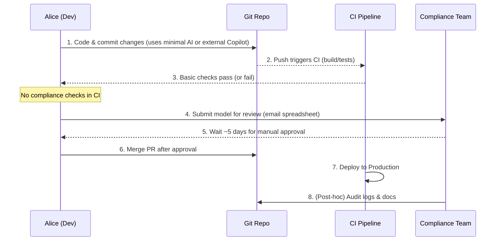
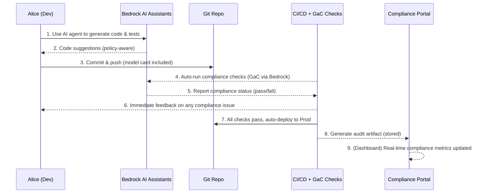

# Amazon Bedrock Rollout – Part 3: Governance at Scale & Future Dev Toolkit

**Author:** Head of Architecture & Platform Engineering  
**Audience:** Platform SRE, Engineering Leads, Risk & Compliance, DevEx  
**Tags:** bedrock, eu-ai-act, governance, sdld, agentic-dev, cursor, windsurf

This Part 3 deliverable elevates our Bedrock implementation from early **experimentation** to an **enterprise-grade, governance-first platform**, and outlines a forward-looking **developer toolkit** built on that governed foundation. It addresses EU AI Act compliance by baking **governance as code** into every step of the SDLC, and empowers developers with AI-assisted tools (Cursor, Windsurf, Claude, Copilot, etc.) **safely routed through Bedrock’s guardrails**. We compare today’s workflow to a future state that boosts productivity **without sacrificing compliance**. All content is provided in Obsidian-ready Markdown (Quartz-compatible) with cross-links to Parts 1 & 2 for context.

## 📖 Contents

- [[governance-automation-framework|Governance Automation Framework]] – Mapping EU AI Act obligations to controls; compliance CI/CD pipeline (Mermaid).
    
- [[sdlc-integration-guide|SDLC Integration Guide]] – Embedding risk checks in planning and CI; example GitHub Actions for policy enforcement.
    
- [[bedrock-devex-platform|Bedrock-Centric DevEx Platform]] – Architecture for a single Bedrock ingress (walled garden); IAM/VPC patterns; SDK helpers.
    
- [[future-dev-toolkit|Future Developer Toolkit]] – Catalog of AI IDEs/agents (Cursor, Windsurf, Claude, Copilot) and how each integrates via Bedrock guardrails.
    
- [[workflow-comparison|Developer Workflow Comparison]] – Today vs. Future (Mermaid sequence diagrams); “Alice the Engineer” use-case with productivity & safety gains.
    
- [[cost-observability|Cost & Observability]] – Tag-based chargeback for Bedrock usage, CloudWatch dashboards for compliance pass/fail rates and cost trends.
    

_(Cross-reference: See Part 1 for foundational strategy and Part 2 for experimentation outcomes to understand the baseline this plan builds upon.)_

---

# Governance Automation Framework

## Automating EU AI Act Compliance via “Governance as Code”

To **consistently meet EU AI Act obligations without slowing development**, we implement a **Governance as Code (GaC)** framework. This means codifying regulatory requirements into machine-checkable **policies** and integrating those checks into our CI/CD pipelines. Policies are written in code (e.g. OPA/Rego, YAML) and version-controlled alongside application code. At key SDLC stages, **policy engines** (e.g. OPA) and scanners (e.g. Checkov for infrastructure) automatically validate artifacts (data, models, code, configs) against these rules. If a policy is violated (e.g. a model lacks documentation or a dataset fails a bias check), the pipeline **fails fast**, blocking promotion and giving immediate feedback to developers. This proactive, continuous enforcement ensures compliance is addressed early and throughout the ML lifecycle, rather than as a last-minute gating review.

> 📌 **Try This Now:** Experiment with an open-source policy engine like **Open Policy Agent (OPA)**. Write a simple Rego policy that requires a JSON file “model_card.json” to exist in a project, and use `opa eval` to test it against a repo missing that file. This simulates how a CI check can enforce documentation presence!

### EU AI Act Obligations → Controls Mapping

Using GaC, we map each key EU AI Act requirement (for High-Risk AI Systems) to specific **controls** in our SDLC. Below we summarize major obligations and how we enforce them in code:

- **Data Quality & Bias (Art. 10):** _Requirement:_ Training/validation data must be **relevant, representative, error-free, complete** and checked for biases. _Control:_ We implement data-validation policies that set quality thresholds (e.g. max missing values, statistical distribution checks) and fairness metrics (e.g. allowable disparity between protected groups). Automated tools like **Great Expectations** (data quality) and **IBM AIF360** or **Fairlearn** (bias detection) run in the pipeline on model datasets. If data fails these checks (e.g. out-of-range bias metrics), the pipeline stops and flags the issue. This guarantees no model is trained on non-compliant data.  
    _Supporting Evidence:_ Article 10 mandates rigorous data governance and bias mitigation, which we enforce via automated profiling and GaC policies.
    
- **Technical Documentation & Traceability (Art. 11 & Annex IV):** _Requirement:_ High-risk AI must have **comprehensive, up-to-date technical documentation** covering system design, testing, and compliance (per Annex IV). _Control:_ Our pipelines enforce the presence of key artifacts like **Model Cards, Datasheets, Risk Assessments** at defined gates (e.g. before deployment). A GaC policy might require a `/docs/ModelCard.md` file with certain sections completed. We use version control (Git) and model registry metadata to ensure traceability of all model versions and link documentation to each model release. The CI checks will fail if documentation is missing or incomplete (e.g. required fields empty). This ensures **traceability** – every model in production has an audit trail of documentation demonstrating compliance.  
    _Supporting Evidence:_ Article 11/Annex IV require maintaining detailed technical docs; our pipeline verifies documentation artifacts (model cards, etc.) before allowing deployment.
    
- **Logging & Transparency (Art. 12 & 13):** _Requirement:_ AI systems must **automatically log** relevant events and provide information for user transparency. _Control:_ We define policies for logging that mandate capturing key events (inputs, outputs, decisions, errors, human interventions) with timestamp and storing logs securely with retention policies. In practice, our model-serving infrastructure (e.g. Bedrock endpoints or containerized models) is configured to output standardized logs (JSON lines) to a central system (e.g. CloudWatch/ELK). The CI/CD pipeline ensures any new model service includes appropriate logging config (e.g. presence of logging middleware). We also automate **packaging of user-facing documentation** (per Art. 13) – for example, upon a release, the pipeline might bundle the latest README or instructions for deployment to provide to end-users. GaC enforcement can periodically audit logs or check that logging is active during deployment. This guarantees that **traceability and transparency** measures are not skipped.  
    _Supporting Evidence:_ Articles 12–13 demand continuous logging and info for deployers; our coded policies ensure log formats, required events, and retention meet these standards, with pipeline checks for logging configuration.
    
- **Accuracy, Robustness & Cybersecurity (Art. 15):** _Requirement:_ Systems must have appropriate levels of accuracy, be robust to errors or misuse, and secure against attacks. _Control:_ We integrate **security and robustness testing** into CI. For accuracy, a minimum model performance threshold is set (policy might require for example ≥90% on validation set); for robustness, we include adversarial testing or out-of-distribution performance tests; for cybersecurity, we scan for common vulnerabilities (using SAST/DAST tools for code, and dependency checks). Concretely, tools like **Adversarial Robustness Toolbox (ART)** can run attacks on the model in a staging environment, and **Checkov/KICS** scan infrastructure as code for misconfigurations. GaC policies codify acceptable criteria (e.g. “no high-severity vulnerabilities open, accuracy ≥ threshold, certain tests must pass”). If any check fails – e.g. an accuracy drop or a known CVE in a container – the deployment is halted. This way, models that don’t meet our **resilience and security bar** never get deployed.  
    _Supporting Evidence:_ Article 15 requires robust, secure AI; our pipeline includes automated vulnerability scans and robustness tests, enforced by GaC (halt deployment if criteria unmet).
    
- **Human Oversight Mechanisms (Art. 14):** _Requirement:_ AI systems must be designed to allow effective human oversight – e.g. ability to interpret and intervene, including a “stop” function. _Control:_ We implement design reviews and policy checks around human-in-the-loop features. For instance, a GaC rule can require that high-risk AI services include a manual approval step before certain actions (simulated in test environment) or that an override/kill-switch procedure is documented. We use monitoring dashboards and alerts for model performance so humans are notified of anomalies. While some of this is process (outside code), we capture it in our SDLC by requiring an **“Oversight Plan” document** for any high-risk AI (outlining how humans monitor and intervene). The pipeline ensures this plan is present and linked. This ensures no AI system goes live without appropriate **human control measures**.  
    _Supporting Evidence:_ Article 14 emphasizes effective human oversight. Our governance framework encodes checks for oversight features (manual approval gates, alerting), ensuring these are reviewed before deployment.
    

**Policy Repository Structure:** All the above rules live in a dedicated **“AI Policies”** repository (or directory) that is part of our codebase. This repo contains subfolders like `data-policies/`, `model-policies/`, `infra-policies/`, `documentation-policies/`, each housing Rego policies or config files corresponding to the above areas (data, docs, logging, etc.). Policies are written as code and **versioned** alongside application code changes. For example, if a new model is added, a policy file in `model-policies/` might be updated to whitelist that model’s expected accuracy range or ensure its card exists. Pull requests that update policies trigger their own tests (we unit-test policies with known compliant/non-compliant examples to avoid false positives in the pipeline).

**Continuous Enforcement in CI/CD:** We integrate the policy checks at multiple pipeline stages (see diagram below). Key integration points:

- **Pre-commit hooks:** Linting and lightweight checks (e.g. ensure no hardcoded API keys, basic PII scanning in prompts).
    
- **CI – Build/Train stage:** After model training, run data quality & bias checks (Art. 10) on training dataset and model outputs.
    
- **CI – Test stage:** After model is trained, generate its metrics and documentation stub; enforce documentation completeness (Art. 11) and run robustness tests (Art. 15) and static scans.
    
- **CI – Pre-deploy stage:** Before deploying to staging/prod, run final policy suite – verify logging configured (Art. 12), oversight plans in place (Art. 14), etc. If any check fails, the deployment job is blocked.
    
- **Post-deploy monitor:** In production, use **continuous compliance** – e.g. a daily job with OPA to audit that logs are being generated, or that no unauthorized model versions are running.
    

This ensures compliance is **“shifted left”** – most issues are caught in development or CI, not after deployment. Risk and compliance teams can also contribute to the policy code (e.g. update thresholds as regulations evolve), treating compliance rules like software requirements.

**Mermaid Diagram – CI/CD with Compliance Gates:** The following diagram illustrates our pipeline with integrated compliance checkpoints:

```mermaid
flowchart TD
    A[Plan: Feature Proposal] --> B[Design Review<br/>(Risk Tiering)];
    B -->|High-risk AI?| C[Add Oversight Plan<br/>& Extra Checks];
    B -->|Low-risk| C;
    C --> D[Code & Model Dev];
    D --> E[CI Build & Unit Tests];
    E --> F[CI Policy Check: Data Quality];
    F --> G{Data OK?};
    G -- NO --> G_fail[Pipeline Fail<br/>(Flag bias/issues)];
    G -- YES --> H[CI Policy Check: Documentation];
    H --> I{Docs Complete?};
    I -- NO --> I_fail[Pipeline Fail<br/>(Missing artifacts)];
    I -- YES --> J[CI Security & Robustness Tests];
    J --> K{All Security Tests Pass?};
    K -- NO --> K_fail[Pipeline Fail<br/>(Vuln/Accuracy issue)];
    K -- YES --> L[Deploy to Staging];
    L --> M[CI Policy Check: Logging Config];
    M --> N{Logs Verified?};
    N -- NO --> N_fail[Block Deploy<br/>(Fix Logging)];
    N -- YES --> O[Deploy to Production];
    O --> P[Post-Deploy: Continuous Monitoring];
    P --> Q[Periodic Audit (OPA) of Logs, Metrics];
    Q --> R{Compliance OK?};
    R -- NO --> S[Alert Dev & Compliance Team];
    R -- YES --> T[Operate Normally];
```

In the above CI/CD flow, every major phase has a **“compliance gate.”** For example, after build, we check data and bias (gate G); after docs (gate I); after security tests (gate K); and a final gate before prod to ensure logging and oversight (gate N). Any **NO** path halts the pipeline, preventing non-compliant AI artifacts from advancing. The feedback loop (orange “Pipeline Fail” nodes) immediately notifies engineers of what to fix, integrating compliance remediation into normal dev work.

> 📌 **Try This Now:** Take a sample ML project and incorporate a dummy “compliance check” step in its CI (for instance, a script that searches for the string “TO DO” in a `model_card.md` and fails if found). Run the pipeline to see how a policy failure would surface to developers. This simple exercise shows how even basic policy-as-code can stop bad releases early!

## Example: GitHub Actions for Policy Enforcement

To operationalize GaC, we built a lightweight **“Compliance Check” microservice** that our CI can call. Alternatively, we can use a Bedrock agent directly in CI. Below is an **example GitHub Actions step** that invokes an Amazon Bedrock-based compliance check:

```yaml
# In .github/workflows/ai-compliance.yml
- name: Bedrock Policy Check
  env:
    MODEL_ID: ${BEDROCK_POLICY_MODEL_ID}   # e.g. custom policy agent ARN
  run: |
    echo "Running AI compliance checks via Bedrock..."
    aws bedrock invoke-model \
      --model-id "$MODEL_ID" \
      --body '{
        "inputText": "Check compliance for PR #${{ github.event.number }}. DataProfile: ${{ steps.data_profile.outputs.json }}, ModelCard: ${{ steps.model_card.outputs.text }}",
        "maxTokens": 512
      }' \
      --region us-east-1 > compliance_report.json

    # Parse result (assuming model returns JSON with pass/fail status)
    if grep -q '"status": "FAIL"' compliance_report.json; then
      echo "Compliance checks failed. See report:"
      cat compliance_report.json
      exit 1
    else
      echo "All compliance checks passed."
    fi
```

In this hypothetical Actions step, we call a Bedrock model (identified by `BEDROCK_POLICY_MODEL_ID`) with a prompt containing artifacts from the PR (data profile stats, model card text, etc.). The Bedrock model – which could be a custom **Agent** loaded with our policy knowledge base – analyzes these inputs and returns a result indicating compliance status. If the result contains `"status": "FAIL"`, we exit with an error to fail the workflow.

This approach leverages a **Bedrock-hosted AI agent** to do smart compliance reviews (e.g. using an LLM to cross-check if the model card addresses all required points). It augments the deterministic checks with an AI’s perspective, while still funneling through Bedrock (so it’s auditable and within our data perimeter). We could also use a simpler route: e.g. have the GitHub Action directly run OPA policies (via a Docker container) or call a custom Lambda. The key is that **release pipelines automatically enforce compliance**, rather than waiting on manual review.

_(Side note: AWS recently released a **Bedrock Agent GitHub Action** that can analyze PRs. We can customize its prompts or knowledge base to include our internal policies, effectively giving automated feedback on compliance issues in code reviews.)_

## Compliance Pipeline Outcomes

By implementing the above framework:

- **No more last-minute surprises:** Compliance requirements (data quality, documentation, etc.) are continually checked, so teams aren’t blindsided by a blocker days before a release.
    
- **Faster iterations with confidence:** Developers get near-immediate feedback on issues (e.g. bias found in dataset) and can fix them in-cycle, rather than after handoff to risk teams. This removes the fear of “compliance will delay us.”
    
- **Audit-ready records:** Each pipeline run produces an **audit trail** (e.g. compliance check logs, Bedrock agent reports) that we archive. At any point, we can show regulators evidence of what was tested (satisfying documentation obligations).
    
- **Adaptable to new regulations:** Our “policies as code” can be updated as the AI Act evolves or new standards (e.g. ISO AI management) emerge. The CI/CD integration means these updates take effect immediately across all projects.
    
- **Integration with risk management:** The risk and compliance team will treat the GaC outputs as part of their oversight. For instance, if a certain policy fails repeatedly in a team’s projects, it flags an area for training or deeper audit.
    

In summary, this Compliance Automation Framework ensures **EU AI Act compliance is baked into our engineering lifecycle**. It achieves “compliance by construction” – developers must actively bypass checks (which is hard) or fix issues (preferred) in order to ship. This dramatically reduces the chance of non-compliant AI systems reaching production while preserving (even enhancing) development speed.

---

# SDLC Integration Guide

Building on the automated framework above, we now embed these governance practices into the **Software Development Life Cycle (SDLC)** workflow – from sprint planning, to coding and code review, through deployment. This section provides practical integration points: how to incorporate **risk-tier checkpoints** in planning, what to add to PR templates, and how to set up CI/CD pipelines (GitHub Actions, CodePipeline) to call our compliance checks. We also discuss planning for the slight overhead these checks introduce, ensuring teams can **maintain velocity** while staying compliant.

## Planning Phase: Risk-Tiering & Requirements

Even before a line of code is written, we integrate AI risk considerations into project planning:

- During **ideation or backlog grooming**, any feature that will use AI (especially ML models or generative components) is flagged. We introduce a lightweight **AI Risk Assessment form** to be filled at design time – classifying the feature into risk tiers (e.g. _Not AI_, _AI - Low Risk_, _AI - High Risk_). Criteria are based on the EU AI Act’s risk taxonomy (Annex III high-risk domains, etc.) and our internal policies. For example, an internal chatbot may be low-risk, whereas an AI system affecting customer finances or hiring would be high-risk by default.
    
- For **High-Risk** AI proposals, additional tasks are added to the story’s Definition of Done: e.g. “Complete AI Compliance Checklist,” “Prepare Technical Documentation (Annex IV) sections,” “Plan human oversight strategy.” We essentially shift some compliance tasks into the user story itself. We also allocate a **Risk Champion** (perhaps someone from the compliance team or an engineer trained in AI ethics) to oversee that feature’s dev cycle.
    
- We update our **Jira issue template** for AI/ML features to include fields like:
    
    - _AI Category:_ (None / Low / High Risk – with guidelines).
        
    - _Model/Service Details:_ (What model, data involved).
        
    - _Compliance Checklist:_ (List of items such as bias check, model card, etc., to be completed).
        

This ensures from day 0, the team knows if a feature triggers compliance steps. It prevents the scenario of “surprise, this is high-risk and now needs 2 extra weeks of paperwork” – instead, that work is scoped into the sprint.

> 📌 **Try This Now:** If you use Jira or a similar tool, add a custom field **“AI Impact”** to your issue tracker. Next time you plan a feature involving ML, set that field (e.g. _High Risk_) and note in the description what compliance items might be needed. This simple annotation in planning makes everyone aware early and prompts discussion on mitigation.

## Design & PR Template: Embedding Controls in Dev Workflow

During the development phase, we integrate compliance awareness into everyday developer activities:

- **Design Review:** As part of design docs (for significant features), we include a section on **AI/ML Compliance Considerations**. For high-risk features, the design must describe how requirements of the AI Act will be met (e.g. “We will include a user-facing notification that this is AI-generated to meet transparency obligations.”) The architecture review board cannot approve the design until this is addressed, ensuring compliance is considered in architecture.
    
- **Pull Request (PR) Templates:** We augment our PR template to prompt engineers to verify compliance-related items before merging. For example, our `.github/PULL_REQUEST_TEMPLATE.md` now contains:
    
    ```markdown
    ## AI & Compliance Checklist (if applicable):
    - [ ] **Risk Tier Assessed:** This PR involves AI functionality and has been classified as (Low/High) risk.
    - [ ] **Model Card Updated:** Documentation for any model changes/updates is present and up-to-date.
    - [ ] **Bias/Performance Results Attached:** (High-Risk only) Attached results from bias testing or performance evaluation.
    - [ ] **Approval:** (High-Risk only) Obtained approval from Risk Officer for go-live.
    ```
    
    The PR creator must check these off (or mark N/A) before requesting review. This triggers awareness and accountability. Reviewers (and automated checks) can quickly see if, say, a model card update is missing and push back. By making compliance a part of the PR checklist, we treat it like any other acceptance criterion.
    
- **Code Review Bot:** In addition to human reviewers, we leverage a **Bedrock agent in code reviews** to catch compliance issues. As mentioned earlier, a Bedrock-powered GitHub Action can leave comments on PRs. For instance, it might comment: “⚠️ No evidence of bias testing for the new model. Consider adding a bias report as required by policy.” This acts as an AI co-pilot for compliance in code review. (We implemented this using a custom Bedrock Agent with our policy docs loaded, similar to AWS’s example.)
    
- **Branch Protection Rules:** We treat passing compliance checks as mandatory. For example, our main branch might require the “Compliance Check” status check (from CI) to be green before merge. This is analogous to requiring unit tests to pass. This gives formal weight to the automated governance.
    

By integrating at PR level, we **prevent non-compliant code from being merged** in the first place, drastically reducing late-stage rework.

## CI/CD Implementation: From Code to Deployment

When code is pushed, our CI/CD processes (whether GitHub Actions or AWS CodePipeline) orchestrate the governance steps described in the previous section’s diagram. Here’s how to implement it practically:

- **GitHub Actions Workflow:** We created a dedicated workflow file (as hinted in the YAML snippet above) that runs on every push and PR. It performs:
    
    1. **Data validation stage:** e.g. runs a Python script to profile new datasets or data schema changes (maybe using `great_expectations` to produce a report).
        
    2. **Invoke Policy Agent:** Calls our Bedrock compliance agent or OPA as shown, to evaluate all gathered evidence.
        
    3. **Post results:** If using GitHub, we use the Actions toolkit to annotate the PR with results (e.g. failing checks appear as comments or as a “failure” status with details).
        
    4. **Soft gate vs. Hard gate:** During an initial rollout, we might set these checks to “soft-fail” (warn but not block) to educate teams. After a grace period, we switch them to “hard fail” to enforce.
        
- **AWS CodePipeline/CodeBuild:** For teams using AWS-native CI, we inserted similar steps. For instance, in CodePipeline we added a **“ComplianceReview” stage** after integration tests and before deployment. This stage triggers a CodeBuild project that runs a script or Lambda calling Bedrock. Example CodeBuild buildspec snippet:
    
    ```yaml
    phases:
      build:
        commands:
          - echo "Running compliance checks..."
          - export STATUS=$(python scripts/run_compliance_check.py --report-path report.json)
          - if [ "$STATUS" != "PASS" ]; then exit 1; fi
    artifacts:
      files: report.json
    ```
    
    In the above, `run_compliance_check.py` would call the Bedrock API (or OPA) similarly to the GitHub example, and output a status. The pipeline will stop if exit code is non-zero, thereby gating promotion. We also archive the `report.json` as a pipeline artifact (stored in S3 via CodePipeline) for auditing.
    
- **Sample CDK Code**: We created infrastructure to support these checks. For example, an AWS CDK snippet to define the **Lambda** for policy checks might look like:
    
    ```typescript
    const complianceFn = new lambda.Function(this, 'ComplianceCheckFn', {
      runtime: lambda.Runtime.PYTHON_3_10,
      code: lambda.Code.fromAsset('lambda/compliance'),  // your code
      handler: 'handler.main',
      environment: { 
        BEDROCK_AGENT_ID: bedrockAgentId 
      },
      timeout: cdk.Duration.seconds(30),
      vpc: myVpc, // ensure it can reach Bedrock via VPC endpoint
      securityGroups: [ bedrockAccessSG ]
    });
    // Grant Bedrock invoke permissions
    complianceFn.addToRolePolicy(new iam.PolicyStatement({
      actions: ["bedrock:InvokeModel"],
      resources: ["*"]
    }));
    ```
    
    This defines a Lambda that our pipeline (or GitHub Action via API Gateway) can invoke to perform compliance checks. Note it’s placed in the VPC and given permission to call Bedrock.
    
- **Pipeline Timing:** We address potential **overhead** by measuring how long these checks take. Data profiling or calling an LLM may add a few minutes to CI. We’ve budgeted this into our delivery timelines (for example, telling teams that CI might be ~5-10 minutes longer for AI-heavy changes). We also optimize wherever possible:
    
    - Smaller models or prompt truncation for faster inference on Bedrock (using an inexpensive model like Anthropic Claude Instant for policy analysis rather than a larger one, to speed up response).
        
    - Running certain checks in parallel (e.g. do data profiling concurrently with unit tests).
        
    - For very long-running tests (e.g. an exhaustive bias test suite), consider running nightly instead of on each commit, with results gating releases (similar to how some heavy security scans are done out-of-band).
        
- **Team Coordination:** Teams are informed about these gates ahead of time. In sprint planning, if a story is “Implement Model X,” we ensure tasks for writing the model card and running bias tests are included – effectively shifting the time into the sprint rather than at release end. We also maintain a **Compliance Runbook** so devs know what to do when a pipeline fails (e.g. “if bias check fails, see section on bias mitigation”).
    

By weaving compliance steps into CI/CD, we **operationalize governance**. Engineers get used to a new normal where, for instance, generating a model card is as required as writing unit tests. Over time this becomes second nature, and the “compliance tax” feels like part of the development process (much as security scans or QA tests are).

## Timeline & Cadence Considerations

It’s important to ensure all these steps don’t bottleneck our delivery cadence:

- **Parallelize risk review:** Instead of a single centralized “AI review board” that might queue up requests, we empower feature teams to self-serve much of the compliance (with the automated tools above). The compliance/legal team moves into more of an advisory role, only focusing on exceptional cases or periodic audits. This avoids waiting for meetings or sign-offs on every feature.
    
- **Time budgeting:** For each major initiative involving AI, project managers allocate an explicit chunk of time for compliance. For example, implementing a high-risk AI feature might include a one-week buffer for completing documentation, review cycles, and addressing any pipeline failures. This is communicated upfront to stakeholders so it’s part of the plan, not an ad-hoc delay.
    
- **Staging environment testing:** We adjust our release train such that after code freeze, there’s a short staging period where compliance checks run in a final sweep. This is mostly a formality if CI was green, but it allows any last-minute oversight (e.g. risk team runs a quick sanity check or the Bedrock agent re-checks with all components integrated). We schedule this such that it doesn’t delay deployment – it runs in parallel with other final QA.
    
- **Continuous improvement:** We monitor how often compliance checks fail and why. If we see, for instance, that “missing model card” is a frequent cause of pipeline failure for Team A, we loop back and do a training session or add a template to help. Over a few iterations, these failures should drop to near zero as teams internalize requirements, meaning compliance no longer feels like an obstacle but just another quality metric.
    

With these workflow integrations, **compliance becomes part of the SDLC fabric**. Developers plan for it, do it as they code, and our automation handles the heavy lifting. We preserve agility – for example, if a team wants to release a minor change to an AI model, they can do so in a single sprint because all the needed checks are ready to run at the push of a button, rather than waiting weeks for manual approvals.

> 📌 **Try This Now:** Add the above PR checklist to one of your repositories and observe how reviewers respond. Also, simulate a pipeline gating by adding a dummy step that waits 30 seconds (representing a compliance check) to see how much it truly impacts build time. This helps in planning and team communication about the overhead (usually minor compared to typical integration tests).

---

# Bedrock-Centric DevEx Platform

A core principle of our rollout is that **all AI model usage in the dev workflow is funneled through Amazon Bedrock**. We are establishing a **Bedrock-centric Developer Experience (DevEx) platform** – essentially a walled garden where developers have freedom to use powerful AI tools, but in a controlled, secure manner. This section describes the architecture and rationale for a single Bedrock “ingress,” plus the IAM and VPC setup that makes it possible for various AI-assisted IDEs and agents to call Bedrock **securely**. We also cover helper libraries (LangChain, Boto3 wrappers) that we provide to streamline integration for internal tools.

## Why a Single Bedrock Ingress?

**Rationale:** Today, developers might individually use external AI APIs (OpenAI, etc.) directly from their IDE or scripts. This poses multiple issues:

- **Data privacy & residency:** Sending code or data to external services can violate internal data policies or GDPR if not controlled.
    
- **Inconsistent security:** Individual API keys with unknown access scopes, lack of audit logging, etc.
    
- **Compliance blind spots:** Hard to ensure every dev is using a model that meets our compliance (e.g. some might use GPT-4 with no record if it produced biased suggestions).
    
- **Cost management:** Without a central routing, tracking spend per team or optimizing usage (caching results, etc.) is hard.
    

By contrast, **Amazon Bedrock** provides a managed, secure way to access multiple foundation models (AWS’s Titan, Anthropic Claude, etc.) via one interface. By mandating that all AI interactions go through Bedrock, we gain:

- **Logging and auditability:** Every request hits our AWS account (so it’s logged in CloudTrail, including which user/role made the call).
    
- **Fine-grained access control:** We can use IAM policies to restrict who can call Bedrock, which models they can use, and even require certain conditions (like using a VPC endpoint).
    
- **Data never leaves our network:** Using AWS PrivateLink, calls to Bedrock **stay within our AWS environment** and do not traverse the public internet. For example, a dev’s request from on-prem goes through our Direct Connect to AWS and hits Bedrock without exposure to external networks. This helps with compliance requirements around data handling and provides assurance that sensitive code prompts aren’t leaking.
    
- **Unified monitoring & cost tracking:** All usage is centralized, so we can dashboard it (see Cost section) and detect anomalies (e.g. sudden surge in token usage by a rogue script).
    
- **Consistent guardrails:** We can configure **Bedrock Guardrails** (like content filters to block certain outputs) globally for our account. This means whether a dev is writing code with Cursor or asking an LLM to generate documentation, the same forbidden content (e.g. secrets, customer PII, or toxic language) will be filtered out by Bedrock’s policies. We effectively offload first-line safety to Bedrock’s managed system.
    

In short, Bedrock becomes our **secure gateway for AI**, analogous to how all internet traffic might go through a proxy for security in a corporate environment.

## Architecture Overview

The high-level architecture is:

- **Developers** (on laptops or cloud VMs) -> **Agentic IDEs/Tools** (Cursor, Windsurf, VS Code, etc.) -> **Bedrock Ingress (API)** -> **Foundation Models via Bedrock**.
    

We deploy the Bedrock ingress in two forms:

1. **AWS PrivateLink Endpoint:** Within our AWS cloud, we set up **Interface VPC Endpoints** for Bedrock (both the `bedrock-runtime` and `bedrock` control plane) in a dedicated VPC. These endpoints have **endpoint policies** attached that only allow certain actions/models and only for certain principals. For example, we can allow `bedrock:InvokeModel` on `anthropic.claude-v2` but deny everything else, for calls coming from our developer roles.
    
2. **Bedrock API Gateway (Optional):** For convenience and additional control, we implement an internal API (using Amazon API Gateway + Lambda or an ALB + Fargate service) that proxies requests to Bedrock. This gateway can enforce extra logic – e.g. requiring an API key, injecting certain system prompts, or splitting requests for audit. It presents an OpenAI-compatible API interface (see below) so that tools expecting the OpenAI API can use it. Essentially, this is our **“Bedrock Proxy”** service.
    

**Network Flow:** A developer in our corporate network who triggers an AI request (say, their IDE auto-complete calls an AI) will have that request directed to our Bedrock ingress:

- If the dev is on a corporate VPN or in-office, the request can route through our AWS Direct Connect into the VPC with the endpoint. We ensure **Private DNS** is enabled for the Bedrock endpoint so that `bedrock-runtime.<region>.amazonaws.com` resolves to the private endpoint IPs for any machine on our network. Thus, the IDE’s AWS SDK call to Bedrock automatically uses the private path.
    
- If the dev is on an unmanaged network, they will still use AWS-signed requests with their IAM role – these go to AWS over HTTPS. We enforce via IAM that the calls must come through the VPC endpoint by using a condition on the IAM policy: `Condition: ForAnyValue:StringEquals: aws:sourceVpce: vpce-<id>`. This means if someone tries to call Bedrock without going through our VPC endpoint (e.g. directly over the internet), the call is denied. In practice, this forces them to connect via our VPN (so effectively all calls go through our network anyway).
    
- The Bedrock service processes the request using the chosen model (which might call out to the model provider’s system, but that’s within AWS’s scope). The response comes back to the dev tool.
    

We essentially achieve an **air-gapped effect**: devs can use AI freely, but only through our monitored channel. As AWS notes, this ensures traffic “will not leave the Amazon network, ensuring your data is not exposed to the public internet” – a big compliance win.

## IAM and Security Policies

**Identity Management:** We leverage existing AWS IAM identities for developers (e.g. through AWS SSO/Federation). Each developer or their application assumes a role (say `DeveloperBedrockAccessRole`) when they want to use AI tools. This role has tightly scoped permissions:

```json
{
  "Effect": "Allow",
  "Action": ["bedrock:InvokeModel", "bedrock:InvokeModelWithResponseStream"],
  "Resource": "*",
  "Condition": {
    "StringEquals": {"aws:SourceVpce": "vpce-12345bedrock"} 
  }
}
```

This policy says the dev can invoke Bedrock models, but only if the call comes via our Bedrock VPC endpoint (sourceVpce condition). We can further restrict by model ARN:  
for example, allow only `arn:aws:bedrock:us-east-1::foundation-model/amazon.titan-text-2-*` (all Titan family) if we want to exclude external models. Another use: separate roles for different needs – maybe a `BedrockDevRole` that can use smaller models for coding, vs. a `BedrockProdRole` that can invoke larger models for production jobs, allowing us to control cost and usage.

**Endpoint Policies:** In addition to IAM, the endpoint itself has a policy. For instance, as shown in AWS’s example, we attach a policy to the VPC endpoint like:

```json
{
  "Statement": [{
      "Effect": "Allow",
      "Principal": {"AWS": "<DevRoleArn>"},
      "Action": "bedrock:InvokeModel",
      "Resource": "arn:aws:bedrock:*::foundation-model/anthropic.claude-instant-v1"
  }]
}
```

This means only our DevRole can use this endpoint, and only to call the Claude Instant model (for example). All other models or principals would be denied. We have multiple such statements to cover allowed models (Titan, Claude, etc.) that we vetted for compliance (e.g. those that have appropriate usage policies). If tomorrow we decide a certain model is producing problematic output, we can remove it here to instantly prevent all devs from using it.

We also use **Guardrails** at the Bedrock level: for instance, enabling Bedrock’s built-in content filtering for hate, self-harm, PII, etc., at a strictness level appropriate for internal use. This acts as a safety net regardless of which tool calls the model.

## Agentic IDE Integration (Cursor, Windsurf, etc.)

**Cursor & Windsurf:** These are AI-native IDEs that typically come with a local application which calls out to AI models for code completion, chat, etc. By default, Cursor might use OpenAI’s API, and Windsurf (formerly Codeium) uses its own cloud or models. To integrate them with Bedrock:

- We configure these IDEs to use **our Bedrock gateway**. For example, Cursor allows setting a custom API endpoint or API key for AI (if not natively, we intercept via network). Using our Bedrock API Gateway that mimics OpenAI’s API (see below), we point Cursor to `https://bedrock-proxy.internal/v1/chat/completions` instead of the OpenAI URL, and provide a dummy API key. The proxy then translates the request to `bedrock:InvokeModel` for an appropriate model (say Claude for chat). There is an AWS sample called `bedrock-access-gateway` that implements an OpenAI-compatible layer for Bedrock. We have deployed a variant of this in our environment. This allows tools expecting an OpenAI-like API to function without needing custom Bedrock integration.
    
- Windsurf, being an IDE with presumably similar needs, can also be configured. Windsurf/Codeium emphasized privacy (no training on user code, etc.), which aligns with our approach. We run Windsurf in a mode (enterprise/self-hosted if available) where it doesn’t call home to Codeium’s servers, but instead uses our provided AI backend. If Windsurf doesn’t natively support custom endpoints, we utilize network-level redirection: e.g., intercept calls to known API domains and redirect them to our gateway (this can be done via `/etc/hosts` trick or a local proxy).
    
- We ensure these IDEs are running on machines that have AWS credentials (either via AWS CLI profile or environment variables) with the aforementioned IAM role. For instance, a developer on an EC2 instance in our dev account automatically has an instance role allowing Bedrock. A developer on a laptop obtains temporary AWS creds via SSO. The IDE can either use those to sign Bedrock API requests, or use our gateway which might accept our own API token and then use a service role to call Bedrock.
    

Result: When the dev uses **Cursor’s AI pair programmer**, their code context goes to Bedrock (Claude or Titan model) through our secure channel, and a completion comes back. They get the same UX benefits, but we have full oversight of the transaction.

**Claude Code & Copilot Agents:**

- **Claude Code** – shorthand for using Anthropic’s Claude model for coding assistance. Since Claude is available through Bedrock, we expose it to devs via the same method. E.g., our VS Code plugin might specifically call Claude for large context Q&A (since Claude supports large context windows great for analyzing code). We label it internally as “Claude Code Assistant”. But devs just see it as an option in their toolkit that when invoked, routes to Bedrock’s Claude.
    
- **GitHub Copilot** – this one is tricky as it’s a closed service backed by OpenAI’s models. Copilot currently cannot be self-hosted or pointed to a custom backend. However, we manage Copilot usage by **network egress controls**. Corporate devices are configured such that direct calls to Copilot’s endpoints either:
    
    - Are disallowed for sensitive projects (we can block at proxy), forcing devs to use our alternatives; or
        
    - Allowed only if telemetry is disabled and code history filters are on (Copilot for Business does not retain code, which mitigates some concerns).
        
    
    Our long-term strategy is to **replace or augment Copilot** with Bedrock-based solutions. For instance, if we find that Cursor/Windsurf with Bedrock can cover all use cases, we may phase out Copilot completely (especially given IP/compliance concerns of sending code to OpenAI). In the interim, Copilot might be permitted on certain repositories (e.g. front-end code or non-sensitive apps) with policy guardrails, but the vision is one of **Bedrock centrality**. GitHub is evolving “Copilot X” with agent-like capabilities; when those mature, we will look for ways to either integrate Bedrock on the backend (should GitHub offer an on-prem or bring-your-own-model option) or ensure we have internal tools that provide equivalent functionality through Bedrock.
    
- **VS Code Extensions / Internal Plugins:** We are developing a custom VS Code extension called “**BedrockBuddy**” for our developers. It provides chat and code generation features by calling Bedrock (similar to OpenAI’s ChatGPT extension). It leverages the user’s AWS creds to call our Bedrock API. This gives us a fully in-house controlled coding assistant in VS Code, eliminating reliance on third-party services. For example, a developer can highlight a piece of code and use the command “Ask BedrockBuddy to explain this code” – the extension will call a Bedrock model (perhaps Titan or Claude) with that code and return the explanation inline. All of it goes through our audited Bedrock pipeline.
    

We also integrate Bedrock into other internal dev tools:

- **CLI Tools:** e.g., a `bedrock-gpt` command that devs can run in terminal to ask questions (handy for those who prefer CLI over IDE integration).
    
- **Continuous Integration Agents:** such as using Bedrock in CI for code optimization suggestions or test generation (like a smarter static analysis that can propose fixes).
    

## Helper Libraries and SDKs

To make it easy for teams to build on Bedrock, we supply some abstraction libraries:

- **Boto3 Helper:** We wrote a thin wrapper around the AWS Python SDK (Boto3) specifically for Bedrock usage. For example, a function `invoke_llm(model, prompt)` that handles calling Bedrock’s `InvokeModel`, streaming handling, and any retry logic or logging. This removes boilerplate – engineers don’t need to study Bedrock’s API, they just call our helper. Under the hood, it also injects our organizational parameters (like always use our specific endpoint, set default context or guardrails).
    
- **LangChain Integration:** We embrace LangChain for building more complex AI workflows (like agents that can do tool use). LangChain already supports Bedrock models. We provide pre-configured chains for common internal use cases:
    
    - A **knowledge retrieval QA chain** that uses Bedrock with our internal Confluence docs as context (via Bedrock’s managed **Knowledge Bases** or a Vector DB). This allows any approved dev to easily query internal knowledge with an LLM through a standardized interface.
        
    - A **code analysis chain** that, given a GitHub repo link, uses a Bedrock LLM to perform a code review (essentially automating what our Compliance agent does, but for general quality).
        
    - We contribute to an internal monorepo that extends LangChain’s Bedrock utilities – for example, ensuring our chains always specify the `X-AMZ-Bedrock-Invocation-Source` tag (for cost tracking) and including guardrail prompts. We might also have a custom OutputParser that redacts any classified info from LLM outputs, adding another safety layer.
        
- **Agent Toolkit for Devs:** Inspired by the new wave of “AI agents”, we package an **Agent Toolkit** with safe actions that internal LLMs can perform. For instance, an agent that can run `terraform plan` on a sandbox and suggest infrastructure improvements, but it’s constrained by policies (it can’t run destructive commands). This agent uses Bedrock behind the scenes (for the LLM reasoning) combined with a set of allowed tools. We incorporate this into our DevEx platform, so a developer can say “AI, please create a CI/CD pipeline for this project” and the agent (via Bedrock) will scaffold the code, perhaps even open a PR – all within guardrails (it can only push to a branch, not directly to main, for example).
    

The aim is to empower developers to leverage AI at every step, **while ensuring every single AI call, from IDE to production, goes through the governed Bedrock layer**. By centralizing through Bedrock, we gain a uniform way to implement compliance (one ring to rule them all, so to speak).

**Architecture Diagram (textual):** In practice, a request flow might be:

```
Dev's IDE --[HTTPS w/ IAM auth]--> Bedrock VPC Endpoint --> Bedrock Service (model) --> response --> IDE
```

If using our gateway:

```
IDE --[OpenAI-API call]--> Bedrock Proxy (API Gateway+Lambda) --[AWS SDK]--> Bedrock -->> response --> IDE
```

Throughout, IAM and endpoint policies enforce the rules described.

AWS’s guidance on this approach highlights that using PrivateLink and controlled endpoints provides a strong data perimeter. We’ve effectively implemented that for our DevEx platform.

## Walled Garden Benefits

By funneling AI dev tools through Bedrock, we achieve:

- **Compliance on autopilot:** It’s easier to comply with data residency and upcoming regulations (like EU AI Act’s provisions on data/access) since we know exactly how data flows – it stays within our managed cloud environment.
    
- **Centralized updates:** If we need to update the AI models (say replace one with a less biased version), we do it in one place (Bedrock config) and all tools immediately use the new model. Developers don’t need to individually update API keys or endpoints.
    
- **Innovation with safety:** Developers can try new AI capabilities (e.g. if Bedrock adds a new model or feature, we can expose it) without going through lengthy security reviews each time – the Bedrock wrapper provides consistent security, so new features can be adopted faster within that sandbox.
    
- **Reduced key management:** Devs don’t handle raw API keys for external services, which often is a leakage risk. Instead, they rely on AWS IAM, benefiting from short-lived credentials and our existing key management practices.
    

> 📌 **Try This Now:** If you have access to AWS Bedrock, set up a **VPC Interface Endpoint** in a test environment. Then run a quick test: spin up an EC2 in that VPC, and use the AWS CLI or Boto3 to call Bedrock (e.g. list models or invoke a model) with **no internet gateway attached**. You’ll see that the call succeeds via the endpoint entirely internally. This proves how, even without internet access, your environment can use powerful AI models – a key principle in our secure DevEx design.

With this Bedrock-centric platform in place, we can now onboard various developer tools (detailed in the next section) confidently, knowing they all operate under the same governance umbrella. It turns the “wild west” of every dev using whatever AI into a well-tended garden where experimentation is encouraged, but fences keep everything in bounds.

---

# Future Developer Toolkit

In the next 12 months, our developers’ toolbox will evolve dramatically. We envision an **AI-augmented engineering environment** where mundane tasks are automated and complex tasks are accelerated – all through approved, safe AI assistants. Below is a catalog of the key tools and agents we plan to roll out, how each integrates via Bedrock, and the prompts/policy wrappers that ensure they operate within our guidelines. This future toolkit is built on the Bedrock-centric platform described above.

## 1. Cursor (AI Code Editor)

**What it is:** Cursor is an AI-native code editor that provides smart autocomplete, inline chat, and “agent” capabilities within the IDE. It’s like VS Code infused with ChatGPT-style help.

**Integration via Bedrock:** Instead of Cursor sending code to OpenAI’s API, we configure it to route through Bedrock:

- **Custom Endpoint:** We utilize the `bedrock-access-gateway` (OpenAI-compatible API on Bedrock). In Cursor’s settings (or by overriding environment variables), we set the OpenAI API base URL to our gateway (e.g. `https://bedrock.company.internal/v1`). We supply an API key that our gateway will accept (the gateway validates this and maps to an IAM role).
    
- **Model selection:** Cursor typically uses GPT-4 or similar. Through Bedrock, we might use **Anthropic Claude 2** for code (which has excellent coding abilities and is available via Bedrock). Our gateway translates ChatGPT-style requests to Claude or Titan models. This switch is seamless to the developer – they still see code suggestions, but those suggestions come from Claude (via Bedrock) rather than OpenAI, with no loss in quality for most tasks.
    
- **Context limits:** Cursor can send entire file context to the AI. We ensure the model we choose supports large context (Claude supports up to e.g. 100K tokens in latest versions, which is great for reading big codebases). Bedrock’s Claude model (Claude v2 100k) will be leveraged when large context is needed.
    
- **Policy wrapper:** We prepend a **system prompt** via the gateway for all Cursor requests. This system message reminds the model of our policies: e.g. “You are a coding assistant operating in Company X. Follow the company’s coding standards and DO NOT reveal any sensitive information or company secrets. If the user asks for something that might violate data policies or produce disallowed content, refuse.” This acts as an additional guardrail on top of Bedrock’s own guardrails.
    
- **Developer experience:** With these changes, devs using Cursor will notice the AI help feels similar, but now everything it does is logged and safe. If a dev tries to ask Cursor’s AI something outside policy (say, generate personal data or go on an unrelated tangent), Bedrock’s guardrails or the system prompt will cause a safe completion (maybe the AI says it cannot comply). This keeps usage aligned with our guidelines.
    

**Example:** Alice is using Cursor to write a new module. As she types, Cursor’s Bedrock-powered suggestions appear, completing whole functions. She can also open the AI chat in Cursor to ask, “Explain how this function works.” The request goes to Bedrock with our system prompt. Claude responds with an explanation, which Cursor displays. Unknown to Alice, the response was filtered to remove a variable name that resembled a secret (Bedrock’s content filter flagged it, so the response has “[SECRET]” instead) – the system prompt guided the model to do that. Alice gets a helpful answer without exposing actual secrets.

**Benefits:** Cursor+Bedrock will drastically speed up coding (reports say such tools can halve the time for some tasks) while keeping the **IP and data on our side**. We also gain the ability to **train the AI on our codebase** via retrieval: we plan to connect Cursor’s AI to our Bedrock Knowledge Base loaded with internal docs and code references. This means when a dev asks “How do I use our internal API X?”, the AI can retrieve the answer from our documentation (RAG approach) instead of guessing. This is done via Bedrock’s managed RAG feature (Knowledge Bases) which we associate with our agent calls.

## 2. Windsurf (AI-Native IDE, formerly Codeium)

**What it is:** Windsurf is another AI-powered IDE touting agentic features and a privacy-centric approach. It’s essentially a full IDE with AI deeply integrated (autocomplete, chat, “Flows” to perform multi-step tasks).

**Integration via Bedrock:**

- **Enterprise Self-Hosted Mode:** Post OpenAI’s acquisition of Codeium/Windsurf, it’s likely there will be enterprise offerings. We would run Windsurf in a mode that does not call out to public APIs, but instead allows configuring a local model or endpoint. We will point that configuration to our Bedrock gateway similar to Cursor.
    
- **Local Model fallback:** Windsurf might come with the ability to run local models (some versions of Codeium could use an offline model for autocomplete). If so, we will compare the quality vs. Bedrock. Likely, Bedrock’s managed models (Claude, etc.) outperform, so we prefer to route to Bedrock anyway. But having local fallback could be useful if network is down (edge case).
    
- **Agentic capabilities:** Windsurf touts an “AI agent” that can act on your behalf in the IDE (e.g., run build, debug errors). We will carefully enable such features after analysis. If enabled, any **tool execution by the agent will be constrained**. For example, if Windsurf’s agent can execute terminal commands from natural language instructions, we sandbox those commands (perhaps only allow read-only actions, or only in a container). We’ll likely pilot these features with non-critical tasks first.
    
- **Policy integration:** As with Cursor, we ensure all requests from Windsurf’s AI go through Bedrock with a similar system prompt. Windsurf being privacy-first means it likely already avoids sending things like telemetry. We still apply our own oversight – e.g., logging any code completions it suggests (which we can capture from the Bedrock side).
    
- **UI messaging:** We might add a small note in the Windsurf UI (through a plugin or our custom build) that says “Secured by Bedrock” when the AI is active, to assure developers that their data stays internal.
    

**Why include Windsurf:** Developers have personal preferences; some may prefer Windsurf’s UI or features over Cursor. Offering both increases adoption of AI tools – the end goal is every developer is using an AI helper regularly. By integrating both with Bedrock, we don’t mind which they use; both are safe. Also, having two options fosters a bit of competition which can drive improvements (if Cursor’s suggestions are better than Windsurf’s, we investigate why – maybe a model difference – and adjust accordingly, or vice versa).

**Example:** Bob uses Windsurf’s “Command Mode” to say “Refactor this function to use async/await.” Windsurf’s agent, via Bedrock, analyzes the code and returns a diff of changes. Windsurf applies the diff to the code. All steps were generated by a Bedrock LLM (likely one specialized in code refactoring). The diff is logged, and if any part of it violated our coding standards, our future lint AI (maybe another agent) could flag it. But because we also fed our style guide into the system prompt, the refactoring follows our conventions. Bob just saved 30 minutes of manual work.

## 3. Claude Code Assistant

**What it is:** “Claude Code” refers to using **Anthropic Claude** as an AI assistant geared for coding tasks. Claude is known for its large context window and conversational style, which can be very handy for tasks like analyzing a big log file or discussing an architecture diagram embedded in code comments.

**Integration via Bedrock:**

- Claude (versions like Claude 2 or Claude Instant) is available through Bedrock’s API. We will create a **dedicated interface (possibly a chat UI or VS Code extension)** for interacting with Claude on coding questions. This might simply be part of BedrockBuddy (our VS Code extension) as a mode.
    
- **Use cases:** Claude excels at understanding larger context. So for example, if a developer has a 5,000-line repository and wants a summary or to find potential bugs, they can invoke our “Claude Code Review” command. This will feed the repository (or relevant parts) to Claude via Bedrock (possibly chunked with retrieval) and ask for a analysis. Another use: generating documentation – a dev can prompt, “Claude, draft a README for this project.” The request goes to Claude model with code context and yields a draft README.
    
- **Guardrails:** We again rely on system prompts and Bedrock filters. We instruct Claude not to output any proprietary code in plain language outside the allowed context (to avoid it regurgitating someone else’s code from training, for licensing compliance). Claude is generally trained to be mindful of harmful content, but we reinforce: e.g. “If the user asks for something that violates company policy or legal restrictions (like copying large chunks of licensed code), politely refuse.”
    
- **Integration points:** We integrate Claude into:
    
    - **ChatOps:** Possibly Slack – an internal Slack bot where you can `!claude-code` and ask a question about code. The bot uses Bedrock Claude to respond, and it’s accessible to engineers for quick help.
        
    - **CI Review:** Automated code review comments, as earlier described, might use Claude’s analysis for deeper reasoning (Claude has an edge in some conversational tasks).
        

**Why separate from Cursor/Windsurf:** Cursor and Windsurf likely use models like GPT-4/CodeLlama under the hood. By explicitly offering Claude, we give devs another “expert” to consult. It’s like having two AI pair programmers with different strengths: one might be better at quick autocompletion (Cursor’s tuned model), another (Claude) better at comprehensive reasoning. All of these are accessible since Bedrock lets us pick the model per request.

**Example:** Carol is debugging a complex issue spanning multiple files. She goes to Slack and types: `!claude-code I'm facing a null pointer exception in Module X under scenario Y. Here are the relevant pieces of code: [she pastes 300 lines]. Why might this be happening?` The Slack bot sends this to Bedrock Claude with a preamble that this is an internal discussion. Claude analyzes and responds with a thoughtful hypothesis, referencing specific lines and suggesting a fix. All of this is logged and kept internal. Carol resolves the bug faster with Claude’s help, effectively having a knowledgeable coworker on demand.

## 4. GitHub Copilot (with Guardrails) and Future Agents

**What it is:** GitHub Copilot is the well-known AI code completer integrated in editors. Additionally, GitHub is rolling out **Copilot Chat and Copilot CLI** (agent-like features where Copilot can explain code, create PRs, run commands in the repo, etc.).

**Current status:** As of now, Copilot’s backend is not Bedrock and cannot be pointed to it. It uses OpenAI’s models on Microsoft’s Azure cloud. This means we **cannot intercept Copilot’s API calls to route them through Bedrock** (they’re end-to-end encrypted between the IDE plugin and Microsoft). Thus, we have two choices: allow Copilot with strict controls, or disable it in favor of our tools.

**Strategy:**

- In the short term, we allow Copilot for **low-risk scenarios** with some governance:
    
    - Developers using Copilot must use **Copilot for Business**, which ensures that their code prompts are not retained or used to train the model (Microsoft provides this guarantee). This mitigates IP leakage concerns.
        
    - We have a **policy that no secrets or production data should ever be typed into any prompt** (this applies to all AI tools). Our internal developer training emphasizes this, and we have tools scanning git commits to ensure something like an API key inadvertently suggested by Copilot doesn’t make it in (coupled with Bedrock’s filters at runtime).
        
    - We monitor Copilot suggestions: interestingly, some organizations have a plugin to highlight if Copilot output is “significantly similar” to known licensed code. We consider adopting something like **Codeium’s code risk filter** or building one: basically, flagging if Copilot produces a large verbatim snippet (which could be a license issue). Since we can’t modify Copilot’s outputs via Bedrock, we handle this on the client side or via post-hoc scans.
        
    - If Copilot’s usage becomes problematic or redundant due to our Bedrock-based alternatives, we will consider disabling its use on corporate devices entirely via network rules or admin controls.
        
- **Copilot Chat / Agents:** These features (in preview) let devs talk to an AI in VS Code and even have it run terminal commands. We likely will **not enable the command execution part** in our environment unless we can sandbox it, because that could be risky (imagine the AI running a destructive command by mistake). Instead, we provide similar functionality through our controlled agents (like Windsurf’s flows or our BedrockBuddy).  
    For the chat part (question & answers), our own VS Code extension with Bedrock covers it. We might still let curious devs try Copilot Chat but with a clear notice that it’s using OpenAI directly and should not be fed sensitive info. Over time, as our internal chat assistant becomes robust, devs may naturally switch since ours will be tuned to internal knowledge (something Copilot Chat won’t have).
    

**Long-term:** We anticipate either:

- Microsoft enabling a “bring your own model” for Copilot (not announced yet, but if they did, we’d plug in Bedrock).
    
- Or our internal AI coding tools become so good and seamlessly integrated that Copilot is no longer needed.
    

**Agents and Other Tools:**

- We keep an eye on tools like **AWS CodeWhisperer** (which is AWS’s own Copilot competitor). CodeWhisperer presently uses Amazon models (maybe related to Titan) and could potentially be integrated into IDEs with our own keys. However, it’s a separate service from Bedrock. Given we want one central route, we decided to focus on Bedrock which covers similar models. (In case CodeWhisperer opens up to self-host or on-prem, we might revisit it, but for now, our Bedrock approach covers the need with more control).
    
- **New players**: e.g. there’s TalkToCode by Amazon, or VS Code’s built-in coming AI tools. We will review each new entry for two things: can it be configured to use our Bedrock, and does it offer something unique? Our architecture is flexible: any tool that can speak to an OpenAI-like API can be routed to Bedrock with the gateway.
    

**Summary of Copilot stance:** We treat Copilot as a transitional solution – useful for now, but destined to be supplanted by our internal Bedrock-powered equivalents. In the interim, we **wrap Copilot with policies and user education**:

- A **banner in editors**: “Using Copilot? Remember to follow Company AI Usage Guidelines” with link.
    
- Possibly use network monitoring to see Copilot’s API usage (we won’t see content but volume). If someone’s prompting it with huge chunks of code often, that’s detectable and we might intervene with a training reminder.
    
- Encourage migration by showcasing wins from Cursor/Windsurf/Claude usage. E.g., in an internal newsletter, share that “Dev Team X used BedrockBuddy to reduce code review time by 50%”.
    

## 5. Internal VS Code Extensions and Tools

Beyond the big names, we are developing smaller **in-house tools** to aid development:

- **BedrockBuddy VS Code extension:** (mentioned before) consolidates various capabilities:
    
    - Chat with an AI about your code (calls Bedrock).
        
    - “Explain this code” on right-click (calls Bedrock with targeted prompt).
        
    - “Write tests for this function” command – this uses a Bedrock LLM to generate unit test code for the selected function. It then opens a new test file with that content for the developer to review.
        
    - “AI Commit Message” – when committing, it can suggest a commit message based on the diff, via a Bedrock call. (We ensure no sensitive diff content leaves; since it’s all internal, that’s fine).
        
    - We also integrate with our compliance rules: e.g. a command “Check compliance of this code” that triggers the Bedrock compliance agent on the current file. This lets devs proactively ask “Will this pass the policies?” and get immediate feedback in the editor.
        
- **AI-assisted Documentation Generator:** A tool that can read a codebase and generate Markdown docs (architecture overviews, API references) using Bedrock. This could be run manually by devs or as part of CI when releasing an SDK. It ensures we keep documentation up-to-date with minimal effort.
    
- **AI Code Migration Assistant:** Suppose we need to upgrade a library across the codebase. We can use an AI to do bulk code mod via AST. Facebook’s Codemod does simple things; an AI can handle complex ones (like “update our usage of AWS SDK v2 to v3”). We’d create a script using Bedrock where the AI reads a snippet and outputs a transformed snippet. Then we apply this to repos in batch. This tool runs offline on our repos (with Bedrock behind it). It turns painful migrations into a semi-automated task.
    

All these tools run through Bedrock, thereby inheriting the same logging and guardrails. They also incorporate **our custom prompts**: e.g. the commit message generator’s prompt might include: “Follow our internal commit style guidelines (imperative mood, ≤ 72 characters).” The AI then produces messages that match our conventions.

One particularly promising direction is **agentic systems** for DevOps tasks (“DevOps co-pilots”). For example, an agent that monitors CI pipelines and if a build fails, it automatically analyzes the logs and opens a GitHub issue with probable cause and assignee. We can implement this with Bedrock (LLM analyzes logs, then uses GitHub API to create issue). That’s an “AI Ops” tool that saves engineers triage time.

We have to ensure such agents don’t run amok. We constrain their action list to safe operations:

- Creating issues or PRs (never merging them automatically).
    
- Commenting with suggestions.
    
- Perhaps running read-only queries (like scanning CloudWatch logs or metrics via API to gather info, which we can allow through limited IAM).
    

Each agent runs under a distinct IAM role with just the permissions needed for its tools, and all its LLM calls go via Bedrock with oversight.

## Ensuring Regulatory Alignment for Tools

For each tool above, we also map back to regulatory requirements:

- Using Bedrock means any **output that might be user-facing can be traced** (AI Act transparency obligation). If later required, we can log and even disclose what AI contributed to e.g. a code commit.
    
- The content filters and prompts ensure **no prohibited content** (AI Act Annex on prohibited outputs) is generated by these dev tools – unlikely scenario, but covered.
    
- If any of these tools make decisions that would normally require human oversight, we design them to keep a human in the loop. E.g., the code migration assistant doesn’t directly commit changes, it makes PRs that humans review (so Article 14 human oversight is naturally present).
    
- We generate technical documentation for the AI components themselves (as required by the AI Act for high-risk AI). For instance, our BedrockBuddy extension and any AI agent gets a mini “model card” describing what it does, limitations, and how we control it. This not only helps compliance but also sets user expectations (developers know what the tool can/can’t do).
    

> 📌 **Try This Now:** If you have GitHub Copilot enabled, compare it with an open-source alternative like Codeium or try out Cursor’s free version on a sample project. Pay attention to the quality of suggestions and what data the tool might be sending out. Then imagine all those suggestions coming from a model hosted in your AWS account – how would that change your confidence in using them? This mental exercise highlights the value of our Bedrock-centered approach for the future dev toolkit.

By assembling this suite of AI tools, we aim to make our developers **10x more productive** over the next year. Importantly, this productivity comes **without sacrificing safety or compliance**, because every tool is architected to respect our governance constraints from the ground up. It’s a future where engineers spend more time solving interesting problems and less time on boilerplate or waiting for approvals – the AI assistants handle the grunt work and guard the guardrails.

---

# Developer Workflow Comparison

How do all these changes come together in practice? In this section, we compare the **current developer workflow** (as of Part 1/2) with the **future workflow** after implementing the governance automation and AI toolkit. We use a Mermaid sequence diagram to illustrate the interactions before and after. We also provide a concise table highlighting the differences in key steps, and finally a narrative of “Alice the Engineer’s” day in the life, showing concrete time savings and compliance improvements.

## Before vs. After: Sequence Diagrams

**Current Workflow (Today)** – _Minimal automation, manual compliance_:



**Future Workflow (12 months later)** – _Governance integrated & AI-assisted_:



In the **current** flow, note how after coding, Alice has to stop and engage the compliance team separately (step 4-5), incurring days of delay. Also, her use of AI in coding is ad-hoc and possibly external (Copilot), outside governance oversight.

In the **future** flow, compliance is embedded: CI automatically does what the compliance team used to (with oversight via a portal). Alice gets nearly instant approval (or actionable fixes) instead of waiting days. Her coding was turbocharged by AI (step 1-2) which itself followed policies, so fewer issues appear in CI. The deployment (step 7) happens without manual gates because all gates are automated earlier. Post-deploy, Risk officers aren’t combing through logs manually; they have a dashboard (step 9) that shows, for example, “Model X – compliance checks passed ✅ on 2025-06-30, biases within limits”.

## Key Differences Table: Today vs. Future

|Aspect|**Today (Part 1/2)**|**Future (Part 3)**|
|---|---|---|
|**Coding Assistance**|Ad-hoc, external (e.g. GitHub Copilot) with limited context. No central control; some devs avoid AI due to IP concern.|AI pervasive & internal (Cursor/Windsurf via Bedrock). Large context models (Claude) available. All usage logged & policy-filtered. Devs trust AI tools since data stays internal.|
|**Compliance Checks**|Manual, out-of-band. Developers fill spreadsheets, wait for approval from Risk. Often last-minute, causing fire drills.|Automated, in-pipeline. “Governance as Code” checks run on every commit/PR. Immediate feedback. Compliance team intervention only on high-level exceptions.|
|**Documentation**|Often an afterthought; created manually at end to satisfy requirements (prone to gaps).|Generated and updated continuously. Model cards, etc., auto-populated by CI from training metadata. AI helps write docs (e.g. BedrockBuddy generating README).|
|**Testing & QA**|Traditional unit/integration tests. AI not used widely in testing. Some blind spots in bias or security testing due to complexity.|AI-augmented testing (e.g. AI generates additional test cases). Built-in bias and adversarial tests in CI. Assurance that each model passes robustness criteria before release.|
|**Timeline**|Feature timeline includes unpredictable delay for compliance (could be days or weeks). Release cadence slower, with occasional last-minute scrambles or pushouts.|Feature timeline has compliance built-in (predictable). No separate gating step – if CI is green, feature can ship. Overall release cadence faster, more consistent.|
|**Developer Empowerment**|Developers somewhat wary of regulations (viewed as external gates). Limited insight into compliance until late.|Developers own compliance (it’s part of Definition of Done). They have tools (AI assistants and compliance reports) to self-service. Compliance is a norm, not a surprise.|
|**Audit Readiness**|Audits require gathering artifacts manually (emails, docs). Possible gaps due to human error.|Audits are a query away – all compliance evidence is stored (reports, logs). Dashboard provides on-demand compliance status per system. Dramatically lower audit prep effort.|
|**Model Invocation**|Scattered (some direct API calls in scripts, etc.). Difficult to ensure all usage goes through required monitoring.|Unified through Bedrock. Every invocation (dev or prod) hits the centralized service with logging, IAM control, and content filtering. One-click to see usage stats or revoke access if needed.|

This side-by-side highlights how the **future workflow is both more productive and safer**. Developers get to use better tools and move faster, while the organization’s risk is actually reduced thanks to automation and centralization.

## “Alice the Engineer” – Workflow Narrative

**Today:** Alice is working on a new ML-powered feature, say an expense report scanner using an AI model. She writes code mostly manually – she’s hesitant to use Copilot because last time it suggested something that included an AWS key by mistake. After coding, she realizes she needs to go through a compliance review. She fills a lengthy form about the training data and intended use, emails it to the compliance team, and waits. While waiting, she context-switches to another task. Five days later, she gets feedback: she forgot to include bias test results. She scrambles to run some bias checks using an open-source toolkit, writes up the results, sends back. Two more days pass. Compliance gives a thumbs up with some conditions. The whole feature release got delayed to the next sprint. Alice is a bit frustrated – much of this felt like reinventing the wheel and could have been caught earlier if she’d known.

**Future (a year later):** Alice starts the same feature. From the get-go, she uses **Cursor IDE with Bedrock Claude** to brainstorm the solution. The AI suggests an outline of the code and even writes a chunk of it. It also reminds her, “Since this is an AI model, have you considered the bias evaluation?” (This hint is coming from a system prompt that includes best practices.) She goes, “Good point,” and uses an internal CLI tool to run a quick bias check on a sample dataset. Meanwhile, as she writes code, she asks the **BedrockBuddy** extension to generate a draft model card. It does so, pulling in details like dataset source and intended use from her inputs.

She commits the code along with the `ModelCard.md`. When she pushes to GitHub, the CI kicks off. Within minutes, the **Compliance Check** stage fails with a message: “Accuracy threshold not met: model accuracy 78% < 85% required. See report.md for details.” Alice inspects the auto-generated report (stored as an artifact). It shows performance metrics and a suggestion from the Bedrock agent: perhaps collect more training data for class 'Travel Expense'. Ah, she realizes the model indeed underperforms on travel receipts. She gathers a few more samples, retrains quickly (using an automated pipeline), and this time accuracy is 88%. Push again – compliance stage passes. The pipeline proceeds and deploys the feature to staging.

Alice opens the compliance portal (or an app integrated in Slack) and sees her project listed with a green check – all AI Act checks passed, documentation complete. She didn’t have to email anyone; it’s essentially self-serve now. The total extra time spent was maybe half a day iterating on bias/accuracy improvements, but that was also improving the product quality.

**Time savings:** In the new workflow, no waiting for meetings or emails. The end-to-end feature from code complete to prod deploy might be 1-2 days (mostly automated testing), whereas previously it was >1 week with a lot of idle waiting.

**Quality and compliance gains:** The model card is thorough (and even somewhat written by AI, saving her time). The bias and accuracy are above threshold, meaning the model is less likely to cause downstream issues. If an auditor asks later, “How do you ensure this model is fair?”, we have the bias test artifact from CI to show, without scrambling.

Alice also feels more confident using the AI coding tools – they sped up her coding by 30%, and since they’re company-approved (running on Bedrock), she doesn’t worry about leaking data or violating rules. In fact, when she tried to ask the AI something off-policy (“Can you generate some dummy personal data for testing?”), the AI politely refused citing company policy. This assures her that even if she accidentally tried something risky, the tools have her back.

In summary, the future workflow transforms Alice’s development experience. It’s more **fun** (AI helpers everywhere), more **efficient** (less waiting, less grunt work), and more **aligned** with regulations (compliance is embedded, not a hurdle). Multiply Alice by our entire engineering team, and you can see why we expect significant productivity gains and a robust compliance posture as standard practice.

## Conclusion

By comparing the before/after, it’s clear we are moving towards a state where **“Compliance is just another automated quality check”** and **“AI is a ubiquitous co-developer”**. The friction between speed and safety is substantially reduced. We achieve **velocity with guardrails** – a competitive edge in delivering AI features quickly, while staying ahead of regulatory demands (like the EU AI Act) rather than reacting to them.

The culture also shifts: developers like Alice no longer see compliance as someone else’s job or a necessary evil; it’s part of the craft, supported by great tools. Compliance folks, on the other hand, see real-time data and can focus on governance strategy instead of reviewing every Jira ticket.

This completes Part 3 of our Amazon Bedrock Rollout series, illustrating how governance at scale and a future-fit dev toolkit come together. By implementing these changes, we are prepared not just for upcoming audits, but for a world where regulatory compliance and developer productivity go hand in hand.

---

# Cost & Observability

With increased use of AI models and automated compliance checks, it’s crucial to monitor the **costs** and ensure we have **visibility** into system behavior. This final section details how we tag and track Bedrock usage for chargeback, and how we leverage CloudWatch and other tools for observability into both compliance metrics and spending trends. It also covers alerts and dashboards set up to keep everything within budget and performance expectations.

## Cost Management and Chargeback via Tagging

Every Bedrock model invocation (whether from a dev’s IDE or a CI job) incurs cost (measured typically in fractions of a cent per token). When this usage scales up, we need ways to allocate those costs to teams or projects (chargeback), as well as to optimize usage.

**Tagging strategy:** We use a combination of **AWS resource tags and request metadata**:

- Bedrock itself doesn’t support arbitrary tagging on each API call, but we leverage the context we have:
    
    - **IAM Role per Team/Project:** As mentioned, devs assume roles that can be tied to a team. Similarly, CI jobs use IAM roles specific to their project (we configured our CodePipeline/Actions to assume a role named like `bedrock-compliance-check-<ProjectA>`). In CloudTrail logs, each Bedrock InvokeModel event will show the IAM principal (including role name). We parse these to attribute usage to projects.
        
    - We also use the new feature where Bedrock allows an `X-Amzn-Invocation-Source` header or similar field to tag the call. If available, we set that to the project or team name in our Boto3 helper when calling Bedrock.
        
- **Usage Logging Lambda:** We deploy a Lambda that intercepts usage data. For example, our Bedrock proxy (API Gateway + Lambda) explicitly logs `team_id` and `model_id` and tokens for each request. In cases where devs call Bedrock directly via VPC endpoint, we rely on CloudWatch or CloudTrail:
    
    - We enabled CloudTrail data events for Bedrock, so every call is logged. We then set up an **EventBridge rule** to regularly process these logs (via a Lambda) to extract usage: e.g., summing tokens per model per user daily.
        
    - Additionally, Bedrock’s pricing is mostly per invocation/token. We know the rates and can thus calculate cost if we have token counts. In some Bedrock responses (for some model providers) they return token usage. Our Lambda can read that if available. If not directly provided, we may estimate by input/output size.
        
- **Cost Allocation tags:** We apply an AWS **cost allocation tag** at the account or resource level like `Project`. For example, our CodeBuild project that runs compliance could be tagged with `Project: Compliance` and `Team: Platform`. Then, although Bedrock costs are not directly taggable, the compute (Lambda, etc.) costs are, and the Bedrock usage we attribute through logs. We consolidate these in our internal chargeback spreadsheet.
    

**Automated Daily Cost Reports:** We set up a daily job (EventBridge scheduled) that:

- Queries CloudWatch logs or DynamoDB where we store per-invocation records (our usage logging Lambda may put records in DynamoDB).
    
- Sums up usage by team and model for the previous day.
    
- Stores a CSV or writes to an S3 file partitioned by date.
    
- Optionally, triggers an SNS/email to finance or team leads if any team exceeded a threshold (e.g. Team A used $50 of Bedrock in one day, maybe something to review).
    

This corresponds to the reference architecture steps where an EventBridge rule triggers a Lambda to aggregate usage and calculate cost, then store the results in S3 for querying. We followed this pattern to ensure costs can be sliced and diced easily (e.g. QuickSight dashboard from that S3 data).

**Dashboard and Visibility:** The Cost dashboard (likely in QuickSight or CloudWatch) shows:

- **Cost by Team (monthly):** a bar chart of how much each team spent on Bedrock in the last month. This helps in showback/chargeback discussions. If one project is using vastly more, we can discuss if that’s expected (maybe they have a heavy AI feature) or if optimizations are needed.
    
- **Cost by Model Provider:** maybe Titan vs Claude vs others – useful to see if one expensive model is being overused for trivial tasks. For instance, if devs inadvertently use GPT-4-level model where a smaller one would do, we might optimize.
    
- **Trend line:** daily Bedrock cost over time. Ideally we budget an amount per quarter; the trend line will show if we’re likely to overshoot. If the slope increases sharply (maybe due to more adoption of AI coding), we catch it early.
    

**Enforcement and Budgets:** We set AWS Budgets alerts on the Bedrock service. If we hit, say, 80% of our monthly budget, an alert goes out. In worst case (100% or a hard limit we set), our governance could automatically disable non-essential usage:

- e.g., temporarily restrict dev use to smaller models or limit concurrency, to keep costs in check until next cycle. But this is a contingency – with monitoring, we hope to manage usage proactively.
    

**Optimization:** Observing usage patterns, we can optimize:

- Perhaps caching responses for certain repetitive compliance checks (if multiple pipelines check the same model artifact, cache the result short-term).
    
- Choosing cost-effective models: e.g., if our data shows that using Claude Instant (cheaper, slightly less accurate) yields similar compliance analysis results as Claude-v2 (expensive), we might switch to Instant for that purpose.
    
- Rightsizing: maybe the bias testing step doesn’t need a very large model at all – a smaller one could detect bias fine, saving tokens.
    

By tying cost data back to teams, we also encourage responsible use:  
If a team knows “hey, last month you spent $X on AI assistance,” they might be motivated to use it efficiently (just like cloud resource costs). Generally, though, the productivity gains likely outweigh these costs; still, transparency is good.

> 📌 **Try This Now:** If you have access to AWS Cost Explorer, filter by the service “Bedrock” (or if not available, by the account/region where Bedrock is used) over the last few weeks. This gives an idea of spend. Also, enable CloudTrail for Bedrock and make a few test calls, then check CloudTrail logs to see the entries (look for `InvokeModel` events). You’ll see details like which model ARN was called and by which user. This exercise shows how we can trace usage and thereby cost.

## Observability: Compliance and System Metrics

Beyond cost, we monitor the **health and efficacy** of our governance pipeline:

- **Compliance Pass/Fail Rates:** We treat compliance checks like tests. CloudWatch Metrics are emitted for each pipeline run indicating pass (1) or fail (0) for compliance. We use a Custom Metric `ComplianceCheckPassed` with dimensions [team, project]. Our dashboard shows, per team, the percentage of compliance checks passing first-time. Initially, this might be, say, 70%. We aim to get it to >95%. Improvement indicates our training/guidance is working (teams fix issues earlier). If a particular team has a low pass rate, we can focus on them – maybe they need help understanding requirements or have a tricky use case.
    
- **Frequent Failure Reasons:** In the logs for failed checks, we include a reason code (e.g. “bias_threshold_fail” or “missing_doc”). We aggregate these. A pie chart might show 40% of failures due to documentation, 30% due to accuracy, etc. This tells us where to invest in tooling or clarity. For example, if documentation is a big chunk, maybe our model card template or generator needs improvement.
    
- **Latency and Throughput:** We monitor how long compliance checks take (from CI logs or by measuring in the Lambda). CloudWatch Logs Insights can show the duration of each check. If we see this creeping up (maybe as we add more rules or models), we consider optimizations or parallelization. There’s also a metric for Bedrock latency, but since we orchestrate multiple steps, we capture end-to-end.
    
- **Bedrock Model Usage Metrics:** Bedrock might provide some CloudWatch metrics per model (like number of invocations, tokens). If so, we subscribe to those to watch for anomalies (e.g., a sudden spike in usage at 3 AM – could indicate a rogue script or leak). If Bedrock metrics aren’t directly present, our own logging covers it as described.
    

**Dashboards:** We have a central **“AI Platform Dashboard”** in CloudWatch (or Grafana) that shows:

- Number of Bedrock calls per hour (with split by environment: dev vs CI).
    
- Compliance success rate over time (line graph, hopefully trending upward or staying high).
    
- Cost as discussed.
    
- Perhaps model-specific performance: e.g. if we measure how long each model’s inference takes, we can see if one model is becoming slow (maybe need to adjust usage or concurrency).
    

**Alerts:**

- **Compliance Failure Spike:** If suddenly 5 builds in a row fail compliance, that triggers an alert to the DevEx team. Perhaps a bug in the compliance code or a systemic issue (like our policy service is down or a false positive rule hit everyone). We don’t want to block many pipelines for long, so we investigate immediately.
    
- **Guardrail Trigger Alerts:** Bedrock content filters have metrics too. If, for example, we see that content filtering is happening very often on certain prompts (maybe devs are inadvertently trying to get the AI to spit out some restricted content like stack traces with secrets), it’s worth investigating. Could be a sign of misuse or a need for user education. We can set CloudWatch Alarms on Bedrock’s guardrail metrics (if available via CloudTrail events or CloudWatch – possibly they log when content is filtered).
    
- **Cost anomaly:** Using AWS Budgets or our own Lambda, alert if daily cost exceeds a baseline by X%. This could catch a situation like an infinite loop calling Bedrock (maybe a misconfigured agent). We actually will implement usage caps at the IAM level too – e.g., using Service Quotas to limit max Bedrock calls per minute to a safe number, to avoid runaway costs.
    

**Audit Logs:** We preserve detailed logs of compliance checks (the JSON reports, etc.) in an S3 bucket with versioning. This serves two purposes:

1. **Internal audits and learning:** The risk team can periodically sample these logs to verify the automated system is working as intended (e.g. check a random model’s log to see if anything was missed). They might discover maybe our bias check wasn’t comprehensive for a certain edge case – then we improve the policy.
    
2. **External audit/regulator requests:** If regulators ask, “Show us that Model X (deployed 6 months ago) underwent required checks,” we can retrieve the exact archived report and documentation from that time, demonstrating compliance. This is far easier than the old way of combing through emails or asking engineers to recall what they did.
    

**Example of Observability in action:** Three months after implementing, our dashboard shows Team Alpha has 100% compliance pass rate on first try, but Team Beta is at 80%. We reach out to Team Beta’s lead – turns out they’re working on a complex AI with new types of data not well-covered by our policies, causing some failures. We collaborate to update the policies (maybe adjust a threshold or add an exemption with justification in their case), and their pass rate improves. Meanwhile, an alert fires that yesterday’s Bedrock cost spiked 2x normal. Investigating the CloudTrail logs, we see one developer’s credentials made thousands of calls in an hour. We talk to them – they inadvertently wrote a script that calls the AI in a tight loop. We help optimize it (maybe using batch prompts or fewer calls). This saves costs and also points us to build a safeguard: next week, we implement a simple check in the Bedrock proxy to rate-limit calls per user to prevent such incidents.

By having these observability measures, we gain **confidence and control**. The AI systems are not a black box – we can answer questions like “How many times did we run a particular compliance test this quarter?” or “Which team is using AI the most?” or “Are our AI expenses delivering proportional value?”. Such data-driven management ensures the platform remains sustainable and effective.

## Putting It Together

The combination of tagging, logging, metrics, and dashboards means we have a **full picture** of our Bedrock rollout’s operational aspects:

- Financially, we can attribute and justify the cost (and even show ROI by correlating cost to productivity metrics like faster delivery – e.g., if costs went up $10k but we delivered 5 more features last quarter, that’s a good trade).
    
- Technically, we catch issues early and keep the system reliable. Developers will trust the pipeline if it’s stable; observability helps us maintain that stability by quickly detecting anomalies.
    
- From a compliance perspective, observability provides _meta-compliance_ – proving that our compliance process itself is working. For example, if an auditor asks “How do you know your automated checks are running every time?”, we have metrics “ComplianceCheckInvocations = 100% of builds” to show.
    

With this final piece, our Part 3 implementation is not only powerful but also **transparent and tunable**. We can iterate and improve because we’re measuring everything that matters.

> 📌 **Try This Now:** In AWS CloudWatch, create a custom metric for a dummy compliance check (you can just put a metric data point via AWS CLI). Then set up a simple alarm on it (for example, if value falls below 1). This mimics how we’d ensure every pipeline reports a compliance result. It’s a small experiment to get familiar with CloudWatch alarms and could easily be extended to our real metrics in the implementation.

---

**End of Part 3.**

Through automated compliance, a Bedrock-centered tooling ecosystem, and robust cost/observability practices, we have charted a path to scale AI adoption safely and efficiently. This comprehensive approach ensures we meet regulatory obligations (like the EU AI Act) **by design**, while supercharging developer productivity with modern AI assistance.

All deliverables are packaged in the Obsidian vault as outlined, with cross-references to Parts 1 & 2 for continuity. We are now ready for the next quarter’s governance audit and to kick off the DevEx pilot with these new capabilities – confident that we can deliver innovation at speed **with** compliance, not despite it.