# Amazon Bedrock Rollout – Part 1: Pre-Release Foundation

Welcome to the Pre-Release Foundation guide for **Amazon Bedrock** rollout at our financial-services firm. This Part 1 documentation provides the vision, compliance alignment, technical groundwork, usage examples, and training plan to prepare our teams for adopting Amazon Bedrock. It is organized into the following sections (as individual files in this Obsidian vault):

- **[[vision-business-rationale|Vision & Business Rationale]]** – *Why we’re adopting Bedrock:* multi-model access, scalability, data control, and alignment with our AI strategy (includes a value-alignment Mermaid diagram).
- **[[eu-ai-act-compliance|EU AI Act Compliance]]** – *Regulatory alignment:* how Bedrock usage will comply with the EU AI Act (risk tiers, audit trails, model provenance, PII handling, etc.) and internal risk controls (with a compliance checklist).
- **[[foundations-models-tokens|Foundational Models & Tokens]]** – *Primer for engineers:* overview of Bedrock’s foundation model families (Claude, Mistral, Titan, etc.), context windows, token costs, and responsible prompt engineering practices.
- **[[usage-patterns-examples|Usage Patterns & Examples]]** – *How to use Bedrock:* prototyping in the AWS Console, invoking models via CLI/SDK, building Bedrock Agents for real-time chat and task automation, with step-by-step code examples and a Mermaid sequence diagram.
- **[[training-plan|Training Plan]]** – *Upskilling our team:* a hands-on training program with custom labs and quizzes, plus curated Udemy courses for different roles (generalists, developers, prompt engineers, compliance leads).

Each section ends with a **“📌 Try This Now”** action – either a lab exercise or practical prompt to reinforce learning. All content is optimized for Obsidian (Quartz) with internal links and embedded assets.

**Series Roadmap:** This document is **Part 1** of a multi-part rollout guide. Upcoming parts will cover the Tooling & Integration Roadmap (Part 2) and Governance & Monitoring (Part 3). Links to those will be included here once they are available.

Please use this Part 1 guide as both an executive overview and a technical how-to foundation. Let’s ensure a smooth, compliant, and value-driven adoption of Amazon Bedrock across our organization!


**File Structure:**

- Part 1 (Pre-Release Foundation) – *This folder*  
  - README.md (Overview and index)  
  - vision-business-rationale.md  
  - eu-ai-act-compliance.md  
  - foundations-models-tokens.md  
  - usage-patterns-examples.md  
  - training-plan.md  
  - assets/ (diagrams or screenshots, if any)  

- Part 2 (Tooling & Integration Roadmap) – *To be added*  
- Part 3 (Governance & Monitoring) – *To be added*  

**`bedrock-rollout/part-1-pre-release/vision-business-rationale.md`**  
```markdown
---
title: "Vision & Business Rationale for Amazon Bedrock"
tags: [bedrock, strategy, multi-model, scalability, data-control]
---

# Vision & Business Rationale

Our firm’s AI strategy is to **innovate responsibly** and at scale. Amazon Bedrock is a key enabler of this vision, offering a managed platform to accelerate AI-driven solutions while meeting our stringent data and regulatory requirements. This section outlines *why* we are adopting Bedrock and how it aligns to our business goals and values.

## Why Amazon Bedrock?

Amazon Bedrock is a fully managed service that provides access to **multiple high-performing foundation models through a unified API**, coupled with enterprise-grade security and privacy controls:contentReference[oaicite:0]{index=0}. Adopting Bedrock allows us to:

- **Leverage Multi-Model Choice:** Bedrock gives us a **menu of state-of-the-art models** (Amazon’s own Titan, Anthropic’s Claude, AI21’s Jurassic, Mistral AI models, etc.) for different tasks:contentReference[oaicite:1]{index=1}:contentReference[oaicite:2]{index=2}. We can choose the best model per use-case (e.g. a large-context model for research versus a lightweight model for a simple chatbot) without building separate integrations for each. This multi-model strategy ensures **flexibility** and avoids vendor lock-in, aligning with our goal to use the right tool for each job.

- **Scale with Managed Infrastructure:** As a fully managed AWS service, Bedrock **scales on-demand** without us provisioning servers or optimizing model runtimes:contentReference[oaicite:3]{index=3}. It offers a serverless experience where we can start quickly and later **scale to enterprise workloads** seamlessly:contentReference[oaicite:4]{index=4}. This means our engineers focus on building solutions rather than managing GPU clusters or model serving infrastructure. The platform automatically handles model optimization, load balancing, and performance tuning, ensuring reliability as usage grows.

- **Ensure Data Security & Control:** Bedrock is designed for sensitive industries. **Our data stays within our AWS environment**: any prompts or outputs we send are encrypted and stored in-region, not shared with model providers or used to retrain models:contentReference[oaicite:5]{index=5}:contentReference[oaicite:6]{index=6}. This is critical for us as a financial institution – we maintain full control over client information and proprietary data. By keeping data private and off the public internet, Bedrock helps uphold GDPR and banking secrecy compliance out-of-the-box. (In contrast, some external AI APIs send data to third-party servers; with Bedrock, data processing remains under our AWS security umbrella.)

- **Align with Regulatory and Ethical AI Practices:** Bedrock comes with built-in features for **responsible AI** – content filtering and guardrails to prevent inappropriate outputs, detailed logging, and **model transparency via “AI service cards”** documenting model behavior:contentReference[oaicite:7]{index=7}. This aligns with our firm’s commitment to ethical AI use and supports compliance efforts (detailed in the next section on EU AI Act). Using Bedrock helps demonstrate to regulators that we have chosen a platform with strong controls (e.g. Bedrock is compliant with SOC, ISO 27001, GDPR, etc. out of the box:contentReference[oaicite:8]{index=8}).

- **Accelerate Innovation (Time-to-Market):** With Bedrock, our teams can **prototype rapidly** in a low-code environment. The AWS Console provides playgrounds for text and chat, so product teams can experiment with prompts and models in minutes:contentReference[oaicite:9]{index=9}. When moving to implementation, Bedrock’s unified API and integration with AWS SDKs mean we can plug AI capabilities into applications with minimal friction. This speed and agility support our business goal of quickly delivering AI-powered features (like intelligent customer service chatbots, automated report generation, etc.) to market, gaining a competitive edge.

- **Integrate with Enterprise Systems via Bedrock Agents:** Bedrock isn’t just about model inference – it also introduces **Agents** that can connect models to our internal systems. Bedrock Agents can orchestrate workflows: they break down tasks, call our APIs or databases, and use company knowledge bases in a secure, controlled manner:contentReference[oaicite:10]{index=10}:contentReference[oaicite:11]{index=11}. This opens the door to sophisticated AI assistants (for example, an AI agent that can look up a customer’s account and draft a personalized financial advice letter). Crucially, Bedrock manages the heavy lifting of prompt orchestration, memory, authentication, and monitoring for these agents:contentReference[oaicite:12]{index=12}:contentReference[oaicite:13]{index=13}, which aligns with our vision of **AI at scale without operational complexity**.

Below is a **value alignment map** summarizing how Amazon Bedrock’s capabilities tie into our firm’s strategic objectives:

```mermaid
mindmap
  root((Amazon Bedrock Adoption))
    "Multi-Model Access"::Benefits 
      "Choose best model per use-case"
      "Avoid vendor lock-in"
    "Managed Scalability"::Benefits
      "Serverless & fully managed"
      "No infra to provision"
      "Auto-scale with demand"
    "Data Security & Privacy"::Benefits
      "No data leaves AWS/VPC"
      "Encrypted & not used for training:contentReference[oaicite:14]{index=14}"
      "Meets GDPR & compliance"
    "Responsible AI & Compliance"::Benefits
      "Built-in guardrails & logging"
      "Model cards for transparency:contentReference[oaicite:15]{index=15}"
      "Supports EU AI Act alignment"
    "Innovation & Integration"::Benefits
      "Rapid prototyping in console:contentReference[oaicite:16]{index=16}"
      "Agents link AI to internal APIs"
      "Faster AI feature delivery"
````

_(Mermaid Diagram: Amazon Bedrock Adoption – aligning Bedrock’s features with our business values.)_

## Business Use Cases in Financial Services

To ground this rationale in concrete examples, consider a few high-impact use cases for Bedrock at our firm (with an EU/UK financial regulatory lens in mind):

- **Enhanced Customer Support:** Deploy a Bedrock-powered **chatbot assistant** on our banking app to answer customer queries. Using a model like Claude (known for its conversational ability and 100k+ token context), the assistant can securely access knowledge bases (e.g. policy documents or a customer’s recent transactions) to provide detailed, compliant answers. Bedrock’s multi-model capability means we could use a large model for complex queries, but a faster, cost-efficient model for simple FAQs – all within one platform. Data control features ensure no sensitive personal data ever leaves our secure environment during these interactions.
    
- **Internal Research and Document Summarization:** Our analysts deal with lengthy financial reports and regulatory updates. Bedrock allows us to use models with **extensive context windows** (e.g. Amazon Titan Premier with 32k tokens or Anthropic Claude with 200k tokens) to summarize large documents or compare multiple sources. This accelerates compliance reviews or market research while ensuring the content stays internal. The **EU AI Act’s transparency requirements** for generative content can be met by instructing models to include citations or summary disclaimers, if needed.
    
- **Automated Compliance & Risk Analysis:** Bedrock Agents can orchestrate tasks like scanning transaction data for AML (Anti-Money Laundering) anomalies or summarizing new regulations. For example, a **“Compliance Analyst” agent** might use a foundation model to read the latest EU regulatory bulletin and then query our internal policy database to highlight required changes (as demonstrated by AWS’s multi-agent compliance solution). Because Bedrock manages prompt logs and can maintain an audit trail of such agent actions, it supports our internal auditors in tracking how AI reached its recommendations – a crucial factor for trust and regulatory approval.
    
- **Personalized Financial Advice (with Human Oversight):** Bedrock’s models could draft personalized investment summaries for clients by analyzing their portfolio (via a secure internal API call) and combining it with market data (via a knowledge base). The draft would then be reviewed by a human advisor (human-in-the-loop). This approach aligns with **“augmenting” human experts rather than fully automating decisions**, which is key for compliance in a high-risk domain like financial advice. Bedrock’s responsible AI features (e.g. content moderation, and our own prompt guidelines) ensure the model stays within approved boundaries (no unverified financial promises, etc.), supporting both innovation and risk control.
    

📌 **Try This Now:** _Think of a current challenge in your team that involves heavy text or data processing._ Consider how using a Bedrock model might streamline that task. For a quick hands-on experience, log in to the Amazon Bedrock **Playground** in the AWS Console and try a relevant prompt with one of the available models. For example, if you frequently summarize reports, paste a snippet of a report and use the Titan Text model to generate a summary. This will give you a feel for Bedrock’s capabilities in action – and might spark ideas for further use cases!

````

**`bedrock-rollout/part-1-pre-release/eu-ai-act-compliance.md`**  
```markdown
---
title: "EU AI Act Compliance & Internal Risk Controls"
tags: [eu-ai-act, compliance, risk-management, regulation]
---

# EU AI Act Compliance & Internal Risk Controls

Adopting Amazon Bedrock in a regulated environment means we must rigorously align with emerging AI regulations—most notably the **EU AI Act**—as well as our internal risk management policies. This section outlines how our use of Bedrock will comply with these requirements, ensuring that our AI applications are **legal, ethical, and auditable**. We describe the Act’s risk-based classification (and where our use cases fall), and detail the controls we’ll implement around Bedrock (audit logs, documentation, human oversight, etc.) to meet both EU law and internal governance standards.

## Risk-Based Classification (EU AI Act Overview)

The EU AI Act defines categories of AI systems by risk level, with corresponding obligations for each:contentReference[oaicite:21]{index=21}:contentReference[oaicite:22]{index=22}:

- **Unacceptable Risk (Prohibited)** – AI uses that threaten safety or fundamental rights are banned. Examples include social scoring or subliminal behavior manipulation:contentReference[oaicite:23]{index=23}. **Our policy:** We will *not* pursue any Bedrock use case that falls into prohibited categories. For instance, using an AI to profile customers’ emotions for loan decisions (if it infringes on rights) is off-limits. This is in line with our firm’s ethics and avoids legal jeopardy.

- **High Risk** – AI systems with significant impact on health, safety, or rights, often in regulated fields like finance, healthcare, law enforcement:contentReference[oaicite:24]{index=24}. In our context, this could include AI involved in credit risk assessment, fraud detection, or algorithmic trading. Such uses are allowed *only if* strict requirements are met: extensive **risk management, transparency, human oversight, and robust documentation/testing:contentReference[oaicite:25]{index=25}:contentReference[oaicite:26]{index=26}**. **Our approach:** If we deploy Bedrock for any high-stakes task (e.g. an AI assistant suggesting loan approvals), we will treat it as a *high-risk AI system*. We’ll perform thorough *AI impact assessments*, ensure humans ultimately approve critical decisions (human-in-the-loop), and maintain documentation of how the model was trained, its performance metrics, and limitations.

- **Limited Risk** – AI systems that interact with users but with low safety impact. This category typically includes chatbots and generative models not making critical decisions:contentReference[oaicite:27]{index=27}. The main obligation here is **transparency**: users must be informed they are interacting with an AI, and generative content (text or images) should be labeled as AI-generated when there’s a risk of confusion:contentReference[oaicite:28]{index=28}. **Our approach:** Many of our Bedrock use cases (e.g. an internal Q&A chatbot for employees, or a customer-facing FAQ assistant) will likely be limited-risk. We will implement clear **AI disclosure** – for instance, the chatbot’s first message or UI will identify it as an AI assistant. If the AI provides content like reports or images used externally, we’ll ensure those are accompanied by disclaimers (e.g. “This analysis was generated by AI”) or watermarks as appropriate. Bedrock’s features such as system messages and moderation will be used to enforce these transparency measures.

- **Minimal or No Risk** – Everyday AI with negligible impact (spam filters, game AI, etc.):contentReference[oaicite:29]{index=29}. These have no specific obligations under the Act, aside from general good practice. **Our approach:** Even if some Bedrock uses fall here, we will still apply baseline best practices (fairness checks, security controls) as part of our internal AI governance. For example, a trivial internal tool (minimal risk) should still not use personal data insecurely or produce harassing content – our standard guidelines and Bedrock’s guardrails will cover this.

> **Note:** We will maintain a registry of all Bedrock use cases and classify each into these risk tiers. This mapping informs the level of control and review needed.

### Mapping Use Cases to Risk Tiers

For clarity, here’s how a few envisioned Bedrock applications map to EU risk categories:

- *Customer-facing chatbot for account inquiries:* **Limited Risk** – Requires AI disclosure to customers, plus monitoring for accuracy/bias.
- *AI model suggesting credit limits (with human final approval):* **High Risk** – We must document the model’s training data and performance, do rigorous bias testing, and ensure a human credit officer reviews suggestions.
- *Internal code-generation assistant for developers:* **Minimal Risk** – Primarily an productivity tool; no direct regulatory impact but we will still log its outputs and feedback for quality control.
- *Automated compliance document summarizer:* **Limited Risk** – Used internally by compliance officers; should be labeled as AI-generated summaries and audited for correctness against source docs.

## Controls and Compliance Measures

Regardless of risk tier, we are instituting strong controls around our Bedrock usage to meet EU AI Act obligations and our internal risk standards:

- **✨ Data Lineage & Documentation:** For each model and use-case, we will maintain **comprehensive documentation**. This includes the model’s origin and version, training data characteristics, intended purpose, and performance evaluations:contentReference[oaicite:30]{index=30}. Amazon Bedrock assists here by providing **AI Service Cards** for its models (e.g. Amazon Titan’s card details intended use cases, fairness considerations, known limitations):contentReference[oaicite:31]{index=31}. We will supplement these with our own notes (e.g. results of internal bias tests or any fine-tuning we perform). High-risk systems will have a full technical document as required by the Act – akin to a “model card” plus an outline of measures taken to mitigate risks and any *residual risk*. All this documentation will be version-controlled and auditable, fulfilling Article 11 of the AI Act on technical documentation.

- **🔍 Logging & Traceability:** **Every interaction with Bedrock will be logged** in detail for audit purposes. Bedrock’s architecture allows capturing input prompts, model outputs, and relevant metadata (timestamps, model ID used, etc.) without storing the content externally:contentReference[oaicite:32]{index=32}:contentReference[oaicite:33]{index=33}. We will utilize Amazon CloudWatch and Bedrock’s own logging features to record this data securely. This “prompt audit trail” enables us to trace how any AI output was generated:contentReference[oaicite:34]{index=34}. For high-risk use cases, per the Act, we will retain logs necessary to recreate the chain of events leading to a given decision:contentReference[oaicite:35]{index=35}. In practice, if a regulator or our internal audit asks “why did the AI recommend this customer action?”, we can retrieve the exact prompts, model version, and response that occurred, demonstrating accountability. Logs will be protected and access-controlled (considered sensitive operational data).

- **🤖 Model Provenance & Change Management:** We will strictly control and track which **model versions** are in use. The EU AI Act (Aug 2025 provisions) requires that those deploying an AI system using foundation models **verify the provider’s compliance and track model versions, updating risk assessments with any model change:contentReference[oaicite:36]{index=36}:contentReference[oaicite:37]{index=37}**. Accordingly, if Amazon or Anthropic updates a model on Bedrock (say from Claude 3.5 to Claude 3.7), we will: 
  - Review the updated model’s release notes or AI service card for changes.
  - Re-run our validation tests (e.g. does it still handle our prompts correctly, any new undesired behaviors?).
  - Update our technical documentation and risk assessment documents to reflect the new version.
  - Clearly **version-tag our prompts and applications** to know which model version they were tested with.
  
  Bedrock’s unified API makes it easy to reference models by version ID, so we can pin critical applications to a specific version until we approve an upgrade. This change control ensures we’re never blindsided by a model update affecting compliance.

- **🔒 Personal Data (PII) Handling:** In financial services, models may process personal data (names, account info). We must comply with **GDPR/data privacy** alongside the AI Act:contentReference[oaicite:38]{index=38}. Our strategy:
  - **Data Minimization:** We will minimize sending PII to the model. For example, instead of inputting a full account profile, we might input just the relevant fields or a pseudonymized ID and have the agent fetch sensitive details via a secure API call. 
  - **Encryption & Access Control:** Bedrock encrypts data in transit and at rest automatically:contentReference[oaicite:39]{index=39}. We will also use AWS PrivateLink endpoints for Bedrock to ensure prompts never traverse the public internet:contentReference[oaicite:40]{index=40}. Access to the Bedrock API will be restricted via IAM roles – only our approved applications or users can invoke models, preventing any rogue or unintended use.
  - **Retention:** We will not persist model outputs containing PII beyond necessary session logs (and those logs will be protected). If an output needs to be stored (e.g. an AI-generated report with client data), that will fall under our existing data retention policies and be stored in encrypted form.
  - **Consent & Transparency:** If any AI feature were to use customer data in a way visible to the customer (e.g. a personalized advice letter generated by AI), we will ensure the customer is informed that AI was used in creating it, as required by the Act’s transparency rules for personalized content.

- **👥 Human-in-the-Loop & Oversight:** We recognize that **AI is not infallible**. For high-impact decisions (high-risk category), Bedrock will be used to assist, not replace, human judgment. For instance, an AI might flag unusual transactions, but a compliance officer makes the final call on filing a suspicious activity report. We will implement **approval workflows** where AI outputs move to a human queue for review when needed. Moreover, we plan periodic **human review of AI interactions** even in limited-risk cases (sampling chatbot transcripts to ensure quality and no compliance issues). The AI Act explicitly mandates human oversight for high-risk systems:contentReference[oaicite:41]{index=41} – our internal policy extends this ethos to appropriate contexts. We will also train staff to know when to *disengage or override* AI: e.g. if the model output seems odd or erroneous, employees should question it rather than accept it blindly (building a culture of AI-assisted, not AI-ruled, processes).

- **✅ Quality Assurance & Bias Mitigation:** Before any Bedrock-driven solution goes live, it will undergo testing for accuracy, fairness, and potential bias. Our Model Risk Management team (or AI Risk committee) will review outcomes across different demographics to check for bias. For example, if an AI model is summarizing loan applications, we’ll test that its summaries or recommendations don’t systematically favor or disfavor a group. These evaluations and their results will be documented – aligning with the Act’s requirements for risk mitigation measures and monitoring. Bedrock’s variety of models gives us flexibility; if one model exhibits concerning bias, we can switch to or fine-tune another that better meets our fairness criteria. Regular re-testing (at least annually, or upon model updates) will be scheduled to catch drift or emerging issues:contentReference[oaicite:42]{index=42}.

- **📖 Staff Training & AI Literacy:** The EU AI Act introduces an obligation (effective Feb 2025) to ensure staff involved with AI systems have appropriate training in AI risks and mitigation:contentReference[oaicite:43]{index=43}. We are proactively addressing this by **upskilling our teams** (see the Training Plan section). Engineers, product owners, and compliance officers who will work with Bedrock are enrolled in targeted training on AI ethics, the AI Act, and our internal AI policies. This not only fulfills regulatory expectations but also empowers our staff to make prudent decisions when designing and deploying AI features. For example, developers will be trained on secure prompt engineering (so they don’t accidentally elicit sensitive data or policy-violating content from the model), and compliance teams will learn how to interpret AI outputs and logs effectively during audits.

- **🔄 Continuous Monitoring & Incident Response:** Post-deployment, we’ll continuously monitor AI outputs for anomalies. Amazon Bedrock’s **CloudWatch integration** allows setting alarms on unusual usage patterns (e.g. sudden spike in tokens which might indicate misuse) and we will capture user feedback loops (if users can flag an AI answer as incorrect or inappropriate, that will be reviewed). The Act will require reporting serious incidents or malfunctions of AI systems (e.g. if an AI causes a breach of privacy or a significant error) to regulators. To handle this, we are defining an **AI incident response process**: any such incident triggers an internal review, we use the Bedrock logs to diagnose the issue (traceability), and we have an escalation matrix up to legal and DPO (Data Protection Officer) for deciding on external disclosures. All incidents and near-misses will be catalogued to improve our systems and show regulators our proactive stance on AI safety.

By implementing the above controls, we create a *compliance-by-design* ecosystem around Amazon Bedrock. In summary, Bedrock’s architecture and our additional governance measures together ensure that **every prompt, response, and model deployment is under oversight**, documented, and falls within the risk appetite of our firm and the boundaries of EU/UK regulations.

📌 **Try This Now:** *Compliance Mapping Exercise.* Consider one of your team’s upcoming AI use cases (for example, an AI tool to pre-score loan applications or a chatbot to advise on investment products). **1)** Determine which EU AI Act risk category it falls under. **2)** List at least three controls from above that you would apply to that project. (For instance, a loan pre-scoring model = high risk: you’d implement bias testing, human approval of decisions, and detailed documentation of the model’s training data and accuracy.) Discuss your mapping with a colleague or our compliance lead to verify if additional safeguards are needed. This exercise will help internalize the compliance framework as we start building with Bedrock.
````

**`bedrock-rollout/part-1-pre-release/foundations-models-tokens.md`**

````markdown
---
title: "Foundational Models & Tokens: Bedrock Primer"
tags: [bedrock, models, tokens, cost, prompt-engineering]
---

# Foundational Models & Tokens: Bedrock Primer

To use Amazon Bedrock effectively, our engineers and data scientists need a solid understanding of the *foundation models* available and how usage is measured (tokens and costs). This section provides a crash course on the model families in Bedrock (e.g. Claude, Titan, Mistral), explains key concepts like **context window** and **tokens**, and offers tips on **responsible prompt engineering** to get the best results while controlling cost and risk.

## Model Families in Amazon Bedrock

One of Bedrock’s strengths is giving us access to a **diverse array of foundation models** from leading AI organizations:contentReference[oaicite:44]{index=44}. Rather than being tied to a single large language model, we can choose among many. Here are some of the notable model families and their characteristics:

- **Amazon Titan** – A family of models developed by AWS. Titan models are powerful general-purpose transformers, exclusive to Bedrock:contentReference[oaicite:45]{index=45}. Currently:
  - *Titan Text (G1)* for text generation comes in tiers: **Premier (Large)** with up to **32K tokens** context:contentReference[oaicite:46]{index=46}, **Express** (fast, 8K context:contentReference[oaicite:47]{index=47}), and **Lite** (cost-efficient, 4K context:contentReference[oaicite:48]{index=48}). Titan is good for a wide range of tasks (Q&A, summarization, code generation) and is tightly integrated with Bedrock features (supports fine-tuning, Retrieval-Augmented Generation, and Bedrock Agents out-of-the-box).
  - *Titan Embeddings* for converting text to vector embeddings (useful for semantic search or clustering). 
  - *Titan Image (G1)* for image generation. (While our focus is text, Bedrock also offers image models like Titan Image or Stable Diffusion.)

  *Why use Titan?* As Amazon’s own models, they are robust and come with **AI service cards** detailing their intended uses and limitations (helpful for compliance). Titan models also support **custom fine-tuning** on Bedrock, meaning we can teach them from our data to better suit niche tasks.

- **Anthropic Claude** – Claude is a series of advanced conversational models created by Anthropic. They are known for their emphasis on being helpful, honest, and harmless (Anthropic builds in safety via techniques like Constitutional AI). Claude’s standout feature is a **very large context window** – up to **200,000 tokens** in the latest versions:contentReference[oaicite:49]{index=49}:contentReference[oaicite:50]{index=50}. That’s roughly 150,000 words of text (about 500 pages) in a single prompt:contentReference[oaicite:51]{index=51}! This makes Claude ideal for analyzing long documents or multi-document queries. For example, Claude could take an entire compliance manual as input and answer questions referencing it. Bedrock offers multiple Claude variants (e.g. *Claude 2.1*, *Claude 3.5*, etc., often with names like Claude “Haiku” or “Opus” indicating model size/speed trade-offs). 
  *Why use Claude?* It excels at dialogue and complex reasoning, and has strong built-in safety measures against toxic or sensitive content. We might pick Claude for tasks like customer chatbots or when we need to ensure the model follows strict ethical guardrails.

- **AI21 Labs Jurassic-2 (J2)** – Jurassic-2, from AI21 Labs, are large language models known for strong performance in **long-form text generation** and multilingual capabilities. Bedrock includes variants like *J2-Ultra* (the most powerful), *J2-Mid*, etc. AI21 also provides specialist models (for instance, a summarization-focused model, as referenced in some comparisons:contentReference[oaicite:52]{index=52}). 
  *Why use Jurassic-2?* These models might excel at creative writing or summarization tasks. If we need natural-sounding, extensive narratives (perhaps generating sections of a report or marketing copy under compliance supervision), J2 could be a candidate. They also have good non-English support, which could be useful for our EU operations (e.g. generating content in French or German).

- **Cohere Command** – Cohere’s Command models are tuned for following instructions (similar in spirit to OpenAI’s instruct models). Bedrock offers *Command* models and Cohere’s multilingual embedding models. 
  *Why use Cohere?* Cohere Command may handle **structured tasks and smaller context** use cases efficiently, possibly at lower cost for moderate-length prompts. They might be useful when we need quick responses and are cost-sensitive, or for classification tasks on text.

- **Meta Llama** – Meta’s Llama family (versions 2 and 3) are open-source-ish models that Bedrock hosts. Llama 2 was known for being a strong base model freely available; by 2025, Bedrock lists Llama 3.x models up to huge scales (70B or even 405B parameters):contentReference[oaicite:53]{index=53}:contentReference[oaicite:54]{index=54}. Llama models come in different sizes (e.g. 7B, 13B, 70B parameters) with smaller ones being faster and cheaper but less “smart”. 
  *Why use Llama?* Using Llama on Bedrock means we can tap into open-model ecosystem while still getting Bedrock’s managed service benefits (security, scaling). Llama might be chosen for scenarios where an open model is preferred (perhaps to allow on-prem deployment later or due to licensing) or where we want to experiment with community-built fine-tuned versions. Bedrock’s **Custom Model Import** even allows us to bring our own fine-tuned Llama or Mistral weights to serve through Bedrock:contentReference[oaicite:55]{index=55}, giving flexibility to leverage any open advancements.

- **Mistral AI** – Mistral is a newer player (EU-based) that released a highly efficient **7B parameter model** known for strong performance at small size. Bedrock includes Mistral models, which likely have around 8K context tokens and are very fast. 
  *Why use Mistral?* For lightweight applications or edge cases, a 7B model can be very cost-effective. If we need something to handle high volume of simple queries (like completing form field suggestions) with low latency, an optimized model like Mistral could be ideal. It’s also EU-origin, which might appeal for data sovereignty reasons in some projects.

- **Stability AI – Stable Diffusion** (and others) – For image generation, Bedrock provides Stability AI’s **Stable Diffusion** models. These produce images from text prompts. While our immediate focus is NLP, we should note Bedrock could also generate graphs, concept art or other imagery if needed (with appropriate compliance review to ensure no IP issues). Stability’s models on Bedrock can support enterprise use (no external calls, and outputs can be watermarked if needed). 
  *Why use Stable Diffusion?* If Marketing or another department asks for AI-generated visuals (with on-brand and on-policy constraints), doing it via Bedrock (instead of a public tool) keeps the process internal and logged.

In summary, **Bedrock’s model marketplace spans over 100 models** including text, image, multimodal, and specialty models:contentReference[oaicite:56]{index=56}. We can always select the model that best **balances our needs for performance, cost, language, and compliance**. And because it’s all accessed through one API, trying a different model is often as simple as changing a model ID in our code.

## Key Concepts: Tokens, Context Windows, and Cost

Understanding how models “see” text and how we are billed is crucial for efficient use:

- **What is a Token?** A *token* is the basic unit of text that models process. It’s roughly a “word piece”. In English, tokens are often pieces of words; e.g., “financial” might split into “finan” and “cial” as two tokens. Common words may be one token (“bank”), and a number or unusual word could be several tokens. As a rule of thumb, 1 token ≈ 3-4 characters in English, or **~0.75 words**. Amazon’s documentation describes a token as “a few characters” that the model uses as its minimal unit:contentReference[oaicite:57]{index=57}.

  When we prompt a model, the input is broken into tokens; the model then generates output tokens one by one. Both input and output tokens count toward usage. For example, the prompt “Hello, how are you?” is about 5 tokens, and if the model responds with 10 tokens of text, that’s 15 tokens total.

- **Context Window:** This is the maximum number of tokens the model can handle in one request (input + output). Each model has a fixed context length. Smaller models (like Titan Lite or older Llamas) often have 4K token context (enough for a few pages of text). Larger models are expanding this: Titan Premier offers 32K:contentReference[oaicite:58]{index=58}, many new models offer 100K+, and as noted, Claude can go up to 200K:contentReference[oaicite:59]{index=59}. A **larger context** means you can provide more background or ask the model to produce longer outputs (e.g. entire reports). However, using huge contexts is slower and more expensive, so it’s only worth it when needed. We should choose models with a context size appropriate to the task (e.g. use Claude or Titan Premier for analyzing a long policy document, but don’t use them with max context for a one-sentence prompt).

- **Cost and Token Counting:** Amazon Bedrock **charges per token for text generation** (for on-demand usage):contentReference[oaicite:60]{index=60}. Specifically, every input token and every output token has a price (varies by model – larger models cost more per token). For embeddings, usually only input tokens are charged (since output is a fixed-size vector):contentReference[oaicite:61]{index=61}. For image models, it’s per image. The exact prices are detailed on the Bedrock pricing page and differ by model (for example, a 1K tokens on a large model might cost significantly more than on a small one) – we will maintain an internal cheat-sheet of model costs for reference.

  *Practical impact:* When designing prompts, **conciseness matters**. Unnecessary words in a prompt not only risk confusing the model, they also cost money. If a prompt can be phrased in 50 tokens instead of 100 and achieve the same result, that’s a direct cost saving of 50%. Likewise, constraining the model’s output (e.g. asking for a summary of ~100 words vs. letting it ramble 500 words) can save tokens. We should use the model’s settings (like `maxTokenCount`) to limit output length where appropriate, to avoid runaway token usage and costs.

- **Provisioned Throughput vs On-Demand:** Bedrock offers two modes: *On-Demand* (pay-as-you-go per token) and *Provisioned Throughput* (pre-commit to capacity for a lower unit price):contentReference[oaicite:62]{index=62}:contentReference[oaicite:63]{index=63}. Initially, we will use On-Demand while volumes are low and for flexibility. As we ramp up usage in production (say, our customer chatbot starts handling millions of messages), we will evaluate switching to provisioned throughput for that model, which could cut costs (up to ~50% for large steady workloads):contentReference[oaicite:64]{index=64}. The trade-off is a time commitment and ensuring we provision the right amount of capacity (measured in tokens per minute). Our monitoring of token usage will guide these decisions.

- **Batch Requests:** For certain use cases like processing large numbers of inputs (e.g. generating summaries for 1000 documents), Bedrock’s *Batch* capability lets us send a batch file of prompts and get batch results at a discount:contentReference[oaicite:65]{index=65}. We will explore this for back-office processes – it could dramatically speed up things like nightly report generation, and at 50% lower cost than calling one by one:contentReference[oaicite:66]{index=66}.

In summary, **tokens are currency** in the world of AI models. We should strive to:
  - Keep prompts clear and *as short as possible* (but not so short that meaning is lost).
  - Limit requested output length to what we need.
  - Use smaller models for simple tasks to save costs (why invoke a 20B-parameter model for a trivial lookup?).
  - Take advantage of batch mode or throughput commitments once we identify steady high-volume tasks.

To assist developers, we will provide a simple token counting utility (and note: AWS provides CloudWatch metrics to track token usage per invocation:contentReference[oaicite:67]{index=67}). This way, you can estimate the token count of your prompt before running it, avoiding surprises.

## Responsible Prompt Engineering

“Prompt engineering” is the craft of writing inputs that yield useful, accurate results from an AI. In our context, it’s also about **prompting in a way that upholds compliance and avoids pitfalls**. Here are fundamental guidelines:

- **Clarity and Specificity:** Be clear about what you want. Ambiguous prompts produce unpredictable outputs. Include details or format instructions if needed. For example, instead of `“Explain credit cards.”`, ask: `“Explain in one paragraph the concept of credit card APR to a customer, in simple terms, and include a precaution about late payments.”` The latter is explicit about length, audience, and even content (asking for a precaution) – guiding the model to a better answer. *Clear prompts yield better results; vague ones waste tokens and time:contentReference[oaicite:68]{index=68}.*

- **Conciseness:** Use only necessary details in the prompt. Extra fluff can confuse the model or lead it off-track. Also, as noted, it costs more tokens. If we have a large context (like past conversation history for a chatbot), ensure we trim irrelevant parts when formulating the next prompt. That said, don’t omit key context that the model needs – it’s a balance. Provide *just enough* information for the model to understand the task.

- **Contextual Framing:** If using Bedrock Agents or Knowledge Bases, the prompt might be augmented with data (e.g., retrieved documents). The **agent orchestrator will handle some prompt engineering for us** (it creates an “augmented prompt” that includes knowledge base info):contentReference[oaicite:69]{index=69}. Even so, how we design the system and agent instructions matters. We should set clear **system prompts** for agents – e.g. “You are a helpful financial assistant. You have access to the following tools... Always follow compliance guidelines provided.” This provides a consistent framing for the model’s responses.

- **Tone and Style:** We can instruct models on the desired tone (formal, friendly, concise, etc.) and format (bullet points, JSON, etc.). This is important for our brand voice and compliance. For instance, for customer communications, we might specify: “Respond in a polite, professional tone. Do not give financial advice, only factual information. Use complete sentences.” This reduces the chance of the model producing content that’s off-brand or inappropriate. Early testing has shown that models can follow style instructions well when given.

- **Examples (Few-Shot Prompting):** If a task is complex, giving an example in the prompt can help. E.g., “Here is how to answer a customer query: *Customer*: ‘What is my balance?’ *Agent*: ‘Your current balance is …’. Now answer this query: *Customer*: ‘Can I increase my credit limit?’.” This technique (“few-shot”) can guide the model to format the answer as we expect. However, examples count toward tokens, so we use them judiciously. Often, one well-chosen example can dramatically improve output quality.

- **Avoiding Bias and Pitfalls:** We must be cautious not to **lead the model into biased or forbidden territory**. For example, avoid prompts that trigger subjective judgments about protected characteristics (unless absolutely necessary and handled carefully). Internally, we will maintain a list of *red flag prompt patterns* – e.g., anything asking the model to make decisions about race, gender, etc., or instructions to produce derogatory or personal data content. Bedrock’s models have guardrails (they often refuse if asked for disallowed content), and we will rely on those plus our own filters. Prompt engineers should test prompts with edge cases to see how the model responds and ensure it aligns with our values and policies.

- **Iterate and Refine:** Prompt engineering is an iterative process. Try a prompt, see how the model responds, and refine it. Bedrock’s console is great for this experimentation. Sometimes adding a single clarifying sentence (“If you don’t know the answer, say so explicitly”) can be the difference between a compliant, correct response and a hallucination. Encourage a mindset of **continuous improvement**: when we find a prompt formulation that works reliably, document it as a pattern for others.

Here’s an illustration contrasting a poor vs. good prompt, inspired by best practices:contentReference[oaicite:70]{index=70}:

```plaintext
❌ **Vague Prompt:** “List compliance issues in finance.”
````

This might yield an unfocused or even incorrect list, as the model guesses what we mean by “compliance issues.”

```plaintext
✅ **Improved Prompt:** 
“List five key compliance challenges that a European financial-services firm might face when deploying AI, 
and provide one sentence on how to mitigate each. 
Focus on EU regulations (like GDPR or the AI Act) in your answer.” 
```

This prompt specifies the number of items, the scope (EU regulations, financial sector), and even asks for mitigation advice, leading the model to produce a structured, relevant answer.

### Prompt Parameters and Configurations

Bedrock models expose tuning parameters in the API that influence output: notably **temperature** and **top_p**, as well as **max_tokens**:

- **Temperature:** Controls randomness. Range 0.0 to 1.0. Lower values (0.2–0.5) make outputs more deterministic (the model is more likely to choose the highest-probability next word), which is good for factual answers. Higher values (0.8+) make the output more varied or creative – useful for brainstorming or creative writing, but risky for factual accuracy. Our default for most enterprise use will be moderate (around 0.5) to balance coherence and creativity. For compliance-sensitive tasks, we might go lower to ensure consistency.
    
- **Top_p:** An alternative way to control creativity by limiting the pool of possible next tokens to a certain cumulative probability. For example, top_p = 0.9 means “consider the top 90% probability mass for next words”. We often adjust temperature OR top_p (not both) to control output randomness. We’ll provide recommended settings: e.g., for summarization, temperature 0.3 (so it doesn’t hallucinate, stays focused); for generating marketing text (if we ever do), maybe temperature 0.7 for more flair.
    
- **Max Tokens:** As discussed, we can and should cap the output length via `maxTokenCount` (in the SDK) or similar parameter. If we expect an answer should be one paragraph, maybe 100 tokens is enough. This prevents the model from rambling and saves cost. We’ll align this with each use case (and note: some models have a hard limit anyway if the context window is near full).
    

These parameters will be part of the **Bedrock SDK calls** – we’ll have presets in our internal libraries so developers don’t always have to guess. E.g., our Bedrock invocation wrapper might have modes like `.askQuestion(prompt)` that under the hood use a safe temperature and max_tokens for Q&A.

### Responsible Use and Testing

Finally, “responsible prompt engineering” also means **testing prompts for unintended outcomes**. Before deploying any prompt in production (especially for customer-facing AI), we will:

- Test with varied inputs, including edge cases. E.g., if building a customer support bot, test how it responds to angry or inappropriate user messages. Ensure it remains polite and doesn’t produce policy-violating output.
    
- Include instructions in the prompt to handle such cases (e.g., “If the user is angry or uses profanity, respond calmly and do not retaliate.”).
    
- Use Bedrock’s **Guardrails** feature if available: Bedrock allows configuration of moderation filters and safety settings. We will enable these to block or adjust outputs that contain hate speech, personal data, etc., as an extra safety net in addition to prompt instructions and model’s own training.
    

By combining well-crafted prompts with the right model choice and parameter settings, we set the foundation for high-quality AI outputs. This reduces the need for extensive post-editing and lowers risk. It’s both an art and science – and our team will get better with practice, sharing successful prompt techniques in our internal knowledge base.

📌 **Try This Now:** _Token Counting and Cost Estimation._ Let’s get a feel for tokens and cost. Take a sample piece of text – for example, copy a paragraph (approximately 100 words) from one of our internal documents. Use the **AWS CLI or a simple Python script** to count the tokens if possible (hint: you can use open-source tokenizers like HuggingFace’s GPT2 tokenizer for estimation). Determine roughly how many tokens 100 words corresponds to. Now, check the Bedrock pricing for a mid-sized model (say Titan Text Express) – if it’s, hypothetically, $0.000X per 1k tokens, calculate how much a single response of 100 tokens would cost. This exercise will illustrate how token count translates to real cloud cost. Understanding this will encourage mindful prompt design. Feel free to share your findings on our Slack channel – this helps everyone build an intuition for token economics!

````

**`bedrock-rollout/part-1-pre-release/usage-patterns-examples.md`**  
```markdown
---
title: "Usage Patterns & Examples with Amazon Bedrock"
tags: [bedrock, usage, console, cli, api, agents]
---

# Usage Patterns & Examples

In this section, we move from theory to practice. How will our engineers and applications actually use Amazon Bedrock day-to-day? We outline several usage patterns – from interactive prototyping to automated workflows – and provide **step-by-step examples** (with code snippets and a Mermaid sequence diagram) to illustrate each:

1. **Console Prototyping:** Using the AWS Management Console’s Bedrock **Playground** for quick experiments.
2. **CLI Scripting:** Invoking Bedrock models through the AWS CLI (useful for ad-hoc tasks or integration in shell scripts).
3. **Application Integration (SDK):** Calling Bedrock from code (Python/TypeScript examples) for real-time requests in our services.
4. **Bedrock Agents & Knowledge Bases:** Building an AI agent that can handle multi-step tasks and use our internal APIs/data, enabling sophisticated interactions like chatbots that perform actions.
5. **Batch and Async Workflows:** Patterns for handling large volumes or longer-running jobs (e.g. using batch processing or queuing with Bedrock).

Throughout, we emphasize best practices (like handling errors, streaming responses for chat, and monitoring).

## 1. Prototyping in the Bedrock Console

When first exploring a solution or debugging a prompt, the **Bedrock Console** is our go-to. It provides a graphical interface (web UI) where you can select a model, enter prompts, and see the responses – similar to ChatGPT interface but within our AWS environment. 

**How to use it:** Navigate to Amazon Bedrock in the AWS Console. You’ll find **playgrounds for text, chat, and image models**:contentReference[oaicite:75]{index=75}. For example, to prototype a Q&A bot, choose a model like `amazon.titan-text-express-v1`, open the chat playground, and start typing your questions. You can tweak parameters (temperature, max tokens) via dropdowns. If you have a specific prompt format, you can paste it and run it. The console also allows experimenting with **Knowledge Bases** if you’ve set one up (you can select a knowledge base so the model can pull in data from it).

This is great for one-off tests or demoing to stakeholders. Keep in mind, anything you do in the console is also using the service (and will incur token usage charges), so don’t accidentally paste huge texts without expecting the cost. But for reasonable tests, the console is an efficient sandbox.

*Example:* Suppose we want to prototype how the model explains a new product. In the console’s text playground, we might enter:
````

Prompt: “Summarize the key features of our Platinum Credit Card in 50 words.”  
Model: Amazon Titan Text (Express)  
Temperature: 0.5

````
Click “Generate”. If the summary isn’t satisfactory, we can refine the prompt (maybe specify “in a friendly tone” or change length). Once happy, we can take that prompt pattern into our application code.

## 2. Using the AWS CLI for Bedrock

The AWS Command Line Interface (CLI) allows direct calls to Bedrock, which is useful for scripting or quick integration tests. Before using it, ensure you’ve updated to the latest AWS CLI version (2.13.8 or above) that includes Bedrock commands.

**Common CLI Commands:**
- `aws bedrock list-foundation-models` – lists all models available in your region (with model IDs).
- `aws bedrock-runtime invoke-model` – sends a prompt to a model and gets a result.

Let’s walk through an example of using the CLI to invoke a model:

📄 *Example: Invoking a model via CLI*

Imagine we want to quickly get an answer from a model without writing a full program. We can use `invoke-model` from our terminal (or AWS CloudShell). For instance:

```bash
aws bedrock-runtime invoke-model \
  --region us-east-1 \
  --model-id "amazon.titan-text-express-v1" \
  --content-type "application/json" \
  --accept "application/json" \
  --body '{ 
    "inputText": "Provide one compliance tip for using AI in banking.", 
    "textGenerationConfig": { "maxTokenCount": 50, "temperature": 0.3 } 
  }' 
````

In this command:

- We specify the Region (ensure it’s one where Bedrock is enabled for us).
    
- `model-id` is the model we choose (here Titan Express).
    
- We set content type and accept to JSON since we’re sending a JSON payload and want JSON back.
    
- The `--body` contains our request in JSON format: in Bedrock’s API, a text generation request can be given as `inputText` plus an optional config. We ask for a compliance tip, limiting to 50 tokens and low temperature for a factual style.
    

When you run this, the CLI will output a JSON response to stdout. It typically contains a `"results"` array with the model’s answer. For example, part of the output might look like:

```json
{
  "results": [{
      "outputText": "Always ensure customer data is anonymized or encrypted when using it in AI models."
  }]
}
```

_(Truncated for brevity.)_

You can redirect the output to a file or parse it with `jq` if needed. This CLI approach is handy for quick queries or integrating Bedrock calls in bash scripts or build pipelines. For instance, one could write a script that goes through a list of prompts in a file and calls the model for each (though for large volume, using the SDK in a proper program or Bedrock’s batch feature would be more efficient).

**Note:** AWS CLI commands require that you have credentials configured with Bedrock access. Also, remember that quotes in JSON need to be escaped properly in shell (as shown above). If your prompt is complex, you might put the JSON in a file and use `--body file://request.json` syntax for convenience.

## 3. Integrating Bedrock via SDK (Python example)

For most application development, you’ll use an AWS SDK to call Bedrock. AWS offers SDK support in multiple languages (Python Boto3, JavaScript/TypeScript, Java, C#, etc.). Below, we’ll demonstrate with Python (Boto3), which many of our teams use for data and backend services. A similar concept applies in other languages.

**Setup:** Ensure you’ve installed `boto3` (AWS SDK for Python) and that your AWS credentials (with Bedrock permissions) are configured.

**Example: Simple Python code to call Bedrock**

Let’s say we want to programmatically get an answer from a model – e.g., our app needs to generate a response to a user’s chat message.

```python
import boto3, json

# Create a Bedrock client (for the Bedrock runtime)
bedrock = boto3.client("bedrock-runtime", region_name="us-east-1")

# Define the model and prompt
model_id = "amazon.titan-text-express-v1"
prompt = "Q: What is the purpose of the EU AI Act?\nA:"

# Define generation parameters
request_payload = {
    "inputText": prompt,
    "textGenerationConfig": {
        "maxTokenCount": 100,
        "temperature": 0.2,
        "topP": 0.9
    }
}

# Invoke the model
response = bedrock.invoke_model(
    modelId=model_id,
    contentType="application/json",
    accept="application/json",
    body=json.dumps(request_payload)
)

# Parse the response
response_body = json.loads(response['body'].read())
output_text = response_body['results'][0]['outputText']
print("Model answer:", output_text)
```

A few things to note:

- We used the `bedrock-runtime` endpoint. Bedrock actually has two endpoints: the control plane (`bedrock` client, e.g. for listing models) and the runtime (`bedrock-runtime` for invoking them). We go directly to runtime for generation calls.
    
- The prompt here includes a format “Q: ... A:” to encourage the model to answer as if in a Q&A format. This is a form of prompt engineering. The model will likely complete the answer after “A:”.
    
- We set `maxTokenCount` to 100 to cap the answer length and temperature 0.2 for a factual answer (since this is a direct question about regulation).
    
- The response from `invoke_model` is a StreamingBody, so we `.read()` it and then load JSON. The structure generally is an object with `"results"` list. We take the first result’s `"outputText"`.
    

When you run this code, you should get something like:

```
Model answer: The EU AI Act is a regulatory framework proposed by the European Union to ensure that artificial intelligence systems are developed and used in a way that is safe, transparent, and respectful of fundamental rights.
```

_(Example output – actual wording may vary, but it should capture the essence.)_

This can now be integrated into, say, a Flask API or Lambda function that powers a chatbot. Each user query goes to a function like above, and the result is returned to the user.

**Error Handling:** Always wrap calls in try/except. For instance, if the Bedrock service returns an error (maybe prompt too long, or model ID incorrect, etc.), `invoke_model` will throw. In Python, `botocore.exceptions.ClientError` would be catchable. Log the error, and implement fallback (maybe try a smaller request or return a safe error message to user). We’ll incorporate robust error handling in our production code – e.g., if a model doesn’t respond within a timeout, we fail gracefully.

**Streaming for Real-time:** Bedrock supports streaming responses (the `InvokeModelWithResponseStream` in the API, or `Converse` for multi-turn chat). Streaming means the model’s answer can be delivered token by token (like how one sees text appear gradually in chat UIs). This is crucial for real-time apps to show the answer as it’s being generated. In Python SDK, you would call `invoke_model_with_response_stream` and iterate over the event stream. In our initial implementations we might not use streaming, but it’s something to explore for improving user experience in chatbots.

## 4. Building with Bedrock Agents (Advanced Pattern)

One of the most powerful patterns is using **Bedrock Agents** to create an AI that can not only chat but also perform actions – calling APIs, retrieving knowledge base info, etc., all under a managed orchestration.

**What is a Bedrock Agent?** It’s essentially an intelligent orchestrator provided by Bedrock that uses a foundation model behind the scenes but can be configured with “action groups” (API operations it can perform) and a knowledge base. The agent breaks down a user request into steps, decides if it needs extra info (and can ask the user for clarification), can fetch data from a knowledge base, and call internal APIs to fulfill tasks. AWS manages the agent’s memory of the conversation and tools, meaning we don’t have to manually implement complex prompt logic for multi-step interactions.

**Example Use Case:** A _“Banking Assistant” agent_ that can answer account questions and also perform simple transactions (like transferring funds between accounts). We would configure:

- An action (API) for “Transfer Funds” that the agent is allowed to call (pointing to an internal endpoint in our system).
    
- A knowledge base with, say, FAQs or product info the agent can use for general questions.
    
- The underlying foundation model (maybe Titan or Claude) that drives the agent’s reasoning.
    

When a user says: “Help me transfer $100 to my savings account,” the agent will parse this, perhaps ask for any missing info (“Which account do you want to transfer from?” if not specified), then call the “Transfer Funds” API with the provided details, get the result, and finally respond to the user with confirmation.

All along, Bedrock ensures that:

- The agent’s **prompts** (system, user, action results) are well-structured.
    
- **Logging and trace** of each step is available (so we can audit what the agent did, which is great for compliance).
    
- Errors like API failures are handled (the agent can catch an error and tell the user “Sorry, that didn’t work” or try something else, depending on how we configure it).
    

To illustrate the flow of such an interaction, here’s a simplified **sequence diagram** of an agent handling a multi-turn request with an API call and knowledge base lookup:

```mermaid
sequenceDiagram
    participant User
    participant Agent as Bedrock Agent
    participant API as Internal API
    participant KB as Knowledge Base

    User->>Agent: "What is my current balance? Also, transfer £100 from checking to savings."
    Agent->>Agent: (Analyzes request & plans steps)
    Agent->>API: GET /accounts/{user}/balance   <!-- Agent uses account info on file -->
    API-->>Agent: Balance = £1,200
    Agent->>API: POST /transfer {from: checking, to: savings, amount: £100}
    API-->>Agent: TransferResult = Success
    Agent->>User: "Your checking account balance is £1,100 after transferring £100 to your savings. The transfer was successful."
    note right of Agent: In between, Agent might consult KB or<br/>ask User for clarification if needed.
```



_(Mermaid Diagram: Bedrock Agent sequence handling a user request with internal API calls.)_

This diagram shows a single user query triggering multiple actions under the hood. The Bedrock Agent took care of orchestrating the sequence: first getting the balance (perhaps using stored credentials or an OAuth token we provided), then performing the transfer, then composing a final answer. It also could have used the knowledge base (KB) if the user asked something like “What are the transfer fees?” – the agent could fetch that info from a documents repository.

**How to build an agent:** In practice, building such an agent involves:

- Defining an **Agent Configuration** in the Bedrock console or via APIs. We list what actions (APIs) it can call. Each action is described to the agent (e.g. “Action: TransferFunds – call this to move money between accounts. Parameters: fromAccount, toAccount, amount.”).
    
- Providing the agent with a **knowledge base** (which we can create by uploading documents or connecting a data source).
    
- Setting up any necessary **authentication** for the agent to call our internal APIs (likely through a secure gateway or a mocked interface in dev – we wouldn’t directly expose our prod API keys to the agent without mediation).
    
- Tuning the agent’s prompting if needed (Bedrock provides default prompt templates that usually suffice, but we can customize them if, say, we want the agent to phrase things in a particular way or follow certain decision logic).
    

AWS provides tooling to test agents step-by-step. We can simulate user inputs in the console and see the agent’s thought process (Bedrock has a _“trace” view_ to debug agent reasoning). Before going live, we will thoroughly test each agent to ensure it doesn’t, for example, call the wrong API or reveal information it shouldn’t.

**When to use an Agent vs. direct model calls?** Use an Agent when the interaction:

- **Requires multiple steps** or tool use. E.g. the query needs a database lookup or an external API call to answer.
    
- **Involves conversation state** beyond a single turn. Agents maintain context over a dialogue (the `Converse` API can do multi-turn too, but Agents add the tool-use dimension).
    
- **Could benefit from modular logic**. Instead of writing custom code to glue together model calls and API calls, let the Bedrock Agent handle it – it reduces our code and ensures consistency.
    

For simpler one-shot prompts (like just generating a summary or answering a straightforward question from provided text), using the foundation model directly via `invoke_model` (like we did in the SDK example) is sufficient and more straightforward. Agents shine for _AI that needs to act autonomously_ on the user’s behalf (under our safeguards).

As we develop our Bedrock solutions, we might start without agents for MVP (minimal viable product), and introduce agents as we integrate deeper with internal systems. For example, our Phase 1 chatbot might only answer FAQs (no agent needed, just model + knowledge base). Phase 2 might add the ability to schedule an appointment, which requires an agent to call our scheduling API.

## 5. Integration Patterns and Tips

Beyond the basic patterns above, here are some additional notes on integrating Bedrock into our architecture:

- **Real-time vs Batch:** For customer-facing real-time interactions (chatbots, web applications), we’ll use direct model calls or agents synchronously (possibly with streaming). Ensure low latency by using the nearest AWS region that supports Bedrock and consider **Provisioned Throughput** if latency-critical (it guarantees throughput and can reduce cold-start lag). For back-office processes (like nightly report generation or processing 10k documents), consider Bedrock’s batch inference. Batch jobs can be prepared and results stored to S3 – this can be triggered via AWS Step Functions or scheduled Lambdas.
    
- **Monitoring and Logging:** Integrate Bedrock calls with our monitoring systems. Use Amazon CloudWatch metrics for Bedrock (e.g. monitor token usage, latency). We can set alarms if usage spikes unexpectedly (which could indicate a runaway script or misuse). Also log application-level info: which user action triggered a Bedrock call, which model was used, etc., to have end-to-end traceability. Our standard logging should capture Bedrock request IDs when possible for cross-reference with AWS logs.
    
- **Fallback Strategy:** Despite high reliability, it’s wise to design a fallback. For instance, if Bedrock service is temporarily unavailable or returns an error, our application should handle it gracefully – maybe return a canned response or defer the action. For critical functions, do not solely rely on AI output; always have a default path. (E.g., if an AI fails to generate a report section, maybe mark that section for human input instead of crashing the whole report.)
    
- **Security:** Treat Bedrock integration like any other external call from our app. Use IAM roles with least privilege (allow Bedrock actions but not others, if possible). Do not hardcode credentials. For web apps, never expose Bedrock API calls directly to end-users – always route through our backend. This prevents any possibility of a user stuffing arbitrary prompts that go straight to the model without oversight. Also, consider rate-limiting Bedrock calls from user-facing endpoints to mitigate abuse (someone could try to force very long prompts repeatedly, etc.).
    
- **Testing in SDLC:** During development, use **test prompts** and maybe a small model for quick feedback. For example, Titan Lite is faster/cheaper – one could test logic with it, then switch to Titan Premier or Claude for final runs. However, always do final testing with the actual model that will be in production, because outputs can differ significantly across models. We will include Bedrock calls in our QA process – writing unit tests for prompt-output pairs if possible (though outputs vary, we can at least assert certain properties or use regex to check format).
    
- **Multi-language support:** If we need to support languages beyond English, note which models are multilingual. Titan Express supports 100+ languages in preview, Cohere and AI21 have multilingual models, and Claude is known to handle some non-English well. We might have to pass a system instruction like “(The user’s query is in Spanish, answer in Spanish.)” to ensure the model continues in the user’s language, depending on detection. Always test the model in the target language – the quality can vary.
    
- **Integration with other AWS services:** We can compose Bedrock with other AWS offerings. For example, an incoming document could be processed by **Textract** for text extraction, then passed to a Bedrock model for summarization. Or we could use **Step Functions** to orchestrate a pipeline: e.g., split a task into parallel Bedrock calls (as noted by an AWS example of chaining prompts). There is even a reference of combining Bedrock with _AWS Step Functions for prompt chaining_ to build complex workflows. As we progress, we may leverage these patterns, especially for building AI services that require multiple steps or decision points.
    
- **Dev Environment:** You can use AWS Cloud9 or even AWS CloudShell for experiments (CloudShell has AWS CLI and Python available – and an example blog shows invoking Claude via CloudShell). For local development, ensure your AWS SDK is up to date. If you face issues like missing model permissions, double-check that Bedrock access is granted (it might be in limited preview mode requiring access request).
    

By following these patterns and tips, we’ll be able to smoothly embed Bedrock’s AI capabilities into our products and operations.

📌 **Try This Now:** _Bedrock in Action – CLI & Code._ If you have AWS CLI access, try the CLI example above: modify the prompt to something relevant to your work (perhaps “Translate the following to French: Hello, world.” using an appropriate model) and run it. Then, if you’re comfortable with Python, try out the SDK snippet on your machine – change the question or model as you like. Observe the outputs. This hands-on exercise will give you confidence in calling Bedrock. Feel free to share a snippet of the output in our team chat (as long as it’s not sensitive data) and mention which model you used – we can start getting a sense for how different models respond!

````

**`bedrock-rollout/part-1-pre-release/training-plan.md`**  
```markdown
---
title: "Training Plan – Bedrock Rollout Foundation"
tags: [training, labs, udemy, education, ai-literacy]
---

# Training Plan (Part 1: Pre-Release Foundation)

Deploying Amazon Bedrock is not just a technical endeavor—it’s also about people. We need to equip our teams with the knowledge and skills to use Bedrock effectively and responsibly. This training plan ensures that everyone from seasoned developers to compliance officers gains the **foundational understanding** and **hands-on experience** needed before we go live. It includes a blend of **custom in-house labs** (tailored to our use cases and policies) and **curated external courses (Udemy)** for broader learning. The plan also satisfies the EU AI Act’s staff training requirement:contentReference[oaicite:90]{index=90} by demonstrating that our personnel have been educated on AI risks and mitigation.

## Internal Hands-On Labs & Quizzes

Our internal labs are designed as practical, interactive sessions (or self-paced exercises) focusing on Bedrock usage within our environment. Each lab comes with a guide and a set of objectives, plus a short **quiz** at the end to reinforce key learnings. Labs can be done in our sandbox AWS account created for Bedrock training.

**Lab 1: Bedrock Basics & Console Exploration**  
*Objective:* Familiarize participants with the Bedrock service and UI.  
*Content:* Walk through the AWS Bedrock Console. In this lab, you will: enable Bedrock access (if required), navigate the model catalog, and try out simple prompts in the Playground for text and chat models. The lab includes experimenting with at least two different models (e.g. Titan vs. Claude) on a sample prompt to see differences.  
*Quiz:* Identify two differences between the responses of the models you tried (e.g. style, detail level). Explain where to find the Bedrock service card info for a model (and why it’s important).

**Lab 2: Hello Bedrock – AWS CLI & SDK**  
*Objective:* Get comfortable invoking models programmatically.  
*Content:* This lab provides step-by-step tasks to call Bedrock from both the AWS CLI and a short Python script. You will configure AWS CLI, use `aws bedrock list-foundation-models` to see available models, and then invoke a model (as shown in the earlier CLI example). Next, you’ll run a provided Python snippet (or use Node.js/TypeScript if preferred) to do the same via SDK. You’ll practice tweaking parameters (temperature, max tokens) and observe effects.  
*Quiz:* Given a scenario (e.g. “need a creative marketing slogan vs a factual definition”), which parameters (temperature) would you adjust and why? Also, describe how you would catch an error if the Bedrock API call fails in the SDK.

**Lab 3: Prompt Engineering & Moderation**  
*Objective:* Learn to craft effective prompts and see how Bedrock handles unsafe content.  
*Content:* This lab is in a notebook style. It presents a poorly performing prompt; participants must iteratively improve it. For example, starting with “Explain GDPR in simple terms” and refining it to include context and length requirements. Then, the lab deliberately has you input a few *edge prompts* (provided in the guide) that might trigger Bedrock’s content filters or highlight model limitations (such as asking for disallowed content, or a biased question). You will observe how the model or service responds (e.g. does it refuse? does it give a caution?). We use a safe environment and dummy data for this.  
*Quiz:* Provide two examples of instructions that improved a prompt’s result. Also, explain how Bedrock responded when asked an inappropriate question – and why such guardrails are important in our industry.

**Lab 4: Knowledge Base Retrieval (RAG) and Bedrock Agent**  
*Objective:* Use Bedrock’s knowledge integration and agent capabilities.  
*Content:* We supply a small “knowledge base” (a few sample documents, like an FAQ PDF and a product sheet) which you’ll upload to Bedrock’s Knowledge Base feature. Then, you’ll configure a simple Agent in the console that can answer questions using that knowledge base. The lab scenario: “Build a mini customer assistant that can answer ‘What are the benefits of the Platinum Credit Card?’ by retrieving info from docs.” You’ll test queries through the Agent and examine the traces to see how it works (did it retrieve the correct info? how did it formulate the answer?). Optionally, a step to invoke the agent via API (if time permits) to see how to call an agent alias from code.  
*Quiz:* What is Retrieval-Augmented Generation (RAG) and why is it useful? In the lab, how did the agent incorporate information from the documents into its answer? Describe one insight you learned from viewing the agent’s reasoning trace.

**Lab 5: AI Compliance and Logging Simulation**  
*Objective:* Reinforce understanding of compliance measures using Bedrock.  
*Content:* This lab simulates a scenario: you have a Bedrock-powered tool and need to demonstrate its compliance features. You’ll use a provided script or CloudWatch dashboard to view logs of Bedrock invocations (we will have pre-run some calls so logs are available). You then analyze a log entry to answer: *What prompt was sent? Which model responded? How long did it take and how many tokens?* Next, you’ll practice documenting a model’s usage: fill out a mini “Model Card” template for a hypothetical use-case based on information from Bedrock’s AI service card and your own testing. The lab also asks you to adjust a prompt to add a disclaimer in the output (simulating the transparency obligation).  
*Quiz:* What steps would you take if you found that an AI output was biased or incorrect during monitoring? List at least two actions. Also, name one piece of information you’d include in technical documentation for an AI use-case (e.g. intended purpose, data source, version of model).

These labs will be scheduled over the next two weeks (roughly one every few days), with open office hours for support. Engineers and relevant staff are expected to complete them (they aren’t long — each lab ~1 hour). Quizzes are not exams, but discussion tools; we’ll review answers in group follow-ups to ensure understanding and surface any questions.

## Curated Udemy Course Paths

In addition to our custom labs, we recommend several **Udemy courses** to provide more extensive background and specialized skills. The courses are grouped by audience role, but team members are free to explore any that interest them. Below is a curated list of up-to-date courses (as of 2025) that align with our needs:

| Audience / Role            | Recommended Udemy Courses (with focus)                                                                          |
|----------------------------|-----------------------------------------------------------------------------------------------------------------|
| **General Staff (AI Literacy)**  | *AI for Everyone - Mastering AI Basics (2025)* – broad intro to AI concepts, terminology, and business implications.<br>*AI Ethics and Governance: Complete Guide* – emphasizes responsible AI, ethics, and an overview of global AI regulations (great for understanding why we implement compliance measures). |
| **Developers & Engineers** | *Generative AI & Amazon Bedrock Ultimate Hands-on* – in-depth Bedrock tutorial with projects (covers using Bedrock APIs, building apps, fine-tuning models):contentReference[oaicite:91]{index=91}.<br>*AWS Bedrock Masterclass: Generative AI Guide* – comprehensive Bedrock and AWS integration guide:contentReference[oaicite:92]{index=92} (architecture focus and best practices).<br>*Developing Generative AI Applications on AWS* – focuses on practical app-building on AWS with Bedrock, including deploying solutions (good for end-to-end project understanding):contentReference[oaicite:93]{index=93}. |
| **Prompt Engineers / Data Scientists** | *Prompt Engineering Bootcamp (2025)* – a deep dive into advanced prompt techniques, few-shot learning, optimizing prompts for quality:contentReference[oaicite:94]{index=94}.<br>*ChatGPT Prompt Engineering Mastery* – though ChatGPT-specific in title, it covers general prompt strategies and pitfalls, which are transferrable to any LLM:contentReference[oaicite:95]{index=95}.<br>*Building NLP Applications with Transformers* – a course that, while not Bedrock-specific, helps understand underlying model mechanics (for those fine-tuning Titan or analyzing model outputs). |
| **Compliance & Risk Teams** | *AI Governance & Compliance - Certification Course* – comprehensive look at AI risk management, ethics, and compliance frameworks:contentReference[oaicite:96]{index=96}. Helps translate regulatory concepts to practical oversight of AI projects.<br>*AI Ethics, Governance, and Compliance: Build Responsible AI* – case studies and best practices for deploying AI in regulated industries responsibly:contentReference[oaicite:97]{index=97}.<br>*Certified AI Compliance Auditor (CACEA)* – a specialized course for those who will audit or assess AI systems:contentReference[oaicite:98]{index=98}. While certification is optional, the content ensures our compliance officers know what to check in AI deployments (e.g. documentation, bias testing, security). |

Each recommended course is self-paced. We’ve secured a budget for Udemy for Business licenses, so all team members can access these without individual cost. We suggest the following sequence:
- **First 2-3 weeks:** Focus on *one* course relevant to your role (e.g., developers take the Bedrock Hands-on course, risk officers take the AI Governance course). These typically range 3-8 hours of content.
- **By week 4:** Swap or explore additional courses if interested, especially the prompt engineering one, as it’s useful for many of us.
- We will organize an internal “lunch & learn” after a month where people who took different courses can share 3 key takeaways from what they learned. This cross-pollination helps everyone gain insights (e.g., engineers hear from compliance folks what they care about, and vice versa).

## Timeline and Progress Tracking

The aim is to complete the core training before we enable Bedrock in production. We have approximately **5 weeks** in our timeline for training (as per the rollout schedule). Here’s a breakdown:
- Week 1-2: Complete Labs 1, 2, 3. (Basic usage, CLI/SDK, prompt basics.)
- Week 3: Complete Labs 4 and 5. (Knowledge base/agent and compliance simulation.)
- Weeks 1-3: Concurrently finish at least one Udemy course (primary one for your role).
- Weeks 4-5: Take additional courses or revisit labs for deeper practice. Also, team knowledge-sharing sessions and Q&A meetings with the project leads to address any uncertainties.

We will track lab completion via our LMS (learning management system) or a simple reporting form after each lab. Quizzes in labs are mostly for self-assessment, but we may ask you to submit a completion confirmation. For Udemy courses, we trust you to allocate the time – we might have you mark it done in the HR system once finished. The key is everyone feels confident and prepared.

## Continuous Learning and Next Steps

Training doesn’t stop at pre-release. As we start using Bedrock in real projects (Parts 2 and 3 of the rollout will cover advanced topics and governance), we’ll likely identify new training needs:
- Additional labs (e.g., fine-tuning a model, or using new Bedrock features that AWS releases).
- Refresher sessions on AI ethics if new regulations (like UK’s guidance) come into play.
- Perhaps inviting an AWS Solutions Architect for a workshop if we need expert guidance on a complex integration.

For now, the above plan covers the foundation. By the end of Part 1 training, our goal is that every team member can confidently:
- Explain why we’re using Bedrock and how it fits in our strategy.
- Use Bedrock’s basic functions (console, CLI/SDK) safely.
- Craft and refine prompts for their domain needs.
- Understand the compliance checkpoints (they know logs exist and what to document).
- Identify when to escalate or seek help (e.g., if a model output seems off or a use-case feels high-risk).

With these skills, we’ll be ready to proceed to the next phases of Bedrock rollout, focusing on building and deploying solutions (Part 2) and establishing ongoing governance (Part 3).

📌 **Try This Now:** *Personal Training Goal.* Write down one or two specific skills or concepts you personally want to improve through this training. For example: “Become comfortable calling Bedrock from a Lambda function,” or “Learn how to verify if an AI output might be biased.” Keep this note handy. As you go through the labs and courses, check back on your goals to ensure you find the answers or practice you need. If by the end of the training period you still feel unsure about something, please bring it up! The goal is for everyone to be confident as we enter the deployment phase. Happy learning! 🚀
````