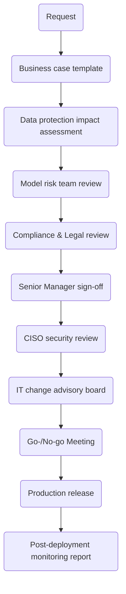
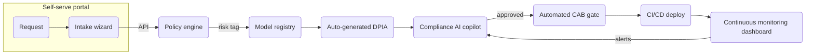
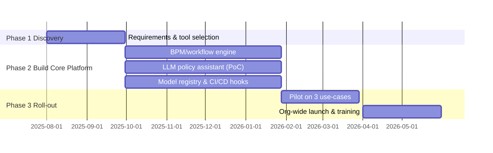

### 1 Executive hook — _“Laying track before the AI express arrives”_

Imagine our fintech platform is a high-speed train poised to race ahead with generative-AI-powered features. If we don’t lay enough regulatory “track” (governance and workflow automation) this year, next year we’ll be forced to throttle the engine or derail under ever-tighter UK/EU rules.  
The EU AI Act’s phased obligations start **August 2025** and hit high-risk financial-services systems by **August 2026** ([artificialintelligenceact.eu](https://artificialintelligenceact.eu/implementation-timeline/ "Implementation Timeline | EU Artificial Intelligence Act")); the Commission has already rejected calls for delay ([reuters.com](https://www.reuters.com/world/europe/artificial-intelligence-rules-go-ahead-no-pause-eu-commission-says-2025-07-04/?utm_source=chatgpt.com "EU sticks with timeline for AI rules")). In parallel, DORA becomes fully applicable in **January 2025** ([eiopa.europa.eu](https://www.eiopa.europa.eu/digital-operational-resilience-act-dora_en "Digital Operational Resilience Act (DORA) - EIOPA")), while UK supervisors (FCA/PRA) are interpreting DP5/22 and FS23/6 to embed AI into the Senior Managers & Certification Regime (SM&CR) ([fca.org.uk](https://www.fca.org.uk/publications/feedback-statements/fs23-6-artifical-intelligence-machine-learning "FS23/6: Artificial Intelligence and Machine Learning | FCA")).  
Without smarter workflows, every new GPT pilot or customer chatbot will queue behind manual reviews, turning regulation from a safety rail into a gridlock.

---

### 2 Regulatory landscape snapshot (2025-26)

|Regime|Status & key fintech-AI hooks|Practical impact|
|---|---|---|
|**EU AI Act**|In force 1 Aug 2024; banned-practices Feb 2025; GPAI & governance Aug 2025; high-risk systems Aug 2026 ([artificialintelligenceact.eu](https://artificialintelligenceact.eu/implementation-timeline/ "Implementation Timeline \| EU Artificial Intelligence Act"))|Mandatory risk classification, data-quality evidence, post-market monitoring; extraterritorial for EU clients|
|**DORA**|Applies 17 Jan 2025 ([eiopa.europa.eu](https://www.eiopa.europa.eu/digital-operational-resilience-act-dora_en "Digital Operational Resilience Act (DORA) - EIOPA"))|Continuous ICT-risk testing, third-party incident reporting (covers AI cloud/LLM providers)|
|**GDPR + DPDI Bill**|DPDI still in Lords “ping-pong”, copyright amendments hotly contested (Jun 2025) ([commonslibrary.parliament.uk](https://commonslibrary.parliament.uk/research-briefings/cbp-10212/?utm_source=chatgpt.com "Data (Use and Access) Bill [HL]: progress of the bill"), [theguardian.com](https://www.theguardian.com/technology/2025/jun/04/ministers-offer-concessions-ai-copyright-avoid-fifth-lords-defeat?utm_source=chatgpt.com "Peers vote to defy government over copyright threat from AI"))|Possible new AI-training transparency duties; UK data-transfer clamps|
|**FCA/PRA (UK)**|FS23/6 feedback emphasises clarifying existing rules & SM&CR accountability for AI ([fca.org.uk](https://www.fca.org.uk/publications/feedback-statements/fs23-6-artifical-intelligence-machine-learning "FS23/6: Artificial Intelligence and Machine Learning \| FCA"))|Named SMF must sign off each model; expect “explainability by design”|
|**UK AI Safety Institute**|Launched Jan 2024 to test frontier models ([gov.uk](https://www.gov.uk/government/publications/ai-safety-institute-overview/introducing-the-ai-safety-institute "Introducing the AI Safety Institute  - GOV.UK"))|Likely reference test-suite for high-risk AI used in finance|

---

### 3 Current manual approval workflow

_Cycle time:_ 6–8 weeks, 20+ hand-offs, evidence scattered across JIRA, Confluence, email.

---

### 4 Pain points & automation opportunities

|Step|Pain|**Gen-AI assist**|**Non-AI / custom**|
|---|---|---|---|
|Business-case drafting|Re-keying policies|LLM wizard pre-fills template, maps feature → risk class|Dynamic web-form with drop-downs & real-time policy links|
|DPIA & GDPR checks|Manual copy-paste of clauses|GPT-based privacy copilot highlights data-transfer hotspots|Rules engine (Open-Source BPM e.g. Camunda) validates mandatory fields|
|Model-risk questionnaire|Spreadsheet ping-pong|Chat interface auto-suggests controls & embeds citations|Central model registry auto-generates PDFs|
|Legal review|Dense regulatory text|Retrieval-augmented-generation bot surfaces precedent rulings|Version-controlled clause library|
|Sign-offs|Email approvals lost|Slack/Teams bot routes tasks, captures e-signatures|Business-process-management workflow with SLAs|
|Evidence pack|Scattered screenshots|Gen-AI extracts controls from logs & writes audit narrative|One-click export to shared evidence vault|

---

### 5 Target automated workflow (12-month build)

---

### 6 Delivery plan & budget

|Item|Qty/FTE|Cost (12 m)|
|---|---|---|
|Platform engineers|4|£600 k|
|Compliance SME|1|£120 k|
|Product manager|1|£130 k|
|LLM infra credits|—|£250 k|
|BPM & security tooling|—|£300 k|
|Contingency (15 %)|—|£210 k|
|**Total ask**||**≈ £1.6 m CAPEX + £0.1 m OPEX**|

---

### 7 Value created

- **Cycle-time reduction:** 8 → 2 weeks for approvals (75 % faster).
    
- **Capacity unlock:** frees ~0.8 FTE per business line; worth ~£500 k / year.
    
- **Regulatory defence:** audit trail generated automatically – cuts external-audit effort 30 %.
    
- **Speed-to-market:** earlier release of GenAI-powered savings & onboarding bots (projected £2 m incremental revenue in FY 26).
    

---

### 8 Risk of inaction (July 2026)

- **Regulatory jam:** high-risk AI obligations live; manual workflow means <30 % of planned AI features reach prod.
    
- **Opportunity cost:** competitors with automated governance capture market share.
    
- **Compliance fines:** up to 7 % global turnover for AI Act breaches on transparency ([artificialintelligenceact.eu](https://artificialintelligenceact.eu/implementation-timeline/ "Implementation Timeline | EU Artificial Intelligence Act")).
    
- **Employee frustration:** shadow-IT LLM use rises, increasing data-leak risk.
    

---

### 9 Next-step research questions (feed into deep-dive workstream)

1. **Reg-tech vendor scan:** Which EU-hosted AI-governance SaaS tools provide out-of-the-box AI-Act conformity evidence?
    
2. **LLM policy-assistant baseline:** Accuracy of RAG models on FCA Handbook & GDPR clauses.
    
3. **Data-residency constraints:** Map cross-border data flows vs. DPDI amendments on copyright transparency ([theguardian.com](https://www.theguardian.com/technology/2025/jun/04/ministers-offer-concessions-ai-copyright-avoid-fifth-lords-defeat?utm_source=chatgpt.com "Peers vote to defy government over copyright threat from AI")).
    
4. **ROI sensitivity:** NPV of project under varying throughput assumptions.
    

---

### 10 Ask to the Executive Committee

Approve **£1.6 m** for a **12-month “AI Governance Automation” initiative**, commencing **1 Aug 2025**, to deliver:

- Self-service AI-use-case intake portal integrated with policy engine
    
- Model registry, DPIA generator, and automated evidence vault
    
- LLM-powered compliance copilot
    
- End-to-end audit trail satisfying EU AI Act, DORA, GDPR/DPDI and FCA SM&CR
    

_By laying the track now, we ensure our AI express arrives on time, safely, and ahead of the pack._