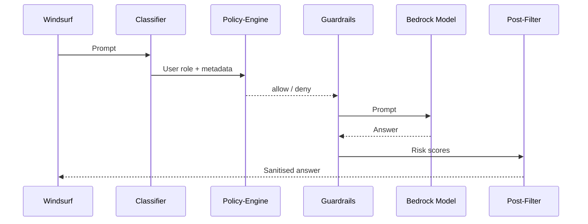
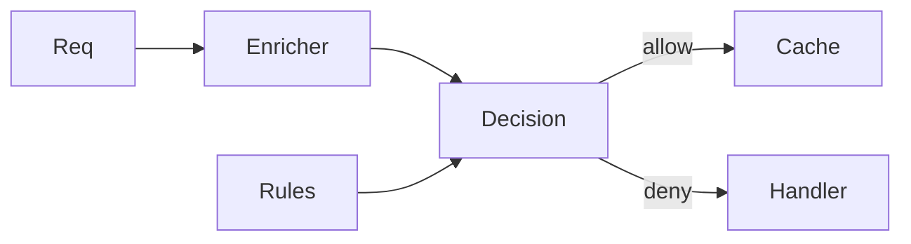
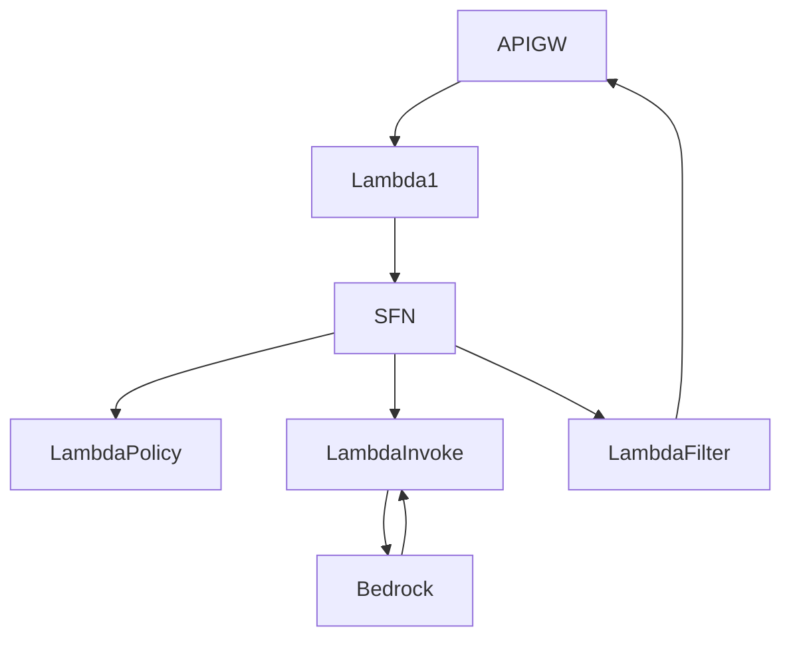

<!-- ─────────────────────────────────────────────────────────────── -->
<!--  H E R O  S E C T I O N                                        -->
<!-- ─────────────────────────────────────────────────────────────── -->


*Alt text: A modern fortress surrounded by water, interior lit with cloud icons and flowing data streams.*

> **Feel-the-buzz tip:** Make this a subtle parallax banner so the garden “opens” as the reader scrolls.

---

## 1 The big picture — Bedrock is our AI landing zone   🌐

> *TL;DR –* Foundation-model demand is exploding, but **EU AI Act** duties for *general-purpose* models kick-in on **2 Aug 2025** and *high-risk* duties on **2 Aug 2027**.:contentReference[oaicite:0]{index=0}  
> Meanwhile, the UK FCA’s *AI Live-Testing* regime—and its “Super-charged Sandbox” with NVIDIA GPUs—opens this year.:contentReference[oaicite:1]{index=1}

### Why Bedrock?

* Fully managed models + **Guardrails for Bedrock** (PII redaction, toxicity, policy blocks) now GA.:contentReference[oaicite:2]{index=2}  
* Runs in-region (Paris, Zurich, Frankfurt) for data-sovereignty.:contentReference[oaicite:3]{index=3}

<!--  📸  Insert a small “Reg-landscape” infographic here  -->


---

## 2 Why the slow burn is worth it  🚀 🛡️  

<details>
<summary><strong>Hover / Click to see the ROI table</strong></summary>

| Up-front (2024-Q2 → 2025-Q3) | Long-term dividend |
| --- | --- |
| Map high-risk AI-Act use-cases | **Reg-by-design** – every downstream app inherits controls |
| GDPR DPIAs on training corpora | Faster vendor onboarding |
| Build guardrails & policy packs | Audit readiness, lower legal cost |
| Model cards & Art 52 artefacts | Evidence pack for supervisors |

</details>

<!--  🎨  Optional side-bar “Before / After” comic strip showing chaotic AI tools → tidy Bedrock hub  -->

---

## 3 Our five-layer guardrail stack  🔐

```mermaid
%%{ init:{ "theme":"neutral" } }%%
flowchart LR
    A[Pre-Prompt Classifier] --> B[Policy Engine]
    B --> C[Guardrails]
    C --> D[Bedrock Model]
    D --> E[Post-Gen Filters]
    B -. logs .-> F((Audit&nbsp;Log))
    C -. hashes .-> F
    E -. hashes .-> F
````

_Place the diagram flush-left; let the narrative flow on the right._

---

## 4 Who piggy-backs on the rails 👩‍💻👨‍🎨👩‍🔬


|Persona|Example tool|What they gain|
|---|---|---|
|Cloud & App devs|Windsurf, Cursor, Amazon Q|Multi-file refactors with policy covers|
|Data engineers|Databricks Mosaic AI|RAG over lake-house with GDPR masking|
|QA / Testers|testRigor|100× faster regression, all logs in-region|
|Designers|Figma AI|On-brand copy & mock-ups without data-leak|
|Product owners|Maze AI|Auto-cluster feedback, draft PRDs|
|Risk & Compliance|Nightfall AI + Guardrails|Inline DLP & insider-trading phrase blocks|

---

## 5 Use-case gallery 🎯

|SDLC productivity|Business value|
|---|---|
|Auto-generate unit & E2E tests (testRigor)|Reg-compliant client chat-assistant|
|Agentic refactor bot (Windsurf “Cascade”)|Real-time AML anomaly triage|
|Design-to-code (Figma Make → Lambda)|Exec-ready FCA notice summaries|
|Story → PRD draft (Maze PM)|Personalised wellness nudges|

> **Interactive idea:** Turn each bullet into a **flip-card** – front = headline, back = 3-line user story & KPI.

---

## 6 Roadmap snapshot 📅

```mermaid
gantt
    dateFormat  YYYY-Q
    title  Bedrock Enablement Roadmap
    section 2025
    Guardrail DSL          :a1, 2025-Q2,   1q
    Sandbox Pilot          :a2, after a1,  1q
    section 2026
    Internal Model Registry: b1, 2026-Q1,  2q
    Designer/PM Tool set   : b2, after b1, 1q
    Bot-Factory Self-Serve : b3, 2026-Q3,  2q
```

_(Readers can expand tasks to see owners & OKRs – use Mermaid’s clickable links.)_

---

## 7 Walk-through: one model invocation ⬇️



_Put this in an **accordion** block; default collapsed to reduce scroll fatigue._

---

## 8 What’s under the hood ⚙️





---

## 9 Regulatory fact-box 📜

> **EU AI Act checkpoints**  
> • _Art 52_ GPAI obligations → **2 Aug 2025**  
> • _High-risk_ system duties → **2 Aug 2027**
> 
> **UK / FCA AI sandbox** live-testing window opens ★ 2025 H2.  
> _(Sources: Reuters / EU AI Act portal / FCA press releases) – linked above._

---

## 10 Call to action 📣


- **Architects & platform engineers:** contribute policy snippets.
    
- **Domain teams:** nominate one high-impact use-case for sandbox beta.
    
- **Everyone:** RSVP to “Bedrock Office Hours” – live demos & Q&A.
    

---

### Design notes & quick wins

|Trick|Why it works|
|---|---|
|**Hero parallax banner**|Instant emotional hook|
|**Flip-cards & accordions**|Keeps long docs skimmable|
|**Persona icon grid**|Readers find themselves in the story|
|**Clickable Mermaid Gantt**|Roadmap feels “live”, not static|
|**Reg fact-boxes**|Shows we’re on top of compliance|

---

_Swap each `images/…` placeholder for final artwork (SVG/PNG). All Mermaid code renders dynamically in GitHub, GitLab, Confluence, or any docs site running Mermaid v10._