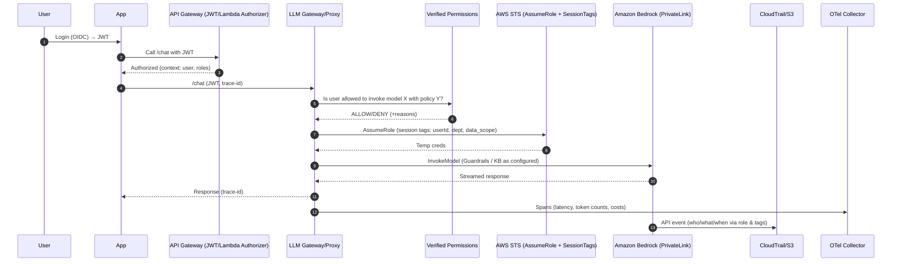

Alright—here’s a secure, scalable way to embed AI into your SDLC with **Bedrock as the model control plane**, and where an **MCP layer** and/or an **LLM gateway/proxy** fits.

# What you’re building (at a glance)

- **Bedrock-first model access** with private networking, safety controls, and full auditability. ([docs.aws.amazon.com](https://docs.aws.amazon.com/bedrock/latest/userguide/vpc-interface-endpoints.html?utm_source=chatgpt.com "Use interface VPC endpoints (AWS PrivateLink) to create a ..."))
    
- **MCP (Model Context Protocol)** to let your apps/agents securely reach tools & data with standardized auth (OAuth 2.1), consent, and capability discovery. ([Model Context Protocol](https://modelcontextprotocol.io/specification/2025-03-26/basic/authorization "Authorization - Model Context Protocol"))
    
- **LLM Gateway/Proxy** to enforce policies, identity pass-through, routing, caching, spend control, and unified observability before anything touches a model. (Think: Kong AI Gateway, Portkey, LiteLLM.) ([Kong Inc.](https://konghq.com/products/kong-ai-gateway?utm_source=chatgpt.com "AI Gateway for LLM and API Management"), [Kong Docs](https://developer.konghq.com/ai-gateway/?utm_source=chatgpt.com "Kong AI Gateway"), [Portkey](https://portkey.ai/features/ai-gateway?utm_source=chatgpt.com "Enterprise-grade AI Gateway - Portkey"), [LiteLLM](https://docs.litellm.ai/docs/simple_proxy?utm_source=chatgpt.com "LiteLLM Proxy Server (LLM Gateway)"))
    
- **Traceability & observability** via CloudTrail, OTel Gen-AI semantics, and OpenLLMetry. ([docs.aws.amazon.com](https://docs.aws.amazon.com/bedrock/latest/userguide/logging-using-cloudtrail.html?utm_source=chatgpt.com "Monitor Amazon Bedrock API calls using CloudTrail"), [OpenTelemetry](https://opentelemetry.io/docs/specs/semconv/gen-ai/?utm_source=chatgpt.com "Semantic conventions for generative AI systems"), [traceloop.com](https://www.traceloop.com/docs/openllmetry/introduction?utm_source=chatgpt.com "What is OpenLLMetry?"))
    

---

# Core requirements for an MCP / LLM Gateway layer

**Security & identity**

- **User & role pass-through**: validate end-user JWT (OIDC), then assume an AWS role with **STS session tags** (userId, org, data-scope) for **ABAC**. Every Bedrock call lands in CloudTrail with those tags. ([docs.aws.amazon.com](https://docs.aws.amazon.com/apigateway/latest/developerguide/http-api-jwt-authorizer.html?utm_source=chatgpt.com "Control access to HTTP APIs with JWT authorizers in API ..."))
    
- **Fine-grained authorization**: externalize allow/deny with **Verified Permissions (Cedar)** for actions like “invoke_model on provider=X with data_classification=internal”. ([Amazon Web Services, Inc.](https://aws.amazon.com/verified-permissions/?utm_source=chatgpt.com "Fine-Grained Authorization - Amazon Verified Permissions"), [docs.aws.amazon.com](https://docs.aws.amazon.com/verifiedpermissions/latest/userguide/what-is-avp.html?utm_source=chatgpt.com "What is Amazon Verified Permissions?"))
    
- **Network isolation**: **AWS PrivateLink** VPC interface endpoints to Bedrock—no internet egress. ([docs.aws.amazon.com](https://docs.aws.amazon.com/bedrock/latest/userguide/vpc-interface-endpoints.html?utm_source=chatgpt.com "Use interface VPC endpoints (AWS PrivateLink) to create a ..."), [Amazon Web Services, Inc.](https://aws.amazon.com/blogs/machine-learning/use-aws-privatelink-to-set-up-private-access-to-amazon-bedrock/?utm_source=chatgpt.com "Use AWS PrivateLink to set up private access to Amazon ..."))
    
- **Content/PII safety**: Bedrock **Guardrails** pre/post filters (or independent `ApplyGuardrail` calls) for denied topics, sensitive terms, and redaction. ([docs.aws.amazon.com](https://docs.aws.amazon.com/bedrock/latest/userguide/guardrails.html?utm_source=chatgpt.com "Detect and filter harmful content by using Amazon Bedrock ..."))
    

**Governance & traceability**

- **Auditable trail**: CloudTrail for Bedrock (and Gateway if using AWS AgentCore Gateway) + S3 archival. ([docs.aws.amazon.com](https://docs.aws.amazon.com/bedrock/latest/userguide/logging-using-cloudtrail.html?utm_source=chatgpt.com "Monitor Amazon Bedrock API calls using CloudTrail"))
    
- **End-to-end tracing**: Propagate `trace-id`/`span-id` with **OpenTelemetry Gen-AI conventions**; optional **OpenLLMetry** instrumentation for LLM spans, costs, and latencies. ([OpenTelemetry](https://opentelemetry.io/docs/specs/semconv/gen-ai/?utm_source=chatgpt.com "Semantic conventions for generative AI systems"), [traceloop.com](https://www.traceloop.com/docs/openllmetry/introduction?utm_source=chatgpt.com "What is OpenLLMetry?"))
    

**Performance & UX**

- **Latency budget**: co-locate gateway and apps in-region; keep connections warm; offload auth to API Gateway JWT/Lambda authorizer; minimize synchronous plugins; enable **semantic caching** and prompt caching where safe. (Kong/Zuplo/Portkey/LiteLLM support routing & caching.) ([Kong Docs](https://developer.konghq.com/ai-gateway/?utm_source=chatgpt.com "Kong AI Gateway"), [Zuplo](https://zuplo.com/features/ai-gateway?utm_source=chatgpt.com "AI Gateway"), [Portkey](https://portkey.ai/features/guardrails?utm_source=chatgpt.com "Enforce Real Time LLM Behavior - Portkey"), [LiteLLM](https://docs.litellm.ai/docs/simple_proxy?utm_source=chatgpt.com "LiteLLM Proxy Server (LLM Gateway)"))
    
- **Resiliency & routing**: centralized fallback/routing, and **Bedrock Inference Profiles** for cross-Region throughput scaling and usage attribution. ([docs.aws.amazon.com](https://docs.aws.amazon.com/bedrock/latest/userguide/inference-profiles.html?utm_source=chatgpt.com "Set up a model invocation resource using inference profiles"))
    

**Developer experience**

- **Single API** for multi-model access (OpenAI-compatible or native), budget/rate limits per user/team, prompt/version registry, and safe evals (Bedrock **Evaluations** for A/B and LLM-as-judge). ([Amazon Web Services, Inc.](https://aws.amazon.com/bedrock/evaluations/?utm_source=chatgpt.com "Evaluate Foundation Models - Amazon Bedrock Evaluations"), [docs.aws.amazon.com](https://docs.aws.amazon.com/bedrock/latest/userguide/evaluation.html?utm_source=chatgpt.com "Evaluate the performance of Amazon Bedrock resources"))
    

---

# How the data & identity flow

- **App/user → Gateway**: App presents OIDC **JWT** (e.g., via API Gateway JWT/Lambda authorizer). Gateway exchanges/augments with **STS AssumeRole** + **session tags** (user, role, LOB, data tier). ([docs.aws.amazon.com](https://docs.aws.amazon.com/apigateway/latest/developerguide/http-api-jwt-authorizer.html?utm_source=chatgpt.com "Control access to HTTP APIs with JWT authorizers in API ..."))
    
- **Gateway → Policy**: Call **Verified Permissions** (Cedar) to authorize “invoke model X with guardrail Y on dataset Z”. ([docs.aws.amazon.com](https://docs.aws.amazon.com/verifiedpermissions/latest/userguide/what-is-avp.html?utm_source=chatgpt.com "What is Amazon Verified Permissions?"))
    
- **Gateway → Bedrock** over **PrivateLink**, with **Guardrails** applied (pre- and/or post-inference) and optional Knowledge Base/RAG calls. CloudTrail captures who/what/when. ([docs.aws.amazon.com](https://docs.aws.amazon.com/bedrock/latest/userguide/vpc-interface-endpoints.html?utm_source=chatgpt.com "Use interface VPC endpoints (AWS PrivateLink) to create a ..."))
    
- **Tracing**: OTel spans emitted at each hop; LLM spans carry tokens/latency/cost attributes (no payloads by default). ([OpenTelemetry](https://opentelemetry.io/docs/specs/semconv/gen-ai/?utm_source=chatgpt.com "Semantic conventions for generative AI systems"))
    

---

# Where MCP fits

- **Why MCP**: standardized, consent-driven way for agents/apps to access **tools/resources** (files, GitHub, KBs, DBs) with OAuth-based auth flows. ([Model Context Protocol](https://modelcontextprotocol.io/specification/2025-03-26/basic/authorization "Authorization - Model Context Protocol"))
    
- **Today on AWS**: AWS publishes MCP servers for **Knowledge Bases**, **Data Automation**, and more; AgentCore can **host MCP servers** and logs show up in CloudTrail (Gateway). ([awslabs.github.io](https://awslabs.github.io/mcp/servers/bedrock-kb-retrieval-mcp-server?utm_source=chatgpt.com "Amazon Bedrock Knowledge Base Retrieval MCP Server"), [docs.aws.amazon.com](https://docs.aws.amazon.com/bedrock-agentcore/latest/devguide/runtime-mcp.html?utm_source=chatgpt.com "Deploy MCP servers in AgentCore Runtime"))
    

---

# Architecture options (Mermaid)

```mermaid
flowchart LR
  subgraph A[Approach A — Direct-to-Bedrock (no gateway)]
    FE1[Apps/Services] -- OIDC -> APIGW1[API Gateway auth]
    APIGW1 --> SR1[AssumeRole(+session tags)]
    SR1 --> BR1[(Bedrock VPC Endpoint)]
    BR1 --> GR1[Guardrails / KB / Agents]
  end

  subgraph B[Approach B — Central LLM Gateway/Proxy]
    FE2[Apps/Agents] -- OIDC JWT -> GW[LLM Gateway/Proxy]
    GW --> AVP[Verified Permissions (Cedar)]
    GW --> OTL[OTel/OpenLLMetry]
    GW --> STS[AssumeRole(+session tags)]
    STS --> BR2[(Bedrock via PrivateLink)]
    BR2 --> GR2[Guardrails / KB / Agents]
    GW <---> Cache[(Prompt/Response Cache)]
    GW <---> Eval[Bedrock Evaluations]
  end

  subgraph C[Approach C — MCP + Gateway]
    FE3[Apps/Agents w/ MCP Client]
    FE3 <-- OAuth 2.1 --> MCP[MCP Servers (GitHub, KB, Data Tools)]
    FE3 -- model calls --> GW2[LLM Gateway/Proxy]
    GW2 --> STS2[AssumeRole(+session tags)]
    STS2 --> BR3[(Bedrock via PrivateLink)]
    BR3 --> GR3[Guardrails / KB / Agents]
  end

  style A fill:#eef,stroke:#88a
  style B fill:#efe,stroke:#8a8
  style C fill:#fee,stroke:#a88
```

**When to pick which**

- **A**: smallest latency/complexity for a single provider (Bedrock-only), but app teams re-implement policy/observability repeatedly.
    
- **B**: strongest **control plane** for policy, routing, and spend—best default in enterprises.
    
- **C**: you want **standardized tool access** (MCP) _and_ a hardened LLM control plane—best for agentic systems.
    

---

# Identity pass-through & trace (Mermaid sequence)



---

# What to run **today**

**First-party AWS**

- **Bedrock Guardrails** (policy-consistent safety filters & PII controls). ([docs.aws.amazon.com](https://docs.aws.amazon.com/bedrock/latest/userguide/guardrails.html?utm_source=chatgpt.com "Detect and filter harmful content by using Amazon Bedrock ..."))
    
- **VPC endpoints (PrivateLink)** to Bedrock for private traffic. ([docs.aws.amazon.com](https://docs.aws.amazon.com/bedrock/latest/userguide/vpc-interface-endpoints.html?utm_source=chatgpt.com "Use interface VPC endpoints (AWS PrivateLink) to create a ..."))
    
- **CloudTrail** for Bedrock calls; **AgentCore Gateway** (preview) also logs to CloudTrail. ([docs.aws.amazon.com](https://docs.aws.amazon.com/bedrock/latest/userguide/logging-using-cloudtrail.html?utm_source=chatgpt.com "Monitor Amazon Bedrock API calls using CloudTrail"))
    
- **Inference Profiles** for cross-Region throughput & cost/usage tracking. ([docs.aws.amazon.com](https://docs.aws.amazon.com/bedrock/latest/userguide/inference-profiles.html?utm_source=chatgpt.com "Set up a model invocation resource using inference profiles"))
    
- **Knowledge Bases** for managed RAG where useful. ([docs.aws.amazon.com](https://docs.aws.amazon.com/bedrock/latest/userguide/knowledge-base.html?utm_source=chatgpt.com "Retrieve data and generate AI responses with ..."))
    
- **Evaluations** (A/B, human/LLM-as-judge) for safe iterative rollout. ([Amazon Web Services, Inc.](https://aws.amazon.com/bedrock/evaluations/?utm_source=chatgpt.com "Evaluate Foundation Models - Amazon Bedrock Evaluations"), [docs.aws.amazon.com](https://docs.aws.amazon.com/bedrock/latest/userguide/evaluation.html?utm_source=chatgpt.com "Evaluate the performance of Amazon Bedrock resources"))
    

**MCP ecosystem (standardized tool access)**

- **MCP spec** with OAuth 2.1-based authorization flows. ([Model Context Protocol](https://modelcontextprotocol.io/specification/2025-03-26/basic/authorization "Authorization - Model Context Protocol"))
    
- **AWS MCP servers** (Knowledge Bases, Data Automation, GitHub, etc.) and **AgentCore runtime** for hosting MCP servers. ([awslabs.github.io](https://awslabs.github.io/mcp/servers/bedrock-kb-retrieval-mcp-server?utm_source=chatgpt.com "Amazon Bedrock Knowledge Base Retrieval MCP Server"), [Amazon Web Services, Inc.](https://aws.amazon.com/blogs/machine-learning/streamline-github-workflows-with-generative-ai-using-amazon-bedrock-and-mcp/?utm_source=chatgpt.com "Streamline GitHub workflows with generative AI using ..."), [docs.aws.amazon.com](https://docs.aws.amazon.com/bedrock-agentcore/latest/devguide/runtime-mcp.html?utm_source=chatgpt.com "Deploy MCP servers in AgentCore Runtime"))
    

**LLM Gateways/Proxies (buy/open-source)**

- **Kong AI Gateway** (plugins for cost control, prompt shaping, routing, analytics). ([Kong Inc.](https://konghq.com/products/kong-ai-gateway?utm_source=chatgpt.com "AI Gateway for LLM and API Management"), [Kong Docs](https://developer.konghq.com/ai-gateway/?utm_source=chatgpt.com "Kong AI Gateway"))
    
- **Portkey AI Gateway** (open-source gateway, guardrails, virtual keys, routing, caching). ([Portkey](https://portkey.ai/docs/product/ai-gateway?utm_source=chatgpt.com "AI Gateway - Portkey Docs"))
    
- **LiteLLM Proxy** (OpenAI-compatible, spend/budgets/rate limits, caching; AWS Marketplace AMI). ([LiteLLM](https://docs.litellm.ai/docs/simple_proxy?utm_source=chatgpt.com "LiteLLM Proxy Server (LLM Gateway)"), [Amazon Web Services, Inc.](https://aws.amazon.com/marketplace/pp/prodview-gdm3gswgjhgjo?utm_source=chatgpt.com "AWS Marketplace: LiteLLM LLM Gateway (Proxy Server)"))
    
- **Zuplo AI Gateway** (routing, auth, rate-limit, **semantic caching**). ([Zuplo](https://zuplo.com/features/ai-gateway?utm_source=chatgpt.com "AI Gateway"))
    
- **Observability**: **OpenTelemetry Gen-AI** + **OpenLLMetry** to ship traces to your stack. ([OpenTelemetry](https://opentelemetry.io/docs/specs/semconv/gen-ai/?utm_source=chatgpt.com "Semantic conventions for generative AI systems"), [traceloop.com](https://www.traceloop.com/docs/openllmetry/introduction?utm_source=chatgpt.com "What is OpenLLMetry?"))
    

---

# Operating considerations at scale

- **Multi-account/region**: central gateway in a **shared services** account; app accounts consume via **PrivateLink**; runbedrock in-region of data to reduce latency/compliance risk. ([docs.aws.amazon.com](https://docs.aws.amazon.com/bedrock/latest/userguide/vpc-interface-endpoints.html?utm_source=chatgpt.com "Use interface VPC endpoints (AWS PrivateLink) to create a ..."))
    
- **Policy-as-code**: Cedar policies (Verified Permissions) versioned in Git; change control via PRs; evaluate in CI. ([docs.aws.amazon.com](https://docs.aws.amazon.com/verifiedpermissions/latest/userguide/what-is-avp.html?utm_source=chatgpt.com "What is Amazon Verified Permissions?"))
    
- **Cost & traffic control**: budgets/quotas per team via gateway (LiteLLM/Portkey); throttle abusive clients; attribute spend with **Inference Profiles** & cost allocation tags. ([LiteLLM](https://docs.litellm.ai/docs/simple_proxy?utm_source=chatgpt.com "LiteLLM Proxy Server (LLM Gateway)"), [Portkey](https://portkey.ai/docs/introduction/feature-overview?utm_source=chatgpt.com "Portkey Features - Portkey Docs"), [AWS Builder Center](https://builder.aws.com/content/2oa6QAE7tgxmAsgAExXY2B2MqCV/getting-started-with-bedrock-application-inference-profile?utm_source=chatgpt.com "Getting started with Bedrock application inference profile"))
    
- **PII/data boundaries**: route prompts through **Guardrails** (or `ApplyGuardrail`) before inference; redact logs by default per OTel Gen-AI guidance. ([docs.aws.amazon.com](https://docs.aws.amazon.com/bedrock/latest/userguide/guardrails-use-independent-api.html?utm_source=chatgpt.com "Use the ApplyGuardrail API in your application"), [OpenTelemetry](https://opentelemetry.io/docs/specs/semconv/gen-ai/gen-ai-events/?utm_source=chatgpt.com "Semantic conventions for generative AI events"))
    
- **DX & latency**: keep gateway minimal in hot path, push heavy evals async; prefer streaming (`ConverseStream`) to improve perceived latency; enable keep-alive/HTTP2. (Converse APIs are native in Bedrock docs.) ([docs.aws.amazon.com](https://docs.aws.amazon.com/bedrock/latest/userguide/inference-profiles-use.html?utm_source=chatgpt.com "Use an inference profile in model invocation - Amazon Bedrock"))
    
- **Audit analytics**: CloudTrail → S3/Lake → Athena/QuickSight; tag every request with user/session; optional anomaly detection on CloudTrail (EventBridge/Lambda). ([docs.aws.amazon.com](https://docs.aws.amazon.com/bedrock/latest/userguide/logging-using-cloudtrail.html?utm_source=chatgpt.com "Monitor Amazon Bedrock API calls using CloudTrail"))
    

---

# Recommended blueprint

1. **Start with Approach B (Gateway)** for centralized control, and add **Approach C (MCP)** where agents need standardized tool access.
    
2. **Wire identity pass-through**: OIDC → API Gateway authorizer → STS AssumeRole + **session tags** (userId, tenant, data_scope). ([docs.aws.amazon.com](https://docs.aws.amazon.com/apigateway/latest/developerguide/http-api-jwt-authorizer.html?utm_source=chatgpt.com "Control access to HTTP APIs with JWT authorizers in API ..."))
    
3. **Enforce Guardrails** + Verified Permissions checks per route/model. ([docs.aws.amazon.com](https://docs.aws.amazon.com/bedrock/latest/userguide/guardrails.html?utm_source=chatgpt.com "Detect and filter harmful content by using Amazon Bedrock ..."))
    
4. **Turn on tracing** (OTel Gen-AI + OpenLLMetry), **log Bedrock calls in CloudTrail**. ([OpenTelemetry](https://opentelemetry.io/docs/specs/semconv/gen-ai/?utm_source=chatgpt.com "Semantic conventions for generative AI systems"), [traceloop.com](https://www.traceloop.com/docs/openllmetry/introduction?utm_source=chatgpt.com "What is OpenLLMetry?"), [docs.aws.amazon.com](https://docs.aws.amazon.com/bedrock/latest/userguide/logging-using-cloudtrail.html?utm_source=chatgpt.com "Monitor Amazon Bedrock API calls using CloudTrail"))
    
5. **Improve throughput** with **Inference Profiles**; evaluate models/guardrails in **Bedrock Evaluations** before broad rollout. ([docs.aws.amazon.com](https://docs.aws.amazon.com/bedrock/latest/userguide/inference-profiles.html?utm_source=chatgpt.com "Set up a model invocation resource using inference profiles"), [Amazon Web Services, Inc.](https://aws.amazon.com/bedrock/evaluations/?utm_source=chatgpt.com "Evaluate Foundation Models - Amazon Bedrock Evaluations"))
    

If you want, I can adapt this into a runnable reference repo (API Gateway authorizer + LiteLLM proxy + OTel + Verified Permissions) and an MCP sample (KB server + GitHub server) to kick off a pilot.