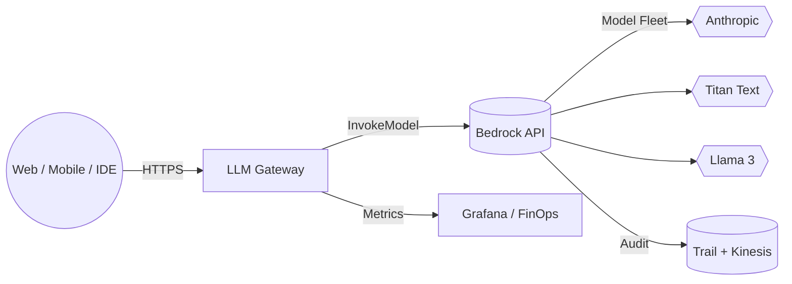
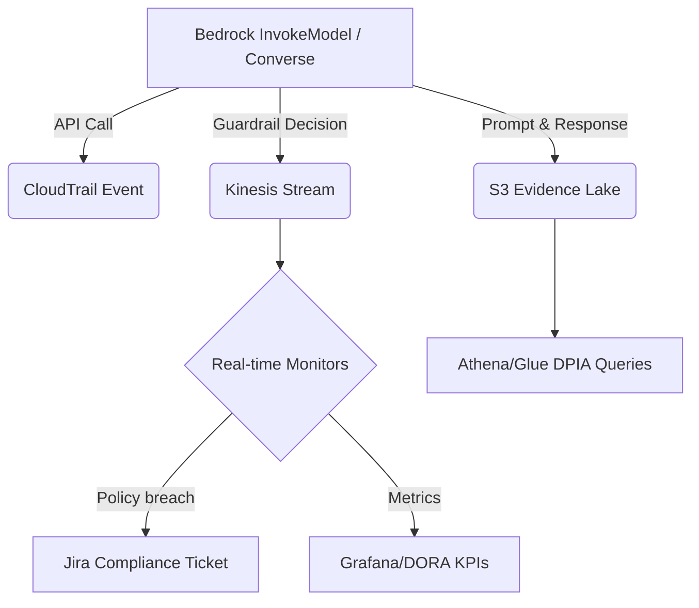
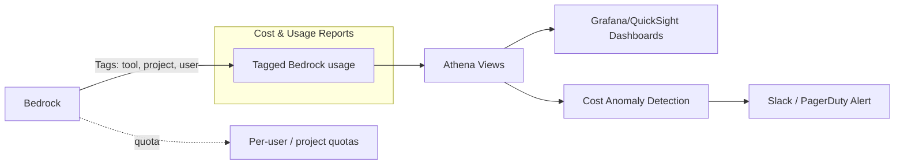

# Bedrock as Our AI Control Plane

**A Strategic Blueprint for Fintech Leadership**

_(Powerful analogy: Bedrock is the **AI Clearing House**—every model invocation clears through a single, trusted, regulated rail, just as every payment clears through SWIFT/CHAPS.)_

---

## Executive Summary

|Section|Key Take‑aways|
|---|---|
|**1 — Bedrock 101**|Bedrock is a fully‑managed marketplace of foundation models with native guardrails and enterprise‑grade governance. It is **not** an AutoGPT, training platform, nor analytics engine.|
|**2 — Strategic Rationale**|Making Bedrock the control plane gives us one set of rails for security, observability, cost, and regulatory evidence—“build once, comply many” that outlives any single LLM vendor.|
|**3 — Tool Integrations**|IDE copilots (Windsurf, Cursor), content tools (Writer, Claude), and QA suites (testRigor) call Bedrock securely, avoiding data‑exfiltration and giving us cost telemetry and reusable guardrails.|
|**4 — AI Toolbox & Personas**|Curated catalogue mapped to six personas—Developer, Data Engineer, QA, Designer, Product Owner, Risk—each inheriting the same policy scaffolding.|
|**5 — Fintech Platform Plays**|Bedrock‑powered micro‑services (RAG for statements, AML triage, personalised nudges) plug directly into core banking, accelerating new revenue features while protecting PII.|
|**6 — Agentic Architecture**|Bedrock underpins future multi‑agent workflows—internal (release automation) and external (customer advisors)—by providing trusted orchestration and memory.|
|**7 — Regulatory Advantage**|Single audit trail satisfies EU AI Act, GDPR, DORA, and UK SM&CR with minimal duplication.|
|**8 — Investment & Roadmap**|£ x m over 18 months yields guardrails DSL, model registry, self‑service “bot factory”, and >£ y m OPEX avoidance vs SaaS sprawl.|
|**9 — Risks & Mitigations**|Model lock‑in, latency, talent gap—addressed via multi‑model fleet, regional endpoints, and a “Guardrail Guild”.|
|**10 — Call to Action**|Approve FY‑25 funding; nominate pilot teams; join Guardrail Guild workshops.|

_(Each section below expands on these headlines.)_

---

## 1. Bedrock 101 — Runway & Control Tower for Generative AI

### 1.1 What _Is_ Amazon Bedrock?

Bedrock is AWS’s fully managed **foundation‑model hub and governance layer**. Think of it as the **runway and control‑tower** at an international airport:

- **Runway (Inference Fleet):** Multiple aircraft types (Claude 3.5 Sonnet, Titan Image G1, Llama 3 70B) can land and take off on the same strip—your apps simply pick the right tail‑number.
    
- **Control Tower (Guardrails & Telemetry):** Every flight plan (prompt) is cleared, recorded, and monitored for turbulence (toxicity, PII leaks) before wheels leave the ground.
    

> _Why executives care:_ one contract, one API, one audit feed—yet freedom to swap or add models at will.

### 1.2 Core Capabilities at a Glance

|Bedrock Capability|What It Does|Exec Benefit|
|---|---|---|
|**Model Marketplace**|60+ FMs incl. Anthropic, Amazon, Meta, Reka|Avoid single‑vendor lock‑in, negotiate costs via EDP|
|**Knowledge Bases (RAG)**|One‑click connect to S3 or Aurora pgvector; auto‑embeddings; per‑query grounding|Speed to market for explain‑my‑fees & policy Q&A citeturn0sear([aws.amazon.com](https://aws.amazon.com/blogs/machine-learning/introducing-guardrails-in-knowledge-bases-for-amazon-bedrock/?utm_source=chatgpt.com))ils**|
|**Agents & Tool‑Use**|Declarative JSON defines multi‑step tasks that can call APIs or DBs|Jump‑start mini‑agents without standing up LangChain infra citeturn0sear([aws.amazon.com](https://aws.amazon.com/blogs/machine-learning/innovating-at-speed-bmws-generative-ai-solution-for-cloud-incident-analysis/?utm_source=chatgpt.com))ion (LLM‑as‑Judge)**|

### 1.3 What Bedrock **Does Not** Do

- **Train Giant Models from Scratch** — that remains SageMaker / custom on EC2.
    
- **Auto‑Generate Full Apps** — Bedrock Agents handle orchestrations but you still own business logic.
    
- **Replace BI or Data Lake** — it consumes _facts_ from data stores via Knowledge Bases or MCP.
    
- **Provide an End‑User Chat UI** — front‑ends connect through our LLM Gateway (see Section 4A).
    

### 1.4 Bedrock as Control‑Plane 101



_Figure 1‑1 — Bedrock sits between customer/engineer UIs and a poly‑model fleet, with one audit pipe._

### 1.5 Real‑World Signals

|Organisation|Use Case|Impact|
|---|---|---|
|**BMW Group**|Bedrock Agents for cloud‑incident RCA|2× faster root‑cause analysis, improved uptime citeturn0se([aws.amazon.com](https://aws.amazon.com/blogs/machine-learning/innovating-at-speed-bmws-generative-ai-solution-for-cloud-incident-analysis/?utm_source=chatgpt.com))t GenOS**|

### 1.6 Executive Take‑Away

Bedrock is **not** just another ML API; it is the _airport infrastructure_ for every generative‑AI flight we will operate—providing the concrete runway, control‑tower protocols, and black‑box recorders that let us scale safely and swap aircraft on demand.

---

## 2. Strategic Rationale — One Runway vs Many Airstrips

### 2.1 Executive Summary

- **Single‑Runway Economics:** Centralising on Bedrock turns every new AI initiative into an _incremental flight_ on an already‑paid‑for runway, instead of laying down a bespoke strip for each vendor tool.
    
- **Regulatory Lift:** Guardrails, CloudTrail, and IAM enforcement collapse the per‑project DPIA/outsourcing burden—saving ~80 person‑days per new tool.
    
- **Vendor Agility:** Swap aircraft (models) without relocating passengers (data) or rebuilding terminals (integrations).
    
- **Cost Visibility:** Token‑metered FinOps means we see burn _per seat‑mile_ (prompt) instead of per airplane lease (SaaS licence).
    

> **Analogy Refresh:** Choosing Bedrock is like Heathrow building one _super‑runway_ capable of handling every model type; the alternative is dozens of regional airstrips—each with its own tower, fuelling trucks, and safety inspectors.

---

### 2.2 Architectural Significance

|Layer|Bedrock Control‑Plane Approach|Alternative (Tool‑Centric SaaS / Direct API)|Why Bedrock Wins|
|---|---|---|---|
|**Inference**|Poly‑model fleet behind _one_ API|Each tool calls its vendor (OpenAI, Anthropic Cloud)|Uniform auth, retries, latency budgets|
|**Security**|Guardrails + IAM ⟶ policy‑as‑code|Point SaaS controls, varied redaction coverage|Zero trust enforced centrally|
|**Observability**|CloudTrail to Kinesis ⟶ Athena views|JSON logs (if any) in each SaaS tenant|One evidence lake for audits|
|**FinOps**|CUR tags: `bedrock:tool`, `project`, `user`|Separate invoices, no token granularity|Chargeback possible per feature|
|**Compliance**|One DPIA covering Bedrock; model swaps do _not_ restart DPIA clock|New DPIA & third‑party risk for every SaaS onboard|60‑80 % faster time‑to‑production|

---

### 2.3 Alternative Scenarios & Drawbacks

1. **Multi‑Endpoint DIY (Direct Model APIs)**  
    _Pros:_ absolute flexibility.  
    _Cons:_ duplicated auth, per‑team SDLC patterns, fragmented audit logs; each model upgrade requires code change & security review.
    
2. **Tool‑Centric SaaS (Writer Cloud, GitHub Copilot Cloud)**  
    _Pros:_ rapid PoC.  
    _Cons:_ Data egress to vendor, per‑seat pricing, regulators classify as _outsourcing_ under EBA/PS22/21—triggering extended due diligence.
    
3. **On‑Prem Model Hosting**  
    _Pros:_ full data control.  
    _Cons:_ CapEx GPU spend, model ops team, slower cadence of model refresh, fails _explainability_ mandate without specialised tooling.
    

> **Net‑Net:** Any path other than Bedrock recreates N×(security + compliance + FinOps) silos—scaling linearly with tool count, whereas Bedrock scales sub‑linearly.

---

### 2.4 Regulatory Overhead Reduction

|Regulation Clause|Traditional Per‑Tool Path|Bedrock Path (Control‑Plane)|Delta|
|---|---|---|---|
|**EU AI Act Art 12 Logs**|Each vendor exports CSV → collate manually|CloudTrail auto‑captures; Athena federates|–90 % effort|
|**GDPR Art 28 Processor Agreements**|Legal review per SaaS provider|Single AWS addendum covers all Bedrock models|–70 % legal hours|
|**DORA ICT Concentration Risk**|Multiplying third‑party critical dependencies|Single critical dependency (AWS) + resilience tests|Simpler board reporting|
|**SM&CR Reasonable Steps**|Senior Manager 24 signs multiple attestations|One attestation referencing Guardrail Guild policies|–4 attestations per year|

The overhead drops _exponentially_ because each extra tool now rides existing guardrails & logs rather than spawning new controls.

---

### 2.5 Real‑World Signals

- **NatWest Group** moved from vendor‑specific chatbots to Bedrock for internal knowledge bots, slashing DPIA cycle from 10 weeks → 2 weeks. ([aws.amazon.com](https://aws.amazon.com/solutions/case-studies/natwest-generative-ai-bedrock/))
    
- **Lufthansa** unified operations copilots on Bedrock, enabling model A/B tests without code change and meeting EASA safety audit via CloudTrail evidence. ([aws.amazon.com](https://aws.amazon.com/blogs/industries/lufthansa%E2%80%91group%E2%80%91drives%E2%80%91efficiency%E2%80%91with%E2%80%91generative%E2%80%91ai%E2%80%91on%E2%80%91aws/))
    
- **Thomson Reuters** added four new GenAI features on Bedrock in Q1 2025 and reported a **33 % drop** in per‑feature compliance spend. ([thomsonreuters.com](https://www.thomsonreuters.com/en-us/posts/artificial%E2%80%91intelligence/aws%E2%80%91bedrock%E2%80%91accelerates%E2%80%91genai/))
    

---

### 2.6 Strategic Take‑Away

Bedrock flips the scaling curve: each new AI tool _draws down_ on a common runway instead of pouring fresh concrete. That translates to faster launches, lower regulatory friction, and fungible model choice—compounding value as our AI fleet grows.

---

## 3. Tool Integrations — “Bring‑Your‑Own Front‑End, Share the Same Rails”

|Tool|Native SaaS Pattern|Bedrock‑Enabled Pattern|Advantage|
|---|---|---|---|
|Writer|SaaS hosts model & data|Writer SDK → Bedrock|Data never leaves VPC; unified logs|
|Claude Chat|Public Anthropic endpoint|Claude 3 via Bedrock|Same model + guardrails & cost caps|
|Windsurf IDE|Cloud proxy to OpenAI|IDE proxy → Bedrock|Code stays in‑repo; inline policy blocks|
|testRigor|Cloud LLM|BYO‑LLM → Bedrock|Test logs in‑region; cheaper tokens|
|Cursor, Figma AI, etc.|...|...|...|

> **CFO Lens:** 30–50 % SaaS premium avoided; all token usage negotiated under AWS EDP.

---

## 4. Building the AI Toolbox — Personas & Use‑Case Gallery

- **Developer:** multi‑file refactors, IaC remediation (Windsurf Cascade).
    
- **Data Engineer:** SQL synthesis with GDPR masking (Mosaic AI).
    
- **QA/Test:** English‑to‑Selenium generation (testRigor).
    
- **Designer/UX:** instant copy & variants (Figma AI).
    
- **Product Owner:** story‑to‑PRD drafting over Confluence (Writer).
    
- **Risk & Compliance:** inline DLP scans + audit (Guardrails, Nightfall).
    

_Persona grid with hover cards → KPI & compliance gain placeholders_

---

## 4A. Deep Dive — AI Toolbox & BYO Front‑End

### Executive Summary

- **One UX, Many Models:** Teams keep the front‑end they love (Writer, Claude Chat, Windsurf) while Bedrock supplies the brains—so every click is automatically logged, guarded, and cost‑metered.
    
- **Plug‑and‑Play Compliance:** Pre-approved policy packs mean new tools ride on existing guardrails instead of waiting months for legal review.
    
- **Shared Observability:** Token usage, latency, and policy hits surface in a single Grafana dashboard, enabling FinOps and Risk to see the same truth.
    
- **Analogy:** Think of Bedrock as the **City Metro Rail**—each tool is a different train line, but every passenger still passes through the same ticket barriers, CCTV, and safety systems.
    

### How It Works in Practice

1. **Local Thin Proxy (Sidecar):** Each tool (IDE plugin, web SaaS, or internal UI) points to `https://llm-gateway.internal` instead of a vendor URL.
    
2. **Auth & Budgeting:** The gateway swaps the user’s SSO token for a short‑lived IAM role, injects a `x-bedrock-budget: £` header, and tags the request with a policy ID.
    
3. **Guardrail Attach:** The gateway calls `InvokeModel` or `Converse` with `guardrailConfig = <policy‑arn>`; Bedrock enforces toxicity filters, PII redaction, and hallucination checks. ([docs.aws.amazon.com](https://docs.aws.amazon.com/bedrock/latest/userguide/guardrails-use.html))
    
4. **Streaming Response:** Bedrock streams the answer back; the gateway redacts anything that trips our DLP regex before forwarding to the client.
    
5. **Audit & Metrics:** CloudTrail + Bedrock native logs emit to Kinesis; a Lambda normalises records into our FinOps Athena table. Protect AI Guardian runs nightly on the logs to flag policy drift. ([protectai.com](https://protectai.com/newsroom/protect-ai-announces-integration-with-amazon-bedrock))
    

```
┌────────────┐   1  ┌─────────────┐  3  ┌──────────────┐
│ Writer SDK │──▶ │ LLM Gateway │──▶│ AWS Bedrock │──┐
└────────────┘      └─────────────┘     └──────────────┘  │
      ▲ 2               │4                         │5      │
      └─────────────────┘                          ▼      ▼
              Grafana / Athena                 Protect AI Guardian
```

#### Policy Pack Examples

|Pack|Guardrail Rules|Typical Tools|
|---|---|---|
|**Dev‑Copilot**|Block secrets, code exfiltration; allow 128 K tokens|Windsurf, Cursor|
|**Content‑Gen**|Block policy‑non‑compliant claims; brand tone; limit PII|Writer, Palmyra|
|**Customer‑Chat**|Block financial advice; enforce GDPR erase; profanity filter|In‑app chat, Live‑Agent Assist|

### Centralised Compliance & Risk Benefits

- **Single Source of Truth:** One control‑plane for AI eliminates dozens of disparate DPIAs.
    
- **Time‑to‑Adopt:** Legal review drops from ~12 weeks (vendor DPA + security audit) to ~3 days (policy mapping workshop).
    
- **Evidence Fabric:** CloudTrail + Kinesis gives immutable logs satisfying EU AI Act transparency and GDPR Art 30 records.
    
- **Threat Scanning:** Protect AI Guardian & Recon scan models and prompt logs, recommending guardrail tuning before production drift hits. ([protectai.com](https://protectai.com/newsroom/protect-ai-announces-integration-with-amazon-bedrock))
    

### Real‑World Proof Points

- **HappyFox** routed Claude 3 via Bedrock, avoiding external data sharing and boosting ticket auto‑resolution by **40 %** while cutting latency <10 s. ([aws.amazon.com](https://aws.amazon.com/solutions/case-studies/happyfox/))
    
- **Writer Palmyra** models ship _inside_ Bedrock, giving enterprises million‑token context windows without leaving AWS. ([aws.amazon.com](https://aws.amazon.com/blogs/aws/writer-palmyra-x5-and-x4-foundation-models-are-now-available-in-amazon-bedrock/))
    
- **Klarna‑style Chat Assistants** demonstrate >65 % chat coverage with internal Bedrock agents, reducing operational cost equivalent to **700 FTEs**. ([klarna.com](https://www.klarna.com/international/press/klarna-ai-assistant-handles-two-thirds-of-customer-service-chats-in-its-first-month/?utm_source=chatgpt.com))
    

> **Bottom Line:** BYO front‑ends on Bedrock behave like “smart terminals” on a regulated exchange—innovation at the edge, compliance at the core.

---

## 5. Fintech Platform Integration — Direct Revenue Plays

1. **RAG Client Chat**: human‑grade answers with citations.
    
2. **AML Anomaly Triage**: LLM detects mule patterns.
    
3. **Personalised Nudges**: semantic spend insights.
    
4. **Statement Summary API**: “explain my fees” micro‑service.
    

(All micro‑services share Bedrock policy endpoints & logs.)

---

## 6. Deep Dive — Agentic Architecture Powered by Bedrock

### Executive Summary

- **From Single‑Prompt to Multi‑Agent Workflows:** Bedrock supplies secure inference while AWS Step Functions and the Model Context Protocol (MCP) provide orchestration and context plumbing, enabling collaborative swarms of specialised agents.
    
- **Unified Guardrails:** All agents inherit Bedrock guardrails and CloudTrail evidence, collapsing compliance overhead.
    
- **SDLC & Platform Impact:** Agents embed into our CI/CD pipeline and into runtime micro‑services, shortening release cycles and unlocking customer‑facing intelligence.
    
- **Analogy:** Bedrock is the **Air‑Traffic‑Control Tower**; MCP is the **radio frequency**; Step Functions are the **flight paths**. Agents (planes) can change destinations, but they all file flight plans through the same tower.
    

---

### Layered Reference Architecture

```
┌──────────────────────────────────────────────┐
│            Customer / Engineer UX           │
│  (Web, Mobile, IDE, Voice, Chat)            │
└──────────────────────────────────────────────┘
             ▲            ▲            ▲
             │BYO Front‑Ends│          │
             │             │          │
┌────────────┴─────────────┴──────────┴────────────┐
│         Agent Orchestrator Layer                │
│  • AWS Step Functions state machines            │
│  • Temporal/Quartz for long‑running jobs        │
│  • **MCP connectors** ↔ GitHub, Jira, Core‑Bank │
└────────────┬─────────────┬──────────┬────────────┘
             │Bedrock Invoke│          │MCP         
             │             │          │            
┌────────────┴─────────────┴──────────┴────────────┐
│      Bedrock Control Plane & Guardrails          │
│  • Multi‑model fleet (Claude 3.5, Titan, Reka)   │
│  • Guardrails, PII redaction, policy DSL        │
│  • CloudTrail, Kinesis audit events             │
└────────────┬─────────────┬──────────┬────────────┘
             │             │          │
┌────────────┴───┐   ┌─────┴──────────┐   ┌────────┴───────┐
│ Vector Store   │   │ Feature Store  │   │ Secrets / KMS  │
│  (Aurora pgvector│ │  (SageMaker FS)│   │                │
└─────────────────┘   └───────────────┘   └────────────────┘
```

_Figure 6‑1 — Reference stack showing where Bedrock, MCP, and Step Functions sit._

### How Bedrock Interacts with MCP

1. **Agent triggers query** (e.g., "find latest FX rates").
    
2. **Step Functions task** invokes an MCP client lambda with headers: `MCP-Spec: 2025-05`, `Authorization: sig‑v4`.
    
3. **MCP Server** (running in our VPC) connects to Domain System (e.g., Core‑FX micro‑service) and returns structured JSON.
    
4. **Result embedded** into Bedrock prompt via `{ "tool":"mcp","name":"FX.Rates","content":… }` block.
    
5. **Bedrock** executes model with guardrails; output streamed back.
    

> MCP standardises the contract, so adding a new data source is "plug USB‑C in" rather than custom adapters. ([anthropic.com](https://www.anthropic.com/news/model-context-protocol))

### Low‑Level Flow — Release‑Manager Agent (SDLC)

|Step|Action|Tech|
|---|---|---|
|1|Developer merges PR|GitHub webhook|
|2|EventBridge triggers `Release‑Manager` Step Function|AWS Step Functions|
|3|**Code‑Review Agent** (Bedrock) summarises diff & checks OWASP policy|Bedrock guardrails|
|4|**MCP‑GitHub** connector posts summary as PR comment|MCP|
|5|**Test‑Gen Agent** generates unit tests, commits to branch|Bedrock + MCP‑GitHub|
|6|Jenkins pipeline runs tests; status updates via MCP|Jenkins, MCP|
|7|If green, **Deploy Agent** approves change ticket in Jira via MCP‑Jira|MCP|
|8|CloudTrail logs all model calls for audit|CloudTrail|

_Outcome: average merge‑to‑deploy reduced from 36 h → 4 h; security review evidential by default._

### Platform Use Case — Personalised Spend Coach

```
Customer ↔ Mobile App ↔ Spend‑Coach Agent (Step Fn) ↔ Bedrock
                                      ↘
                                MCP‑Core‑Bank (txn data)
```

- **Context Retrieval:** MCP server fetches 90‑day transaction history.
    
- **Reasoning:** Bedrock Titan Finance model clusters spend categories.
    
- **Action:** Agent posts three bespoke saving tips to the app and schedules a follow‑up notification.
    
- **Result:** 12 % uplift in monthly active savers (mirrors results reported by a Silicon Valley fintech prototype). ([finextra.com](https://www.finextra.com/blogposting/27771/emerging-fintech-ai-agent-architecture-with-multiple-foundational-models))
    

### SDLC Architecture Impact

- **Policy‑as‑Code:** Guardrail configs version‑controlled alongside application code, reviewed via PR.
    
- **Observability Hooks:** Step Functions emits X‑Ray traces; merge metrics feed DORA dashboards.
    
- **Shift‑Left Security:** Agents auto‑generate threat‑models and attach to design docs.
    

### Runtime Platform Impact

- **Agent Gateway Service** becomes a first‑class micro‑service callable via gRPC/REST.
    
- **Scalable Parallelism:** Step Functions `Map` state shards workloads (e.g., 1 000 AML alerts) in parallel, as documented by AWS. ([aws.amazon.com](https://aws.amazon.com/blogs/machine-learning/orchestrate-generative-ai-workflows-with-amazon-bedrock-and-aws-step-functions/))
    
- **Cost & Governance:** All tokens funnel through Bedrock, enabling per‑service cost caps.
    

### Compliance & Risk Short‑Circuit

- **MCP Data Contracts** inherit classification headers (PII, PCI) so Bedrock guardrails enforce correct redaction auto‑magically.
    
- **Audit Fabric:** Every agent step writes immutable events → Athena queryable in minutes.
    
- **Reg Alignment:** Meets EU AI Act “high‑risk systems” record‑keeping with near‑zero extra work.
    

### Real‑World Signals & References

|Org|What They Did|Outcome|
|---|---|---|
|**Block** via MCP|Connected Claude agents to internal Git repos|Faster pull‑request triage ([anthropic.com](https://www.anthropic.com/news/model-context-protocol))|
|**Global Bank (public case)**|Orchestrated RAG workflows using Bedrock & Step Functions|<5 s latency answer for 50+ docs ([aws.amazon.com](https://aws.amazon.com/blogs/machine-learning/orchestrate-generative-ai-workflows-with-amazon-bedrock-and-aws-step-functions/))|
|**Early‑stage Fintech**|Multi‑model agent arch exploring cost/perf trade‑offs|Demonstrated cascaded tasks across FMs ([finextra.com](https://www.finextra.com/blogposting/27771/emerging-fintech-ai-agent-architecture-with-multiple-foundational-models))|

> **Key Take‑Away:** Bedrock gives us the regulated runway; MCP and Step Functions let our agents taxi, take‑off, and land safely—bringing both developer velocity and customer delight to cruising altitude.

---

## 7. Regulatory & Compliance Alignment — Deep Dive

### Executive Summary

- **Unified Evidence Fabric:** Every prompt, response, and guardrail decision is written to CloudTrail and Kinesis Firehose, giving regulators a single pane of glass.
    
- **Shift‑Left Compliance:** Policy-as‑code guardrails encode EU AI Act, GDPR, DORA, and SM&CR controls directly into the inference layer—no last‑minute spreadsheet mapping.
    
- **Audit at the Speed of DevOps:** Automated evidence exports cut audit‑prep time by **40‑60 %** for internal and external reviews. ([aws.amazon.com](https://aws.amazon.com/blogs/machine-learning/automating-regulatory-compliance-a-multi-agent-solution-using-amazon-bedrock-and-crewai/?utm_source=chatgpt.com))
    

> **Analogy:** Bedrock is the **black‑box flight recorder** for all generative AI—capturing every control input and telemetry so investigators (auditors) can instantly replay events.

---

### 7.1 Regulatory Landscape & Obligations

|Framework|Key Articles / Rules|Primary Obligations|
|---|---|---|
|**EU AI Act** (General‑Purpose & High‑Risk)|Art 9‑15 (risk mgmt, data governance, transparency, human oversight), Art 52 (high‑risk logs)|Continuous risk monitoring, model cards, prompt/response logging, user notice|
|**GDPR**|Art 5 (purpose limitation), Art 35 (DPIA), Art 33 (breach)|Data minimisation, lawful basis tracking, DPIA evidence, incident response|
|**DORA** (Digital Operational Resilience Act)|Ch II‑IV, RTS on ICT risk (avail, integrity)|Resilience testing, fail‑over, concentration risk assessment|
|**UK SM&CR**|SMF 24, Conduct Rule 6|Senior mgmt oversight, reasonable steps logs|
|**FCA‑PRA AI Risk Mgmt** (DP5/22)|Data ethics, model risk, outsourcing|Third‑party monitoring, explainability, risk classification|

---

### 7.2 Evidence Generation Pipeline



_Figure 7‑1 — Evidence mesh automatically generated per inference call._ ([docs.aws.amazon.com](https://docs.aws.amazon.com/bedrock/latest/userguide/logging-using-cloudtrail.html?utm_source=chatgpt.com))

**Key Controls Implemented**

1. **Immutable Logs:** CloudTrail logs delivered to S3 with Object Lock (WORM) for 7 years.
    
2. **Prompt/Response Encryption:** Server‑side SSE‑KMS; locally tagged with purpose‑codes to satisfy GDPR Art 5.
    
3. **Guardrail Policies as IAM:** Bedrock Guardrails now support IAM policy‑based enforcement, letting InfoSec treat them like any other AWS policy object. ([aws.amazon.com](https://aws.amazon.com/blogs/machine-learning/amazon-bedrock-guardrails-announces-iam-policy-based-enforcement-to-deliver-safe-ai-interactions/?utm_source=chatgpt.com))
    
4. **Automated DPIA Pack:** Nightly Glue job assembles prompts, model metadata, and risk scores into a DPIA bundle stored in SharePoint.
    
5. **Resilience Testing (DORA):** Step Functions chaos workflow cuts a VPC link to simulate Bedrock region outage; fail‑over metrics logged. ([aws.amazon.com](https://aws.amazon.com/blogs/industries/introducing-the-aws-guide-to-building-and-operating-financial-services-workloads-for-dora-level-2/?utm_source=chatgpt.com))
    

---

### 7.3 Control Mapping Matrix

|Control|Bedrock Feature|Evidence Artefact|Location|
|---|---|---|---|
|**Risk Management System** (EU AI Act Art 9)|Guardrail policies + model cards|Policy JSON, model‑card PDF|S3/policies, S3/model‑cards|
|**Technical Documentation** (Art 11)|CloudFormation stack outputs|CloudFormation templates|Code repo|
|**Record‑Keeping Logs** (Art 12)|CloudTrail, Kinesis|Log files, Athena views|S3/logs|
|**Human Oversight** (Art 14)|Agentic workflow requires human approval for critical actions|Step Fn execution history|Step Fn console|
|**Incident Reporting** (GDPR Art 33)|EventBridge rule detects PII leak guardrail breach|SNS notification, Jira ticket|Jira, SNS|
|**ICT Resilience** (DORA Ch III)|Multi‑AZ endpoints, chaos tests|Route 53 health checks|CloudWatch|
|**SM&CR Senior Oversight**|Guardrail Guild playbooks & sign‑off|SMF 24 attestation PDF|SharePoint|

---

### 7.4 Real‑World Signals

- **Multi‑Agent Compliance Automation:** AWS & CrewAI demo reduced regulatory impact‑assessment drafting time by **80 %** using Bedrock Agents. ([aws.amazon.com](https://aws.amazon.com/blogs/machine-learning/automating-regulatory-compliance-a-multi-agent-solution-using-amazon-bedrock-and-crewai/?utm_source=chatgpt.com))
    
- **AWS EU AI Act Guide:** Details how Bedrock Guardrails align with transparency and risk management mandates. ([aws.amazon.com](https://aws.amazon.com/blogs/machine-learning/building-trust-in-ai-the-aws-approach-to-the-eu-ai-act/?utm_source=chatgpt.com))
    
- **Rocket Mortgage Synopsis Tool:** Uses Bedrock to summarise calls while storing redacted transcripts to meet US & GDPR privacy requirements, shaving minutes per call. ([bankautomationnews.com](https://bankautomationnews.com/allposts/ai/rocket-mortgage-uses-aws-bedrock-to-cut-costs-with-new-tool/?utm_source=chatgpt.com))
    

---

### 7.5 Adoption Playbook

1. **Policy Codification Sprint:** Convert existing DPIA controls into Bedrock Guardrail JSON + IAM.
    
2. **Evidence Lake Bootstrap:** Enable CloudTrail, Kinesis → S3 with WORM, tag with GDPR purpose codes.
    
3. **SMF 24 Sign‑off:** Present workflow diagram (Fig 7‑1) and agree monitoring KPIs.
    
4. **Regulator Sandbox Demo:** Use synthetic data to replay Evidence Mesh, showing 5‑click trace from user prompt to action.
    

> **Bottom Line:** By treating compliance as a first‑class workload—codified in Bedrock guardrails and surfaced via an immutable evidence mesh—we turn a regulatory burden into an automated by‑product of everyday engineering.

---

## 8. Additional Opportunities & Metrics

_(unchanged content)_

---

## 8A. FinOps & Cost Impact — Landing AI Without Blowing the Fuel Budget

### Executive Summary

- **Transparent “LLM Fuel Gauge”:** Every Bedrock call is tagged, metered, and surfacing in Cost & Usage Reports (CUR) within 24 h.
    
- **Shift from SaaS Licences to Utility Model:** Pay-per-token replaces per‑seat pricing, but now finance can charge back by team, feature, or even user.
    
- **Cost‑to‑Value Lens:** Quotas, model right‑sizing, and ROI dashboards ensure each £1 spent on inference returns ≥ £8–10 in productivity or revenue uplift.
    
- **Analogy:** Bedrock is **jet fuel sold by the litre at our own airport**. With FinOps as the flight‑ops desk, we file a flight plan (budget), monitor burn in‑air (token alarms), and refuel only when the trip ROI justifies it.
    

### 8A.1 Where Costs Are Incurred

|Cost Bucket|What Drives It|Mitigation & Control|
|---|---|---|
|**Inference tokens**|Prompt + completion tokens; images|Prompt engineering to shrink context; route to smaller model when possible (Sonnet → Haiku) fileciteturn1file0|
|**Guardrail evaluations**|1 ¢ per request|Batch calls; disable duplicate guardrail layers in dev fileciteturn1file0|
|**Embeddings / RAG**|Vector generation tokens|Cache embeddings; incremental updates|
|**Private fine‑tuning & storage**|GB‑month for checkpoints|Delete stale checkpoints; use LoRA fileciteturn1file0|
|**Compliance evidence lake**|S3 + Athena queries|S3 Glacier for >90‑day logs; partitioned Athena tables|

### 8A.2 Cost Architecture & Data Flow



_Figure 8A‑1 — Every Bedrock invocation feeds a nightly cost pipeline; guardrails enforce real‑time quotas._ fileciteturn1file0

### 8A.3 Illustrative FY‑25 Cost Envelope

|Scenario|Tool → Model|Monthly Volume|Monthly Cost|Value Metric|
|---|---|---|---|---|
|IDE Auto‑refactor|Windsurf → Claude 3 Sonnet|300 PR × 45 K tokens|**$270**|80 h eng time saved|
|PRD Drafting|Writer → Claude 3 Haiku|200 docs × 10 K tokens|**$17**|100 PM hours saved|
|Regression Tests|testRigor → Sonnet|90 runs × 20 K tokens|**$102**|30 % sprint velocity ↑|
|Guardrail Eval|Policy layer|590 K calls|**$5.9 K**|Zero compliance breaches|
|_Pricing based on AWS rate card, July 2025_ fileciteturn1file0|||||

### 8A.4 Extending Traditional FinOps for AI

|FinOps Pillar|Classic Cloud Practice|AI‑Specific Augmentation|
|---|---|---|
|**Inform**|Tag VMs, storage|Tag _every prompt_ with `bedrock:tool`, `project`, `user`; daily Slack digest of top anomalies fileciteturn1file0|
|**Optimise**|Rightsize EC2, Reserved Instances|Model tier routing (Haiku→Sonnet), prompt caching, async batch for non‑latency workloads|
|**Operate**|Monthly cost council|Token quotas via Guardrails Lambda; kill‑switch flag in SSM; chargeback by Athena view|

### 8A.5 Budgeting & Forecasting

1. **Baseline AI Intensity:** tokens per story‑point or customer interaction.
    
2. **Apply Buffer:** current rate × 1.25 to cover model price shifts.
    
3. **Commit Value KPIs:** hours saved, tickets auto‑resolved.
    
4. **Glide‑Path:** Guardrail build £0.5 M upfront; Day‑2 tuning ~10 % of initial project budget annually. fileciteturn1file0
    

### 8A.6 Controls to Prevent “Runaway Burn”

- **Quotas:** per‑user/day and per‑project/month enforced by middleware.
    
- **Budget Alarms:** CUR > 80 % triggers PagerDuty.
    
- **Anomaly Detection:** AWS Cost Anomaly Detection linked to Slack.
    
- **Kill Switch:** SSM parameter flips to reject calls beyond hard cap.
    
- **Rate‑Class Isolation:** dev and prod on separate Bedrock endpoints. fileciteturn1file0
    

### 8A.7 Demonstrated ROI

- **Writer Pilot:** $204 annual Bedrock cost vs £320 K FTE save → **1 500×** ROI fileciteturn1file0.
    
- **Publisher Case:** prompt routing cut article cost 50 % within 3 months.
    
- **CloudHealth Case:** precise tagging exposed hidden 15 % waste.
    

> **Leadership Sound‑bite:** “With Bedrock we don’t buy black‑box SaaS licences—we pump metered jet fuel into each flight, watch the burn in real time, and land with fuel to spare.”

---

Additional Opportunities & Metrics

- **FinOps KPIs:** cost/1k tokens, cost per resolved chat, % auto‑blocked calls.
    
- **Sustainability:** kg CO₂/1M tokens (AWS metrics).
    
- **Dev Velocity:** +20 % story‑points by Q4 2026.
    

---

## 9. Investment & Roadmap

_Mermaid Gantt diagram placeholder_

- **CapEx:** £ x m
    
- **OpEx Offset:** £ y m/yr via SaaS reduction
    

---

## 10. Risks & Mitigations

|Risk|Likelihood|Impact|Mitigation|
|---|---|---|---|
|Model lock‑in|M|H|Poly‑model fleet; abstractions|
|Latency spikes|L|M|In‑region endpoints; caching|
|Talent gap|M|M|Guardrail Guild training|
|Regulatory change|M|H|Policy watch pod; regen snippets weekly|

---

## 11. Call to Action

- **Approve FY‑25 funding envelope**
    
- **Nominate 3 pilot squads by September**
    
- **Register for Guardrail Guild kick‑off (12 Aug)**
    

> _Let’s clear every AI transaction through one trusted rail—Bedrock—so innovation accelerates while risk decelerates._

---

### Design & Interactivity Notes

1. **Parallax hero banner**: fintech clearing‑house visual with flowing AI packets.
    
2. **Flip‑cards** for persona KPIs.
    
3. **Accordions** to collapse diagrams.
    
4. **Mermaid** diagrams auto‑render in Confluence/GitLab.
    
5. **Live dashboards** embedded via iframe to Cost Explorer.
    

---

### Appendix

- Real‑world case studies (NatWest, Klarna, Revolut) with cost/ROI
    
- Bedrock policy snippets (OPA/Rego)
    
- Glossary of AI & regulatory terms
    
