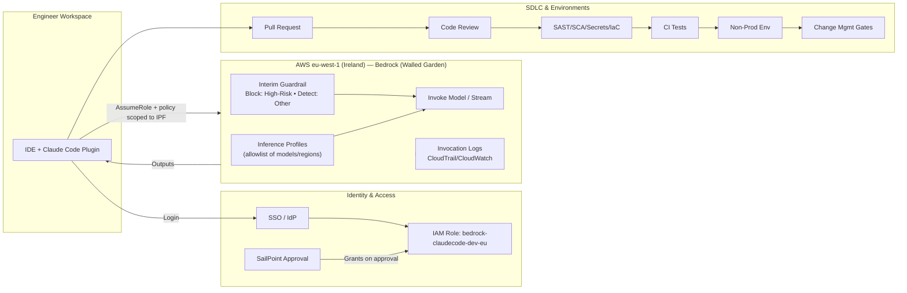
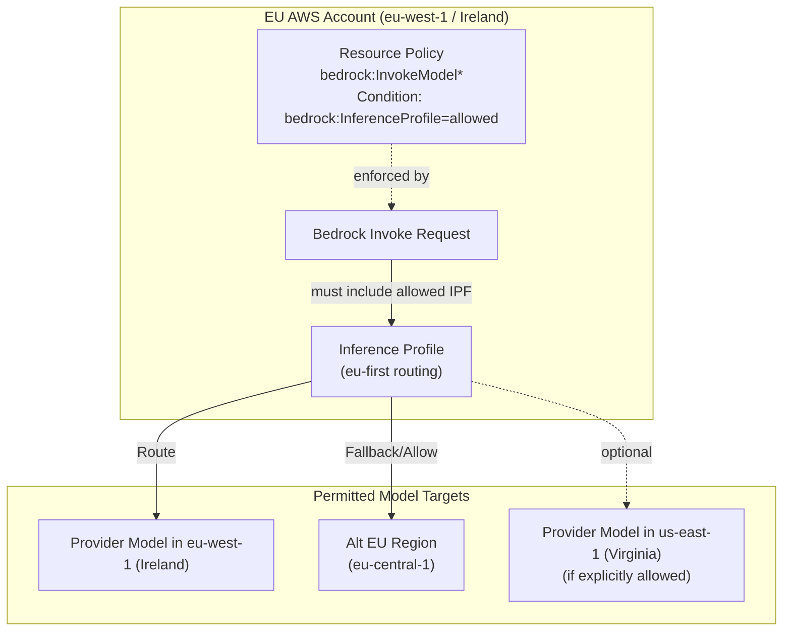
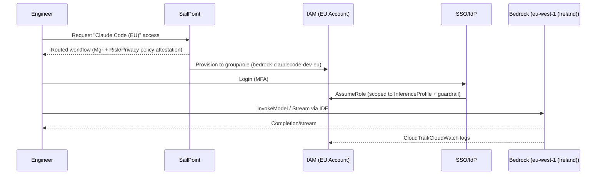
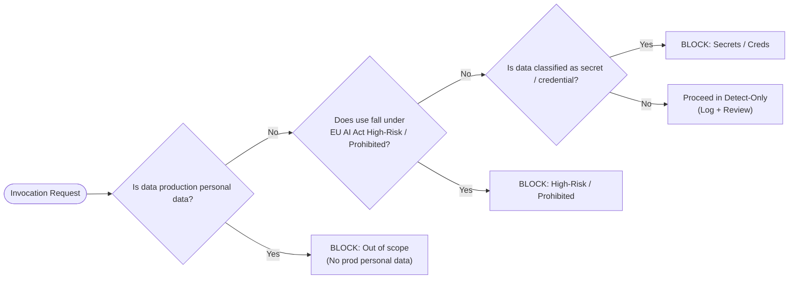
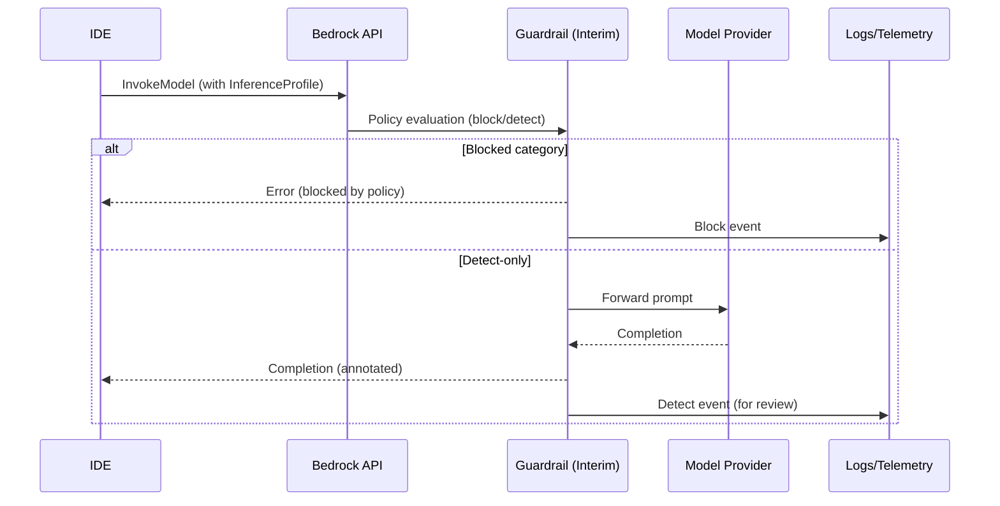
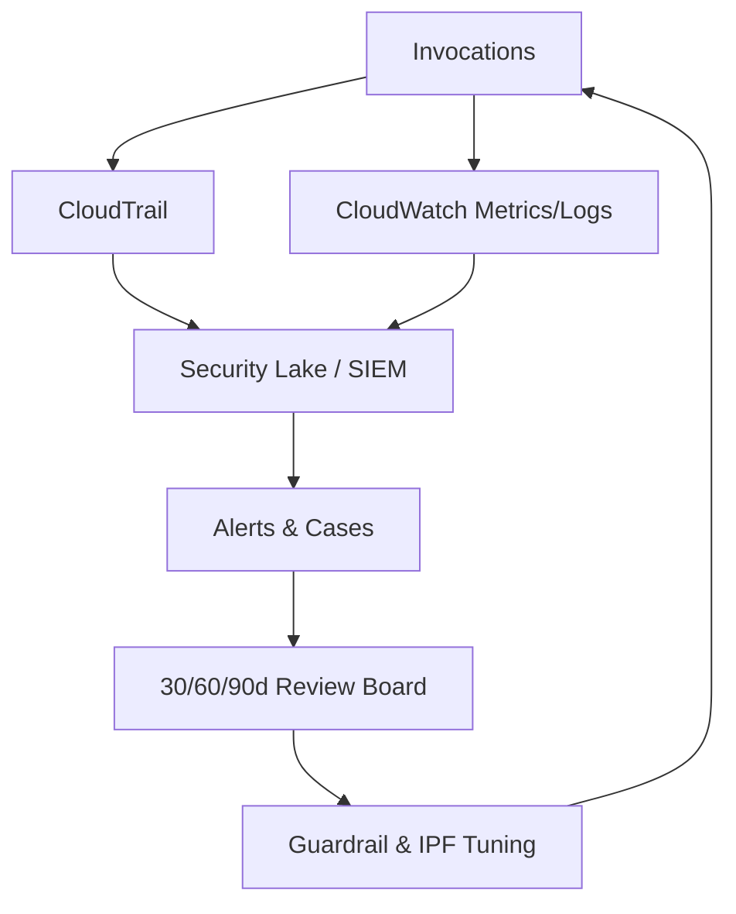
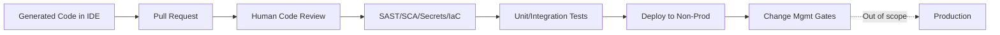
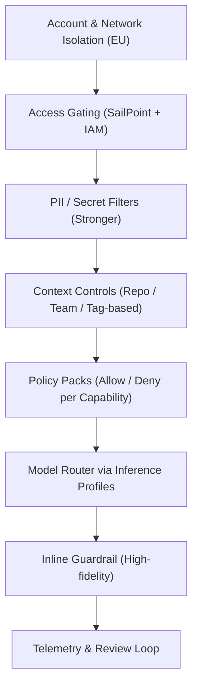
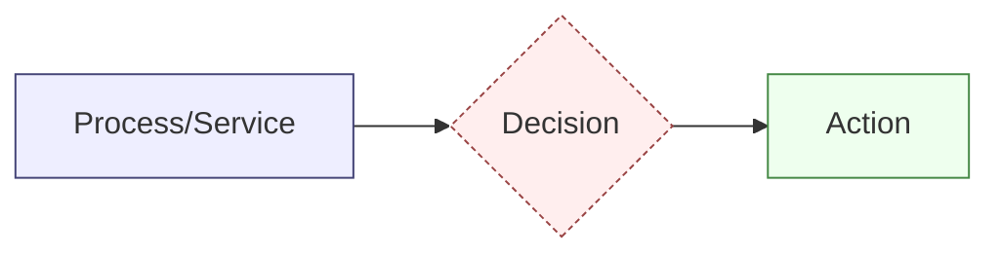

# Mermaid Diagrams — Claude Code Data Flows (EU)

> Context: Amazon Bedrock in **eu-west-1 (Ireland)**, **walled garden** models. Cross-Region **Inference Profiles** are used for model selection and routing.  
> Access to Bedrock is **gated by SailPoint** approval and enforced via **IAM roles** and scoped policies. Interim policy: **block EU AI Act high‑risk** categories; **detect‑only** elsewhere.

---

## 1) End-to-End Developer Assist Flow (Interim)

**Notes**
- The IDE calls Bedrock only **after** the user has SailPoint approval and assumes the scoped IAM role.  
- **Inference Profiles** restrict which models/regions can be used (e.g., EU-first, specific models).  
- **Interim guardrail** blocks high‑risk EU AI Act categories; all else is detect‑only with logging.

---

## 2) Cross-Region Inference Profiles (Routing & Control)

**Notes**
- Invocation **must** reference an **allowed Inference Profile**; IAM policy/conditions enforce this.  
- Profiles prefer EU targets; optional fallbacks are **explicitly configured** (or disallowed).

---

## 3) Access Gating: SailPoint → IAM → Bedrock

**Notes**  
- No access without **SailPoint** approval.  
- Role/session is **least‑privilege** and **profile‑bound**.

---

## 4) Interim Policy Decision Flow (Data & Use Classification)

**Notes**  
- Interim policy: **block** production personal data, **block** high‑risk/prohibited, **block** secrets/credentials; **detect‑only** otherwise.

---

## 5) Guardrail in the Invocation Path

**Notes**  
- Guardrail sits **inline** with invocation.  
- **Blocked** yields error + log; **detect‑only** passes through and logs for later review.

---

## 6) Telemetry, Review & Feedback Loop

**Notes**  
- Logs feed a central lake/SIEM; alerts are triaged; quarterly-ish tuning refines rules and profiles.

---

## 7) SDLC Flow for Generated Code (Non‑Prod Only)

**Notes**  
- **Human-in-the-loop** and **security scans** remain mandatory.  
- Production deployment is **explicitly out of scope** for the interim.

---

## 8) Future State: "Vibe Coding" Guardrail Layers (Preview)

**Notes**  
- Adds **context-aware** controls and **stronger PII filters** for any future production-data scenarios.

---

## 9) Legend

