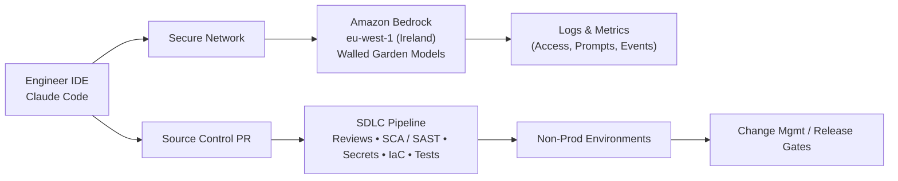
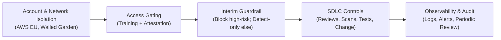

# Executive Proposal — Interim Guardrail for Claude Code (EU)

**Audience:** Executives, Legal, Compliance, Privacy, Risk  
**Company:** Our Firm (Europe)  
**Platform:** Amazon Bedrock in **EU region** — eu-west-1 (Ireland), models in a **walled garden** (enterprise-isolated, no public training on prompts/completions)  
**Scope (now):** Developer-assist coding **only** on **non‑production or synthetic data**

---

## 1) One‑Page Executive Summary

**Decision needed by 22 November 2025:** Approve an **interim, lightweight guardrail** for Claude Code in the EU so developers can start using it on **non‑production or synthetic data** within 2 weeks, while we design the longer‑term **“vibe coding” guardrail** for any future production‑data scenarios.

**Proposal (interim):**
- **Block**: EU AI Act **high‑risk** categories (and any prohibited uses) *as they might apply to a developer-assist tool*.
- **Detect‑only elsewhere**: log and alert for everything else; do not block.
- **Gated access** via **mandatory training** and **developer attestation**.
- **Normal SDLC controls** remain in force (code review, SCA/SAST, secrets/ IaC scanning, change control).

**Why low risk (short term):**
- **No production personal data** in scope.  
- **EU residency & isolation** in eu-west-1 (Ireland); **walled garden** models.  
- **Human‑in‑the‑loop**: all code passes through SDLC checks.  
- **Auditability**: access controls, logs, periodic reviews.

**Business risk of delay:** Every month without access reduces 2026 delivery velocity (lead‑time, throughput, talent retention). The **cost of delay** compounds; interim enablement unlocks value now while we build the fuller guardrail.

**Recommendation:** **Approve** interim guardrail now; launch within 2 weeks; run a 30/60/90‑day review; proceed in parallel on the “vibe coding” guardrail for any future production data use.

---

## 2) Use Case Walkthrough — “Vibe Coding” for Developers

**What it is:** “Vibe coding” is **context‑rich code assistance** in the IDE. It accelerates understanding, boilerplate creation, refactors, tests, docstrings, and small design iterations.  
**What it is not:** It is **not** autonomous deployment, not customer‑facing, and does **not** make decisions about individuals or entitlements.

**How this differs from application LLMs:**  
- **Developer‑assist (this proposal):** helps an engineer write code faster. Output is **reviewed**, **scanned**, and **tested** before use.  
- **Application LLMs:** run in production contexts, may **influence user outcomes** directly, and often require **stricter guardrails** and risk management.

**Narrative data flow:**

**Near‑term DO / DON’T**  
- **DO:** non‑prod/synthetic data; generate code/tests/docs; explore patterns; refactor safely.  
- **DON’T:** use production personal data; build features that make or inform customer decisions; bypass SDLC or controls; upload confidential secrets.

---

## 3) Policy Guardrail — Interim (Now) vs “Vibe Coding” (Next)

**Interim (Now):**
- **Block** where feasible for EU AI Act **high‑risk** categories (and prohibited uses), e.g. biometric identification; decisions impacting access to employment/credit/education; safety‑critical control; justice/law‑enforcement domains.  
- **Detect‑only elsewhere**: log/alert for review; do not block.

**Future “Vibe Coding” Guardrail (Outline):**
- Tuned allow/deny per repo/team; context filters; stronger PII controls if production data is ever in scope; configurable policies; higher‑fidelity detections.

**Layered controls model:**

---

## 4) Risk Assessment & Rating

**Assumptions (in scope):** Developer‑assist only; **no production personal data**; EU residency; human review; SDLC scanning; logs retained.

**Inherent vs Residual Risk (illustrative)**

| Risk Area | Inherent Likelihood | Inherent Impact | Key Mitigations | Residual Rating |
|---|---:|---:|---|---|
| Data leakage (PII/secrets) | Medium | High | No prod data; training+attestation; secrets scanning; EU isolation | **Low** |
| Malicious/unsafe code | Medium | Medium | Code review; SAST/SCA; policy patterns; detect‑only telemetry | **Low** |
| Licensing/IP contamination | Medium | Medium | Dependency policies; review; provenance checks | **Low‑to‑Medium** |
| Hallucinated vulnerabilities | Medium | Low | Tests, linters, reviews | **Low** |
| Regulatory misclassification | Low | High | Block high‑risk categories; detect‑only else; periodic review | **Low** |

**What would raise risk:** introducing production personal data; enabling customer‑impacting decisions; bypassing SDLC; turning off logging. These remain **out of scope**.

---

## 5) EU AI Act Alignment (Plain English)

Developer‑assist coding does **not** itself perform decisions affecting individuals. We **block** high‑risk categories and **prohibited uses** relevant to an IDE assistant, and run **detect‑only** for other uses with oversight. We maintain human control and SDLC checks; logs support audit and incident response.

**Simple alignment view:**

| Area | Relevance to Dev‑Assist | Interim Control | Residual Risk |
|---|---|---|---|
| Biometric identification | Not relevant | **Blocked** | None |
| Employment/credit/education decisions | Not relevant | **Blocked** | None |
| Safety‑critical control | Not relevant | **Blocked** | None |
| Customer‑facing decisioning | Out of scope | N/A | None |
| General code assistance | Core | Detect‑only + SDLC + logs | Low |

---

## 6) Data Protection & Residency

- All inference in **eu-west-1 (Ireland)** with **walled‑garden** models.
- Prompts/completions are **not used for public model training**.
- Access is least‑privilege; retention and log access are controlled; audit trails are available.

---

## 7) Access, Training, and Attestation

**Gating flow:** Training → Attestation → Access provision → Periodic re‑attestation. Breach = access removal and incident process.

**Sample attestation (plain language):**  
> I understand Claude Code is approved only for **non‑production or synthetic data**. I will not input production personal data or secrets. I will follow our secure coding standards and SDLC. I will not use the tool for customer‑impacting decisions or to bypass controls. I agree to monitoring and periodic review.

---

## 8) Business Impact & Options

**Option A — Recommended (Enable Now):** Approve interim guardrail and go live in **2 weeks**. Begin “vibe coding” guardrail design in parallel.  
**Option B — Wait:** Defer usage until the full guardrail is ready (months).

**Cost‑of‑delay considerations:** slower lead‑times and throughput, higher context‑switching costs, reduced developer satisfaction and retention, and missed 2026 planning outcomes. Interim enablement unlocks safe value now with **low residual risk**.

**KPIs to track:** lead time for changes, PR throughput, defect escape rate, time‑saved per PR, developer NPS, policy alert volume & disposition time.

---

## 9) Implementation Plan & Timeline

**T‑0 to T+2 weeks**
- **Week 0–1:** finalize interim block/detect rules; publish policy & FAQ.  
- **Week 1–2:** training rollout; attestation collection; access enablement; baseline dashboards.

**30/60/90‑day review**
- **30d:** utilization, alerts, early wins, friction points.  
- **60d:** refine detect rules; tune SDLC checks; confirm low residual risk.  
- **90d:** proposal draft for “vibe coding” guardrail (production‑data scenarios).

**Ownership:** Architecture (policy, enablement), Platform Eng (config, telemetry), Security (SDLC, scans), Privacy/Legal/Compliance/Risk (review & guidance), Engineering Managers (adoption).

---

## 10) Decision Ask

**Approve** the **interim guardrail** for **developer‑assist coding** on **non‑production/synthetic data** in eu-west-1 (Ireland), with high‑risk categories **blocked** and **detect‑only** for other uses, gated by **training + attestation**, and governed by existing **SDLC controls** and **audit logging**.  
**Target approval date:** **22 November 2025**.

---

## Appendices

### A. Guardrail Scope Table (Interim)

| Area | Example | Mode | Rationale |
|---|---|---|---|
| Prohibited/High‑risk (EU AI Act) | Biometric ID; employment/credit/education decisions; safety‑critical control; justice/law enforcement | **Blocked** | Outside purpose of dev‑assist; high regulatory risk |
| Secrets/credentials | API keys, tokens, passwords | **Blocked & Scanned** | Prevent leakage |
| Everything else (dev‑assist) | Boilerplate, refactors, tests, docs | **Detect‑only** | Preserve developer experience with oversight |

### B. Risk Matrix (5×5, Illustrative)

Likelihood: 1=Rare, 5=Almost Certain; Impact: 1=Negligible, 5=Severe  
- Inherent profile: around **(3,3)** without controls.  
- Residual profile with controls: around **(2,2)**.

### C. RACI (Interim Enablement)

| Activity | R | A | C | I |
|---|---|---|---|---|
| Policy & guardrail design | Arch | Head of Arch & Platform (EU) | Security, Privacy, Legal, Risk | Eng Managers |
| Platform configuration | Platform Eng | Head of Arch & Platform (EU) | Security | Devs |
| SDLC controls | Security | CISO/Delegates | Arch, Platform | Devs |
| Training & attestation | Arch Enablement | Head of Arch & Platform (EU) | HR/L&D, Legal, Privacy | Eng Managers |
| Monitoring & review | Platform Eng | Head of Arch & Platform (EU) | Security, Risk, Privacy | Execs |

### D. Training Outline (30–45 minutes)

1. Policy overview & scope (non‑prod/synthetic; no PII; purpose).  
2. EU AI Act primer (prohibited vs high‑risk; how it applies to dev‑assist).  
3. Safe prompting & examples (do/don’t).  
4. SDLC checkpoints that still apply.  
5. Attestation & acceptable use; incident reporting.  
6. FAQ & support channels.

---

*Prepared by the Head of Architecture & Platform Engineering (Europe) — 8 November 2025*
