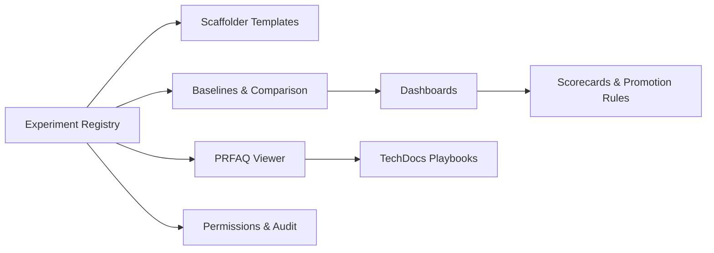

# Product architecture and capability map

We organise the hub as a small product with a few clear capabilities.

## Capability map

**Capabilities**
- **Experiment Registry**: Backstage `Experiment` entities with owner, dates, links.
- **Scaffolder Templates**: one click to create a repo folder with PRFAQ, baselines, Actions.
- **PRFAQ Viewer**: render the one‑page plan in Backstage.
- **Baselines & Comparison**: read CSVs from GitHub; show deltas.
- **Dashboards**: basic charts; Power BI link if needed.
- **Scorecards**: baseline present; three measures; comparison recorded; policies referenced.
- **TechDocs**: playbooks and hub guidance.
- **Permissions**: promotion to “scale” requires two of Architecture, Risk, Product.

**Users**
- Experiment Leads (pods)
- Evidence Lead (metrics)
- Architecture / Risk / Product (promotion decisions)
- AI Enablement (templates, scorecards)
