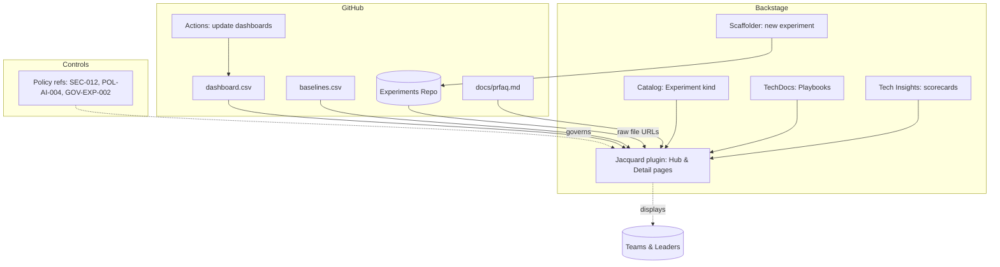

# Solution architecture

**Data flows**
- File‑based for MVP: CSVs and PRFAQ in GitHub; Backstage reads raw URLs.
- Actions update `dashboard.csv` on push.
- Optional phase 2: small ingestion API for posting results to Backstage.

**Boundaries**
- No PII leaves systems of record.
- GitHub remains source of truth for artefacts and evidence.

Related decisions: [[05_ADRs/ADR-002_File_Based_Telemetry_MVP]].
