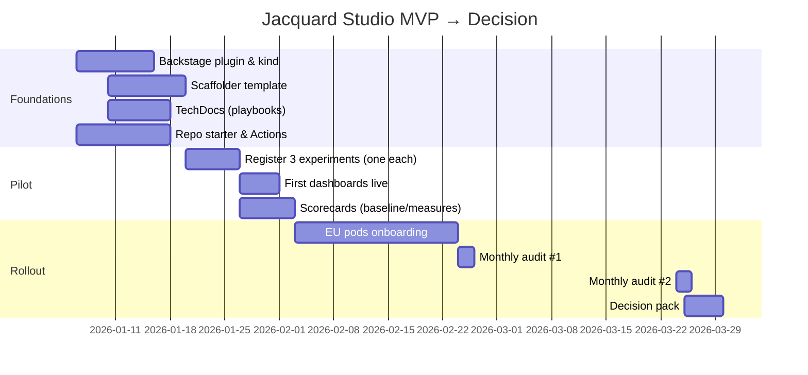

# Design and delivery

## Timeline (MVP to decision)

## Milestones
- 31 Jan 2026: MVP live; first three experiments registered.
- 28 Feb 2026: All new EU experiments using PRFAQ and baselines.
- 31 Mar 2026: Decision to scale or adjust.

## Deliverables
- Plugin and templates published.
- Three PRFAQ examples (one per category).
- Baseline and dashboard CSVs populated.
- Scorecards visible in Backstage.

## Dependencies
- Backstage access; GitHub org permissions; policy IDs available.

## Acceptance
- ≥85% baseline coverage; ≤7 days median time to first result; ≥75% comparison completeness; no rise in change‑fail.

## Communication
- Kick‑off note; weekly progress in Backstage; monthly summary to HOC.
