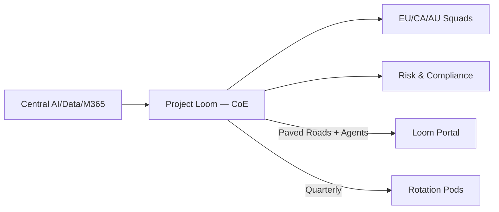

# Project Loom — AI Enablement CoE (International)
*Weave patterns into products.*

> [!info] How to use this page
> Start here for the story and quick links. Human-first, engineering-forward.

## Table of Contents
| Page | Link | Owner | Status | Last review |
|---|---|---|---|---|
| Exec Overview | [[00_Exec_Overview]] | Head of A&PE (International) | draft | 2025-10-18 |
| CoE Charter | [[01_CoE_Charter]] | Head of A&PE (International) | draft | 2025-10-18 |
| Team & Roles | [[02_Team_and_Roles]] | Head of A&PE (International) | draft | 2025-10-18 |
| Operating Model | [[03_Operating_Model]] | Head of A&PE (International) | draft | 2025-10-18 |
| Projects: Gateway / Evidence / Patterns | [[04_Projects_Gateway_Evidence_Patterns]] | Loom Architect | draft | 2025-10-18 |
| Loom Portal | [[05_Loom_Portal]] | Evangelist — Process | draft | 2025-10-18 |
| Rotation Pods | [[06_Rotation_Pods]] | Loom Sol/Bus Architect | draft | 2025-10-18 |
| Experiments Registry | [[07_Experiments_Registry]] | Loom Architect | draft | 2025-10-18 |
| Agent Catalog | [[08_Agent_Catalog]] | Loom Engineers | draft | 2025-10-18 |
| M365 PO Playbook | [[09_M365_PO_Playbook]] | Intl M365 PO | draft | 2025-10-18 |
| OKRs & KPIs | [[10_OKRs_and_KPIs]] | Head of A&PE (International) | draft | 2025-10-18 |
| Roadmap & Timeline | [[11_Roadmap_and_Timeline]] | Loom PO/PM | draft | 2025-10-18 |
| Governance & RACI | [[12_Governance_and_RACI]] | Head of A&PE (International) | draft | 2025-10-18 |
| Brand & Codenames | [[13_Brand_Codenames]] | Loom PO/PM | draft | 2025-10-18 |
| Fluency & Hybrid Org | [[14_Fluency_and_Hybrid_Org]] | Loom Sol/Bus Architect | draft | 2025-10-18 |
| Pre-Charter (Q4 2025) | [[15_PreCharter_Q4_2025]] | Head of A&PE (International) | draft | 2025-10-18 |

## The short version
- **Problem:** International (EU/CA/AU) gets AI features N+1; EU AI Act and data residency slow delivery; Backstage isn’t the on-ramp it should be.
- **Move:** Stand up **Project Loom**—a small **AI Enablement CoE** that ships **paved roads** (Gateway Blueprint, Evidence Assistant, Patterns Library, and a rebooted **Loom Portal**).
- **How:** Work like an **incubation lab**—ship exemplars, keep guardrails in code, and run **Rotation Pods** so engineers learn by doing.
- **Outcome (2026):** Time‑to‑pilot ↓50%, intl‑ready at GA ≥80%, compliance lead‑time ↓40%.

