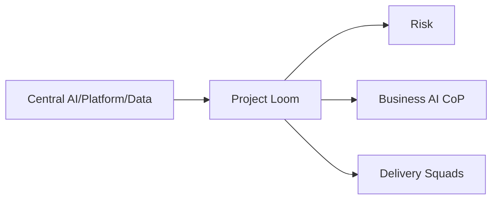

> [!info] How to use this page
> Clear scope, clear lanes, fast engagement.

## Mission & ethos
**Make the right thing the fast thing.** Ship international‑ready AI, safely and repeatably.

## Scope
- **In:** Gateway Blueprint, Evidence Assistant, Patterns Library, Loom Portal, Experiments Registry, Rotation Pods, M365 AI adoption support.
- **Out:** Owning enterprise data governance or model risk (we integrate and automate their evidence).

## Engagement model
- **Self‑serve:** templates, labs, docs.
- **Assisted:** onboarding, workshops, short embeds.
- **Embedded:** time‑boxed delivery to unblock or land exemplars.

## Service catalog (v1)
Gateway Blueprint · Evidence Assistant · Patterns Library · Loom Portal templates · Experiments Registry · Rotation Pods · Copilot cohort support.

## Interfaces
Central AI/Data/M365 · Risk/Compliance · Business AI CoP · Intl CTOs.

## SLAs/SLOs
- Intake triage ≤ **5 business days**
- Assisted onboarding ≤ **2 weeks**
- Evidence‑pack turnaround targets by risk class

## RACI (high level)
- Standards & blueprints (**R:** Architect)
- Evidence & triage (**R:** Solutions/Business Architect; **A:** Risk)
- Templates & DevEx (**R:** Evangelist – Process)
- Reviews & maturity (**R:** Evangelist – Technical)
- Data controls & monitoring (**R:** Data/ML)

## Risks & mitigations
Scope creep → PO gating, OKRs · Tool sprawl → supported matrix & deprecation · Data residency → gateway enforcement + redaction + audit
