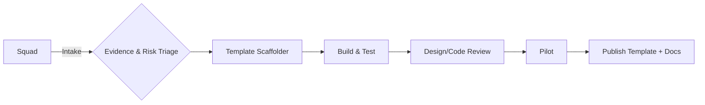

> [!info] How to use this page
> Day‑to‑day, predictable, boring in the right ways.

## Tenets
AI‑First · Fast & Safe · Federated not fragmented · Facts over opinions · Frictionless DevEx

## Cadence
Weekly Intake Clinic · Bi‑weekly Standards Forum · Monthly Exec Review · Office Hours · Monthly Showcase

## Ways of working
- Embed upstream with central teams so **intl‑ready at GA** is normal.
- Keep guardrails in code (templates, CI checks, telemetry).
- Run **Rotation Pods** quarterly; graduates become champions.

