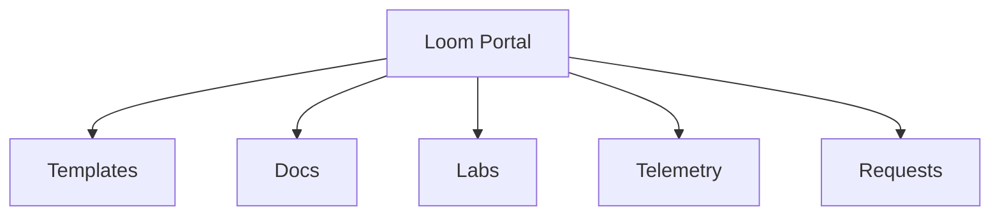

> [!info] How to use this page
> The front door to paved roads.

## Information architecture
Templates · Components · Docs · Labs · Telemetry · Requests

## Must‑haves
- Scaffolder templates mapped to **Gateway / Patterns / Evidence**.
- TechDocs and “copy‑this‑repo” starters.
- Built‑in adoption metrics and cost/latency dashboards.

## Backlog
- [ ] Telemetry plugin
- [ ] Template quality badges
- [ ] SSO with identity pass‑through
- [ ] Sandbox buttons for labs
