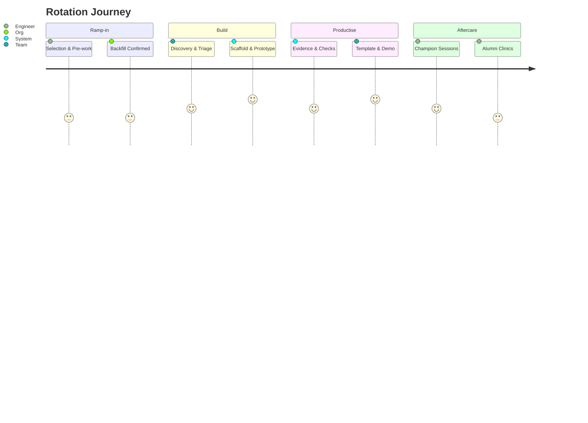

> [!info] How to use this page
> This is a bootcamp, not a side‑of‑desk. The outcome is a pilot you can point at.

## What good looks like (per quarter)
- 1 production‑candidate pilot
- 1 reusable template in the Portal
- Evidence pack + intl‑ready checks
- Teach‑back + badge + 90‑day adoption plan

