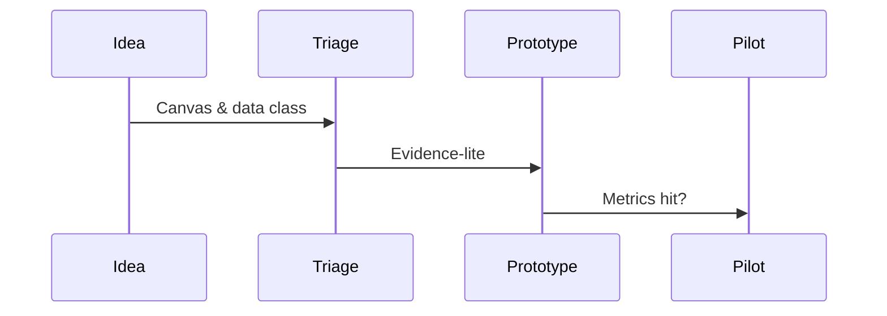

> [!info] How to use this page
> Keep experiments tidy and honest.

## Fields
Hypothesis · Owner · Data class · Risk class · Start/End · Metrics · Decision (Scale/Iterate/Stop)

```mermaid
sequenceDiagram
  participant Idea as Idea
  participant Triage as Triage
  participant Proto as Prototype
  participant Pilot as Pilot
  Idea->>Triage: Canvas & data class
  Triage->>Proto: Evidence‑lite
  Proto->>Pilot: Metrics hit?
```
