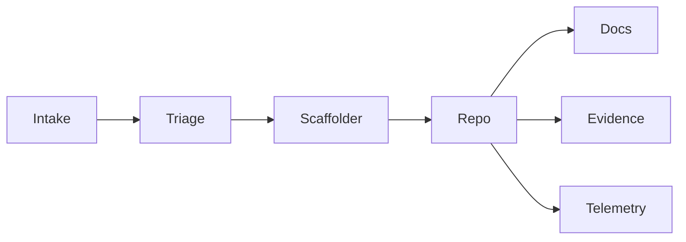

> [!info] How to use this page
> The internal helpers that let a small team move like a big one.

## Agents
- **Triage** — asks the right questions; files tickets.
- **Scaffolder** — spins up repos, CI, policies.
- **Evidence** — compiles DPIA/model cards/lineage.
- **Docs** — TechDocs, ADRs, runbooks.
- **Telemetry** — tracing, SLOs, cost per 1k tokens.
- **Standards Watcher** — suggests diffs to blueprints.
- **Adoption Coach** — nudges on checklists and training.

