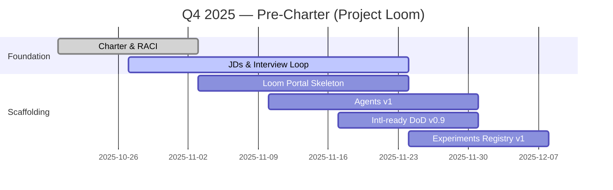

> [!info] How to use this page
> Do these now so 2026 starts fast and clean.

## Decisions to lock
Hybrid model; placement under A&PE; scope boundaries; funding model; principles; draft OKRs.

## Deliverables (by Dec 2025)
Charter & RACI · JDs & interview loop · Loom Portal skeleton · Agents v1 (Triage/Scaffolder) · Experiments Registry v1 · Intl‑ready DoD v0.9 · M365 PO handshake · Baseline telemetry.

## Rhythms to start
Intake Clinic · Standards Forum · Exec Brief · Office Hours · Monthly Showcase

