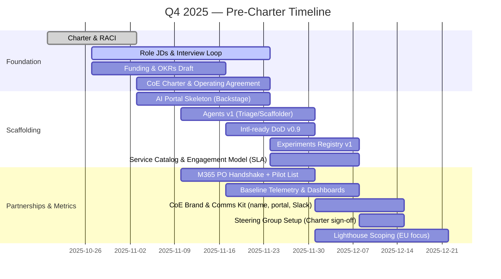
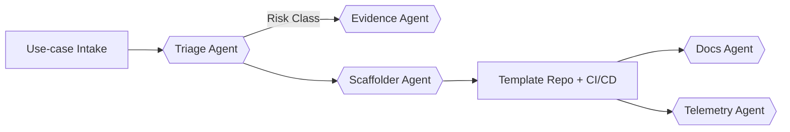
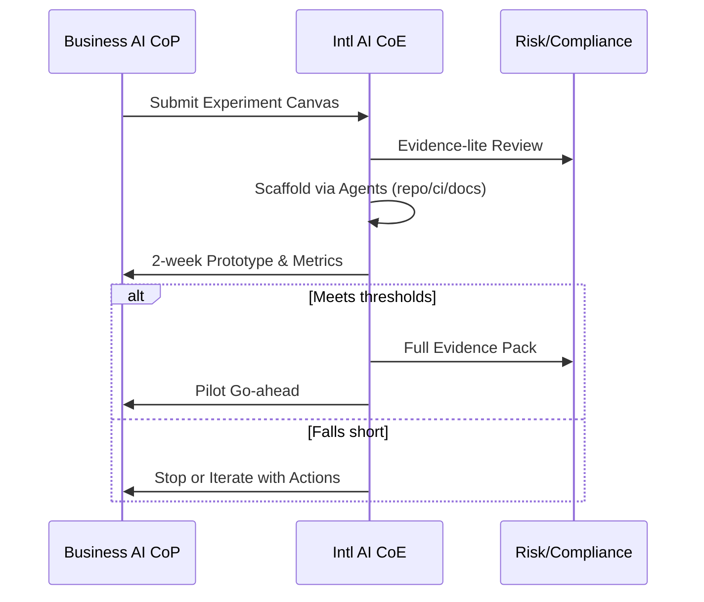
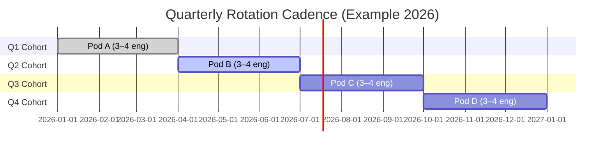
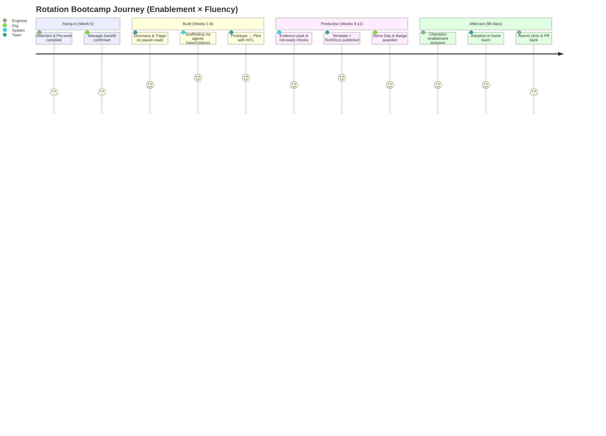

# AI Enablement 2026 — International Supplement (International BU)

> **Audience:** Global CIO, Enterprise AI Council, International CTOs  
> **Author:** Head of Architecture & Platform Engineering (International)  
> **Purpose:** Extend the 2025 AI Enablement proposal with a 2026 operating model that places **boots‑on‑the‑ground** in International (EU, Canada, Australia), defines roles and ROI, and codifies an **AI‑driven team from Day 1**.

---

## 1) Executive Overview

- We will evolve the 2025 **AI Enablement CoE** into an **International operating model** with regional presence.
    
- The team will be **AI‑driven from Day 1**: using agentic workflows, Copilots (GitHub/Claude/M365), and internal agents to automate intake, scaffolding, documentation, and compliance evidence.
    
- We propose a **hybrid resourcing model**: shared International playbooks + **EU‑based regulatory & data specialists** for local nuance; optional Canada/Australia additions as demand and regulation require.
    

**2026 Outcomes (headline):**

- **Time‑to‑pilot ↓ 50%**; **International‑ready at GA ≥ 80%** for enterprise AI capabilities.
    
- **Compliance lead‑time ↓ 40%** via automatic evidence packs.
    
- **Delivery team autonomy ↑** through self‑serve paved roads; CoE shifts toward **emerging tech & standards**.
    
- **TCO ↓ 10–15%** for AI initiatives via reuse, guardrails‑as‑code, and reduced rework.
    

### Table of Contents

|Section|Link|
|---|---|
|1) Executive Overview|[Go](https://chatgpt.com/g/g-p-6867e276dc6481919297b42895b11f70/c/68d44434-518c-8325-a2e6-12ece2de303f#1-executive-overview)|
|1A) Q4 2025 Pre‑Charter — Setup for Success|[Go](https://chatgpt.com/g/g-p-6867e276dc6481919297b42895b11f70/c/68d44434-518c-8325-a2e6-12ece2de303f#1a-q4-2025-pre-charter--setup-for-success)|
|2) Why Local Presence (International) — Business Case|[Go](https://chatgpt.com/g/g-p-6867e276dc6481919297b42895b11f70/c/68d44434-518c-8325-a2e6-12ece2de303f#2-why-local-presence-international--business-case)|
|3) Team Charter (2026)|[Go](https://chatgpt.com/g/g-p-6867e276dc6481919297b42895b11f70/c/68d44434-518c-8325-a2e6-12ece2de303f#3-team-charter-2026)|
|4) Roles & Responsibilities (clarified for 2026)|[Go](https://chatgpt.com/g/g-p-6867e276dc6481919297b42895b11f70/c/68d44434-518c-8325-a2e6-12ece2de303f#4-roles--responsibilities-clarified-for-2026)|
|5) AI‑Driven from Day 1 — Operating Model & Tooling|[Go](https://chatgpt.com/g/g-p-6867e276dc6481919297b42895b11f70/c/68d44434-518c-8325-a2e6-12ece2de303f#5-ai-driven-from-day-1--operating-model--tooling)|
|6) Experiments: Registry & Lifecycle|[Go](https://chatgpt.com/g/g-p-6867e276dc6481919297b42895b11f70/c/68d44434-518c-8325-a2e6-12ece2de303f#6-experiments-registry--lifecycle)|
|7) Value, ROI & TCO (Executive View)|[Go](https://chatgpt.com/g/g-p-6867e276dc6481919297b42895b11f70/c/68d44434-518c-8325-a2e6-12ece2de303f#7-value-roi--tco-executive-view)|
|8) Goals & OKRs (2026)|[Go](https://chatgpt.com/g/g-p-6867e276dc6481919297b42895b11f70/c/68d44434-518c-8325-a2e6-12ece2de303f#8-goals--okrs-2026)|
|8A) Enterprise Initiatives Alignment — AI Fluency & the Hybrid AI‑Human Org|[Go](https://chatgpt.com/g/g-p-6867e276dc6481919297b42895b11f70/c/68d44434-518c-8325-a2e6-12ece2de303f#8a-enterprise-initiatives-alignment--ai-fluency--the-hybrid-ai-human-org)|
|8B) Quarterly Engineer Rotation Program — Extended AI Pods (3–4 engineers)|[Go](https://chatgpt.com/g/g-p-6867e276dc6481919297b42895b11f70/c/68d44434-518c-8325-a2e6-12ece2de303f#8b-quarterly-engineer-rotation-program--extended-ai-pods-3%E2%80%934-engineers)|
|8B.1) Outcomes & Expectations (Enablement × Fluency Bootcamp)|[Go](https://chatgpt.com/g/g-p-6867e276dc6481919297b42895b11f70/c/68d44434-518c-8325-a2e6-12ece2de303f#8b1-outcomes--expectations-enablement--fluency-bootcamp)|
|8B.2) 2025 Pre‑Work — Rotation Program Framework|[Go](https://chatgpt.com/g/g-p-6867e276dc6481919297b42895b11f70/c/68d44434-518c-8325-a2e6-12ece2de303f#8b2-2025-pre-work--rotation-program-framework)|
|8B.3) Certification, Recognition & Comms|[Go](https://chatgpt.com/g/g-p-6867e276dc6481919297b42895b11f70/c/68d44434-518c-8325-a2e6-12ece2de303f#8b3-certification-recognition--comms)|
|9) Governance & Placement (Why under Architecture & Platform Engineering)|[Go](https://chatgpt.com/g/g-p-6867e276dc6481919297b42895b11f70/c/68d44434-518c-8325-a2e6-12ece2de303f#9-governance--placement-why-under-architecture--platform-engineering)|
|10) Phase‑in Plan (2026 → 2027)|[Go](https://chatgpt.com/g/g-p-6867e276dc6481919297b42895b11f70/c/68d44434-518c-8325-a2e6-12ece2de303f#10-phase-in-plan-2026--2027)|
|Appendix A — RACI (International)|[Go](https://chatgpt.com/g/g-p-6867e276dc6481919297b42895b11f70/c/68d44434-518c-8325-a2e6-12ece2de303f#appendix-a--raci-international)|
|Appendix B — Glossary|[Go](https://chatgpt.com/g/g-p-6867e276dc6481919297b42895b11f70/c/68d44434-518c-8325-a2e6-12ece2de303f#appendix-b--glossary)|

---

### 1B) Project Loom Branding — Name, Tagline, Tone

**Name:** **Project Loom — AI Enablement CoE (International)**  
**Tagline:** _Weave patterns into products._

**Why Loom:** Our job is to turn patterns into shippable products, not slideware. Loom is a plain‑English signal to crews: we build reusable patterns and make them easy to launch.

**Naming conventions (keep it descriptive):**

- **Gateway Blueprint** — secure path to LLMs/tools (identity pass‑through, region toggle, logging, DPIA hooks)
    
- **Evidence Assistant** — EU AI Act triage → evidence‑as‑code
    
- **Patterns Library** — agentic exemplars (RAG+tools, planner/executor, batch)
    
- **Loom Portal** — Backstage front door for templates, docs, telemetry
    
- **Rotation Pods** — quarterly 3–4 engineer bootcamps delivering real pilots
    

**Tone of voice (human, engineering‑first):**

- Speak like an engineer explaining to another engineer. Fewer buzzwords, more steps and results.
    
- Default to verbs and numbers: what changed, by how much, how to reproduce.
    
- Use our mantra: **“Guardrails, not gates.”**
    

**Visual cues (lightweight):**

- Simple mono/graphite palette; a subtle weave motif in headers.
    
- Standard header: `Project Loom | <Section>`.

### 1A) Q4 2025 Pre‑Charter — Setup for Success

**Purpose:** Use the remainder of 2025 to establish mandate, scaffolding, and proof points so the 2026 International AI Enablement model launches at speed.

#### A) Decisions to lock in (Q4 2025)

- **Operating model:** Confirm **Hybrid** resourcing (EU‑dedicated regulatory/data roles + shared evangelists) and revisit Q3 2026.
    
- **Placement:** Team sits under **Architecture & Platform Engineering (International)**; interfaces formalised with Central AI, Data, and M365.
    
- **Scope boundaries:** Enablement (gateways, patterns, agents, experiments) ✚ Business CoP partnership; **no** central ownership of model risk or data governance (we integrate with those owners).
    
- **Funding model:** Core team centrally funded; adoption work embedded to LOBs; shared chargeback for prolonged embeds.
    
- **Principles & ethos:** Adopt the **5×F** principles and ethos (_Make the right thing the fast thing_).
    
- **Draft 2026 OKRs:** Socialise and agree provisional targets (see §8).
    

#### B) Concrete deliverables by Dec 2025

- **1‑pager Charter** (mission, scope, interfaces, funding, success criteria) and **RACI**.
    
- **Role scorecards & JDs** (AI Architect L5; Sol/Bus Architect L4‑L5; Evangelists ×2; Data/ML Eng; Intl M365 PO).
    
- **Hiring & interview loop** (panels, case study, hands‑on task); identify internal candidates.
    
- **Backstage AI Portal skeleton** (catalog, TechDocs, scaffolder, policies) and **“International‑ready DoD v0.9”.**
    
- **Agents v1:** **Triage** + **Scaffolder** (non‑prod), wired to template repos and CI/CD.
    
- **Experiments Registry v1** (Backstage plugin or table) with “Scale / Iterate / Stop” governance.
    
- **M365 Product Ownership handshake** with Central M365 (intake rubric, triage gates, pilot pipeline).
    
- **Baseline telemetry:** time‑to‑pilot, adoption NPS, cost/1k tokens, latency SLOs.
    

#### C) Operating rhythms to start now

- **Weekly Intake Clinic** (with Business AI CoP).
    
- **Bi‑weekly Standards Forum** (guardrails, design reviews).
    
- **Monthly Exec Brief** (status, risks, metrics).
    
- **Office Hours** (dev enablement); **Monthly Showcase** (lighthouse demos).
    

#### D) Lighthouse pipeline for Jan–Feb 2026

- **EU Adviser Meeting Copilot** (notes→actions→CRM).
    
- **Ops Reconciliation Agent** (trade breaks triage).
    
- **Marketing Compliance Assistant** (claims pre‑check, evidence bundle).  
    Each with clear value hypotheses, data classification, and success metrics.
    

#### E) Day‑1 AI usage during setup

- **GitHub Copilot / Claude Code:** Draft JDs, scaffolder code, CI policies, PR summaries, test generation.
    
- **M365 Copilot:** Charter drafts, steering minutes → actions, comms packs, stakeholder maps.
    
- **Agents:** Use **Triage** to structure new asks; **Scaffolder** to create PoC repos with telemetry & policy boilerplate.
    



#### F) CoE Formation & Definition (Q4 2025)

**Goal:** Formally stand up the **International AI Enablement CoE** and make it unambiguous what it **is**, **is not**, and **how to engage**.

**Define the CoE**

- **Mission & Scope:** International‑ready AI standards, paved roads, agents, experiments, rotation pods, and M365 AI adoption.
    
- **Out‑of‑scope:** Owning model risk management or enterprise data governance (we **integrate** with those owners).
    
- **CoE vs CoP:** CoE = **central standards & enablement hub**; CoP = **business community** (ideas, champions, adoption).
    
- **Interfaces:** Central AI/Platform/Data (standards & control planes), Risk/Compliance (evidence‑as‑code), Business AI CoP (intake & prioritisation).
    

**Operating Agreement (with Central teams)**

- **RASCI** at a stream level; **escalation paths**; **backlog handshake** cadence; artifact ownership (templates, policies, labs).
    
- **Data/AI Controls Alignment:** how International‑ready DoD maps to central controls.
    

**Service Catalog (v1)**

- **Self‑serve** templates & labs; **assisted** onboarding; **embedded** engineering (time‑boxed); **M365 PO** engagement; **rotation pods**.
    
- Publish **SLA/SLOs** (intake triage ≤ 5 biz days; assisted onboarding ≤ 2 weeks; evidence‑pack turnaround targets).
    

**Engagement Model**

- Three lanes (self‑serve / assisted / embedded), **intake rubric**, and prioritisation criteria (value, risk, data).
    
- Standard **“Definition of Ready”** for squads; artifacts required; sample timelines.
    

**Governance**

- **Steering Group:** Intl Head A&PE (chair), Central AI, Data Gov, Risk, Business AI CoP.
    
- **Forums:** Weekly Intake Clinic; Bi‑weekly Standards Forum; Monthly Exec Review.
    
- **Metrics:** Align to OKRs (time‑to‑pilot, Intl‑ready at GA, template adoption, audit findings=0).
    

**Minimum Viable Org (MVO)**

- AI Architect (lead), Sol/Bus Architect, Evangelist (process), Evangelist (technical), Data/ML (optional), M365 PO (optional); **hiring sequence** defined.
    

**Brand & Comms**

- CoE **name & tagline**; AI Portal landing page; Slack channel; Quarterly roadshow plan.
    

```mermaid
flowchart LR
  Central[Central AI / Platform / Data] --> CoE[International AI Enablement CoE]
  CoE --> Regions[EU / CA / AU Squads]
  CoE --> Risk[Risk & Compliance]
  CoP[Business AI CoP] --> CoE
  M365[Central M365] --> M365PO[Intl M365 Product Owner]
  M365PO --> CoE
  CoE --> Portal[AI Portal (Backstage)]
```

#### G) Risk & dependency checklist

- **Licensing:** Copilot/Claude Code/M365 Copilot seats provisioned for core team.
    
- **Security/Compliance:** Gateway routing, identity pass‑through, data boundary enforcement for agents; privacy review for registry.
    
- **Central alignment:** Confirm joint backlogs with Central AI, Data Governance, and M365; agree escalation paths.
    
- **Change & Comms:** Launch Slack channel, Confluence/Docs space, quarterly roadshow schedule.
    

#### H) Pre‑Charter statement

> **We will launch the International AI Enablement capability in 2026 with a hybrid model and an AI‑first operating rhythm.** In Q4 2025 we will establish mandate, scaffolding, and early proofs (agents v1, AI Portal skeleton, registry, Intl‑ready DoD) **and formally incorporate the CoE with an operating agreement, service catalog, and engagement model**, then line up three lighthouses for Q1 2026 to demonstrate value, compliance, and reuse.

---

## 2) Why Local Presence (International) — Business Case

#### F) Risk & dependency checklist

- **Licensing:** Copilot/Claude Code/M365 Copilot seats provisioned for core team.
    
- **Security/Compliance:** Gateway routing, identity pass‑through, data boundary enforcement for agents; privacy review for registry.
    
- **Central alignment:** Confirm joint backlogs with Central AI, Data Governance, and M365; agree escalation paths.
    
- **Change & Comms:** Launch Slack channel, Confluence/Docs space, quarterly roadshow schedule.
    

#### G) Pre‑Charter statement

> **We will launch the International AI Enablement capability in 2026 with a hybrid model and an AI‑first operating rhythm.** In Q4 2025 we will establish mandate, scaffolding, and early proofs (agents v1, AI Portal skeleton, registry, Intl‑ready DoD) and line up three lighthouses for Q1 2026 to demonstrate value, compliance, and reuse.

---

## 2) Why Local Presence (International) — Business Case

**Drivers:**

1. **Regulatory divergence & cadence** — EU AI Act (and UK/EU data rules), Canadian privacy, and Australian guidance differ in definitions, disclosure, and audit. Local experts **translate policy → controls** quickly.
    
2. **Proximity to product & customers** — Faster iteration with regional squads, advisors, and operations teams; local language and cultural context improve adoption.
    
3. **Time‑zone coverage** — Lower latency for unblockers; better alignment with regional platform/data teams and regulators.
    
4. **Enterprise alignment** — International staff **embed** in central backlogs to make **International‑ready by default**.
    

**Resourcing Model Options**

|Model|Description|Pros|Cons|When to choose|
|---|---|---|---|---|
|**EU‑dedicated**|EU‑based roles (architect, consultant, evangelist, data/ML)|Strongest regulatory fit; fastest EU throughput; clearer LOB alignment|Higher regional cost; replicate for CA/AU later|EU is the largest International demand center or earliest regulatory pressure|
|**Shared International**|Pool across EU/CA/AU; follow‑the‑sun support|Cost efficiency; consistent standards; elastic coverage|Diluted regional focus; context switching; slower regulatory iteration|Balanced demand; lower individual region volume|
|**Hybrid (recommended)**|EU‑dedicated **regulatory & data controls** + shared evangelists/templates across International|Regulatory precision + reuse at scale|Requires disciplined prioritisation|Most realistic for 2026 volumes|

---

## 3) Team Charter (2026)

### Founding Ethos

**Make the right thing the fast thing.** We turn compliant, international‑ready AI into the easiest path to business value—so teams ship faster with higher trust and lower risk.

### Team Principles (the “5×F”)

1. **AI‑First — work smarter, not harder.** Automate wherever safe and useful; put agents and copilots in the loop for intake, scaffolding, documentation, evidence, and telemetry.
    
2. **Fast & Safe by Default.** Guardrails over gates: compliance‑as‑code, identity pass‑through, data boundaries, provenance, and audit baked into every template.
    
3. **Federated, not Fragmented.** Central standards and paved roads; decentralised delivery with clear ownership; **International‑ready at GA** across EU/CA/AU.
    
4. **Facts over Opinions.** Evidence‑as‑code and measurable outcomes (time‑to‑pilot, reliability SLOs, cost/1k tokens, adoption NPS) drive decisions.
    
5. **Frictionless DevEx.** The paved road must be the best road: one‑click templates, docs‑as‑code, and responsive enablement with transparent telemetry.
    

**Mission:** Make **International‑ready AI** the default, accelerate compliant adoption, and **industrialise experiments** into repeatable paths.

**Scope:**

- **Maintain and govern AI experiments** (registry, status, owners, ethics/compliance flags, kill/scale decisions).
    
- **Operate as an AI‑driven team**—automate intake, scaffolding, docs, evidence, and telemetry with agents.
    
- **Co‑own International backlogs** for enterprise AI gateways, agent orchestration, data governance controls, and M365 AI adoption.
    

```mermaid
flowchart LR
  Central[Central AI/Platform/Data Teams] -->|Roadmaps & Releases| IntlCoE[International AI Enablement CoE]
  IntlCoE -->|Paved Roads, Agents, Templates| Regions[EU / CA / AU Delivery Squads]
  IntlCoE -->|Experiment Registry & Evidence| Risk[Risk & Compliance]
  M365[Central M365 Team] -->|Tools & Policies| IntlPO[Intl Product Owner (M365/AI)]
  IntlPO --> Regions
  IntlPO --> Risk
```

---

## 4) Roles & Responsibilities (clarified for 2026)

### 4.1 AI Architect (L5)

- **Owns** International AI reference architecture (MCP/LLM gateways, identity pass‑through, data boundaries, observability).
    
- **Chairs** standards forum; aligns with enterprise control planes (AWS Bedrock/Azure OpenAI).
    
- **Curates** agentic patterns; **approves** high‑risk designs; sets **International‑ready DoD**.
    

**Value/ROI:** Avoids rework and audit findings; increases reuse. _Assumption:_ 10 squads × 2 weeks saved = ~20 sprint‑weeks/yr (≈ 2–3 FTE).

### 4.2 Solutions Consultant / Business Architect (L4–L5)

- **Owns intake → value cases → prioritisation**, partnering with Business AI CoP & central M365.
    
- **Decides** compliance pathway (lite vs full) with Risk; prepares **exec‑ready business cases**.
    
- **Orchestrates** discovery sprints; defines adoption OKRs.
    

**Value/ROI:** Focuses portfolio on high‑value items; reduces compliance over‑processing. _Assumption:_ 15–25% higher realised ROI per pilot by better shaping.

### 4.3 Engineer Evangelist — **Process/Tool Focus** (L3–L4)

- **Industrialises** adoption: Backstage templates, SDKs, CI/CD, prompt registry, guardrails, cost tags.
    
- **Runs** trainings, office hours; **monitors** DevEx telemetry.
    

**Value/ROI:** Time‑to‑pilot ↓; fewer misconfigurations. _Assumption:_ 1–2 weeks saved per squad onboarding, 10+ squads/yr.

### 4.4 Engineer Evangelist — **Technical Maturity Focus** (L4)

- **Coaches** squads during critical sprints; **reviews** AI designs/code; **enforces** performance, scale, and safety.
    
- **Leads** deep dives on latency/cost/safety regressions.
    

**Value/ROI:** Reduces incidents and rewrites. _Assumption:_ Prevents 1–2 major rework cycles/yr (≈ 6–12 sprint‑weeks).

### 4.5 Data/ML Engineer (L3–L4)

- **Bridges** data governance and AI; builds compliant data pipelines, embeddings, feature stores, model monitoring & lineage.
    
- **Partners** with data teams to codify **evidence‑as‑code** (provenance, retention, DPIA hooks).
    

**Value/ROI:** Enables reuse of governed data assets; cuts approval time by providing artefacts. _Assumption:_ 20–30% faster go‑live where sensitive data used.

### 4.6 Intl Product Owner / Business Architect for **M365 & Tooling** (L4)

- **Prioritises** M365 Copilot/Power Platform/Graph integrations by value and compliance complexity.
    
- **Coordinates** pilots, evidence, localisation, and adoption with central M365.
    
- **Owns** the M365 AI adoption roadmap and KPI dashboard.
    

**Value/ROI:** Focused adoption of high‑value apps; avoids tool sprawl. _Assumption:_ 10–20% uplift in knowledge‑worker productivity within targeted groups.

> **Optional:** **AI Regulatory Liaison** (contract/part‑time) to accelerate alignment on evolving EU/UK/CA requirements.

---

## 5) AI‑Driven from Day 1 — Operating Model & Tooling

### 5.1 Core Tooling Practices

- **GitHub Copilot & Claude Code**: pair programming, test generation, refactor & PR summaries; policy‑as‑code snippets; repo hygiene prompts.
    
- **M365 Copilot**: meeting capture → actions; decision logs; timeline & comms plans; business case drafting.
    
- **PromptOps**: versioned prompt registry; offline evaluation sets; red‑team prompts; secrets/PII linting.
    
- **Evidence‑as‑code**: templates for DPIA hooks, model cards, lineage manifests autogenerated in CI.
    



### 5.2 Day‑1 Agent Catalogue (internal)

1. **Triage Agent** — asks structured risk/value questions; proposes pathway (lite/full); raises tickets.
    
2. **Scaffolder Agent** — creates repo from template (gateway, agentic, RAG); sets CI/CD, env, policies, cost tags.
    
3. **Evidence Agent** — generates DPIA pointers, model cards, data lineage stubs; bundles an **evidence pack** for Risk.
    
4. **Docs Agent** — drafts TechDocs, runbooks, ADRs; “explain my design” notes for auditors.
    
5. **Telemetry Agent** — configures tracing, SLOs, and **cost per 1k tokens** dashboards; weekly insight digests.
    
6. **Standards Watcher** — watches internal standards & public guidance; proposes diffs for blueprints (human approval).
    
7. **Adoption Coach** — nudges squads on next steps, checklist completion, training modules.
    

> All agents run behind the corporate gateway; no production data leaves approved boundaries; identity pass‑through and logging are mandatory.

---

## 6) Experiments: Registry & Lifecycle

- **Registry** in Backstage: hypothesis, owner, data classification, risk class, start/end, metrics, decision (scale/iterate/stop).
    
- **Cadence:** fortnightly triage; monthly showcase; quarterly portfolio review.
    
- **Kill/Scale rules:** value threshold, risk posture, and ops readiness.
    
- **Graduation path:** experiment → pilot → productized blueprint.
    



---

## 7) Value, ROI & TCO (Executive View)

### 7.1 How this accelerates org‑wide AI value

- **Removes the International tax**: no N+1 for EU/CA/AU; faster local adoption → earlier business impact.
    
- **Cuts compliance friction** via evidence‑as‑code; fewer cycles with Risk; fewer late‑stage surprises.
    
- **Prevents tool sprawl & rework**: paved roads and M365 product ownership steer effort to high‑value paths.
    
- **Raises delivery maturity**: embedded evangelists and automated guardrails reduce incidents and support costs.
    

### 7.2 ROI Model (illustrative, conservative)

|Lever|Assumption|Annual Impact|
|---|---|---|
|Time‑to‑pilot reduction|10 squads × 2 weeks saved|**20 sprint‑weeks** (~2–3 FTE)|
|Compliance lead‑time cut|12 use‑cases × 1 week saved|**12 weeks** (~1 FTE)|
|Rework prevention|2 major rewrites avoided|**6–12 weeks**|
|Knowledge‑worker uplift (M365 focus)|300 users × 3% productivity|**~9 FTE‑equiv** benefit|
|Template reuse|8 projects × 0.5 week|**4 weeks**|

> **Summary:** ~**3–5 FTE** engineering weeks saved + **knowledge‑worker uplift**, typically **pays for 3–5 roles** in year one, excluding strategic benefits.

### 7.3 TCO Considerations

- **People:** 4–6 roles International (mix of EU‑dedicated + shared).
    
- **Platform:** Backstage plugins, telemetry, gateway costs, eval tooling.
    
- **Licenses:** GitHub Copilot, Claude Code seats, M365 Copilot targeted cohorts.
    
- **Enablement:** Training, office hours, quarterly showcases.
    
- **Offset:** Reduced shadow tooling, faster approvals, fewer incidents, and reusable exemplars.
    

---

## 8) Goals & OKRs (2026)

**Objective 1 — Make International‑ready the default**

- KR1: ≥ **80%** enterprise AI features ship **International‑ready at GA**.
    
- KR2: **Time‑to‑pilot ↓ 50%** (median).
    
- KR3: ≥ **10 squads** onboarded to paved roads (NPS ≥ **+40**).
    

**Objective 2 — Compliance without drag**

- KR1: **Evidence packs auto‑generated** for **100%** high‑risk use‑cases.
    
- KR2: **Compliance lead‑time ↓ 40%**.
    
- KR3: **0 critical audit findings** tied to AI patterns.
    

**Objective 3 — AI‑driven team operations**

- KR1: **5 internal agents** GA (triage, scaffolder, evidence, docs, telemetry).
    
- KR2: ≥ **70%** of new projects scaffolded via agents/templates.
    
- KR3: Monthly “State of AI Enablement” digest published with adoption/cost/latency insights.
    

**Objective 4 — Business partnership & M365 value**

- KR1: **Intl M365 adoption roadmap** in place; 3 high‑value Copilot pilots to production.
    
- KR2: **Idea→pilot conversion ≥ 30%** through Business AI CoP pipeline.
    
- KR3: Demonstrate **3%+ productivity uplift** in targeted cohorts.
    

---

## 8A) Enterprise Initiatives Alignment — AI Fluency & the Hybrid AI‑Human Org

**Intent:** Ensure the International AI Enablement CoE is the **execution engine** that _accelerates_ two enterprise‑wide initiatives:

1. **AI Fluency** (skills uplift and safe adoption), and
    
2. **Hybrid AI‑Human Organisation** (role design, operating model, and team structures).
    

### How the Enablement Team Accelerates These Initiatives

```mermaid
flowchart LR
  EI[Enterprise Initiatives]
(AI Fluency & Hybrid Org) --> L&D[L&D / Academy]
  EI --> HR[People / Org Design]
  EI --> GRC[Risk & Compliance]
  ECoE[International AI Enablement CoE] -->|Paved Roads, Agents, Templates| Regions[EU/CA/AU Squads]
  ECoE -->|Curriculum, Labs, Coaching| L&D
  ECoE -->|Role Blueprints, Task Taxonomy| HR
  ECoE -->|Evidence-as-Code| GRC
  M365PO[Intl M365 Product Owner] -->|Copilot Pilots & Adoption| L&D
  Central[Central AI / Data / Platform] -->|Standards & Control Planes| ECoE
```

#### A) **AI Fluency (Skills & Culture)**

- **Fluency Ladder (4 levels):** L1 _Awareness_ → L2 _Assisted_ (Copilots) → L3 _Augmented_ (agentic workflows) → L4 _Author_ (builds/maintains agents).
    
- **Curriculum & Labs:** Short, role‑based modules with **Backstage labs** that use the paved roads and internal agents.
    
- **Copilot Adoption:** Targeted cohorts for **GitHub Copilot, Claude Code, and M365 Copilot** with value tracking (time saved, quality deltas).
    
- **Safe‑use Playbooks:** Prompt hygiene, data boundaries, model disclosures; built into templates and TechDocs.
    
- **Community & Coaching:** AI Champions network, office hours, monthly “show & share.”
    

**Fluency KPIs:** # trained by role/level, Copilot usage & value signals, **template adoption rate**, secure‑use compliance (lint/red‑team coverage), NPS of training.

#### B) **Hybrid AI‑Human Organisation (Roles & Teams)**

- **Role Blueprints:** Per function (Advisor, Ops Analyst, Engineer, PM), define **task decomposition**: automate/augment/human‑own.
    
- **Agentic Workflows:** Standard **HITL** checkpoints, escalation paths, and “explain‑my‑decision” artefacts.
    
- **Team Patterns:** Cross‑functional pods (Phase 2) with **Business SME + Architect + Evangelists + Data/ML**; clear RACI and SLAs.
    
- **Career Pathing:** Map the Fluency Ladder to skills matrices; partner with HR on progression and incentives.
    
- **Change & Comms:** Monthly hybrid‑org digest; manager toolkits and 1‑page SOP addenda.
    

**Hybrid‑Org KPIs:** # roles with published blueprints, # pods operating on agentic SOPs, approval lead‑time for changes, incident rate tied to AI tasks, employee engagement deltas.

### Deliverables & Timeline (Q4 2025 → 2026)

- **Q4 2025:** Fluency Ladder & curricula draft; Backstage labs v1; Copilot pilot cohorts chosen; 2 role blueprints (Engineer, Ops Analyst) and a **task taxonomy**.
    
- **Q1 2026:** Run 2–3 **fluency cohorts**; launch **Copilot pilots**; publish **agentic SOPs** for two pods; measure value.
    
- **Q2 2026:** Extend to Advisor & Marketing roles; expand labs; publish **manager toolkit**; add career/skills matrices with HR.
    
- **Q3+ 2026:** Enterprise‑wide library of role blueprints; quarterly hybrid‑org report with adoption & outcome metrics.
    

### Governance & RASCI for Enterprise Fit

|Stream|ECoE (Intl)|Central AI/Data/Platform|L&D/Academy|HR/Org Design|Risk/Compliance|Business AI CoP|
|---|--:|--:|--:|--:|--:|--:|
|Fluency curriculum & labs|**R**|C|**A**|C|C|C|
|Copilot cohort selection|**R**|C|C|C|C|**A**|
|Role blueprints & task taxonomy|**R**|C|C|**A**|C|C|
|Agentic SOPs & HITL|**R**|**C**|C|C|**A**|C|
|Template & portal upkeep|**R**|C|C|C|C|C|
|Metrics & quarterly reporting|**R**|C|C|C|C|C|

> **Net effect:** The Enablement CoE turns high‑level enterprise programs into **hands‑on capability**—with tools, templates, and agents that make the hybrid AI‑human model _real_ in day‑to‑day work.

---

## 8B) Quarterly Engineer Rotation Program — Extended AI Pods (3–4 engineers)

**Intent:** Create a quarterly rotation where **3–4 engineers** from regional delivery teams form a **temporary pod** embedded with the International AI Enablement CoE. They act as an **extension of the team** to deliver a focused AI pilot, deepen **AI Fluency**, and operationalise the **Hybrid AI–Human** ways of working. This turns AI from side‑of‑desk work into a **time‑boxed, coached immersion**.

### Why this matters (business rationale)

- **Accelerates enterprise initiatives:** Rotations convert AI Fluency training into **hands‑on competence** and produce **pod SOPs** that make the hybrid org real.
    
- **Scales enablement capacity:** Extended pods multiply the CoE’s reach while keeping **standards high** via embedded coaching.
    
- **Sustainable change:** Returning engineers become **AI Champions**, raising local maturity, improving reuse, and reducing rework.
    

### Pod structure & cadence

- **Size:** 3–4 engineers (mix of app, data, platform), 1 quarter per cohort.
    
- **Goal:** 1 **pilot** delivered to production candidate + blueprint/template for reuse.
    
- **Mentors:** CoE Architect + Evangelist (technical) + Evangelist (process).
    
- **Inputs:** Prioritised backlog from Business AI CoP + CoE triage (value, risk, data).
    
- **Outputs:** Running pilot, **evidence pack**, TechDocs, Backstage template, post‑mortem, and **adoption plan**.
    



### How it ties to the two enterprise initiatives

- **AI Fluency:** Rotations progress engineers from **L2 Assisted → L3 Augmented → L4 Author** by building with copilots and agents on paved roads; outputs feed the **Backstage labs** and curriculum.
    
- **Hybrid AI–Human Org:** Each pod defines **task taxonomy** (automate/augment/human‑own), **HITL checkpoints**, and **agentic SOPs**, then exports these back to line teams.
    

### ROI (illustrative, conservative)

|Lever|Assumption|Annual Impact|
|---|---|---|
|Pod throughput|4 pods/year × 1 pilot each → 2 productised blueprints|2 reusable templates (adopted by 4+ squads)|
|Time‑to‑pilot reduction|Each pod saves 2 weeks vs ad‑hoc|**8 sprint‑weeks/yr**|
|Rework avoidance|1 avoided rewrite per year|**3–6 weeks**|
|Fluency uplift|12–16 engineers/yr progress to L3/L4; act as champions|Faster adoption; lower enablement load|
|Knowledge‑worker uplift (pilot impact)|2 pilots → 1–3% productivity gain in target cohorts|Business value compounds region‑wide|

> **Net effect:** Savings comparable to **2–4 FTE** engineering weeks annually, **plus** material business uplift from pilots and a durable rise in local maturity.

### Selection & governance

- **Eligibility:** Engineers at **Fluency L2+**, nominated by line managers; balanced coverage across EU/CA/AU.
    
- **Safeguards:** Backfill plan agreed pre‑rotation; scope locked by CoE + Business AI CoP.
    
- **Standards:** Work must use paved roads, pass design reviews, and emit **evidence‑as‑code**.
    
- **Exit Criteria:** Pilot demo, evidence pack, template published, **knowledge transfer** to home team, champion commitment.
    

```mermaid
flowchart LR
  CoP[Business AI CoP] -->|Prioritised Ideas| CoE[International AI Enablement CoE]
  CoE -->|Select & Scope| Pod[Quarterly Rotation Pod]
  Pod -->|Pilot + Blueprint| Portal[AI Portal (Backstage)]
  Portal --> Regions[Regional Squads]
  Pod --> HR[AI Fluency Records / Skills Matrix]
  CoE --> HR
```

### Why as an **extension of the Enablement Team**

- **Support:** Pods get daily access to CoE mentors, guardrails, and agents → higher quality and compliance from day one.
    
- **Sourcing:** CoE + CoP identify **high‑leverage problems** and ensure pilots align with platform & data strategies.
    
- **Standardisation:** Results are **immediately codified** into templates/policies—no drift.
    

---

### 8B.1) Outcomes & Expectations (Enablement × Fluency Bootcamp)

**Concept:** Treat each quarterly rotation as a **hands‑on bootcamp** where rotated crew build **real pilots** that advance our **AI Enablement OKRs** while progressing their **AI Fluency** (Ladder L2→L3→L4).

**Cohort Outcomes (per pod, per quarter):**

- **Enablement outcomes**  
    • 1 production‑candidate **pilot** delivered on paved roads  
    • 1 reusable **blueprint/template** published in the AI Portal (tech + docs + CI + telemetry + evidence pack)  
    • **International‑ready checks** (identity pass‑through, region, logging, DPIA hooks) passed  
    • **Adoption kit**: 10‑min demo, runbook, “explain my design” notes, cost/latency dashboards
    
- **Fluency outcomes**  
    • All participants progress at least **one level** (L2→L3 or L3→L4)  
    • Complete **labs** (gateway, agents, PromptOps, evidence‑as‑code) and pass a skills check  
    • Earn **AI Pod Practitioner** digital badge; present a teach‑back to their home team
    

**Expectations when rotating back (90‑day aftercare):**

- Act as **AI Champion** in home team; run **2 enablement sessions** (demo + hands‑on)
    
- **Onboard one initiative** to a paved‑road template; open any template gaps as issues/PRs
    
- Track an **alumni mini‑OKR**: (a) 1 adoption, (b) 1 improvement PR, (c) 1 risk lesson captured
    
- Attend monthly **Alumni Clinic**; mentor the next cohort
    



### 8B.2) 2025 Pre‑Work — Rotation Program Framework

- **Prerequisites (selection rubric):** L2 fluency+, Git & CI basics, cloud fundamentals (IAM, logging), Python/TypeScript comfort, secure‑coding 101, **manager support & backfill**.
    
- **Pre‑work modules:** Copilot & Claude Code 101; PromptOps hygiene; gateway & identity primer; evidence‑as‑code quickstart.
    
- **Syllabus (suggested):**  
    • Week 0: Orientation & safety  
    • Weeks 1–2: Discovery, triage, data classification  
    • Weeks 3–5: Scaffolding + build (agents, RAG, gateway)  
    • Weeks 6–7: Performance, cost, telemetry, resiliency  
    • Week 8: HITL & risk review  
    • Weeks 9–10: Evidence pack & international‑ready checks  
    • Weeks 11–12: Template/TechDocs, demo day, handover
    
- **Aftercare & alumni:** monthly clinics; office hours; track alumni mini‑OKRs; maintain a badge leaderboard in the AI Portal.
    
- **Ties to initiatives:**  
    • **AI Fluency:** Bootcamp maps directly to Ladder levels and curricula; badges feed HR skills matrices.  
    • **Hybrid AI‑Human Org:** Pod SOPs (task taxonomy, HITL, escalation) are exported as reusable team playbooks.
    

### 8B.3) Certification, Recognition & Comms

- **Badges:** _AI Pod Practitioner (L3)_ and _AI Pod Author (L4)_ issued via the AI Portal; criteria published.
    
- **Recognition:** Demo Day with exec judges; newsletter spotlight; certificate for personnel file; **manager toolkit** for role progression.
    
- **Measurement:** Cohort scorecard (pilot status, template quality, adoption in 90 days, fluency deltas, NPS).
    
- **Comms:** Slack #ai‑pods channel; quarterly roll‑up in the “State of AI Enablement.”
    

> **Business value:** The rotation converts training into **production‑grade assets** and **local champions**, accelerating both **Enablement OKRs** (time‑to‑pilot, international‑ready at GA, template adoption) and **AI Fluency** (L2→L4 progression) while seeding durable change in home teams.

---

## 9) Governance & Placement (Why under Architecture & Platform Engineering)

- Mirrors proven **Cloud CoE**: central guardrails + federated delivery.
    
- Neutral vantage point to align **platform, data governance, and business value**.
    
- Houses **IDP/paved roads** and **architecture standards**; closest to SDLC guardrails.
    
- Ensures **tooling, identity, and telemetry** are coherent across regions and vendors.
    

---

## 10) Phase‑in Plan (2026 → 2027)

- **Q1:** Hire EU architect/consultant; stand up agents v1; launch experiment registry.
    
- **Q2:** M365 product ownership live; 2 lighthouse pilots (EU + one other region).
    
- **Q3:** Data/ML controls & monitoring templates; expand agent catalogue; evaluate EU‑only vs shared model.
    
- **Q4:** Publish International standards v2; plan 2027 federated pods with business SMEs.
    

---

### Appendix A — RACI (International)

|Activity|AI Architect|Sol/Bus Architect|Evangelist (Process)|Evangelist (Technical)|Data/ML Eng|Intl M365 PO|Risk/Compliance|
|---|--:|--:|--:|--:|--:|--:|--:|
|Standards & DoD|**R**|C|C|C|C|C|C|
|Intake & Prioritisation|C|**R**|C|C|C|**R**|C|
|Scaffolding & Templates|C|C|**R**|C|C|C|C|
|Technical Reviews|A|C|C|**R**|C|C|C|
|Data Controls & Monitoring|C|C|C|C|**R**|C|C|
|Evidence Packs|C|**R**|C|C|C|C|**A**|

---

### Appendix B — Glossary

- **CoE**: Center of Excellence (central standards, enablement).
    
- **CoP**: Center of Practice (business community and champions).
    
- **Paved Roads/IDP**: Opinionated templates & tooling via the Internal Developer Portal.
    
- **MCP/LLM Gateway**: Control plane for model/tool access with identity pass‑through.
    
- **Evidence‑as‑code**: Automated generation of audit artefacts from pipelines.