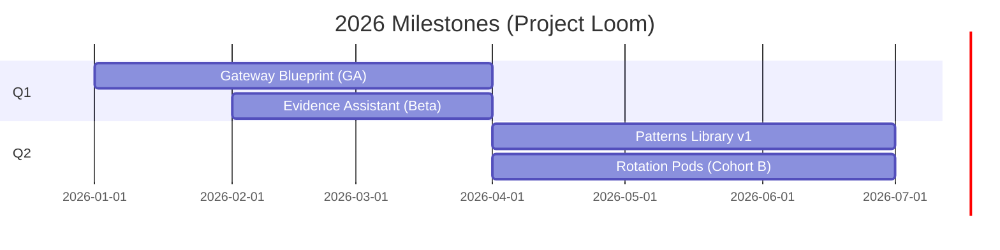

# Project Loom — AI Enablement CoE (International BU)
*Weave patterns into products.*

> **Audience:** EU & IST Technology Leadership 
> **Date (for PR):** 2026‑03‑31  
> **Budget note:** Platform/tooling (Copilots, Claude Code, Backstage) **charged centrally** and already accounted; request covers **people** only (4–6 FTE International + quarterly Rotation Pods).

---

## Press Release (Future‑dated)
**International BU launches Project Loom to make international‑ready AI the default.**  
*London, 31 March 2026* — The International Business Unit announced **Project Loom**, a small **AI Enablement Center of Excellence** that delivers **paved roads** for compliant AI and accelerates squads from idea to pilot in weeks. Loom focuses on **gateway blueprints, evidence automation for the EU AI Act, an agentic patterns library, and a revived Backstage “Loom Portal.”** A quarterly **Rotation Pods** program immerses engineers in hands‑on delivery, graduating them as **AI Champions**. With tools funded centrally, Loom concentrates investment on **regional expertise and adoption**.

> “Our goal is simple: **make the right thing the fast thing**,” said the Head of Architecture & Platform Engineering (International). “Loom bakes **international‑ready at GA** into enterprise platforms and gives squads one secure, repeatable path to value.”

---

## FAQ (selected)

### 1) What problem does Loom solve?
- **International lag** (EU/CA/AU) when US‑first platforms ship, creating rework and shadow tools.  
- **Compliance drag**: EU AI Act overhead and **PII leaving region** risks; evidence not automated.  
- **Fragmented DevEx**: Backstage exists but is under‑maintained; no single path for gateway/agents/RAG/telemetry.

### 2) Who is the customer?
- **Primary:** International delivery squads and engineers.  
- **Partners:** Business AI CoP, Risk/Compliance, Central AI/Data/M365.  
- **Beneficiaries:** Advisors/operations teams via earlier value and safer adoption.

### 3) Why now?
- Incoming **EU AI Act** obligations and client expectations on data residency.  
- Strong demand for Copilots and agentic workflows; existing Backstage needs a reboot.  
- Tools already funded centrally — we can focus spend on **people and adoption**.

### 4) What exactly will we ship in the first 120 days?
- **Gateway Blueprint** (LLM/gateway with identity pass‑through, region selection, redaction, audit).  
- **Evidence Assistant** (intake → EU AI Act triage → **evidence pack** generation).  
- **Patterns Library** (agentic exemplars: RAG+tools, planner/executor, batch agent; tests & guardrails).  
- **Loom Portal** (Backstage revived: templates, TechDocs, scaffolder, telemetry).  
- **Rotation Pods (quarterly)** — 3–4 engineers embedded to deliver a pilot + publish a reusable template.

### 5) How is Loom different from (or duplicative of) central teams?
- Loom **embeds** international requirements inside central backlogs so features ship **international‑ready at GA**, not N+1.  
- Loom **does not own** model risk or data governance; it **integrates** with those control owners and automates their evidence.

### 6) What tools and guardrails do we use from day one?
- **GitHub Copilot & Claude Code** for engineering; **M365 Copilot** for planning and comms.  
- Internal **agents** (triage, scaffolder, evidence, docs, telemetry) running behind the corporate gateway; **no PII leaves region**.  
- **Backstage** as the Loom Portal for templates and adoption telemetry.

### 7) What does success look like? (OKRs excerpt)
- **Intl‑ready at GA ≥ 80%** for enterprise AI capabilities.  
- **Time‑to‑pilot ↓ 50%**; **Compliance lead‑time ↓ 40%**.  
- ≥ **10 squads** onboarded; template adoption NPS **≥ +40**.  
- **3 Copilot pilots** in production with measurable uplift (target 3%+ for chosen cohorts).

### 8) How many people and what roles?
- **4–6 FTE**: AI Architect; Solutions/Business Architect; Engineer Evangelist (Process/Tool); Engineer Evangelist (Technical); **Data/ML Engineer (optional)**; **Intl M365 Product Owner**.  
- **Rotation Pods**: 3–4 engineers per quarter (temporary extension of Loom) to deliver pilots and become AI Champions.

### 9) What’s the ROI and TCO?
- **ROI (conservative):** ~**3–5 FTE** engineering weeks saved annually via faster pilots, fewer rewrites, and evidence automation, **plus** knowledge‑worker gains from Copilots.  
- **TCO:** Tools are centrally funded; Loom’s spend is **people + enablement**. Savings from reduced shadow tooling, rework, and incidents offset headcount.

### 10) How does Loom accelerate enterprise initiatives on **AI Fluency** and the **Hybrid AI‑Human Org**?
- **Fluency:** Rotation Pods are a **hands‑on bootcamp** (L2→L3→L4) with badges; outputs feed Backstage labs.  
- **Hybrid Org:** Each pilot publishes **HITL SOPs** and a task taxonomy (automate/augment/human‑own) that line teams adopt.

### 11) What are the top risks and mitigations?
- **Scope creep** → PO/PM gating + OKR guardrails.  
- **PII crossing regions** → gateway enforcement, redaction, and audit by default; evidence‑as‑code.  
- **Tool sprawl** → supported tool matrix and deprecation policy in Loom Portal.

### 12) What decisions do we need in Q4 2025?
- Approve **charter, headcount (4–6 FTE), and Rotation Pods** program.  
- Confirm **hybrid resourcing** (EU regulatory/data expertise + shared evangelists).  
- Endorse reboot of Backstage as the **Loom Portal** with ownership and SLOs.

### 13) What happens if we don’t do this?
- Continued **international tax** (N+1); shadow integrations; longer compliance cycles; lower developer satisfaction and slower business value.

---

## Visuals

```mermaid
flowchart LR
  Central[Central AI/Data/M365] --> Loom[Project Loom — AI Enablement CoE]
  Loom --> Regions[EU/CA/AU Squads]
  Loom --> Risk[Risk & Compliance]
  Loom -->|Paved roads + Agents| Portal[Loom Portal (Backstage)]
  Loom -->|Quarterly| Rotation[Rotation Pods]
```



---

## Obsidian Deep‑Dive Pages (links/titles)
- [[00_Exec_Overview]]  
- [[01_CoE_Charter]]  
- [[02_Team_and_Roles]]  
- [[03_Operating_Model]]  
- [[04_Projects_Gateway_Evidence_Patterns]]  
- [[05_Loom_Portal]]  
- [[06_Rotation_Pods]]  
- [[07_Experiments_Registry]]  
- [[08_Agent_Catalog]]  
- [[09_M365_PO_Playbook]]  
- [[10_OKRs_and_KPIs]]  
- [[11_Roadmap_and_Timeline]]  
- [[12_Governance_and_RACI]]

> **Note:** Keep codenames descriptive: **Gateway Blueprint**, **Evidence Assistant**, **Patterns Library**, **Loom Portal**, **Rotation Pods**.

