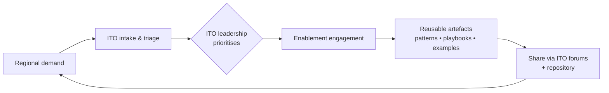
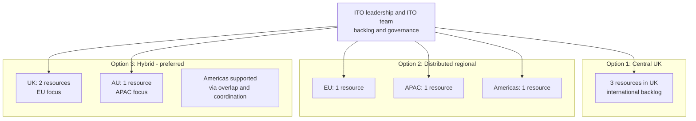

# Loom (Project Name) — ITO Enablement (2026)  
> **One-pager for Regional CIOs + Head of International**  
> **Regions:** EU (incl. UK) | APAC (mainly AU) | Americas (CA/MX/BR)  
> **Team size:** 3 resources | **Owner:** ITO leadership (managed by ITO team)

---

## What is Loom?
Loom is an **ITO Enablement** initiative that turns architecture intent into **usable, repeatable delivery patterns**—starting with **AI enablement** to unlock value quickly and safely.

**Enduring capability (not AI-only):** the same enablement model can later address gaps like **Kafka, Flink, Databricks**, and similar platform capabilities.

---

## How it works (single front door)

---

## 2026 Operating Model options (3 resources total)

### Quick comparison (exec view)
| Option | Best for | Key trade-off |
|---|---|---|
| **1) Central UK** | Standardisation + single backlog | Less regional intimacy + APAC timezone challenge |
| **2) Distributed** | Strong regional responsiveness | Higher risk of divergence/duplication |
| **3) Hybrid (preferred)** | Best fit for EU regulatory needs + APAC timezone coverage + pragmatic Americas support | Needs disciplined sharing to avoid split-brain |

---

## Funding impact (central funding + chargeback) — placeholders
| Region | Chargeback share [%] | Estimated annual impact [£X] | Notes |
|---|---:|---:|---|
| EU (incl. UK) | [%] | [£X] | [Assumption / allocation basis] |
| APAC (mainly AU) | [%] | [£X] | [Assumption / allocation basis] |
| Americas (CA/MX/BR) | [%] | [£X] | [Assumption / allocation basis] |

> **Notes:** Complete using [Chargeback formula], [FTE cost], and agreed allocation basis.

---

## Recommendation (ITO leadership)
**Prefer Option 3 (Hybrid).**  
Rationale: **EU regulatory reality + combined UK/EU demand**, **APAC timezone coverage**, and **Americas coordination via overlap**, with **no additional headcount**.

**Guardrails (to prevent fragmentation):**
- One ITO-managed intake and prioritisation path
- Shared artefacts repository + consistent templates
- Monthly ITO forums to share/retire patterns
- Transparent prioritisation and engagement visibility

---

## Decisions / Asks (tick-box)
- [ ] **Confirm operating model** for 2026 (recommend **Option 3**)  
- [ ] **Confirm funding approach**: Region-funded vs Central + chargeback  
- [ ] **Nominate one sponsor per region** (EU / APAC / Americas) for demand shaping and comms  

---

## Optional: What to expect first (AI-first, not AI-only)
- [ ] Codified AI reference patterns (repeatable “golden paths”)  
- [ ] Enablement walkthroughs + reusable examples for teams  
- [ ] Guidance packaged for re-use (forums + repository), not bespoke one-offs  
