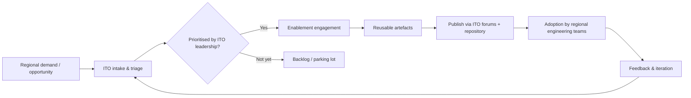
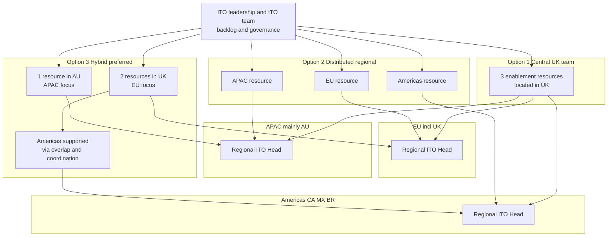
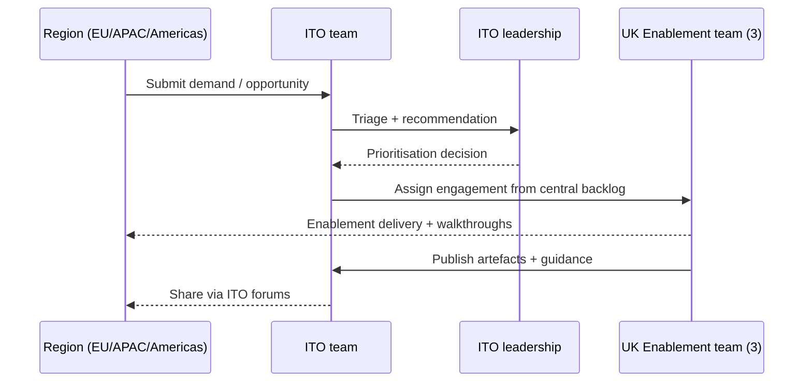
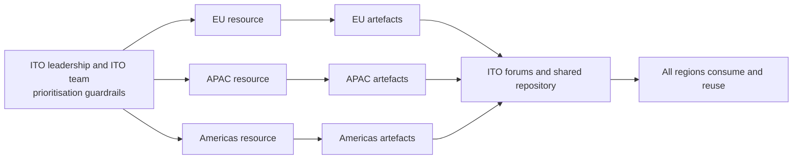
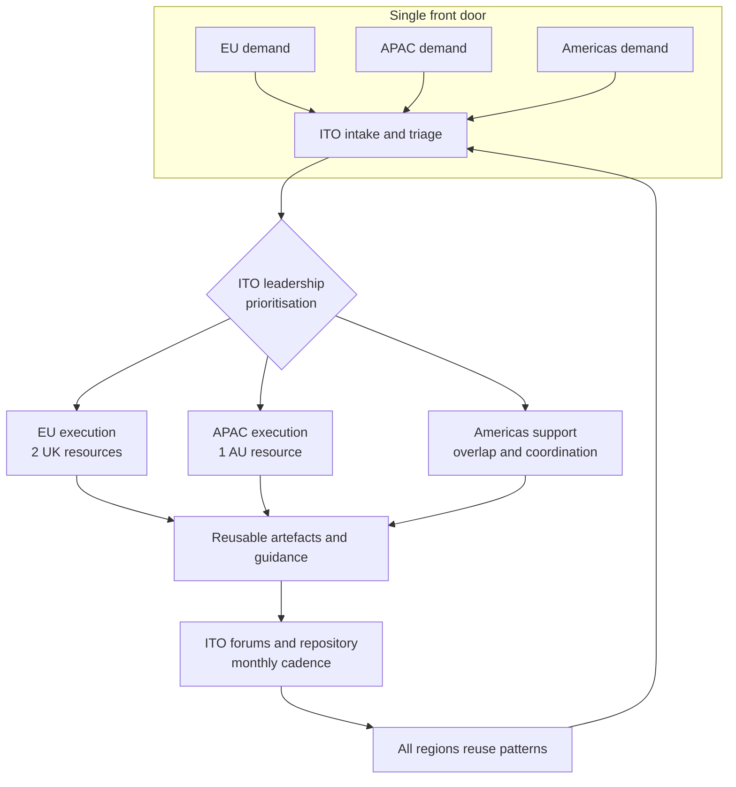

# Loom (Project Name): ITO Enablement Operating Model & Funding Impact — 2026

> **Audience:** Regional CIOs (EU incl. UK, APAC mainly AU, Americas: Canada/Mexico/Brazil) + Head of International  
> **Owner:** International Technology Office (ITO) leadership  
> **Purpose:** Align on a 2026 operating model and funding approach for the ITO Enablement team (3 resources)

---

## Purpose
This pre-read sets out the proposed 2026 operating model options for the **ITO Enablement team** (3 resources) and the **funding impact** by region. The intent is to align on a model that accelerates delivery, codifies architecture guidance through Engineering Excellence, and provides enduring enablement capacity—**AI-first, not AI-only**.

---

## Executive Summary
- **Why now:** Engineering teams are increasingly constrained by the time and effort required to translate architecture intent into safe, repeatable delivery patterns. Loom addresses this by **codifying guidance and unblocking teams** through hands-on enablement.
- **What Loom is:** A CTO-sponsored **ITO Enablement initiative** that creates reusable reference patterns, guardrails-by-default, and enablement assets—starting with **AI enablement** to unlock value quickly and safely.
- **Enduring capability:** Loom is not a temporary AI taskforce. The same enablement approach applies to adjacent platform gaps over time (e.g., **Kafka, Flink, Databricks**), where regions need practical patterns and accelerators.
- **Governance:** Prioritisation is owned by **ITO leadership** and managed by the ITO team. Outside Option 1, delivery focus is regional, with systematic learning-sharing via ITO forums.
- **Decision required:** Agree the 2026 operating model and the funding approach (region-funded vs central + chargeback).
- **Preferred model:** Option 3 (Hybrid) best balances **EU regulatory reality**, **APAC timezone coverage**, and pragmatic coordination with Americas, while minimising delivery friction.

### Funding impact (central funding + chargeback) — placeholders
| Region | Chargeback share [%] | Estimated annual impact [£X] | Notes |
|---|---:|---:|---|
| EU (incl. UK) | [%] | [£X] | [Assumption / allocation basis] |
| APAC (mainly AU) | [%] | [£X] | [Assumption / allocation basis] |
| Americas (CA/MX/BR) | [%] | [£X] | [Assumption / allocation basis] |

---

## How Loom works (intake → enablement → reuse)

---

## What “Loom” is (high level)
- A CTO-sponsored **ITO Enablement initiative** focused on accelerating safe adoption of priority capabilities.
- A practical “last-mile” function that turns standards into **usable patterns, playbooks, and working examples**.
- Initial focus: **AI enablement** to unlock value while meeting governance and regional constraints.
- Delivery mechanism: targeted enablement engagements, reusable artefacts, and a consistent intake/prioritisation path via ITO.
- Designed to scale learnings across regions through lightweight, repeatable enablement assets.

---

## What the ITO Enablement team is (and is not)

### We do
- Produce **reference patterns** and “golden paths” aligned to Engineering Excellence.
- Build **guardrails-by-default** (where applicable) and standardised templates/playbooks.
- Run enablement engagements: workshops, pairing, and “show-me” walkthroughs to **unblock teams**.
- Create reusable accelerators (starter repos, integration examples, decision guides).
- Convert recurring questions into **codified guidance** shared through ITO forums.

### We don’t
- Become long-term owners of regional products or platforms.
- Replace regional delivery teams or central platform owners.
- Bypass governance or create bespoke one-off solutions that can’t be reused.
- Act as a permanent “delivery squad” for BAU change.

**Enduring capability beyond AI:** The same enablement model can address future gaps in non-AI areas such as **Kafka, Flink, Databricks** (and similar platform capabilities), where regions need repeatable patterns and practical guidance.

---

## 2026 Operating Model Options (3 resources total)

### Visual map of resourcing by option

---

### Overview comparison
| Option                  | Structure                                                             | Best for                                       | Trade-offs                                          | Pros                                                                    | Cons                                                         |
| ----------------------- | --------------------------------------------------------------------- | ---------------------------------------------- | --------------------------------------------------- | ----------------------------------------------------------------------- | ------------------------------------------------------------ |
| 1) Central UK team      | 3 resources in UK; central international backlog                      | Consistency and central control                | Risk of perceived distance from regional priorities | Strong standardisation; simple team structure                           | Regional responsiveness may suffer; timezone coverage limits |
| 2) Distributed regional | 1 resource per region (EU/APAC/Americas), regional-only focus         | High regional autonomy and alignment           | Risk of divergence and duplication                  | Strong local responsiveness; clear regional ownership                   | Harder to keep consistent standards; fragmented backlog      |
| 3) Hybrid (preferred)   | 1 in AU (APAC focus) + 2 in UK (EU focus); coordination with Americas | Balance of regulatory/timezone needs and reuse | Requires disciplined sharing to avoid split-brain   | Best fit for EU regulation + APAC timezone; pragmatic Americas coverage | Needs strong ITO governance and artefact-sharing discipline  |

---

## Option 1 — Central UK team (international backlog)
### How it works
- 3 enablement resources located in the UK, operating against a **single international backlog**.
- Engagements are prioritised by ITO leadership; delivery is scheduled across regions.
- Outputs are centrally standardised and published via ITO channels.

### Pros
- Highest consistency of patterns, guidance, and artefacts.
- Simplest operating model and management overhead.
- Clear single backlog and prioritisation flow.

### Cons
- Lower regional intimacy; risk of “remote enablement” perception.
- Harder to respond quickly to APAC timezone needs.
- Regional constraints (including EU regulatory nuance) may compete with global priorities.

### Governance & sharing
- ITO-managed single backlog and publication of artefacts via ITO forums and repositories.

### Funding impact — placeholders (fill in)
| Funding approach | EU [£X] | APAC [£X] | Americas [£X] | Notes / Assumptions |
|---|---:|---:|---:|---|
| A) Region-funded (regions pay directly) | [£X] | [£X] | [£X] | [e.g., allocation per FTE / engagement / split] |
| B) Central funding + chargeback | [£X] | [£X] | [£X] | [Chargeback formula / basis] |

---

## Option 2 — Distributed regional (regional-only delivery; shared learnings)
### How it works
- 1 enablement resource assigned to each region (EU, APAC, Americas).
- Day-to-day focus is **regional priorities**, shaped by ITO leadership and regional input.
- Learnings and artefacts are shared across regions through ITO forums.

### Pros
- Strongest regional alignment and responsiveness.
- Clear local ownership and stakeholder proximity.
- More natural fit for region-specific constraints and ways of working.

### Cons
- Higher risk of divergent patterns and duplicated effort.
- Harder to maintain consistent “golden paths” without strong central discipline.
- Backlog coordination overhead increases.

### Governance & sharing
- ITO leadership provides prioritisation guardrails; artefacts and learnings shared through ITO forums on a regular cadence.

### Funding impact — placeholders (fill in)
| Funding approach | EU [£X] | APAC [£X] | Americas [£X] | Notes / Assumptions |
|---|---:|---:|---:|---|
| A) Region-funded (regions pay directly) | [£X] | [£X] | [£X] | [e.g., each region funds its assigned resource] |
| B) Central funding + chargeback | [£X] | [£X] | [£X] | [Chargeback formula / basis] |

---

## Option 3 — Hybrid (preferred)
### How it works
- 1 enablement resource located in **AU** to support APAC priorities (timezone-aligned), priorities set by ITO leadership/ITO team.
- 2 enablement resources located in **UK**, primarily focused on EU priorities, reflecting regulatory intensity and combined UK+EU business needs.
- Americas supported through coordination and timezone overlap (primarily via UK coverage), with ITO leadership directing cross-regional work where applicable.
- Rationale for no dedicated Americas resource: Americas has greater overlap with enterprise enablement and can follow US-led enablement more directly; **AU and EU cannot**.

### Pros
- Best fit for EU regulatory reality and depth of demand across UK+EU.
- APAC gets dedicated timezone-aligned capacity, improving responsiveness and adoption.
- Pragmatic Americas coverage without increasing total headcount.
- Encourages reuse while recognising genuine regional constraints.

### Cons
- Requires disciplined governance to avoid EU/APAC “split backlog” drift.
- Americas demand must be explicitly managed to avoid under-coverage.
- Success depends on strong artefact-sharing and transparent prioritisation.

### Governance & sharing
- Single ITO-managed intake and prioritisation, with regional execution focus.
- Monthly ITO forums to share patterns/learnings; a shared artefact repository; transparent prioritisation decisions and visibility across regions.

### Funding impact — placeholders (fill in)
| Funding approach | EU [£X] | APAC [£X] | Americas [£X] | Notes / Assumptions |
|---|---:|---:|---:|---|
| A) Region-funded (regions pay directly) | [£X] | [£X] | [£X] | [e.g., EU funds 2 FTE share; APAC funds 1 FTE share; Americas funds 0 / fractional via agreed basis] |
| B) Central funding + chargeback | [£X] | [£X] | [£X] | [Chargeback formula / basis] |

---

## Recommendation (ITO leadership)
**Recommend Option 3 (Hybrid).** It best balances (1) **EU regulatory reality and combined UK+EU demand**, (2) **APAC timezone coverage** needed for practical enablement, and (3) pragmatic coordination with **Americas** through overlap and enterprise alignment—while keeping headcount constant and minimising delivery friction.

### Guardrails to prevent fragmentation
- ITO-managed intake and prioritisation (single front door).
- Standardised artefact publishing (shared repository + consistent templates).
- Monthly ITO forums to share patterns/learnings and retire duplication.
- Transparent prioritisation and engagement tracking across regions (visibility by default).

---

## Decisions / Asks
1) **Operating model:** Align on **Option 3 (Hybrid)** as the 2026 model.  
2) **Funding approach:** Align on **Region-funded** vs **Central funding + chargeback** (placeholders above to be completed).  
3) **Regional sponsorship:** Nominate a **single regional sponsor / point of contact** per region (EU, APAC, Americas) for demand shaping, comms, and escalation via ITO.

