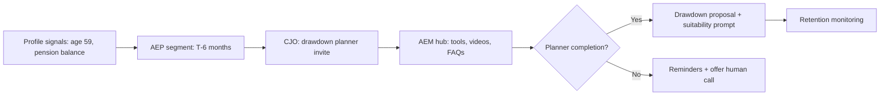
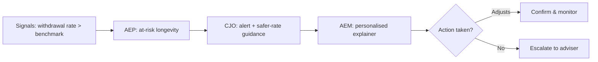

# Board Paper — Investing in Adobe MarTech to Power Our Personal Investing Strategy (UK)

**Author:** Head of Architecture & Platform Engineering  
**Audience:** Executive Committee & Board  
**Date:** August 2025  
**Decision Required:** Approve phased investment in the Adobe Experience stack to operationalise our three strategic pillars.

---

## 0) One‑Page Executive Summary

**Why now:** To achieve our strategy—(1) turn savers into investors, (2) support people through retirement drawdown, and (3) bridge the advice gap—we must deliver _relevant, trusted, and timely_ experiences across web, app, and service channels. Our current tooling cannot do this at scale with the required governance and velocity.

**What we propose:** A phased adoption of the Adobe Experience stack as our growth engine:

- **Foundation (Year 1):** Adobe Experience Platform (AEP + RT‑CDP), Adobe Experience Manager (AEM), Customer Journey Orchestration (CJO).
    
- **Scale/Optimise (Year 2+):** Adobe Target, Adobe Analytics, Customer Journey Analytics (CJA), Marketo (for B2B/IFA), Workfront (workflow & compliance), and AI add‑ons.
    

**Outcomes:**

- **Savers → Investors:** +X% conversion uplift; +£Y Net New Money (NNM) per quarter.
    
- **Retirement Confidence:** ↑ drawdown suitability & retention; ↓ complaints and cost‑to‑serve.
    
- **Advice for All:** Advice‑lite journeys at scale, reducing advice gap proxies (e.g., first‑time guidance completion, follow‑on action rates).
    

**Risk & control:** First‑party data strategy, opt‑in consent, explainable decisioning, auditable journeys, alignment with FCA Consumer Duty & GDPR.

**Investment & timeline:** Phased 12–18 month rollout with KPI gates each quarter (see §8).  
**Ask:** Approve foundation stack funding and governance model; agree pilot cohorts and success metrics.

---

## 1) Strategic Context & Business Objectives

Our three pillars:

1. **Turn savers into investors:** Build confidence, reduce friction, and provide timely nudges into low‑cost, appropriate products (e.g., GIA/ISA/pension contributions).
    
2. **Support retirement drawdown:** Provide personalised planning, ongoing suitability nudges, and clear trade‑offs to sustain lifestyle and reduce longevity risk.
    
3. **Bridge the advice gap:** Deliver accessible, low‑cost, digital guidance and adviser hand‑offs for all wealth tiers.
    

**Implication:** We need a platform that unifies first‑party data, orchestrates journeys by life moment, delivers dynamic content, and measures outcomes—safely and at scale.

---

## 2) Strawman of the Adobe Stack

### 2.1 Foundation Components (Year 1 – must‑have)

- **Adobe Experience Platform (AEP) with Real‑Time CDP (RT‑CDP):**  
    _Purpose_ — Create a unified, consented, real‑time customer profile from web/app behaviour, holdings, CRM, service, and campaign data.  
    _Capabilities_ — Identity resolution, consent & preference management, real‑time segmentation, destination connectors, profile governance.
    
- **Customer Journey Orchestration (CJO):**  
    _Purpose_ — Event‑driven, next‑best‑action decisions and orchestration across channels.  
    _Capabilities_ — Real‑time triggers, eligibility rules, throttling & frequency capping, channel coordination (email, push, in‑app, site, contact centre), experimentation hooks.
    
- **Adobe Experience Manager (AEM Sites + Assets):**  
    _Purpose_ — Authoring and delivery of personalised, compliant content at scale.  
    _Capabilities_ — Headless/SPA compatible content, dynamic components, localisation, content governance, DAM & reusable content fragments.
    

### 2.2 Integrate Over Time (Year 2+ – scale/optimise)

- **Adobe Target:** On‑site/in‑app personalisation and experimentation (A/B, multi‑armed bandit).
    
- **Adobe Analytics & Customer Journey Analytics (CJA):** Deep multi‑channel analytics, attribution, and causal insights.
    
- **Marketo Engage:** B2B/IFA enablement, partner lifecycle, and adviser marketing automation.
    
- **Adobe Workfront:** Workflow, approvals, and compliance trails for campaigns and content.
    
- **AI extensions (AEP/AEM/Target):** Predictive propensity, content intelligence, and automated next‑best‑offer—introduced under governance once foundation KPIs are met.
    

### 2.3 Heat‑Map of Adoption Scope

|Capability|AEP|CJO|AEM|Target|Analytics/CJA|Marketo|Workfront|
|---|:-:|:-:|:-:|:-:|:-:|:-:|:-:|
|Unified Profile & Consent|🟢|||||||
|Real‑time Segmentation|🟢|||||||
|Event‑Driven Journeys||🟢||||||
|Personalised Content|||🟢|🟡||||
|Experimentation||||🟡|🟡|||
|Deep Analytics & Attribution|||||🟡|||
|B2B/IFA Marketing||||||🟡||
|Workflow & Compliance|||||||🟡|

> Legend: 🟢 Foundation (Year 1) · 🟡 Integrate over time (Year 2+)

---

## 3) Capability Maps by Strategic Pillar

### 3.1 Pillar 1 — Turn Savers into Investors

**Business capabilities we need**

- First‑party insight on savings vs investing behaviours
    
- Confidence‑building education and calculators
    
- Timely prompts at life moments (payday, ISA season, market events)
    
- Friction‑light onboarding and funding
    

**MarTech mapping**

- **AEP:** Real‑time profile + segments (e.g., “Cash‑heavy”, “ISA‑eligible”, “First‑time investor”).
    
- **CJO:** Triggered nudges and eligibility logic (e.g., salary day, balance thresholds).
    
- **AEM:** Personalised landing pages, FAQs, videos, and interactive ISA/GIA calculators.
    
- **Target/Analytics (later):** Optimise messaging variants and measure uplift.
    

**Outcomes & KPIs**

- Conversion rate from saver → investor (+X%)
    
- Net New Money (NNM) attributable to journeys (+£Y)
    
- Time‑to‑first‑investment (‑Z days)
    

---

### 3.2 Pillar 2 — Support People in Retirement (Drawdown)

**Business capabilities we need**

- Life‑stage segmentation and suitability signals
    
- Proactive drawdown health monitoring and alerts
    
- Accessible modelling tools and guidance content
    
- Adviser hand‑off when complexity/risks rise
    

**MarTech mapping**

- **AEP:** Segments such as “T‑12 months to retirement”, “High withdrawal velocity”, “At‑risk longevity”.
    
- **CJO:** Next‑best‑action (e.g., conduct drawdown check‑up, schedule guidance call).
    
- **AEM:** Personalised retirement hub with scenario tools and explainer content.
    
- **Analytics/CJA (later):** Measure retention, complaint reduction, and income stability.
    

**Outcomes & KPIs**

- Retention in drawdown (+X%)
    
- Complaints per 1k customers (‑Y)
    
- Completion of annual drawdown check‑up (+Z%)
    

---

### 3.3 Pillar 3 — Bridge the Advice Gap

**Business capabilities we need**

- Advice‑lite digital guidance for all balances
    
- Clear confidence ladders for new investors
    
- Hybrid digital → human advice pathways
    
- Continuous improvement through testing/learning
    

**MarTech mapping**

- **AEM:** Guided pathways, literacy content, progressive disclosure by confidence level.
    
- **CJO:** Multi‑step guidance journeys, reminders, and escalation rules.
    
- **AEP:** Holistic view to prevent over‑messaging and respect consent/preferences.
    
- **Target/Analytics (later):** Optimise guidance steps and reduce drop‑off.
    

**Outcomes & KPIs**

- Guidance completion rate (+X%)
    
- % users taking a follow‑on action (open account, fund, rebalance) (+Y%)
    
- Cost‑to‑serve reduction (‑£Z per customer)
    

---

## 4) Relatable User Journeys (Flow Views)

### 4.1 Emma (32) — Reluctant Saver to First‑Time Investor

```mermaid
flowchart LR
A[Web/App Visit] --> B{Unified Profile in AEP}
B -->|Cash‑heavy segment| C[CJO triggers ISA nudge]
C --> D[AEM: "Why Invest?" explainer + calculator]
D --> E{Eligibility check}
E -->|Pass| F[Quick ISA open & fund]
E -->|Fail| G[Confidence path: basics course]
F --> H[Post‑fund welcome journey]
G --> H
H --> I[Measure: conversion, time‑to‑first‑investment]
```

### 4.2 David (59) — Approaching Retirement



### 4.3 Aisha (70) — In Drawdown, Needs Reassurance



### 4.4 Tom (25) — First‑Time Investor, Low Wealth

```mermaid
flowchart LR
A[Visits site from social] --> B[AEP: low balance, beginner]
B --> C[CJO: "Start with £25/mo" journey]
C --> D[AEM: gamified steps + glossary]
D --> E{Completed?}
E -->|Yes| F[Open + auto‑invest setup]
E -->|No| G[Nudge + content variant test]
```

---

## 5) Operating Model, Governance & Risk

- **Consumer Duty & Suitability:** Prevent harmful nudging; eligibility rules and audit trails in CJO; transparent rationale in comms.
    
- **GDPR & Consent:** First‑party data with explicit consent; preference centre; purpose limitation; data minimisation.
    
- **Explainability:** Documented rules and eligibility in CJO; human override paths; content review in AEM workflows.
    
- **Controls:** Frequency capping, channel prioritisation, and suppression lists in AEP/CJO.
    
- **Data Security:** Role‑based access, PII tokenisation/pseudonymisation where appropriate; integration via secure APIs.
    
- **Change & Approvals:** Workfront (Phase 2) for campaign approvals, legal sign‑off, and evidence of control operation.
    

---

## 6) Integration Blueprint (High Level)

```mermaid
flowchart TB
subgraph Data Sources
CRM
Holdings[Record‑keeping / Holdings]
WebSDK[Web/App SDK]
Service[Call Centre / Tickets]
Consent[Consent & Preferences]
end

Data Sources --> AEP[AEP + RT‑CDP]
AEP --> Seg[Segments]
Seg --> CJO[CJO Orchestration]
CJO --> Channels[Email / Push / In‑App / Site / Contact Centre]
AEM[AEM Sites + Assets] --> Channels
Channels --> Analytics[(Analytics/CJA)]
Analytics --> AEP
```

---

## 7) Commercials, Value, and Measurement

**North‑Star Metrics**

- Saver→Investor conversion, NNM, retention in drawdown, guidance completion, cost‑to‑serve.
    

**Attribution & Learning**

- Use Analytics/CJA to attribute uplift; run holdout tests in Target (Phase 2) to quantify incremental impact.
    

**Indicative Value Model (illustrative placeholders)**

- If 200k cash‑heavy customers see a +3% conversion uplift at £2,000 avg funding → **£120m NNM**.
    
- If drawdown retention improves by 2% on £Xbn AUA → **£Y m revenue retention**.
    
- If advice‑lite reduces cost‑to‑serve by £1 per MAU across 1m MAU → **£12m annual saving**.
    

---

## 8) Phased Roadmap & Decision Gates

**Q1–Q2 (Foundation)**

- Stand up AEP profiles, consent, and 3 priority segments.
    
- Launch CJO for two journeys (Saver→Investor; T‑6 months to retirement).
    
- Ship AEM content hub with calculators and modular content fragments.  
    **Gate:** +1–2% conversion uplift in pilot cohorts; compliant operation confirmed.
    

**Q3–Q4 (Scale)**

- Extend journeys (in‑drawdown monitoring; advice‑lite pathways).
    
- Introduce Target experiments and initial Analytics/CJA dashboards.
    
- Begin Workfront approvals for content/campaigns.  
    **Gate:** Stat‑sig uplift across 3+ cohorts; content velocity ↑; control evidence captured.
    

**Year 2 (Optimise & AI)**

- Expand segments; roll out AI propensity under governance.
    
- Deepen adviser/IFA integration (Marketo, if in scope).  
    **Gate:** Sustained uplift; CAC/LTV improvement; audit readiness.
    

---

## 9) Alternatives Considered (Summary)

- **Status quo / point tools:** Lower cost short‑term, but fragmented data, limited governance, slower change; risk of Consumer Duty breaches via inconsistent journeys.
    
- **Build in‑house:** High engineering burden; difficult to match Adobe’s maturity for identity, orchestration, and content ops.
    
- **Other suites:** Comparable capabilities exist; Adobe chosen for strength in content (AEM), enterprise governance, and RT‑CDP maturity.
    

---

## 10) Risks & Mitigations

|Risk|Impact|Mitigation|
|---|---|---|
|Data quality / identity match|Poor targeting|Data contracts; profile hygiene; iterative match‑rate targets|
|Over‑messaging|Customer harm, churn|Frequency caps; suppression; journey guardrails|
|Change overload|Delivery risk|Phased scope; pilot cohorts; enablement plan|
|Regulatory findings|Compliance cost|Evidence packs (Workfront), audit trails in CJO, DPIAs|
|Vendor lock‑in|Strategic risk|Standards‑based data flows; export pathways; periodic market reviews|

---

## 11) Investment & Operating Model (High Level)

- **People:** MarTech product owner, data engineer, AEM lead, orchestration specialist, content ops, compliance partner.
    
- **Run costs:** Licences (tiered), cloud usage, enablement, BAU optimisation.
    
- **Operating cadence:** Monthly optimisation sprints; quarterly journey reviews; compliance checkpoints.
    

---

## 12) Decision & Next Steps

**Decision today:** Approve foundation stack & roadmap.  
**Next 30 days:** Finalise pilot cohorts; establish metrics baselines; confirm data feeds and consent policies; kick off delivery.

---

### Appendix A — Glossary (selected)

- **AEP / RT‑CDP:** Unified, real‑time profiles from first‑party data.
    
- **CJO:** Engine that sequences personalised steps across channels.
    
- **AEM:** Content management and delivery system.
    
- **CJA:** Customer Journey Analytics for multi‑channel insights.
    

### Appendix B — Example KPI Dashboard (wireframe)

- Conversion funnel, NNM by cohort, drawdown check‑up completion, guidance path progression, complaint trend, frequency‑cap breaches.
    

### Appendix C — Evidence Pack Checklist

- DPIA, consent policy, journey rules, holdout test design, copy approvals, moderation logs, incident playbook.