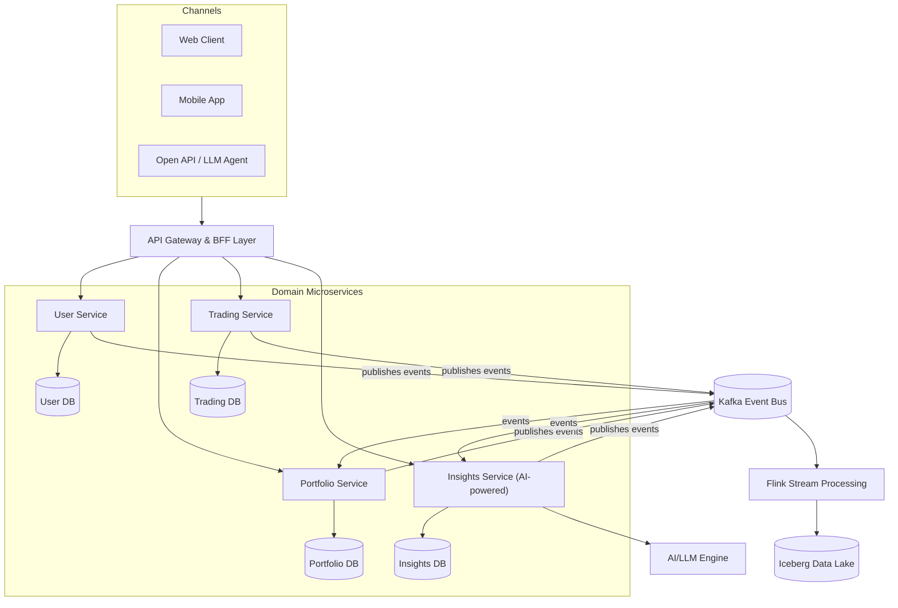

---
subtitle: "Personal Investing Platform – From Startup to Scale-Up"  
author: "Consulting Team"  
date: "2025-05-27"  
tags: [Enterprise Architecture, FinTech, Strategy, UK]
---
# Platform Architecture Maturity Assessment and Strategic Vision

## Introduction

As a UK-based personal investing platform transitions from **startup** to **scale-up**, a robust technology strategy is required to support rapid growth, innovation, and regulatory compliance. This document provides a consultancy-grade architecture assessment and strategic vision to evolve the platform. We evaluate current architecture maturity, identify legacy pain points and risks, and define a target architecture that is **modular, event-driven, domain-oriented, streaming-native, and AI-ready**. We also outline compliance measures aligned with UK regulations (FCA, GDPR, EU AI Act) and present a phased transformation roadmap. All content is structured in clear sections with Obsidian-compatible Markdown (including Mermaid diagrams) for easy navigation and publishing.

## Architecture Maturity Assessment

We assessed the current architecture across key domains – **Integration**, **Modularity**, **Governance**, **Resilience**, **Observability**, **Scalability**, and **Data Ownership** – benchmarking each against a target state. **Table 1** below summarizes the maturity (on a 1–5 scale) of each domain in the current state versus the desired target, with color-coded heatmap indicators (🔴 low, 🟠 medium, 🟢 high maturity). The gap to target is indicated qualitatively (Red = significant gap, Amber = moderate, Green = minor gap).

|**Domain**|**Current Maturity**|**Target Maturity**|**Gap**|
|---|---|---|---|
|**Integration**|2 – Ad-hoc point-to-point integrations 🔴|5 – Seamless event-driven enterprise integration 🟢|**Red** (High)|
|**Modularity**|1 – Monolithic, tightly coupled 🔴|5 – Highly modular domain microservices 🟢|**Red** (High)|
|**Governance**|2 – Minimal architecture governance 🔴|5 – Strong governance & standards 🟢|**Red** (High)|
|**Resilience**|2 – Basic resilience (single AZ) 🔴|5 – Highly resilient (multi-AZ/DR) 🟢|**Red** (High)|
|**Observability**|1 – Limited logging, no tracing 🔴|5 – Full-stack observability 🟢|**Red** (High)|
|**Scalability**|3 – Moderate (cloud auto-scaling) 🟠|5 – Elastic scale (global readiness) 🟢|**Amber** (Medium)|
|**Data Ownership**|1 – Undefined, silos in one DB 🔴|5 – Clear domain data ownership 🟢|**Red** (High)|

_Table 1: Architecture Maturity Heatmap – Current vs Target State._

**Key observations:** Most domains show **low maturity** in the current startup-mode architecture, with wide gaps to the target state. **Integration** is ad-hoc – services and external partners communicate via point-to-point REST APIs or file exchanges with no unified messaging backbone, far from the target of seamless event-driven integration. **Modularity** is very low, as the platform is essentially a monolithic application (or a few large services) with tightly coupled components, whereas the target envisions decoupled microservices aligned to business domains. **Governance** practices are nascent – there is little formal oversight of design choices, leading to inconsistent technology usage and shortcuts; the goal state requires strong architectural governance (standards, review boards, reference architectures) to guide the growing engineering team. **Resilience** is insufficient – currently the system likely runs in a single cloud availability zone or region with basic failover, making it vulnerable to outages; the target is a highly resilient deployment (multi-AZ, automated failover, disaster recovery) to meet strict uptime requirements. **Observability** is very limited – perhaps only basic logs and metrics are collected, lacking centralized monitoring or tracing, whereas the target is full **observability** (centralized logs, metrics, distributed tracing, dashboards, alerting) for proactive incident management. **Scalability** is moderate – the platform uses cloud infrastructure that provides some auto-scaling, but the monolithic design and a single database could become bottlenecks; the target is to achieve elastic scalability (horizontally scaling microservices and data partitions) to handle a growing user base and peak loads with ease. Finally, **Data Ownership** is poorly defined – customer and transaction data reside in a single monolithic database with no clear domain ownership or data stewardship, complicating compliance and analytics; the target state emphasizes each domain owning its data (a principle aligned with data mesh thinking) to improve accountability, quality, and regulatory compliance (e.g. easier GDPR data management per domain).

### Current State High-Level Architecture

To illustrate the **current state**, the diagram below provides a high-level view of the platform’s architecture in startup mode. It shows a monolithic application core, tightly connected to a single database and directly integrating with external services (for payments, KYC, etc.). Channels (web and mobile) directly interact with this monolithic backend. This simplicity has enabled rapid development in the startup phase but now poses limitations in flexibility and scale.

```mermaid
flowchart LR
    subgraph Channels
      Web[Web Application]
      Mobile[Mobile Application]
    end
    Web --> Monolith[Monolithic Application Server]
    Mobile --> Monolith
    Monolith --> DB[(Main Database)]
    Monolith --> External[Third-Party APIs (Payments, KYC, etc.)]
```

flowchart LR
    subgraph Channels
      Web[Web Application]
      Mobile[Mobile Application]
    end
    Web --> Monolith[Monolithic Application Server]
    Mobile --> Monolith
    Monolith --> DB[(Main Database)]
    Monolith --> External[Third-Party APIs (Payments, KYC, etc.)]
    
Figure 1: Current State Architecture (Startup Phase) – Monolithic core with tightly-coupled components._

In the current setup, any change or failure in the **monolith** can impact the entire system, deployment cycles are riskier (all features deploy together), and **integration** with new services is cumbersome. There is no centralized event stream or data pipeline – data sharing between components or with analytics tools likely happens via the database or file exports. **Resilience** is limited to what the cloud provider offers out-of-the-box (e.g. basic VM auto-restart), with no active-active redundancy. **Observability** and **governance** are ad-hoc, relying on the heroic efforts of a small engineering team rather than standardized frameworks.

## Architectural Risks and Technical Debt

The startup-phase architecture has accumulated **technical debt and risks** that could undermine the platform’s reliability, scalability, and compliance as it scales. We identify key pain points inherited from the current design, each mapped to enterprise risks and technical debt impact:

- **Monolithic Core System:** The core application is a single, tightly-coupled codebase implementing multiple business functions.
    
    - _Enterprise Risk:_ A **single point of failure** – an outage or bug in one module can crash the entire platform, causing major service downtime. Slow, coordinated deployments across the monolith risk **operational disruptions**, violating uptime commitments and potentially breaching FCA operational resilience expectations (by 2025 firms must operate within impact tolerances for outages). It also **slows time-to-market**, as new features or fixes require rebuilding and redeploying the whole system.
        
    - _Tech Debt:_ **High coupling and complexity** make the system hard to modify or test. Minor changes can have unintended side effects across the codebase, increasing maintenance effort. The lack of modular boundaries means **poor team scalability** – developers contend with a large codebase, and onboarding new engineers is harder. This debt will require significant refactoring effort to achieve a modular architecture.
        
- **Brittle Point-to-Point Integrations:** Integrations between components and with external partners (payments, KYC, market data feeds, etc.) are implemented in an ad-hoc manner (e.g. direct REST calls or nightly file batches) without a unifying integration layer.
    
    - _Enterprise Risk:_ **Fragile connections** can break as transaction volume grows or as APIs change, leading to data inconsistencies and service outages. A lack of a resilient integration strategy (like messaging or event streaming) means **upstream failures propagate** downstream (e.g. if a payment API is slow, the whole user transaction flow might hang). This can degrade customer experience and trust.
        
    - _Tech Debt:_ The platform has **accumulated custom integration code** and workarounds for each partner, making it hard to maintain. Duplicate data mappings, lack of central monitoring for integrations, and inconsistent error handling all contribute to debt. Scaling up will force re-writing these point-to-point links to a more robust integration architecture (e.g. introducing an event bus or API gateway).
        
- **Lack of Formal Architecture Governance:** In startup mode, technology decisions (frameworks, data models, APIs) were made quickly by a small team without formal standards or oversight. There is no architecture review board or reference architecture documentation.
    
    - _Enterprise Risk:_ This leads to **inconsistent practices** (different teams might use different coding standards, libraries, or cloud services) and can introduce security or compliance gaps. For example, absence of governance can mean **undocumented system behaviors**, which is risky when regulators or auditors (FCA or external) assess the platform. It also impedes strategic alignment – technology might drift away from business goals or compliance needs without checkpoints.
        
    - _Tech Debt:_ The **absence of governance** is debt in itself – it manifests as **architecture sprawl** and “tribal knowledge” dependency. Refactoring to a target state will require cleaning up inconsistencies and establishing standards retroactively (e.g. re-aligning logging formats, reworking authorization mechanisms to a single approach). This will consume effort that could have been saved if good practices were in place from the start.
        
- **Basic Resilience & Recovery Capabilities:** The current infrastructure likely runs in a single cloud region and may not have automated disaster recovery or multi-region failover. Backups and incident response processes are basic.
    
    - _Enterprise Risk:_ **Operational resilience risk** is high – a major cloud outage (or even a zonal outage) could bring down the platform for an extended period. With the FCA’s increasing emphasis on operational resilience (firms must prevent, adapt, respond, and recover from disruptions within defined tolerances), the platform in its current state might fail to meet regulatory expectations. Prolonged downtime could also cause **customer harm and regulatory fines**, given the FCA’s stance that resilience is essential to consumer protection and market integrity.
        
    - _Tech Debt:_ The platform lacks built-in **redundancy and failover mechanisms**, which will now need to be added under pressure. This includes setting up multi-AZ or multi-region deployments, implementing database replication or hot standby, and automating recovery playbooks. Each of these is a significant undertaking that becomes harder to retrofit into a live system. The team may also need to invest in **chaos testing and resilience verification** – something typically easier when designed in upfront.
        
- **Limited Observability and Incident Response:** Currently, monitoring is minimal – perhaps only basic server metrics and log files pulled as needed. There is no centralized **observability stack** (logging, metrics, tracing) or automated alerting.
    
    - _Enterprise Risk:_ Low observability means **incidents can go undetected or take longer to diagnose**, increasing downtime and impact on customers. Without proper audit logs and monitoring, the platform may also fall short of **compliance requirements** (e.g. FCA requires timely incident reporting and root cause analysis; GDPR requires breach detection and notification). Lack of auditing is especially risky in finance – if a trade goes missing or a transaction is disputed, inability to trace it quickly can lead to financial loss or legal liability.
        
    - _Tech Debt:_ The effort to implement **observability tools (logging pipelines, APM, dashboards)** is now a debt to pay. Instrumenting the code for tracing and metrics retroactively is labor-intensive. Additionally, without initial observability, the team has likely built fragile, manual ways to debug production issues (like SSH-ing into servers), which is not scalable or secure. This must be replaced by robust telemetry and on-call practices, effectively building a “**monitoring nervous system**” from scratch.
        
- **Scalability Constraints:** While the platform uses cloud infrastructure (allowing some scaling vertically or via VM auto-scaling), the **architecture itself is not web-scale**. The monolithic application and single database can handle the current user load, but as usage grows 10x, performance issues loom. For example, the database might become a throughput bottleneck, and the monolith cannot scale development or deployment speed linearly.
    
    - _Enterprise Risk:_ If not addressed, **performance bottlenecks** will degrade user experience (slow page loads, timeouts during high traffic events like market volatility). In extreme cases, inability to scale could lead to outages during peak usage (e.g. a surge of trades causing system crash). This not only frustrates customers (who might take their investments elsewhere) but could also attract regulatory scrutiny if important services become unavailable. In the UK context, the **FCA’s consumer protection remit** means they expect firms to have sufficient capacity and continuity planning to avoid harming consumers.
        
    - _Tech Debt:_ Scalability debt shows up as **hard limits** in the design – e.g. a single-threaded process, or heavy synchronous calls that cannot be parallelized. Mitigating this will involve re-architecting key components: introducing caching layers, splitting the database (through sharding or moving to cloud-managed scalable databases), and decoupling synchronous flows to asynchronous. Each fix requires careful engineering to avoid breaking existing functionality, essentially “re-writing the plane while flying it.”
        
- **Data Ownership and Quality Issues:** In the current state, **data is centralized** in one or few databases without clear ownership by functional domains. There may be redundant or overlapping data models (e.g. customer data used by multiple features with no single source of truth), and data governance (quality checks, lineage, access controls) is rudimentary.
    
    - _Enterprise Risk:_ This leads to **compliance and privacy risks**. Under GDPR, the company must know where personal data resides and how it’s used – currently, that could be opaque. Responding to a _“right to be forgotten”_ request or a data breach could be slow and incomplete if data is not well cataloged by domain. Furthermore, lack of data controls increases the risk of unauthorized access or incorrect data being used in financial decisions (violating FCA principles for data integrity and customer fairness).
        
    - _Tech Debt:_ The platform will need to implement a **data governance program** and possibly reorganize data storage by domain – a heavy lift after the fact. This includes assigning data stewards, establishing data catalogs, cleaning up data quality issues that have gone unnoticed, and partitioning the monolithic database into domain-specific databases or schemas. The longer this is delayed, the more **data debt** accumulates (inconsistent records, undocumented fields, etc.), which can severely hinder analytics and AI initiatives down the line.
        

Overall, these pain points reveal a pattern: the startup succeeded with speed and focus on core functionality at the cost of **architecture fundamentals**. Now, as a scale-up, the **enterprise risks** (operational, regulatory, security) of this debt are too high. The next section defines a **target architecture** to systematically address these gaps, reduce technical debt, and provide a solid foundation for growth.

## Target State Architecture Vision

To support the platform’s scale-up journey, we propose a **target architecture** that embodies **modern, modular, and resilient design principles**. The vision is for a **domain-driven, event-centric platform** that can meet high growth demands and integrate advanced capabilities like AI, while ensuring compliance with UK financial regulations. Key characteristics of the target architecture include:

- **Modular and Domain-Oriented** – The monolith is refactored into a suite of **microservices** aligned with business domains (e.g. Account Management, Trading, Portfolio Analytics, Payments). Each service is independently deployable and owned by a dedicated team. This modularity localizes changes and failures, improving agility and reliability. Domain services follow _Domain-Driven Design (DDD)_ principles, encapsulating their own logic and data. Clear **bounded contexts** eliminate cross-module entanglement and enforce strong contracts (APIs/events) between services. Each domain service manages its own data store, establishing **data ownership** and enabling decentralized data management (a step toward a data mesh). This separation of concerns accelerates development (teams can work in parallel) and improves system **robustness**, as one domain can be updated or scaled without impacting others.
    
- **Event-Driven Integration (Streaming-Native)** – All services communicate via an **event-driven architecture** to decouple interactions. A central **event streaming platform** (Apache Kafka) is introduced as the **nervous system** of the platform. Domain services publish events (e.g. _“TradeExecuted”, “PortfolioUpdated”_) to Kafka and subscribe to relevant events from other services. This asynchronous messaging backbone drastically reduces tight coupling and improves resilience – services remain loosely connected and can function even if peers are temporarily unavailable (eventually consistent updates). The platform becomes **streaming-native**: real-time events are first-class citizens, not afterthoughts. We integrate a stream processing layer (Apache Flink) that consumes events from Kafka to perform real-time computations (e.g. risk calculations, fraud detection, personalized recommendations) and to feed downstream analytics. Using **Confluent’s Tableflow**, Kafka topics can be materialized into Apache Iceberg table formats. This means the same event data flowing through the system is continuously captured into analytical tables (Iceberg), unifying streaming and batch processing. Data engineers and AI systems can then query fresh data without building complex ETL pipelines – **Kafka topics appear as queryable tables** in the data lake. This approach not only provides a low-latency pipeline for analytics and AI, but also improves governance by keeping a **consistent schema history** of events (via Schema Registry and Iceberg metadata). In summary, the target integration style is _publish-subscribe_ and streaming-first, enabling real-time responsiveness and data-driven innovation.
    
- **AI-Ready Architecture (Agent-Native)** – The future platform is designed to seamlessly incorporate **AI and machine learning capabilities** into business workflows. This involves two levels: _AI-enabled services_ and _LLM-based agents_. First, an **AI/ML platform layer** is built into the architecture, including components like a **Feature Store** (to serve curated data features for ML models), a **Model Serving service** (for deploying predictive models or ML algorithms as APIs), and data pipelines (Flink jobs populating features and events for models). For example, a fraud detection model or a portfolio optimization model can be served and updated continuously from streaming data. Second, the architecture is **agent-native**, meaning it can integrate **intelligent agents powered by Large Language Models (LLMs)** into both user-facing and internal processes. Rather than treating an LLM (like GPT) as a black-box, the system orchestrates _agentic AI_ – where the AI can observe data, take actions via APIs, and learn from outcomes within governed boundaries. In practice, this might mean exposing certain backend functionalities through secure APIs that an AI agent can call (with permission), and feeding the agent relevant context from the platform’s data. For instance, a customer-facing “Investment Advisor Agent” could use LLM capabilities to answer user queries or even execute trades based on user prompts, but it would do so by calling the platform’s APIs (which enforce business rules and security) – the LLM becomes an orchestrator of actions rather than an all-knowing oracle. Internally, an AI Ops agent might monitor system metrics and auto-create incident tickets or suggest resolutions. The architecture will include an **AI Orchestration Service** that handles communication with external LLM services (OpenAI API or similar), vector databases for knowledge retrieval, and tool-use by agents. Notably, an _agentic AI_ approach coordinates multiple LLM calls and tools, rather than relying on a single prompt/response. This allows the system to break complex tasks into steps, integrate private data in real-time, and apply governance at each step. The entire platform will be **AI-ready by design**: data needed for AI is readily accessible (via the streaming data lake and feature store), model inference can happen with low latency in workflows, and new AI capabilities can plug in through standardized interfaces.
    
- **Omnichannel Delivery (Web, Mobile, API, Agents)** – The target architecture provides a unified experience across **all channels**: web, mobile, third-party API consumers, and even AI agents. To enable this, a **flexible API layer** is implemented. We introduce an API Gateway (or API management layer) that front-ends all backend services for external channels. This gateway handles cross-cutting concerns like authentication, rate limiting, and routing of requests to the appropriate service (e.g. a mobile app request for portfolio data is routed to the Portfolio Service). For web and mobile, the platform can use a **Back-end For Front-end (BFF)** pattern: lightweight gateway services optimized for each client type (to aggregate data or adjust payloads as needed), ensuring efficient use of bandwidth and client-specific needs. For third-party integrations, we expose a set of **public APIs** (with appropriate security and consent controls) so that partners or external developers can build on the platform (for example, an integration with an Open Banking service to pull account info, or allowing a fintech aggregator to show our investment products). Crucially, **LLM-based agents** are treated as a new type of client in this omnichannel model – essentially “API consumers” that may operate on behalf of a user. This means we design APIs and authentication flows that an AI agent (with the user’s permission) can use safely. For instance, an AI agent might use an OAuth token to access a user’s account info via the same APIs used by the mobile app. The architecture will likely include **context middleware** for agents – e.g. a service that transforms internal data (user portfolio, knowledge base articles) into a prompt or context window for the LLM, and then interprets the LLM’s response into actionable API calls. By planning for this now, we ensure the platform is **future-proof** as conversational or autonomous agents become a common way customers interact with financial services. Overall, the omnichannel approach emphasizes _consistency_ (all channels access the core domain services and logic, so business rules are uniform) and _flexibility_ (new channels can be added by leveraging the same core APIs/events).
    
- **Security & Compliance by Design** – The target architecture is built with compliance to **FCA, GDPR, and the forthcoming EU AI Act** in mind from day one. Security and privacy are not bolted on, but woven into the fabric of the platform. All services employ **strict authentication and authorization**, using a unified Identity and Access Management system (for example, OAuth2/OIDC for user-facing auth, combined with fine-grained service-to-service auth policies, perhaps via a service mesh). **Customer data** is segregated and protected – domain-owned databases mean that, for instance, personal identifiable information (PII) for user profiles lives in the Accounts service DB, isolated from other data, with access controlled via that service’s API. We enforce **encryption at rest and in transit** for all data. A comprehensive **audit trail** is implemented: every critical transaction or decision (including those made by AI models or agents) is logged with context to support traceability. This is vital for both internal governance and regulatory audits – e.g., being able to explain why an automated agent executed a trade is essential for compliance and customer trust. The architecture also supports **data governance** features like data lineage tracking (knowing how data flows through Kafka topics and into analytics tables) and automated **GDPR compliance** workflows (e.g. a service to handle data deletion requests that can propagate delete events to all services holding a user’s data). We align with _“privacy by design and by default”_ principles of GDPR – meaning minimal data retention (only collect what is needed), pseudonymization techniques in non-production environments, and continuous privacy impact assessments as new features (especially AI features) are introduced. For AI components, we explicitly incorporate the **EU AI Act’s principles** of transparency, risk management, and human oversight. Concretely, this means any AI that could impact customer outcomes (such as an investment recommendation engine) will be classified by risk, and if high-risk, will include provisions for human review and robust documentation of how it works. The platform will maintain an **AI model registry** detailing training data, intended use, and evaluation for bias – ensuring fairness and non-discrimination per the AI Act. By building these compliance measures into the architecture (rather than treating them as external constraints), we reduce the risk of costly rework or fines. Additionally, aligning with regulatory expectations can be a market differentiator – demonstrating to customers and partners that the platform is **trustworthy and secure**.
    

The envisioned target architecture thus achieves a step-change in maturity: highly modular, resilient, observable, scalable, and _ready for intelligent and compliant innovation_. The figure below illustrates the high-level target state:

### Target State High-Level Architecture



_Figure 2: Target State Architecture (Scale-Up Vision) – Domain-aligned microservices, event-driven communication, streaming data platform, and AI integration._

In the target diagram, **Channels** (Web, Mobile, Partner/Agent) access the platform via a unified **API Gateway/BFF**, which routes calls to the appropriate **Domain Microservice**. Each microservice (Users, Portfolio, Trading, Insights in this example) has its own **database** (illustrating data ownership per domain). Services communicate **internally via the Kafka event bus** – for example, the Trading Service publishes a “TradeExecuted” event to Kafka after a user trade, which the Portfolio Service consumes to update holdings, and the Insights (AI) service consumes to possibly recalibrate recommendations. This decoupling via Kafka ensures that adding new consumers (like an Analytics service or Risk service) doesn’t impact the trading flow – they can tap into the event stream independently. The **Flink stream processing** framework listens to Kafka events to perform continuous computations (for instance, aggregating real-time trading metrics or detecting anomalies) and writes results to an **Iceberg Data Lake**. The Iceberg tables provide a queryable history of events and state that can be used by reporting tools, BI dashboards, or machine learning training jobs. Through the use of **Tableflow**, Kafka topics are directly represented as tables in Iceberg, simplifying the data architecture by unifying streaming and batch data under a common format. The **Insights Service** (AI-powered domain) is shown calling an external **LLM/AI Engine** – this represents the integration with AI models, such as making a call to an LLM for generating an investment report or using an internal ML model for predictions. All such calls are funneled through the service, allowing us to enforce policies (e.g. sanitizing prompts, caching responses, or requiring a confidence threshold). Every interaction – whether a web request or an internal event or an AI call – is logged and monitored to provide end-to-end **observability and traceability**.

To support this architecture, the underlying infrastructure and engineering practices must also evolve. We next describe the **platform engineering stack** that will enable efficient development, deployment, and monitoring of the target state.

### Platform Engineering Stack (GitOps, CI/CD, Observability)

The scale-up will invest in a strong **platform engineering** foundation to automate and streamline the software delivery and operations of the new architecture. The diagram below outlines the toolchain and workflows:

```mermaid
flowchart LR
    Dev[Developer] --> Git[Source Code (Git Repo)]
    Git --> CI[CI Pipeline (Build & Test)]
    CI --> CD[CD Pipeline (Deploy)]
    CD --> Platform[Kubernetes Cluster]
    ConfigRepo[Infrastructure & Config as Code] -.->|GitOps (ArgoCD)| Platform
    Platform -.->|Telemetry (Logs & Metrics)| Observability[Monitoring & Logging Stack]
```

flowchart LR
    Dev[Developer] --> Git[Source Code (Git Repo)]
    Git --> CI[CI Pipeline (Build & Test)]
    CI --> CD[CD Pipeline (Deploy)]
    CD --> Platform[Kubernetes Cluster]
    ConfigRepo[Infrastructure & Config as Code] -.->|GitOps (ArgoCD)| Platform
    Platform -.->|Telemetry (Logs & Metrics)| Observability[Monitoring & Logging Stack]
_Figure 3: Platform Engineering and DevOps Pipeline – GitOps, CI/CD automation, and observability._

**Explanation:** Developers commit code to a Git repository, triggering a **Continuous Integration (CI)** pipeline that runs automated builds, tests, and security scans. Upon a successful build, a **Continuous Delivery (CD)** pipeline deploys the new version to the target environment (using containerization and orchestrators like Kubernetes). The platform will standardize on containerized microservices, orchestrated by Kubernetes (or a managed cloud equivalent), providing elasticity, self-healing, and easy scaling for the microservices. Deployments follow **GitOps** principles: all infrastructure and configuration (K8s manifests, Terraform scripts for cloud resources, etc.) are stored in a version-controlled **Config repo**. A tool like Argo CD watches this repo and syncs any config changes to the cluster, ensuring a single source of truth for environment state. This approach improves traceability and makes rollbacks or environment rebuilds straightforward. The runtime platform (Kubernetes cluster) is complemented by a comprehensive **observability stack** – all services emit logs, metrics, and traces to centralized systems (e.g. EFK/ELK stack for logs, Prometheus/Grafana for metrics, OpenTelemetry/Jaeger for tracing, or an integrated SaaS like Datadog). Telemetry flows out of the platform in real time, enabling dashboards and alerts that give the team deep visibility into system health and performance. With this in place, engineers can detect anomalies or regressions early (often before customers notice) and trace issues across microservice boundaries (crucial in an event-driven, distributed system). Moreover, **automated alerting and on-call processes** will be established, along with SRE practices like error budgets for reliability.

The platform engineering stack also includes: **Infrastructure as Code (IaC)** (using Terraform or CloudFormation to provision cloud resources consistently across dev, test, prod), **CI/CD security gates** (automated dependency vulnerability scanning, container image scanning, and policy checks to ensure compliance before deployment), and possibly a **Service Mesh** (like Istio or Linkerd) to manage service-to-service security (mTLS), traffic routing, and observe communications in a uniform way. All these pieces ensure that the target architecture can be delivered and run in a **repeatable, controlled, and high-quality** manner – a hallmark of a mature engineering organization. The result is faster time-to-market (with safe automated deployments potentially multiple times a day) and improved reliability (with self-healing infra and proactive monitoring), which together support the business’s scale-up objectives.

## Phased Roadmap for Transformation

Transitioning from the current state to the target architecture is a complex journey. We propose a **phased roadmap** over roughly 24 months, broken into three main phases. Each phase has specific objectives, allowing the company to deliver incremental value and reduce risk iteratively. This roadmap aligns with industry best practices for gradual modernization (for example, other financial institutions have taken phased approaches to evolve from monoliths to event-driven microservices). Below, we outline the focus of each phase:

### Phase 1 (0–3 months): Stabilize

**Objective:** **Stabilize** the current platform and create the groundwork for change. In this immediate term, the emphasis is on **quick wins** that improve reliability and governance without requiring major rearchitecture. Key actions in Phase 1 include:

- **Introduce Basic Observability:** Implement a quick **centralized logging solution** (e.g. set up an ELK stack or use a cloud log service) to aggregate logs from the monolith and database. Establish baseline monitoring on key application and infrastructure metrics (CPU, memory, response times, error rates). This will provide better visibility into system behavior and aid in incident response. Also define initial **alerts** for critical issues (high error rate, downtime) to ensure no incident goes unnoticed.
    
- **Tackle Critical Hotspots:** Identify any immediate **stability issues** or performance bottlenecks in the monolith (e.g. memory leaks, slow database queries, etc.) and fix or mitigate them. For example, if peak usage is causing database deadlocks, implement quick tuning or add read replicas. If certain functions are unreliable, consider temporarily disabling non-essential features to reduce user impact. The goal is to **buy breathing room** by reducing fire-fighting, thus freeing up the team to focus on the strategic changes ahead.
    
- **Establish Interim Governance:** Even before a full architecture board is in place, introduce some lightweight **governance practices**. This could be as simple as a weekly architecture stand-up where tech leads review upcoming changes, or adopting a “**Decision Register**” to record key tech decisions (e.g. choice of Kafka as event bus) and their rationale. Also introduce coding standards and CI checks to enforce them – ensuring new code meets quality bars. Early governance will set the tone for a more disciplined engineering culture.
    
- **Security & Compliance Quick Wins:** Conduct a brief **security review** of the current system. Patch any known vulnerabilities, ensure proper firewall rules and access controls on databases, and enforce multi-factor authentication for any admin access. Likewise, address any glaring **compliance gaps**: for instance, if personal data is found in logs or being stored without encryption, fix that now. These actions not only reduce risk of breaches/fines, but also demonstrate to regulators (and investors) that the company is proactively shoring up its foundations. If not already done, formally register with the ICO for data protection and confirm GDPR-required roles (like Data Protection Officer) are assigned – this lays a compliant groundwork for later phases.
    
- **Plan and Train for Phase 2:** Use this phase to detail the **target architecture design** and prepare the team. Finalize technology choices (e.g. confirm using Kafka, Flink, etc.), and create high-level domain boundaries for microservices. Identify any talent or knowledge gaps – for example, if no one on the team has deep Kafka experience, arrange training sessions or bring in a consultant to do a workshop. Starting to upskill the team early (in event-driven design, DevOps, security) will pay dividends in Phase 2. Additionally, engage with business stakeholders to prioritize which domain/services to modularize first (likely those areas causing most pain or those critical for growth).
    

By the end of Phase 1, the platform should be **more stable and observable** (fewer fires, known metrics) and the organization should be aligned on the transformation plan (everyone understands the target state vision and their role in it). Quick wins on governance and security set a positive momentum and mitigate the highest risks.

### Phase 2 (3–12 months): Modularize

**Objective:** **Modularize** the architecture – this is the heavy-lift phase where the monolithic system is progressively broken into a **modular, microservices-based architecture** and the new infrastructure (Kafka, streaming, etc.) is rolled out. It’s a gradual refactoring rather than a big bang, to manage risk. Key initiatives in Phase 2:

- **Stand up the Core Platform Infrastructure:** Early in Phase 2, deploy the foundational tech components for the new architecture. This includes setting up a **Kafka cluster** (or Kafka service) for event streaming, deploying **Flink** for stream processing jobs, and configuring the **API Gateway**. Simultaneously, establish the new **Kubernetes cluster** (if not already) or expand it to host new microservices. Set up CI/CD pipelines for microservices from day one, following the GitOps model. Essentially, create the “skeleton” of the target platform so that new services have a place to live and a way to communicate. Conduct thorough testing of Kafka (e.g. ensure it can handle the expected throughput, test fault-tolerance by killing nodes) and of the CI/CD process (deploy a sample “hello world” service through the pipeline).
    
- **Incrementally Carve Out Microservices:** Using a **strangler pattern**, iteratively extract functionality from the monolith into new microservices. Start with a less risky domain to build confidence. For example, the **User Profile** domain (managing user accounts, profiles, settings) could be a good first candidate: create a new **User Service** with its own database, and gradually reroute relevant requests from the monolith to this service. Use anti-corruption layers or adapters where needed to keep the monolith and new service in sync during transition (e.g. the monolith might still have its own user data; consider using change data capture or events to sync changes to the new service until cut-over). After that, target other domains like **Portfolio** or **Trading**. For each, the process is: define the service boundaries and data model, build the service (with improved code structure and tests), introduce it alongside the monolith (perhaps behind feature flags), migrate data to the new service’s database (one-time migration or dual-write for a period), then switch traffic and deprecate the monolith’s part. By end of Phase 2, a majority of the monolith’s responsibilities should be offloaded to microservices. The goal is a **gradual decomposition** that delivers value incrementally – e.g. once the Trading Service is live, it can be scaled independently, improving performance for trade processing immediately, rather than waiting for all services to be done.
    
- **Implement Event-Driven Communication:** As services come online, refactor integration between them to use **events via Kafka**. Initially, services might still call the monolith or each other via REST for some functions; over time, replace these with async events. Define a clear **domain event taxonomy** (e.g. events like `UserRegistered`, `TradeExecuted`, `FundsDeposited`) and schema for each event (using a schema registry to enforce consistency). Developers will publish events at the end of each transaction in their service, and subscribe to others’ events as needed for their business logic. Introduce a **message broker or event gateway** in cases where external systems need to produce/consume events (ensuring external messages don’t overwhelm internal bus without control). Train the team on idempotency and eventual consistency concerns that come with events. By the conclusion of Phase 2, the platform should exhibit the beginnings of an **event-driven nervous system** – for example, a user’s action to execute a trade generates events that update positions, notify the UI, trigger email notifications, etc., all via Kafka topics rather than direct synchronous calls.
    
- **Establish Observability & Resilience for Microservices:** As microservices are rolled out, augment the **observability stack** to cover them. Implement distributed tracing (so a user request that flows through gateway -> service A -> service B can be traced end-to-end). Set up dashboards for each service’s key metrics (e.g. trades processed per minute, latency of external API calls, etc.). Also, incorporate **chaos engineering tests** on the new distributed setup – e.g. kill a service instance to verify load balancers and retries work, or simulate Kafka downtime to see how services behave. This will flush out resilience gaps to fix (perhaps you need circuit breakers in place when event processing fails, or better retry logic on consumers). In parallel, ensure that the **resilience patterns** are implemented: multi-AZ deployments for Kafka and the services, read replicas or clustering for databases, etc. Conduct a simulated **disaster recovery drill** (e.g. deploy everything in a secondary region and switch over in a test) to build confidence in the new architecture’s robustness. Achieving a resilient microservices environment is crucial by end of Phase 2, as more customer load is shifted onto it.
    
- **Data Management and Migration:** A careful plan for **data migration** is executed throughout this phase. Each time a piece of the monolith is carved out, its data must move to a new store. This involves writing migration scripts, verifying data consistency, and possibly running systems in parallel during a transition. Implement a **data catalog** to track where each data entity now resides (helpful for compliance). Also, Phase 2 is when the **streaming data platform** (Kafka + Flink + Iceberg) comes into full use: begin capturing important event streams into the data lake and use Flink to process them into useful tables. For example, all transaction events could be streamed into an “All Trades” Iceberg table partitioned by date – giving the analytics team immediate access to live trading data for reporting or ML, without hitting production systems. Work on **data quality** as well – ensure new services implement validation rules and that data flowing in events is well-formed (possibly using schema validation in Kafka). By phase end, the **single monolithic database should be largely split** into domain databases, and the central data lake should hold a reliable copy of critical business data, opening the door for advanced analytics.
    
- **Compliance and Security Enhancements:** Many compliance features will start taking shape in Phase 2, integrated with the new components. For instance, implement a **unified identity service** (if not already) – users might be re-authenticated via a new Auth service using OAuth, supporting SSO and future integration with third-party identity providers. Apply **role-based access controls** in the gateway and microservices, ensuring least privilege across services. Build the foundations of **audit logging** – each service logs audit events (like user actions or system decisions) in a structured way, and a centralized audit log repository aggregates them for easy retrieval (crucial for FCA record-keeping obligations). Also address GDPR requirements in the new design: e.g. include a mechanism to propagate a data deletion request event to all relevant services. Start documenting the AI/ML components under development (to prepare for AI Act compliance), including intended use and risk mitigations. By proactively baking compliance into Phase 2 deliverables, the platform will avoid having to retrofit these controls later and will stand on solid footing for regulatory scrutiny.
    

Phase 2 will likely be the most resource-intensive and time-consuming. Regular milestones should be set (e.g. “User Service live by Month 6”, “Trade processing on Kafka by Month 9”) to track progress. It's important to show value along the way – for example, by Month 6, maybe the login and user profile functions are running on the new architecture, resulting in slightly faster response times or fewer errors, which can be celebrated. By the end of Phase 2 (~12 months), the **architecture should be largely modularized**: the monolith may still exist but in a greatly slimmed form, with core domains handled by microservices and an event backbone in place. The platform at this point should already be handling load more gracefully and be easier to maintain, even as we plan to leverage its new capabilities in Phase 3.

### Phase 3 (12–24 months): Scale & Innovate

**Objective:** **Scale and Innovate** – with the new architecture in place, this phase focuses on leveraging it for competitive advantage and scaling the business to new heights. The platform can now support rapid innovation (e.g. advanced AI features, new products) and aggressive scaling (more users, more data) with confidence. Key focus areas in Phase 3:

- **Performance at Scale:** Now that microservices and streaming are in place, **optimize for high performance and capacity**. Conduct rigorous load testing and capacity planning using production-like conditions. Identify bottlenecks (maybe a particular service’s database writes are slow under high concurrency, or Kafka throughput needs tuning) and optimize or scale out those components (e.g. add read replicas, partition Kafka topics further, fine-tune garbage collection on services). The goal is to ensure the platform can handle an **order of magnitude more users and transactions** than it could a year ago. Implement auto-scaling policies for each microservice based on relevant metrics (CPU, queue length, etc.), and test that sudden spikes (like double traffic) trigger additional instances appropriately. By mid Phase 3, the platform should demonstrate **linear scalability** in key areas – meaning you can add resources to handle more load without major redesign. This also involves preparing for geographic expansion: if the business plans to serve EU customers or beyond, deploy additional regional clusters or use CDN/edge caching for global performance, while keeping data residency in mind (GDPR). Essentially, the platform evolves from “works in theory” to “battle-tested at scale”.
    
- **Full AI Integration and Personalization:** With the core platform stable, Phase 3 fully realizes the **AI-ready vision**. Roll out advanced AI-driven features that differentiate the platform. For example, launch an **AI-powered investment assistant** for customers – integrated into the web/mobile apps as a chat or voice assistant that can answer questions about the user’s portfolio, provide education on investing topics, and even help execute trades. Thanks to the agent-native design, this assistant would use the platform’s data (securely via APIs) and LLM capabilities to deliver personalized advice or insights, within compliance guardrails. Internally, deploy **AI agents for operations** – e.g. an AI Ops module that continuously monitors logs and metrics with anomaly detection models, alerting the team to issues or auto-resolving known patterns; or an AI-driven compliance checker that scans transactions and communications to flag potential regulatory issues. Also use this time to improve ML models: with a year’s worth of streaming data in the data lake, the data science team can train more accurate models (for fraud, risk, or personalization) and deploy them via the model serving service. Embrace a culture of **experimentation** – A/B test new AI features on subsets of users, gather feedback, and iterate quickly. By the end of Phase 3, AI should be **deeply embedded** in the platform’s value proposition, whether through better user experiences or smarter internal processes. All the while, maintain compliance: e.g., ensure the AI assistant’s advice is explainable and documented to satisfy upcoming AI regulations (providing users disclaimers that it’s AI-driven, logging the reasoning steps it took, etc., in line with the EU AI Act’s transparency requirements).
    
- **Product and Ecosystem Expansion:** The flexible, API-driven nature of the new platform allows the business to **expand product offerings and distribution channels** in Phase 3. The company can easily add new features like **support for additional asset classes** (e.g. if currently it’s stocks only, now adding crypto or forex) by building or integrating new microservices in the domain architecture without disrupting existing ones. The **open API** and partner integrations can be leveraged to form strategic partnerships – for instance, integrating with a digital bank via open banking to offer seamless money transfers into the investment account, or allowing third-party fintech apps to show our investment products to their users (driving customer acquisition). The architecture can also support launching a **white-label solution** or B2B offering if desired (since each component is modular, you could package certain services for external use). This phase may also involve entering the FCA’s **Regulatory Sandbox** with innovative products (more on this in the next section) – for example, if launching a novel AI advisory service or a new financial product, doing so in the sandbox environment to test regulatory compliance and customer outcomes. By phase end, the platform should not only be larger (more users, more data) but also **more versatile** – capable of iterating on new ideas quickly thanks to the modular design.
    
- **Operational Excellence & Cost Optimization:** As the system matures, focus on **operational excellence** – running the platform efficiently and reliably. Implement advanced **DevOps/SRE practices** like blameless post-mortems for incidents, continuous chaos testing, and capacity planning as a continuous process. Optimize cloud costs now that the baseline is running: e.g., use autoscaling and right-sizing to reduce waste, leverage spot instances for non-critical workloads, and employ monitoring to detect underutilized resources. Introduce **governance automation** – for example, policy-as-code tools to ensure every deployment meets security baseline (no open security groups, etc.), and automated compliance checks (perhaps using scripts or even AI to verify that systems remain within regulatory parameters). With more teams and services, invest in a **developer portal** that documents all APIs and events, making it easy for developers (internal and external) to understand and use the platform capabilities. Culturally, this phase should see the tech organization operating with a **product mindset** for the platform itself – treating the internal platform as a product that provides services (CI/CD, monitoring, etc.) to developers, continuously improving their experience. By the end of Phase 3, the transformation is complete: the organization has not just new tech, but new skills, processes, and culture to **sustain innovation and growth** going forward.
    

This phased approach ensures that at each stage, the company **delivers value and reduces risk**. Early stabilization builds trust, modularization builds capability, and the final phase drives differentiation. Notably, this roadmap is aligned with external timelines as well: for example, by 24 months the FCA’s operational resilience deadline (March 2025) will have passed – by following these phases, the platform will have achieved the required resilience and more by that time. Similarly, the EU AI Act will be in effect soon after – Phase 3’s focus on AI governance ensures readiness for that. The roadmap, while ambitious, will be supported by regulatory engagement and careful change management as discussed next.

## Regulatory Engagement Strategy

Scaling an investing platform in the UK requires proactive and strategic engagement with regulators, chiefly the Financial Conduct Authority (FCA). We recommend a multi-pronged **regulatory engagement strategy** to accompany the technical roadmap, leveraging the FCA’s innovation initiatives and ensuring compliance at every step:

- **Leverage the FCA Regulatory Sandbox:** The FCA’s **Regulatory Sandbox** provides a controlled environment to test innovative products with regulatory oversight. The company should plan to **enter the sandbox** for any high-risk novel features, especially those involving AI or new business models. For example, if Phase 3 includes launching an AI-driven investment advice feature or an autonomous investing agent for customers, testing this in the sandbox first would be wise. In the sandbox, the firm can serve a limited number of customers with the new feature under relaxed regulatory conditions and with close FCA guidance. This not only helps iron out compliance issues early but also signals to the market and investors that the product has regulatory backing. Research shows that fintech firms entering the FCA sandbox often see significant benefits – a **15% increase in capital raised over the next two years and improved operational outcomes** relative to peers. The sandbox can thus be a springboard both for fine-tuning the offering and for boosting credibility (and indeed, fundraising prospects). Concretely, we will prepare a sandbox application highlighting how our innovation benefits consumers (e.g. democratizing financial advice via AI while managing risks). Once accepted, we’ll run the sandbox test with clear success metrics agreed with the FCA, and share results transparently with them.
    
- **Engage with FCA Innovation Pathways:** In addition to the sandbox, the FCA offers **Innovation Pathways**, a support service providing informal regulatory guidance for firms innovating in areas like AI, open finance, etc. We will make active use of this channel, scheduling one-to-one discussions with FCA’s innovation team as we design key aspects of the architecture and product. For instance, as we implement the AI orchestration service, we’ll seek feedback on our approach to model governance and customer disclosures (aligning with the **AI Act principles** and FCA’s expectations for treating customers fairly). This early dialogue can uncover potential regulatory concerns (like algorithmic bias or transparency) that we can address in design, rather than after the fact. The **pre-authorization meetings** offered via Innovation Pathways will be valuable if we decide to expand into new regulated activities (for example, providing personalized investment advice could trigger additional regulatory permissions). By engaging early, we ensure our roadmap stays in sync with regulatory requirements, avoiding surprises during formal authorization or audits.
    
- **Map Architecture Changes to Regulatory Requirements:** Throughout the transformation, we will maintain a **requirements traceability matrix** mapping each major change to relevant regulatory requirements. For example, as we implement multi-region failover and improved RTO/RPO in Phase 2, we map that to FCA’s **operational resilience** rules (SYSC 15A) that by 2025 firms must stay within impact tolerances for important business services. When we implement comprehensive audit logging, we map that to FCA record-keeping rules and MiFID II requirements for trade traceability. This mapping ensures nothing falls through the cracks – each regulatory obligation (client money segregation, data protection, financial promotions rules for any AI-based advice, etc.) has a corresponding technical or procedural control in the new architecture. We will also engage our compliance officers and possibly external advisors to review the target architecture from a regulatory lens, ensuring we interpret requirements correctly. The outcome is a platform that not only _is_ compliant but can **demonstrate compliance** easily (e.g. producing required reports or evidences without massive manual effort).
    
- **FCA Sandbox to Production – smooth transition:** If we use the sandbox for certain features, we will coordinate closely with the FCA on exit criteria and scaling those features to production. The **Innovation Pathways** team and sandbox case officers can help outline what a successful test looks like and what regulatory clearances are needed to go live broadly. We will document all findings from sandbox tests (user outcomes, risk mitigation effectiveness, etc.) and incorporate any FCA feedback (maybe they might ask for an extra confirmation step in the AI advisory flow, or enhanced risk warnings to consumers). Our roadmap will include buffer time to implement these adjustments. Once a feature graduates from the sandbox, we will likely pursue the FCA’s **hand-holding supervision** in initial launch, inviting them to observe or even receive periodic updates. Showing the regulator that we are responsible and cooperative can lead to a more favorable oversight relationship.
    
- **Stay Ahead of Emerging Regulations:** The regulatory landscape for AI and data is evolving (e.g. the EU AI Act, Digital Operational Resilience Act in EU, and the UK’s own approach to AI regulation which leans on sector regulators like the FCA to manage AI in financial services). We will allocate effort in Phase 3 to **monitor and pilot compliance** with these emerging rules. For the EU AI Act, although the UK may not directly adopt it, our platform might serve EU customers, and moreover, the FCA has signaled interest in similar principles. We’ll ensure our AI systems meet the Act’s likely requirements: conducting risk assessments for AI (classifying any use of AI for advising as high-risk, thus implementing extra safeguards), maintaining **transparency** (users know when they are interacting with AI, and have access to information on how the AI made a decision) and **human-in-the-loop** where needed (e.g. offering the option to consult a human advisor if the AI suggests a complex product). We might even join industry forums or FCA tech sprints on AI ethics to stay at the cutting edge. In terms of operational resilience, by 2025 we’ll be prepared to demonstrate to the FCA our resilience testing results and impact tolerance metrics – turning compliance into a **competitive advantage** (we can market our reliability).
    
- **Collaboration and Communication:** We view the regulator not as an adversary but as a **stakeholder** in our success. The strategy will include regular, proactive communication. For example, providing the FCA with architecture overview documents, not just when required but as part of our transparency ethic – showing them how our new event-driven architecture improves data integrity and auditability, or how our AI oversight dashboard works. We will also seek opportunities to participate in the **FCA’s Digital Sandbox or TechSprint events**, which often focus on innovative solutions to regulatory challenges. Such participation raises our profile and gives us a chance to receive input from a broad community of experts (including FCA’s own data scientists or policy folks) on tricky issues like AI bias or transaction monitoring. By Phase 3, we might even consider applying to the **FCA’s Innovate programs** as a case study or joining advisory groups, positioning the company as a thought leader in compliant innovation.
    

In summary, the regulatory engagement strategy is about **being proactive, collaborative, and leveraging the FCA’s support structures**. By using the sandbox and Innovation Pathways, we reduce uncertainty and build trust with the regulator early. By weaving compliance into our architecture and keeping open lines of communication, we aim to not only avoid pitfalls but actually to differentiate on compliance (customers and partners can feel safer knowing our platform is vetted and resilient). The UK regulator has generally been forward-thinking and supportive of fintech innovation, so by engaging fully, we turn regulation from a burden into an **enabler for innovation and growth**.

## Conclusion

Through this comprehensive analysis and roadmap, the personal investing platform is poised to transform from a fragile startup system into a **scalable, intelligent, and compliant** financial platform. The **architecture maturity assessment** highlighted critical gaps that our strategic vision directly addresses with a target architecture centered on **modularity, event-driven communication, real-time data streaming, and AI-readiness**. We detailed the path to get there in structured phases, ensuring that improvements in stability, capability, and innovation come steadily and sustainably. Importantly, our plan is deeply rooted in the **UK context** – aligning technology upgrades with **FCA regulatory milestones, GDPR privacy safeguards, and AI governance norms** – which not only mitigates risk but builds a platform of trust for users and regulators alike. By following this roadmap and actively engaging with regulatory programs, the company will not only scale up successfully but also set itself apart as a **leader in responsible fintech innovation**, ready to serve customers with excellence and resilience in the years ahead.

Overall, this document serves as a blueprint for action. Each section – from heatmap assessments to architecture diagrams and phased initiatives – provides clear direction for engineering teams and leadership. By executing on these recommendations, the platform will evolve into a robust **financial services architecture** capable of supporting rapid growth, continuous innovation (especially in AI-driven services), and stringent compliance. This aligns the technology platform with the company’s broader mission: empowering personal investors confidently and securely, at scale. The journey from startup to scale-up is challenging, but with a solid architecture vision and strategy, it will be a journey of **strengthening the core, accelerating innovation, and building lasting trust** in the platform.