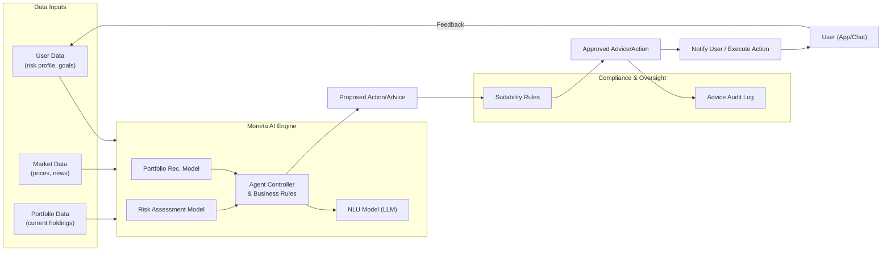

---
title: "Agentic AI Capabilities"
tags: [architecture, ai, agentic, fintech, personalization]
aliases: ["AI Capabilities", "Moneta AI", "AI Advisor"]
created: 2025-04-02 07:45:30
updated: 2025-04-02 07:45:30
---
# Agentic AI Capabilities

At the heart of Moneta is its _agentic AI_ — an AI system that doesn't just respond to user commands, but actively works on the user’s behalf to optimize their financial well-being. This section details how Moneta’s AI is architected, the capabilities it offers (proactive guidance and personalized strategies), and how it integrates with the rest of the platform in a safe and effective manner.

## Role of Agentic AI in Moneta

Moneta’s AI functions as a **personal financial agent** for each user, embodying several key capabilities:
- **Proactive Financial Guidance:** The AI continuously monitors relevant data (market conditions, the user’s portfolio performance, upcoming economic events, etc.). It identifies opportunities or risks and reaches out to the user with timely advice. For example, if the AI detects that a portfolio is over-exposed to a sector that is projected to underperform, it might suggest rebalancing _before_ the user asks.
- **Personalized Investment Strategies:** Using machine learning models, the AI crafts strategies tailored to the individual’s goals, risk tolerance, and life situation. This could include recommending a mix of assets (e.g., shifting 10% more into sustainable investments because the user indicated interest in ESG, or suggesting a higher savings rate if the AI knows the user’s goal is to buy a house in 5 years).
- **Automated Decision Support:** The AI can execute certain actions autonomously within preset boundaries. For instance, a user might enable “auto-rebalance” such that the AI will automatically perform minor portfolio adjustments if allocations drift too far, or “auto-invest” which deploys idle cash into the market following user-approved strategies. These actions always generate notifications and can require user confirmation depending on preferences.
- **Natural Language Interaction:** The AI is accessible via conversational interface. It can understand questions like “How can I reduce my taxes on investments?” or “Can I afford to invest more each month?” and provide answers or suggestions by analyzing the user’s data and general financial knowledge. This uses natural language processing (NLP) integrated with Moneta’s domain knowledge.

What makes the AI _agentic_ is its autonomy in certain aspects: it perceives changes, reasons about implications, and can act (or recommend action) without being explicitly prompted each time&#8203;:contentReference[oaicite:1]{index=1}. This dramatically enhances the user experience by reducing the need for constant manual checks and empowering even novice investors with an always-on expert assistant.

## AI Architecture and Components

The AI capability is delivered through a combination of components working in concert:
- **Data Inputs:** The AI consumes various data:
  - User-specific data: portfolio holdings, transaction history, financial goals, risk profile questionnaire results, spending patterns (if linked to bank accounts), etc.
  - Market data: real-time and historical prices, economic indicators, news sentiment (optionally).
  - Knowledge bases: financial ontologies or knowledge graphs encoding relationships (like correlations between indicators and asset classes) which help in reasoning.
- **AI Models and Engine:** There isn’t a single monolithic AI model; instead, multiple specialized models and algorithms form the AI engine:
  - A **Portfolio Recommendation Model** (e.g., using reinforcement learning or predictive analytics) that suggests asset allocations or portfolio changes aimed at improving returns for a given risk level.
  - A **Risk Assessment Model** that evaluates the risk of the current portfolio or a potential move (using techniques like Monte Carlo simulations or Value-at-Risk calculations accelerated by the AI).
  - A **Natural Language Understanding (NLU) Model** (likely based on a fine-tuned large language model) for interpreting user queries and generating human-friendly explanations. This could be something like an on-premise GPT-style model fine-tuned on financial FAQs and Moneta’s own knowledge.
  - A **Decision Logic/Agent Controller** that sits atop these models to orchestrate their outputs. For example, it might use a rule-based system combined with model outputs: “If the user’s portfolio deviates from target allocation by > X%, consider rebalancing suggestion using output from the Portfolio model, unless recent market volatility is above Y (then maybe wait).”
- **AI Service Implementation:** The above models run within the **AI Advisory Service** (from the back-end). The service might be broken internally into micro-components:
  - An **Inference API** that other services (or the chatbot) call to get recommendations or answers. This ensures that when the front-end requests “latest advice for user123”, the inference API gathers required data and runs the appropriate model logic then returns a result.
  - A **Scheduler/Watcher** that performs proactive tasks. This component subscribes to events (like market movements or daily portfolio value changes) and schedules AI tasks. E.g., end of each day, run a portfolio health check for each active user (this could be distributed across many worker instances for scale).
  - A **Learning Component** for continuous improvement, possibly offline. It could take feedback (did the user follow the advice? did it yield positive outcomes?) and feed that into model retraining. This might be part of an MLOps pipeline (discussed in Section 13) rather than real-time, to improve future recommendations.

- **Personalization Layer:** The AI keeps a profile for each user’s AI preferences and learnings. For instance, it might learn that a particular user prefers more conservative suggestions than their initial profile indicated (based on their interactions), and adjust accordingly. This profile is stored in the AI’s data store and used to bias model outputs for that user.

## Integration with Platform & Compliance Controls

Moneta’s AI is deeply integrated but also carefully controlled:
- **Integration with Back-End Services:** The AI service uses the Portfolio Service’s APIs to get up-to-date account info; uses the Trading Service to place trades if an automated action is confirmed; logs any advice or action to the Compliance Service. The AI does not bypass these services – e.g., it can’t execute a trade on its own without going through the Trading service (which applies checks like if markets are open, etc.).
- **Explainability and Transparency:** A critical requirement in finance is that advice can be explained. The AI is designed to provide a rationale for its suggestions (“I recommend selling 5% of Asset X because it has grown to 30% of your portfolio, above your target of 25%. This will help rebalance risk.”). Under the hood, the AI models output not just decisions but also key features/reasons which are translated into user-friendly text by the NLU component. This fosters trust and also helps Moneta comply with possible regulatory expectations for robo-advice transparency.
- **User Control:** Despite the AI’s autonomy, the user is always in control. They can set the degree of automation (full manual, semi-automated suggestions, or fully automated within limits). They can override or ignore advice, and the AI will adapt (e.g., if the user consistently ignores a type of suggestion, perhaps it is adjusted or presented differently next time).
- **Compliance and Ethical Guardrails:** The AI’s actions are bounded by rules set by the Compliance Service. For example, if a user is categorized as a novice investor, the AI will not suggest highly complex or extremely risky products without thorough warnings (in line with regulations for suitability). If a certain advice would trigger a regulatory red flag (say, frequent trading that looks like market manipulation or something), the AI either avoids it or flags it for human review. Moneta’s AI is also designed to avoid conflicts of interest (if Moneta ever has any of its own financial products, the AI will not unfairly favor them without basis).
- **Testing and Validation:** All AI models undergo rigorous testing before deployment: simulations on historical data, A/B testing with real users (with consent) to measure effectiveness, and bias audits to ensure fairness (e.g., the AI should not inadvertently favor or disfavor users based on protected attributes – which it shouldn’t even be aware of per data design).

## Technologies and Tools

From a technology standpoint, Moneta’s AI leverages:
- **Machine Learning Frameworks:** TensorFlow or PyTorch for training neural models (like the deep learning parts of the recommendation engine or NLU). The platform uses Python for AI development, given its rich ecosystem in finance and AI (with possibly some C++ for performance-critical parts).
- **AI Infrastructure:** A combination of CPUs and GPUs in the cloud for training and inference. Real-time inference for individual user queries is optimized to run on CPUs or modest GPUs for cost; whereas periodic deep analysis might use GPU clusters in the background.
- **Knowledge Bases:** Possibly an internal financial knowledge graph (using a graph database like Neo4j) for relationships and reasoning, and a vector store (like Pinecone or an open-source equivalent) for semantic search capabilities (for example, the AI can search a knowledge base of financial FAQs or regulatory info to augment its answers).
- **MLOps Pipeline:** As mentioned elsewhere, tools like MLflow or Kubeflow help manage model versions, experiments, and deployment. This ensures the AI models can be updated frequently as new data comes in or as better techniques are developed, without disrupting the platform.

> [!diagram] AI Capability Integration  
> The diagram illustrates how Moneta’s agentic AI components interact with the platform: it takes in data from user portfolios and market feeds, processes through various models, and outputs advice or actions that go through compliance checks and reach the user. The feedback loop for learning is also shown.

In this diagram, data inputs (user profile/goals, current portfolio state, market context) flow into the **AI Engine**, where multiple models analyze different aspects. The **Agent Controller** combines model outputs with predefined rules/strategies. A proposed action or advice (like “rebalance portfolio” or “suggest buying X”) is then checked by the Compliance rules (e.g., suitability, limits). If approved, it gets logged in the audit trail and then either communicated to the user (via notification or chatbot) or executed through the appropriate service (which would also notify the user). The user’s response or outcome (feedback loop) goes back into user data (for example, if the user declines advice, that might update their preference or the AI’s understanding of the user).

**In summary,** Moneta’s agentic AI is a sophisticated ensemble that brings proactive intelligence to personal finance. Architecturally, it’s treated as a first-class component but with oversight and integration such that its autonomy never compromises compliance or user trust. It can be thought of as a tireless co-pilot for the user’s financial journey: always learning, always watching the road ahead, but deferring to the human driver’s final decisions. This synergy of AI and human control is what makes Moneta both cutting-edge and responsible.