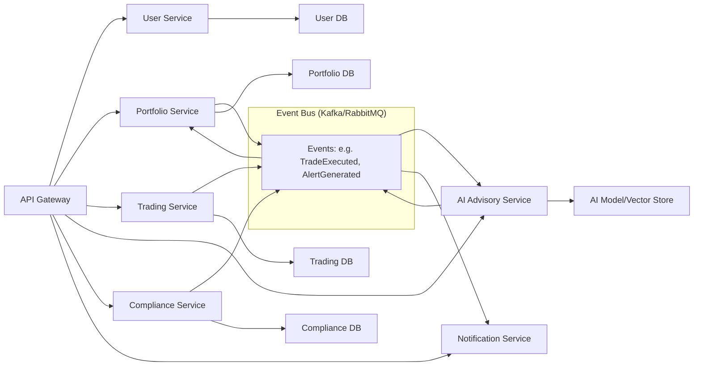

---
title: "Back-End Architecture"
tags: [architecture, backend, microservices, api, server]
aliases: ["Moneta Backend", "Server Architecture", "Microservices"]
created: 2025-04-02 07:45:30
updated: 2025-04-02 07:45:30
---
# Back-End Architecture

Moneta’s back-end is the engine that powers its intelligent investing features. It is designed as a **modular, microservices-based** system, encapsulating distinct domains such as user management, portfolio management, trading, AI advisory, and compliance. This separation of concerns enhances scalability, maintainability, and allows different teams to develop and deploy features independently. This section describes the overall structure of the back-end, the responsibilities of key services, and how they interact.

## Microservices and Domain-Driven Design

The back-end is organized around business domains, each implemented as one or more microservices. Key services include:
- **User Profile Service:** Manages user accounts, profiles, preferences, and authentication (if not offloaded to a dedicated identity provider). It stores personal information in compliance with GDPR (ensuring fields like emails, names, etc., are encrypted at rest and access-controlled).
- **Portfolio Management Service:** Handles users’ portfolios, including asset holdings, transaction history, performance calculations, and risk profile. This service implements core investment logic (e.g., portfolio rebalancing algorithms when instructed by the AI or user) and interacts with market data to value assets.
- **Trading Service:** Responsible for executing trades and transactions. It interfaces with external brokerage APIs or trading systems to buy/sell stocks, funds, or other instruments on behalf of users. It also handles order management, status tracking, and ensures that trades are executed within compliance constraints (for example, not exceeding a user’s risk limits or violating trading rules).
- **AI Advisory Service:** The heart of Moneta’s agentic AI capabilities (detailed in Section 6). This service runs the AI models that provide recommendations, insights, and autonomous actions. It can be broken into sub-components (for different AI tasks like prediction, natural language understanding, decision logic). It communicates with the portfolio service (to get user data), market data (for real-time info), and possibly an **AI Model Store** (for loading the latest ML models).
- **Compliance & Risk Service:** Monitors and enforces regulatory compliance and risk management. It runs automated checks on advice and trades (ensuring suitability and flagging anything that might breach FCA or MiFID II rules). It also logs actions for audit trails. This service might incorporate rule engines or even ML models for fraud detection or AML (Anti-Money Laundering) alerts, ensuring a proactive stance on security and compliance.
- **Notification/Communication Service:** Handles delivery of notifications and communications to users. For example, if the AI triggers an alert (“Market drop of 5%, your portfolio is affected”), this service ensures the message is formatted and delivered via the appropriate channel (push notification, email, chatbot message). It may integrate with third-party email/SMS services and ensure compliance with user communication preferences.

These services communicate mostly via REST/GraphQL calls through the API gateway (for synchronous client requests) and also publish/subscribe to events via an internal event bus for asynchronous processing. **Domain-driven design (DDD)** principles ensure each service has a well-defined responsibility and data model, reducing overlap. For instance, only the Portfolio service deals with portfolio calculations; the AI service queries the Portfolio service instead of having its own copy of that logic.

## Service Integration and API Gateway

Moneta employs an **API Gateway** as part of its integration layer (see Section 4) which fronts all the microservices. This gateway routes client requests to the appropriate service and handles cross-cutting concerns like authentication, rate limiting, and aggregation:
- For example, a dashboard screen in the app might require data from the User, Portfolio, and AI services. Rather than the client calling each microservice individually, the API Gateway can provide a **composition endpoint** (or using GraphQL, a single query) that fetches and combines data from multiple services, returning a unified response. This _Backend-for-Frontend_ pattern reduces round trips and keeps the front-end simple.
- The API Gateway also simplifies versioning and potential refactoring of microservices: internal service endpoints can change or be split, while the gateway can continue presenting a stable external API to clients.

Internally, microservices might also communicate directly with each other for certain operations:
- **Synchronous calls:** e.g., the AI Service might synchronously call the Portfolio Service to get the latest portfolio snapshot during a recommendation cycle. These calls use lightweight protocols (REST or gRPC) within the cluster, and service discovery (possibly via Kubernetes or a service mesh like Istio) to find each other.
- **Asynchronous messaging:** Many operations use an event-driven approach. For instance, when a trade is executed by the Trading Service, it could emit an event “TradeExecuted” on a message bus (Kafka or RabbitMQ). The Portfolio Service listens and updates the portfolio, the AI Service listens to re-evaluate advice, and the Notification Service listens to inform the user. This decoupling via events improves scalability and resilience (services can function if one is temporarily down, processing the event when it’s up).

## Data Access and Storage in Back-End

Each microservice has its own database or schema as needed (the **polyglot persistence** approach):
- The **User Service** might use a relational database (e.g., PostgreSQL) for user data and authentication credentials, ensuring strong consistency for user records.
- The **Portfolio Service** could use a combination: a relational DB for structured data (holdings, transactions) and possibly a time-series database for historical price data or a cache for quick portfolio valuations.
- The **Trading Service** likely uses a relational DB or key-value store to track pending orders and transactions reliably.
- The **AI Advisory Service** might not have a traditional DB for user data (it fetches from others), but it could utilize a vector database (for embeddings of financial knowledge or user behavior patterns) or store model outputs. It also might use an in-memory data grid for fast computations.
- The **Compliance Service** might use a graph database or rule database if needed to model relationships (for AML, relationships between accounts) or just a relational store for audit logs and compliance records.
- Shared or read-optimized replicas may exist for complex queries (for example, an analytics database that aggregates data from multiple services for dashboards or regulatory reporting).

Importantly, one service will not directly access another service’s database; all interactions go through service APIs or events. This enforces loose coupling and makes it easier to change implementations internally.

## Scalability and Resilience at the Back-End

The back-end is designed to **scale horizontally**:
- Each microservice is stateless (where possible), meaning any instance can handle any request (stateful info like sessions are stored in the database or a distributed cache). This allows running multiple instances behind a load balancer. For example, during peak trading hours, extra instances of the Trading and AI services can be spun up to handle load.
- Services are containerized (using Docker) and orchestrated by Kubernetes (as described in Infrastructure section). Kubernetes handles automatic scaling (based on CPU/memory or custom metrics, like number of incoming requests or queue length).
- Circuit breakers and timeouts are used in service-to-service calls to prevent cascading failures (e.g., if the Market Data external API is slow, the AI Service will not hang indefinitely and the system might serve slightly stale data with a warning).
- Each microservice publishes health checks. The orchestration layer or service mesh routes traffic only to healthy instances (and can restart or replace unhealthy ones).

Error handling and resilience are baked in:
- If the AI Advisory Service is unavailable for a moment, the system might degrade gracefully by showing last known advice or a message to the user instead of failing completely.
- The event-driven parts use retry mechanisms and dead-letter queues for events that couldn’t be processed, ensuring no data is lost even if a service is temporarily down.

> [!diagram] Back-End Service Architecture  
> The diagram shows Moneta’s back-end microservices and their interactions. Key domain services (User, Portfolio, Trading, AI, Compliance, Notifications) communicate via the API Gateway for client-facing requests and via an internal event bus for asynchronous events. Each service has its own data store, reinforcing the modular design.

In this diagram, solid arrows from **API Gateway** to services indicate synchronous request/response flows for API calls. The **Event Bus** subgraph represents the asynchronous channel: for instance, the Trading Service emits an event after executing a trade; the Portfolio Service picks it up to update holdings, the AI Service picks it up to reconsider its advice, and the Notification Service picks it up to notify the user. Each service is shown connected to its own database (or data store), highlighting the _database-per-service_ pattern. The AI Service is depicted with a connection to a **ModelStore**, which could be a specialized repository for ML models or feature vectors.

**In summary,** Moneta’s back-end architecture is a collection of focused microservices that together provide the platform’s rich functionality. This structure ensures that each concern (from trading to advice to compliance) can scale and evolve independently. The use of an API gateway and message bus provides a robust communication fabric, and the careful data segregation upholds security and integrity. The back-end is thus well-prepared to handle both current needs and future expansion, aligning with Moneta’s objective of a resilient, scalable investment platform.