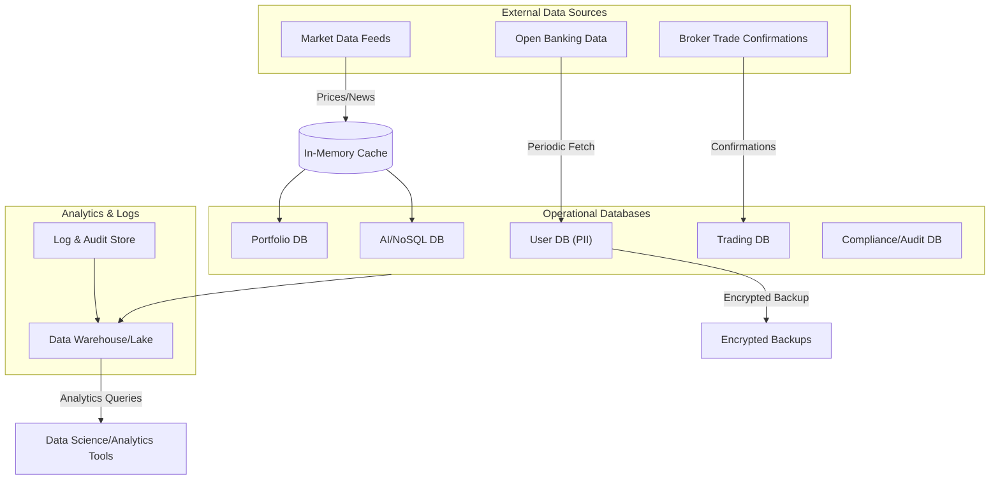

---
title: "Data Architecture"
tags: [architecture, data, database, storage, GDPR]
aliases: ["Moneta Data", "Data Management", "Data Strategy"]
created: 2025-04-02 07:45:30
updated: 2025-04-02 07:45:30
---
# Data Architecture

Data is at the core of Moneta’s intelligent investing platform. The data architecture is designed to securely store and manage a wide variety of data – from sensitive personal information to real-time financial market feeds – while ensuring compliance with privacy regulations and enabling advanced analytics. This section outlines how data is organized, stored, and accessed in Moneta, covering operational databases, analytical data stores, data flow, and governance.

## Data Categories and Storage Solutions

Moneta deals with several types of data, each with different requirements:
- **User Data (PII):** Personal identifiable information such as names, addresses, emails, and KYC documents. This data is stored in a **relational database** (e.g., PostgreSQL) within the User Profile Service’s domain. It is encrypted at rest (using transparent data encryption) and in transit. Access to PII is strictly limited and audited, fulfilling GDPR’s emphasis on protecting personal data. Fields like passwords (if any) are hashed with strong algorithms (bcrypt/PBKDF2).
- **Financial Account & Portfolio Data:** Information about user portfolios, holdings, transactions, bank account links, etc. Portfolio and transaction data also reside in a relational database (for ACID properties ensuring consistency of trades and balances). Some historical data might be stored in a **time-series database** or a specialized format, particularly price history or account value over time, to facilitate quick retrieval of time-based charts or analytics.
- **Market and External Data:** Real-time or near-real-time data from external sources (stock prices, fund NAVs, news, economic indicators). Instead of storing a full history on Moneta’s side, the system caches recent data in an in-memory store like **Redis** for quick access (e.g., the latest prices for display and AI analysis). For longer-term needs, relevant slices of market data are stored in a data lake or time-series store if needed for back-testing algorithms. Bulk historical data might be kept in an **analytics store** (described below) rather than the operational DB.
- **AI Data and Models:** Data used by AI models, such as aggregated user behavior, investment patterns, or feature vectors derived from raw data. These could be stored in a **NoSQL database** or **distributed file store**. For example, user risk profiles or preferences might be stored in a document store like MongoDB as part of the AI service, or the embeddings from a machine learning model could be stored/retrieved from a vector database. Additionally, trained AI model files (e.g., a TensorFlow/PyTorch model) are stored in a secure model repository (possibly on cloud storage) and loaded by the AI service as needed.
- **Logs and Audit Trails:** Every significant action (trade execution, advice given by the AI, user consent changes) generates log entries or audit records. These are stored in an append-only log system or central logging service (like the ELK stack – Elasticsearch for storing logs) to ensure they are tamper-evident and queryable for compliance audits.
- **Analytics & Data Warehouse:** Moneta aggregates anonymized data for insights (like usage statistics, model performance, business KPIs). A separate **data warehouse** or **data lake** is maintained (e.g., on Snowflake, BigQuery, or a self-managed Hadoop/S3-based lake). This analytical store collects data from operational databases (via scheduled ETL jobs or streaming pipelines) to allow complex queries and analysis without affecting production operations. It’s used by data science teams to improve AI models and by business to track platform performance. Only non-PII or properly anonymized data goes into analytics to respect privacy.

## Data Flow and Processing

Data flows through the Moneta system in controlled pipelines:
- **Ingestion of External Data:** Market data arrives via the Market Data Adapter (from the Integration layer) and is immediately disseminated to interested services (AI, Portfolio) and cached. Bank account info flows in via the Banking Adapter when a user connects an account or on periodic refresh, and is stored under the user’s profile/portfolio after passing through the compliance checks (e.g., confirming we have user consent and it’s within usage bounds).
- **Real-time Processing:** Certain events, like a sharp market movement, trigger the AI service to recalc recommendations. This happens through the event-driven architecture – e.g., a market data event triggers the AI service which then possibly updates advice in the AI database and notifies the user. This real-time pipeline is designed to handle bursts of data (like many price updates during trading hours) by using message queues and back-pressure if needed (dropping or sampling minor updates if overwhelmed, to focus on significant ones).
- **Batch Processing:** At end-of-day or scheduled intervals, batch jobs might run to generate reports (e.g., daily portfolio performance summary emailed to users, or compliance reports checking all advice given that day against regulations). These jobs read from operational stores and write to either user-facing outputs or compliance archives. The architecture might include a **stream processing** component (like Apache Spark or Flink) to handle continuous aggregation (for analytics dashboards) and a scheduler (like Airflow) for orchestrating nightly jobs.
- **Data Lifecycle Management:** Moneta implements retention policies: for example, detailed log data might be kept for X months, then archived or deleted; user’s personal data is deleted or anonymized upon account deletion to fulfill GDPR’s “right to be forgotten”. The architecture includes a data retention service or scheduled tasks that periodically scrub or archive data according to these policies. Backups of databases are taken regularly (with encrypted backups stored in secure, separate locations), and those too respect retention (e.g., not holding old backups beyond a limit).

## Data Governance and Compliance

Ensuring data quality, privacy, and compliance is fundamental:
- **Master Data Management:** Consistent identification of data across services (for example, a user ID is unique and used to join data from different sources when needed, such as compiling a full report for a user). The system avoids duplication of master data across services by referencing IDs – e.g., the AI service doesn’t copy all user details, it queries user service or uses IDs to fetch when needed.
- **GDPR Compliance:** Moneta’s data architecture supports GDPR by design:
  - It records user consent for data processing in the User service, and all other services check this before processing sensitive data. If a user withdraws consent for certain data usage (say for AI profiling), that preference is propagated and respected (AI service might stop processing that user’s data and possibly purge related derived data).
  - The data export and deletion processes are facilitated by centralizing PII mostly in the User and Portfolio services. A “Data Subject Access Request” can compile data from these services, and a deletion request triggers a cascade to remove or anonymize personal identifiers in each service’s store. The architecture supports tagging of personal data vs non-personal, so the deletion process knows what to scrub and what can be retained (for legitimate interests, etc., often after anonymization).
- **Access Control:** At the database level, strict access policies ensure only the appropriate service or role can access data. For instance, the AI service might only have read-access to necessary parts of user data (like risk tolerance or past decisions) but not to sensitive personal identifiers it doesn’t need. Database accounts/credentials are unique per service to enforce this.
- **Monitoring Data Integrity:** The platform includes monitoring for data consistency. For example, if a transaction event is missed (in rare cases), reconciliation jobs compare external statements (from the brokerage or bank) with Moneta’s records to find discrepancies. Any mismatch triggers alerts to investigate data integrity issues.
- **Audit Trails:** As part of compliance, the system keeps an audit log of data access. If an admin or system component accesses sensitive data, it’s logged (who/what accessed, when, and why if applicable). These logs help demonstrate compliance with regulations like the FCA’s requirements for record-keeping and auditability of advice and transactions.

> [!diagram] Data Architecture Overview  
> This diagram depicts Moneta’s data architecture: the separation of operational databases for each service, a centralized analytics warehouse, and data flows (ingestion, real-time, batch) that move data through the system. It also highlights security layers like encryption and access control around each data store.

In this diagram, **Operational Databases** for each domain (user, portfolio, trading, etc.) handle live transactions. External data flows in: Market feeds go into a **Cache** (like Redis or Kafka streams) then into relevant databases or directly consumed by services (e.g., AI). Bank and broker data arrive via integration services into the respective stores. Operational DBs and log stores then funnel data into the Analytics Warehouse for offline analysis. Encrypted backups of critical databases are shown going to secure storage. The separation ensures that day-to-day operations and long-term analytics are distinct, improving performance and security. The elements are connected with annotations like “Encrypted Backup” to emphasize security measures in data handling.

**In summary,** Moneta’s data architecture carefully balances the need for rich, real-time data capabilities with the stringent requirements of security and privacy. By using the right tool for each type of data (SQL, NoSQL, time-series, etc.) and enforcing governance, Moneta ensures data is available to power AI insights and user features while respecting user rights and regulatory obligations. This robust data foundation is what enables Moneta’s AI to be intelligent and reliable, and the platform to be trustworthy with user data.