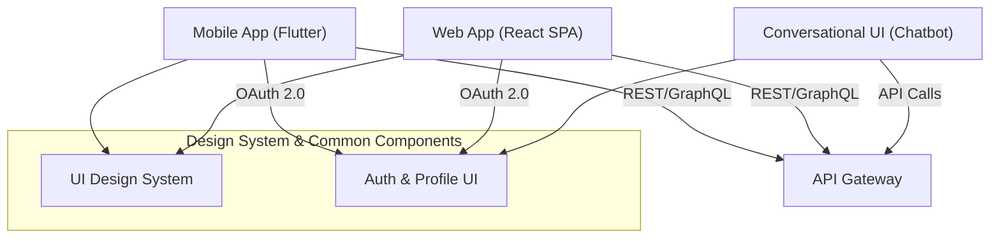

**Front-End Architecture (Section 2)**

```markdown
---
title: "Front-End Architecture"
tags: [architecture, frontend, ui, ux, mobile, web]
aliases: ["Moneta Frontend", "UI Architecture", "User Interface"]
created: 2025-04-02 07:45:30
updated: 2025-04-02 07:45:30
---
# Front-End Architecture

Moneta’s front-end is the user’s gateway to the platform’s capabilities, and it is designed to be **responsive, accessible, and consistent** across all devices. The front-end architecture encompasses web, mobile, and conversational interfaces, all adhering to a unified design system and communicating with back-end services via well-defined APIs. This section describes how each client interface is structured and how they collectively provide a seamless user experience.

## Multi-Platform User Interface Design

To reach users wherever they are, Moneta offers multiple client platforms:
- **Web Application (Desktop & Mobile Web):** Built as a single-page application (SPA) using a modern framework (e.g. **React** with TypeScript), ensuring a dynamic and responsive user experience in browsers. The web app uses a component-based architecture and a shared design system for consistency. 
- **Mobile Apps (iOS & Android):** Developed using a cross-platform framework like **Flutter** or **React Native**, or natively for each platform if needed for performance. Mobile apps provide offline access for certain features (e.g., viewing cached portfolio data or educational content) and use push notifications for real-time alerts from the AI advisor.
- **Conversational Interface:** A chat/voice-based interface integrated via platforms like **WhatsApp, Slack, or voice assistants (e.g. Alexa/Google Assistant)**. This interface allows users to interact with Moneta’s AI agent through natural language. It uses a conversational AI backend (integrated with Moneta’s core AI service) to understand user queries and provide friendly guidance or perform actions (after confirming user intent).

All interfaces utilize the same backend services through the integration layer, which ensures that whether a user is clicking a button on the web app or asking a question via voice, the underlying business logic and data retrieval are consistent.

## Architecture and Tech Stack

The front-end architecture emphasizes modularity and reuse:
- **Design System & UI Components:** Moneta has a centralized design language (colors, typography, UI components) to ensure brand and experience consistency. Components (buttons, charts, forms, etc.) are reused across web and mobile, possibly facilitated by a library like Storybook for consistency. This ensures a familiar look-and-feel on all platforms.
- **State Management:** Each client uses robust state management (e.g., Redux or React Context for web, and equivalent patterns in mobile) to handle complex states like user session, real-time market feeds, and multi-step workflows (like onboarding or making an investment).
- **Localization & Internationalization:** Given Moneta’s European/UK user base, the front-end supports multiple languages and regional formats (dates, currencies). Architecture includes an i18n library to load translations and adapt content dynamically, enabling seamless switching and compliance with local language requirements for financial communications.
- **Performance Optimization:** Techniques like code splitting, lazy loading of modules, and efficient rendering are used in the web app to ensure fast load times. For mobile, assets and data are optimized, and critical interactions happen swiftly (e.g., using local caching for recent data). Real-time updates (such as price changes or AI notifications) are delivered via WebSockets or push notifications, ensuring users get timely information without constantly refreshing.

## Interaction with Back-End and Security

All front-end clients communicate with the back-end through the **API Gateway** (described in the Integration Layer section). The communication is secured with TLS (HTTPS) and utilizes modern authentication flows:
- **OAuth 2.0 + OIDC:** Users authenticate via an identity service (could be AWS Cognito, Auth0, or a custom identity microservice). Tokens (JWT access and refresh tokens) are obtained and stored securely (HTTP-only cookies for web, secure storage for mobile). This allows single sign-on across devices and integration with third-party identity providers if needed.
- **Input Validation & UX Layer of Security:** The front-end performs client-side validation for inputs (to provide instant feedback for, say, form errors or risky operations), complementing server-side validation. Sensitive actions (like transferring funds or changing account settings) prompt additional verification (e.g., 2FA or biometric verification on mobile).
- **Consent and Privacy UI:** To comply with GDPR, the front-end has clear consent dialogs and settings. For example, on first use it asks permission for data processing or enabling the AI advisor. Users can access a “Privacy Dashboard” in the UI to manage their data preferences, download their data, or request deletion, with the front-end invoking appropriate back-end services for these actions.

## User Experience and Accessibility

Moneta’s UI is designed with a **user-centric and inclusive approach**:
- **Intuitive Navigation:** Clear menus and onboarding wizards guide users through setting up their profile, risk preferences, and connecting bank accounts. The AI assistant is introduced in a friendly manner, with tips on how it can help.
- **Accessibility:** The web and mobile apps follow WCAG guidelines (e.g., screen reader support, high-contrast themes, scalable fonts) to ensure even users with disabilities can effectively use the platform. Voice interfaces naturally assist those who prefer auditory interaction.
- **Conversational UX:** The chat/voice interface is integrated but also available within the web/mobile app as an “Ask Moneta” chatbot. This ensures even within the traditional UI, users can interact with the AI in natural language, bridging the gap between conventional navigation and conversational AI.
- **Real-Time Feedback:** When the AI agent performs actions like rebalancing a portfolio or when markets move significantly, users get real-time feedback on all their devices. A notification might open a deep link in the app showing what happened (e.g., “Moneta rebalanced 5% of your portfolio from bonds to stocks based on your settings”).

> [!diagram] Front-End Ecosystem  
> The diagram illustrates Moneta’s front-end ecosystem: a web SPA, mobile apps, and conversational interfaces all accessing back-end services uniformly. It shows common components like the design system and identity management, highlighting consistency across platforms.


In this diagram, the **Design System & Common Components** block indicates that both web and mobile share styling and component guidelines. Authentication and profile management UI is also shared conceptually (ensuring users have a consistent login and settings experience). All front-end clients communicate with the **Backend API Gateway** using secure protocols. The conversational UI (which could be a chatbot on the web or an external messenger integration) also uses the same gateway, although it may use a different authentication mechanism (like token-based auth in a chat platform).

**In summary,** Moneta’s front-end architecture is built to provide a rich, secure, and uniform experience. By using modern frameworks, a shared design system, and focusing on performance and accessibility, the platform ensures that interacting with Moneta is convenient and trustworthy, whether through clicking, tapping, or talking. The front-end is tightly integrated with back-end services but remains decoupled from specific implementations through the API layer, allowing the UI to evolve (or new clients to be added) without breaking the system’s core.