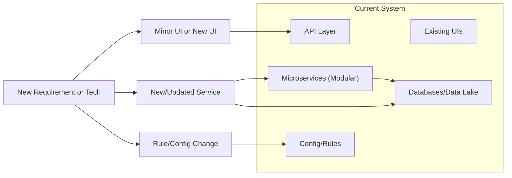

**Future-Proofing Strategy (Section 11)**

```markdown
---
title: "Future-Proofing Strategy"
tags: [architecture, future, innovation, extensibility, strategy]
aliases: ["Future Strategy", "Moneta Future", "Extensibility"]
created: 2025-04-02 07:45:30
updated: 2025-04-02 07:45:30
---
# Future-Proofing Strategy

Designing Moneta with the future in mind ensures the platform remains relevant and robust amid rapid technological, regulatory, and market changes. This section describes how Moneta’s architecture is built to be adaptable and forward-compatible, allowing easy incorporation of new features, technologies, and compliance requirements. Future-proofing is achieved through modularity, technology-agnostic design, and a culture of continuous improvement.

## Modular and Extensible Architecture

Moneta’s modular microservice architecture (as detailed earlier) is itself a key future-proofing element:
- **Plug-and-Play Components:** Each service can be updated or replaced with minimal impact on others as long as it respects the agreed interface (API or event contracts). For example, if a better portfolio calculation engine comes along, the Portfolio Service could be re-written or swapped out, while other parts of the system (AI, front-end) continue to operate using the same API calls. This containment of changes makes the system resilient to shifts in particular technology stacks.
- **Adding New Services:** If Moneta wants to add a new capability (say, a Tax Optimization Service or integration with a new asset class like crypto wallets), a new microservice can be introduced and integrated via the existing integration layer. This avoids massive rewrites of monolithic code; instead, new modules extend the overall system.
- **APIs and Interfaces:** By relying on well-defined APIs (REST/GraphQL) and messaging contracts, Moneta can evolve internal implementations without breaking clients. Additionally, adopting GraphQL at the gateway could allow adding new fields or types for new features without affecting older clients (which simply won’t query the new data).
- **Configurable Business Rules:** Many aspects (like compliance thresholds, risk parameters for AI, UI feature flags) are externalized in configuration or a rules engine. This means when regulations or business strategies change, a configuration update (or hot-swappable rule set) can adjust behavior without code changes. For instance, if a new EU law requires a certain disclosure before making a trade, a flag can enable a new UI dialog and require an extra API call to confirm it, instead of redesigning the flow from scratch.

## Technology Agnosticism and Upgradability

While Moneta uses specific technologies today, it’s built to avoid lock-in and to embrace new tech when beneficial:
- **Cloud-Agnostic Deployment:** By using Kubernetes and abstracted data layers, Moneta isn’t tightly coupled to a single cloud provider’s proprietary services. This means if needed, it could migrate to a different cloud or even a hybrid/on-prem setup (for a bank partnership, perhaps) with relative ease. Using Terraform for infrastructure means cloud resources can be re-provisioned on another platform by changing the provider configurations.
- **Swappable Components:** At the infrastructure level, if a better tool emerges (say a new type of database or a faster streaming system), Moneta can consider swapping it. Because each service’s persistence is decoupled (via repositories/DAOs patterns in code), one could migrate, for example, from MongoDB to a new distributed SQL database by implementing a new adapter without changing business logic.
- **Incremental Upgrades:** The system is set up for continuous delivery, which supports incremental improvements rather than big bang reboots. This means as technology evolves, Moneta can continuously integrate improvements. For example, as new versions of libraries or frameworks come out, they can be tested and rolled in gradually, keeping the system up-to-date. The architecture avoids any hard dependencies on deprecated technology by regularly refactoring those parts.
- **Emerging Tech Integration:** The design anticipates areas of innovation:
  - If quantum computing or advanced analytics needed more specialized processing, Moneta can integrate with specialized services (e.g., offloading certain computations to a quantum service via APIs when that becomes viable).
  - If user interfaces evolve (say AR/VR investing apps, or in-car assistants), the multi-channel approach of the front-end means adding a new interface type is manageable. We already have conversational; adding an AR interface could reuse the same APIs with a new presentation layer.
  - If AI leaps forward (e.g., artificial general intelligence or new frameworks), Moneta’s AI service can incorporate those. The use of MLOps pipelines means the team is continually evaluating model performance and can adopt new model architectures (transformers, graph neural networks, etc.) as they prove themselves, without altering the rest of the system.
  
## Adaptability to Regulatory Changes

Financial regulations will evolve, and Moneta’s compliance architecture is built to adapt:
- **Rule Engine for Compliance:** As mentioned, many compliance checks are in a rules engine. If regulations change (like new MiFID guidelines or tax laws), updating the rules doesn’t require re-coding fundamental logic. The compliance team can update rule sets (maybe via a UI or config files) and deploy those changes quickly. The architecture supports versioning of rules, so changes can be tested (e.g., simulate how the new rules behave on recent data).
- **Audit and Transparency:** If regulators demand more transparency or data, Moneta’s logging and audit systems can be scaled or adjusted. The modular logging pipeline can incorporate new fields or new event types to log (for instance, if a new requirement is to log the rationale of AI decisions in a specific format, the AI service can be updated to output that to the log store).
- **Data Retention Laws:** Should laws like GDPR get updates (or new laws like the ePrivacy Regulation come in), Moneta’s data architecture (with centralized privacy controls and data tagging) allows identifying what data is affected and adjusting retention or consent flows accordingly. For example, if a law mandates shorter retention for certain data types, a configuration change to the retention policy service can enact that.
- **Scalability of Compliance Tools:** If the user base increases or compliance monitoring needs to become more sophisticated (say regulators want real-time reporting of certain metrics), Moneta’s compliance service can be scaled or new monitoring microservices added, benefiting from the existing event streams.

## Continuous Learning and Improvement

Future-proofing is not just technical but also procedural:
- **AI Feedback Loop:** Moneta’s AI is built to learn from new data (market or user behavior). This means its advice quality should improve over time, keeping the platform competitive and useful. The architecture includes retraining pipelines, which means Moneta’s AI can adopt new knowledge (like data from a recession period to better handle future downturns).
- **User Feedback Integration:** The system collects user feedback (explicit, through surveys or implicit, through usage patterns). This can inform what new features to prioritize. If users start heavily using conversational interface over the app, resources can shift to boost that experience. The modular front-end allows such shifts without redoing everything.
- **Observability Data:** As described in Observability (Section 14), Moneta collects a lot of metrics. These metrics can indicate performance trends, capacity needs, or user engagement changes. By analyzing them, the team can foresee scaling needs or identify components that will soon need an upgrade (future capacity planning).
- **Community and Open-Source:** Wherever possible, Moneta relies on open standards and possibly open-source components. This gives it a broad community pool to draw improvements from. If a vulnerability or inefficiency is found in an open source library, often the community addresses it quickly, or Moneta can switch to another library. Moneta avoids proprietary traps that could stagnate the platform.
  
## Innovation Friendly

The architecture fosters innovation by making experimentation easier:
- **Feature Flags and Experiments:** New ideas can be deployed behind feature flags to a subset of users. This allows testing things like a new robo-advice algorithm or a new UI layout without committing fully. If it performs well (future improvement), it can be rolled out; if not, it can be turned off with minimal disruption.
- **Developer Sandbox:** Having infrastructure as code means spinning up a full sandbox of Moneta is relatively easy for R&D. Developers can create a mini environment to try a major change (like switching a database engine or refactoring a service) and see impact, which encourages trying bold changes in a safe way.
- **Documentation & Knowledge Base:** The architecture includes thorough documentation (and architecture decision records as in Section 12). This means as new team members join or new stakeholders come in, they can understand the system’s design intent. Preserving this knowledge ensures that future modifications respect the original principles or consciously deviate when needed rather than accidentally introducing regressions or anti-patterns.
- **Scalable Organization:** Microservices allow teams to work in parallel. As Moneta grows, the engineering team can also scale (more squads focusing on different areas). The architecture won’t bottleneck on a single team’s knowledge. This organizational scalability is a kind of future-proofing for development capacity.

> [!diagram] Future-Proofing Architecture Elements  
> The diagram illustrates aspects of Moneta’s architecture that enable future changes: modular services, configuration/rules layers, and integration points for new modules. It shows how a new feature or requirement flows through minimal parts of the system due to this setup.


```
In this diagram, a "New Requirement or Technology" (like regulatory change, new feature, or new integration) can lead to either a small UI update or a new UI component, a new or updated microservice, or simply a change in configuration/rules. The existing architecture (API Gateway, Microservices, DataStores) accommodates these without fundamental overhaul. The new service plugs into the services mesh and uses existing data stores or new ones as needed. Because of this, the impact of changes remains localized.

**In summary,** Moneta’s architecture is not a static plan but a living structure designed to evolve. By emphasizing modularity, configurability, and continuous evolution, the platform is prepared for whatever the future holds – be it new user demands, cutting-edge AI techniques, changes in the financial world, or regulatory shifts. This future-proofing approach ensures that Moneta can continue to innovate and deliver value over many years without needing a complete redesign every time the landscape changes.

