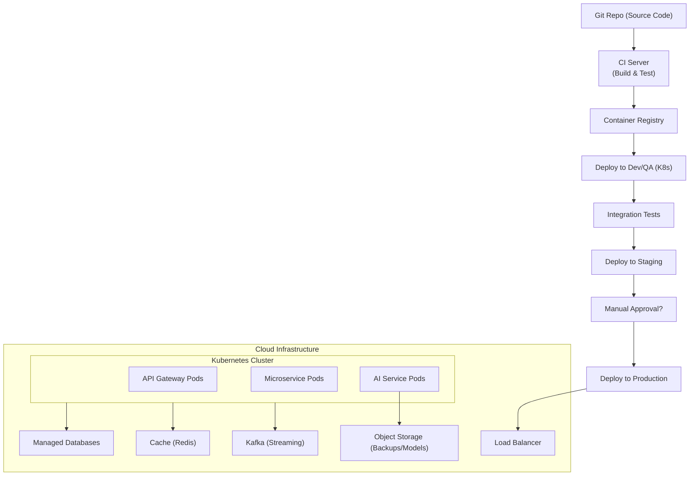

**Infrastructure & Deployment (Section 8)**

```markdown
---
title: "Infrastructure & Deployment"
tags: [architecture, infrastructure, cloud, devops, deployment]
aliases: ["Moneta Infrastructure", "Deployment Architecture", "Cloud Deployment"]
created: 2025-04-02 07:45:30
updated: 2025-04-02 07:45:30
---
# Infrastructure & Deployment

Moneta’s platform is deployed on a modern cloud infrastructure that ensures scalability, high availability, and efficient delivery of new features. This section covers the physical and virtual infrastructure layout, deployment pipelines, and DevOps practices that keep Moneta running smoothly and continuously updated.

## Cloud Environment and Architecture

Moneta is designed as a cloud-native application. The infrastructure could be hosted on a major cloud provider (e.g., AWS, Azure, or GCP) with a focus on using managed services where appropriate to reduce operational overhead:
- **Kubernetes Orchestration:** All microservices (including the AI components, API gateway, etc.) run in containers orchestrated by **Kubernetes**. This provides portability (ability to run on any cloud or on-prem if needed) and efficient resource utilization. Kubernetes is deployed across multiple availability zones within a region (e.g., AWS EU-West or Azure UK region) to ensure resilience against data center-level outages.
- **Service Mesh:** To manage inter-service communications securely and reliably, a service mesh like **Istio** or Linkerd is used on top of Kubernetes. This provides mTLS between services, fine-grained traffic control (for canary deployments, A/B testing), and observability of service-to-service calls.
- **Auto-Scaling:** The infrastructure is set to auto-scale based on metrics. Kubernetes Horizontal Pod Autoscaler increases or decreases pods for services as needed (for example, scaling out the AI service or the API gateway during peak usage). Similarly, the underlying cloud VMs (nodes) can auto-scale within set limits to ensure enough capacity.
- **Multi-Region Strategy:** Initially, Moneta might deploy to a primary region (say, in the EU for data residency compliance). For fault tolerance and latency, a secondary region can be on standby or active-active (depending on complexity). In case of a region outage, failover procedures exist to switch to the secondary region with minimal downtime. Data replication between regions is set up for critical data (with respect for compliance – e.g., EU user data stays in EU region, UK in UK if needed post-Brexit; Moneta might maintain separate clusters for EU and UK if required by regulators).
- **Content Delivery Network (CDN):** Static assets of the front-end (images, JS bundles, etc.) are served via a CDN for fast global access. Also, if Moneta provides e.g. educational videos or content, those are delivered through CDN. The CDN also helps absorb traffic spikes and provides an additional layer of DDoS protection.

## CI/CD Pipeline

Moneta embraces DevOps with an automated Continuous Integration/Continuous Deployment (CI/CD) pipeline:
- **Code Integration:** When developers commit code, a CI system (like **GitLab CI, GitHub Actions, or Jenkins**) runs automated build and test jobs. This includes running unit tests for each service, integration tests for API contracts, and static code analysis/security scans as mentioned.
- **Container Build & Registry:** Each microservice is packaged as a Docker container. The CI pipeline builds these images (tagged with git commit hashes or version numbers) and pushes them to a secure container registry. 
- **Automated Testing:** Beyond unit tests, the pipeline triggers more extensive tests:
  - **Integration Tests:** Perhaps spin up a test environment (using containers or cloud test stack) to test interactions between services (for example, ensuring the portfolio service correctly talks to the database, or the AI service responds via the API gateway).
  - **Performance Smoke Tests:** Basic performance tests to catch any large regressions (if a change drastically slowed down a service, it's flagged before deployment).
- **Deployment Strategy:** Moneta likely uses Infrastructure-as-Code (IaC) tools like **Terraform** or CloudFormation to manage cloud resources (networks, DB instances, etc.), ensuring reproducible environments. For deploying the application:
  - **Rolling Deployments or Blue-Green:** Kubernetes handles rolling updates for services. One by one, pods are replaced with the new version, ensuring the service remains available. If any health check fails, Kubernetes can rollback.
  - For bigger changes, a **blue-green deployment** might be used: deploy a new set of services in parallel (green) while old (blue) still runs, test the new ones, then switch traffic. This minimizes risk of downtime.
  - **Canary Releases:** Using the service mesh, Moneta can do canary releases for critical user-facing services. For example, route 5% of traffic to a new AI service version while 95% use the old, monitor results, then ramp up if all is good. This is especially useful if deploying a new AI model to ensure it performs as expected with real traffic.
- **Environment Separation:** There are multiple environments:
  - **Development/QA:** for internal testing, where developers can deploy feature branches.
  - **Staging/UAT:** closely mirrors production environment (with perhaps scaled-down data) where final testing and user acceptance (if needed) occurs. This environment might also be used for security testing.
  - **Production:** live environment serving users. Deployments to production are automated but often require a manual approval in the pipeline (to ensure someone reviews before hitting real users, unless the company practices full continuous deployment).
  - The IaC ensures each environment can be spun up consistently, and configuration is managed via environment-specific config files or a config service (with secrets, API endpoints, feature flags appropriately set per environment).

## Infrastructure Components and Services

Moneta’s deployment includes various supporting infrastructure components:
- **Databases and Storage:** Managed database services (like AWS RDS for Postgres, or Azure Database for PostgreSQL) are used for reliability (automatic backups, patches). Alternatively, Moneta might run its own DB in a cluster if needed for flexibility, but managed ones reduce ops effort. For NoSQL, use managed options (like MongoDB Atlas or cloud-native equivalents). For the analytics data lake, use cloud storage (S3 or Azure Blob) and perhaps a managed warehouse (like BigQuery or Snowflake connected to the cloud).
- **Cache and Streaming:** Managed Redis (e.g., AWS ElastiCache) for caching, and managed Kafka (like Confluent Cloud or Azure Event Hubs) for streaming events. These reduce the burden of maintaining such systems and provide out-of-the-box scaling and high availability.
- **Load Balancers & Networking:** Cloud load balancers distribute traffic to the Kubernetes cluster (the API Gateway could be behind an Application Load Balancer). Private connectivity is set up for sensitive connections (like database connections not going over public internet, even within cloud).
- **Backup & Disaster Recovery:** Automated backups for databases are scheduled daily (with point-in-time restore enabled). These backups are stored in geo-redundant storage. In addition, configuration (via IaC) and container images in registry act as a “backup” of the application state (so infrastructure can be recreated if needed elsewhere quickly). Disaster recovery drills are performed, where a simulated region outage is handled by bringing up the environment in an alternate region from backups and IaC.
- **Logging & Monitoring Infrastructure:** This will be detailed more in Section 14 (Observability), but in terms of deployment:
  - There are log forwarders on each container/host sending logs to a central system (maybe an ELK stack or a cloud logging service).
  - Monitoring agents gather metrics from services and nodes (Prometheus on Kubernetes, for example). 
  - These run as part of the cluster deployment (sidecar containers or DaemonSets for logs/metrics collection).

## Deployment and Release Governance

Because Moneta operates in a regulated domain, deployment processes are documented and governed:
- **Change Management:** Significant changes (especially ones impacting compliance) go through a change review board that includes compliance officers. The architecture has a concept of feature flags to enable/disable certain features in production safely. This means new features can be deployed but turned off until approvals or necessary checks are complete.
- **Versioning:** All services and APIs are versioned. If a breaking change to an API is needed, a new version is deployed while the old version is deprecated gradually (to ensure the mobile apps or third-party integrations have time to switch).
- **Rollback Plan:** For every deployment, the pipeline automatically can rollback to the previous stable version if health checks or alarms indicate a problem. The infrastructure is capable of keeping two versions ready (the new and the old) so a rollback is a matter of flipping traffic back.
- **Zero-Downtime Aim:** The combination of rolling updates, multi-zone deployments, and careful DB migrations (using techniques like backward-compatible DB schema changes) strives for zero or minimal downtime during releases. For example, a DB migration might be run ahead (adding new columns or tables) without removing old ones, the new code deploys using those, then later a cleanup migration removes deprecated schema parts. This way, even if some users hit the old code and some the new during a deployment window, both work with the database state.

> [!diagram] Deployment Pipeline & Infrastructure  
> The diagram outlines Moneta’s CI/CD pipeline deploying to a Kubernetes-based cloud infrastructure. It highlights code flowing from repository to container images to various environments (Dev, Staging, Prod), and the underlying infrastructure components (K8s cluster, databases, caches, etc.) supporting the running application.


```
In the diagram, code goes through CI, gets built into images, then goes through Dev and Staging before Production deployment. The **Cloud Infrastructure** block shows the Kubernetes cluster (with various pods for different components) connected to managed services like databases, caches, streaming platform, and using a load balancer for ingress. The production deployment step updates the Kubernetes cluster (which the LB routes traffic to). Backups and model files are stored in object storage accessible by the AI pods. This visualizes how continuous deployment ties into the actual running infrastructure.

**In summary,** Moneta’s infrastructure and deployment strategy leverage the best of cloud technologies to provide a reliable backbone for the platform. Automation in deployment ensures rapid yet safe iteration, while the use of Kubernetes and managed services provides a scalable and robust environment. The result is that Moneta can deliver new intelligent features to users quickly, without compromising on stability or compliance, and can gracefully handle growth and failures alike.