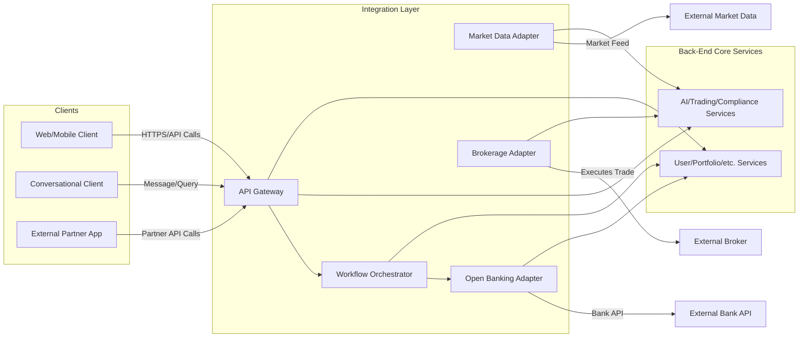

**Integration Layer (Section 4)**

---
title: "Integration Layer"
tags: [architecture, integration, api, interoperability, gateway]
aliases: ["API Integration", "Integration Architecture", "Moneta Gateway"]
created: 2025-04-02 07:45:30
updated: 2025-04-02 07:45:30
---
# Integration Layer

Moneta’s Integration Layer is the glue that binds the front-end clients, back-end microservices, and external systems into a cohesive whole. It comprises the API gateway, orchestration logic for complex workflows, and connectors/adapters that handle communication with third-party services. This layer abstracts the complexity of multiple services and protocols, presenting a unified interface to both internal and external consumers. In this section, we detail the components and design of the integration layer and how it enables interoperability and flexibility.

## API Gateway and Service Orchestration

At the core of the integration layer is the **API Gateway**, which serves multiple purposes:
- **Unified Entry Point:** All client requests (from web, mobile, or conversational interfaces) pass through the gateway. This centralizes authentication and authorization checks (e.g., validating JWT tokens or session info), input validation, and request routing.
- **Request Routing & Load Balancing:** The gateway uses a routing table or service discovery to forward requests to the appropriate back-end service (as described in the Back-End Architecture section). It can also perform load balancing, distributing incoming requests among multiple instances of a microservice.
- **Protocol Translation:** If needed, the gateway can translate protocols – for example, accepting GraphQL queries or WebSocket connections from the front-end and then making REST calls to internal services. This allows flexibility in how clients communicate without forcing every service to support every protocol.
- **Response Aggregation:** In cases where a single client request requires data from multiple services, the gateway can orchestrate those calls in parallel and combine the results. For example, a “dashboard” API might fetch the user profile, portfolio summary, and latest AI recommendation concurrently and merge them into one JSON response. This reduces latency and complexity on the client side.
- **Security Enforcement:** The gateway acts as a security checkpoint. It can implement rate limiting (to prevent abuse or accidental overload), IP whitelisting/blacklisting, and payload inspection (basic anomaly detection on requests). It also ensures that only authorized clients and calls reach the internal network, limiting exposure of internal endpoints.

Technologies for the API Gateway could include **Kong, Apigee, AWS API Gateway, or a custom Node.js/Express gateway**. Given Moneta's needs, a cloud-managed gateway could ease compliance (with built-in monitoring and threat protection), but a self-hosted one provides more control and customization.

## Workflow Orchestration and Integration Logic

Beyond simple request routing, some business processes in Moneta require orchestrating multiple steps, potentially waiting for events or coordinating with external systems. For these, the integration layer might include:
- **Orchestration Service or Workflow Engine:** For example, onboarding a new user might involve creating a profile, linking a bank account (via Open Banking API), setting up initial preferences, and kicking off an AI risk assessment. Rather than handle all of this in the front-end or a single service, a workflow engine (like **Temporal, Camunda, or AWS Step Functions**) can manage the sequence, including retries or human-in-the-loop steps if needed. This ensures long-running processes are robust and auditable.
- **Adapter/Facade Services:** While each microservice focuses on a domain, the integration layer can have lightweight adapter services to interface with external APIs. For instance:
  - A **Market Data Adapter** service pulls in real-time quotes, news, and other market info from third-party providers and normalizes it for use by Moneta’s internal services (AI, Portfolio, etc.).
  - A **Banking Integration Service** connects to various Open Banking APIs (across different European banks) to fetch account balances or initiate transfers. It presents a uniform interface internally despite different bank APIs externally.
  - A **Brokerage Integration Service** that communicates with external brokerage or exchange systems for trade execution, abstracting differences in protocols or order formats.
- These adapter services reside in the integration layer since they primarily translate and forward information between Moneta and outside entities, without containing core business logic of their own. By isolating them, any changes required for third-party API updates or new integrations can be made without touching the core services.

Communication within the integration layer:
- The API Gateway will call these orchestrators or adapters as needed. For example, if a front-end request comes in to initiate a fund transfer from the user’s bank to their Moneta investment account, the gateway might invoke the Banking Integration Service which handles the specific API call to that bank.
- The integration layer components themselves can use the event bus: e.g., the Market Data Adapter might publish incoming market events to the internal event bus for any service that cares (instead of pushing directly to each service).

## Internal vs External Integration

It’s useful to distinguish integration concerns:
- **Internal Integration:** How Moneta’s own services connect and coordinate (addressed by the gateway, service mesh, and event bus). This ensures all internal components speak a common “language” (e.g., common data formats, error handling). The integration layer includes standardized data contracts (like common schemas for financial data) so that, for example, the portfolio and AI services understand the market data events the same way.
- **External Integration:** How Moneta connects with outside systems (banks, data providers, identity providers, etc.). The integration layer handles the variation and complexity here by using connectors/adapters and adhering to industry standards where possible:
  - For banking, Moneta adheres to **Open Banking (PSD2)** standards for access, using secure user consent flows (redirect to bank, etc.) and never storing bank credentials.
  - For market data, it may subscribe to feeds using protocols like FIX or WebSockets, but internally convert them to a standard event format.
  - For identity, if using a third-party (like OAuth with Google for sign-in), the integration layer handles the OAuth callbacks and token exchanges.

By managing both internal and external integration through a well-defined layer, Moneta’s architecture achieves a high degree of **interoperability**. New front-end clients or external partners can be integrated by interfacing at the gateway level, without tight coupling to the underlying microservices. Likewise, if Moneta expands to new countries or services, adding an adapter or extending the workflow engine is feasible without redesigning the core.

> [!diagram] Integration Layer Components  
> The diagram illustrates Moneta’s integration layer: the API Gateway handling client traffic, workflow/orchestration components for complex processes, and adapter services for external systems (market data, banking, brokerage). It shows how a client request or event flows through these integration components.

In this diagram, the **API Gateway** receives calls from various clients (including potentially partner applications via an open API). It directly routes to core services when simple, or invokes the **Workflow Orchestrator** for multi-step operations. The **Adapter** components connect to external systems: Market data flows from **ExtMarket** into **AdapterMarket**, which then provides it to internal services (for example, publishing into the event bus or via direct calls). The **AdapterBroker** and **AdapterBank** handle specific external interactions like placing a trade or retrieving bank info, interfacing with external Broker and Bank APIs. This layer acts as a buffer and translator, ensuring the core services remain insulated from external API quirks or changes.

**In summary,** Moneta’s integration layer ensures that all parts of the ecosystem communicate smoothly. It abstracts away the complexities of multi-service coordination and external API interactions, allowing the rest of the system to remain cleanly modular. By centralizing these integration concerns, Moneta can more easily adapt to new clients, integrate with partners, or incorporate new external data sources, all while maintaining a secure and consistent operational flow.