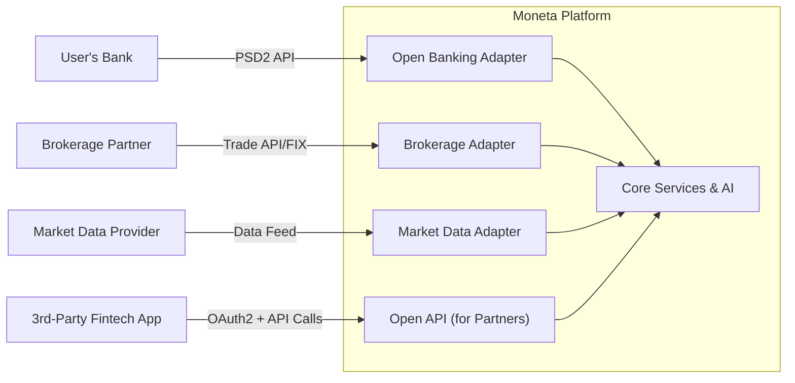

**Integration & Interoperability (Section 9)**

```markdown
---
title: "Integration & Interoperability"
tags: [architecture, integration, interoperability, api, fintech]
aliases: ["System Integration", "Interop Architecture", "External Integration"]
created: 2025-04-02 07:45:30
updated: 2025-04-02 07:45:30
---
# Integration & Interoperability

Moneta does not exist in isolation; it operates within a larger fintech ecosystem. This section focuses on how Moneta’s platform integrates with external systems and ensures interoperability, both for leveraging third-party services and potentially offering its own services to partners. Key integration points include banking systems (Open Banking), brokerage/exchanges, identity providers, and even third-party fintech tools. The architecture is built to accommodate these integrations in a modular and secure fashion, often through open standards and well-defined APIs.

## Open Banking and Financial Account Integration

To provide a holistic financial picture and enable easy movement of funds, Moneta integrates with banks and other financial institutions:
- **Open Banking API (PSD2):** In the EU/UK context, Moneta uses Open Banking APIs to connect to user bank accounts (with user consent). This allows Moneta to fetch account balances, transaction history, and initiate payments (like transferring money to the Moneta investment account or vice versa). The integration follows the UK Open Banking Standard and the EU PSD2 APIs. Technically, Moneta’s Banking Integration Service (see Integration Layer section) handles the OAuth2 authorization with banks and subsequent data fetching in a secure manner. This means Moneta never handles the user’s banking credentials directly – instead, it gets tokens from banks to access data.
- **Account Aggregation:** Through these bank integrations, Moneta can display a user’s full financial dashboard (not just investments, but also their savings or checking account info, credit card data if available). This provides context for the AI to give advice (like noticing high cash balances earning low interest and suggesting investing some of it).
- **Payment Initiation:** For moving money, Moneta leverages payment initiation APIs. For example, if a user wants to top-up their investment account, Moneta can initiate a transfer request through their bank’s API, which the user approves via their banking app. This automates funding without needing manual wire transfers.

## Brokerage and Market Integration

Since Moneta facilitates investments, it must connect with market infrastructure:
- **Brokerage/Exchange APIs:** Moneta itself might not have a broker-dealer license to execute trades directly on exchanges, so it partners with an established brokerage (or multiple). The Trading Service uses APIs provided by those brokerages to place orders. Standards like **FIX (Financial Information eXchange)** protocol might be used for high-speed trading interfaces, or REST APIs for broker platforms. The integration is abstracted so if Moneta changes broker partners or adds a new asset class (e.g., adding cryptocurrency through a crypto exchange API), it can do so by writing a new adapter without changing core logic.
- **Market Data Providers:** Rather than maintaining all market data feeds, Moneta subscribes to data services (like Bloomberg, Reuters, or cheaper fintech data providers). These provide real-time price quotes, historical data, news, etc. The Market Data Adapter ensures Moneta can easily switch or add providers. For example, one provider might cover stocks and another covers crypto or international markets; the adapter normalizes this for the AI and portfolio calculations.
- **Reference Data and Corporate Actions:** Integration with services that provide reference data (e.g., stock symbols, company info) and corporate actions (like dividends, stock splits) ensures Moneta’s calculations are accurate. This might be achieved via periodic data dumps or APIs from financial data vendors.

## Partner APIs and Extensibility

Moneta is envisioned as a platform that could also expose services to third parties, promoting interoperability:
- **Moneta API for Partners:** There might be a scenario where Moneta offers an API or SDK to other fintech apps. For instance, an independent personal finance app might want to embed Moneta’s AI investment advisor or show a user’s Moneta portfolio alongside other data. The architecture supports exposing certain functionalities via secure APIs (with user’s permission). This could include retrieving portfolio data, sending AI-generated recommendations (if the user authorizes a third-party app to get those), or even initiating trades. OAuth2 scopes would be used here to allow users to grant specific apps access to specific data/actions in their Moneta account (similar to how one can connect apps to their bank or brokerage).
- **Modular AI Components:** If the AI advisor becomes a standout service, Moneta could package parts of it as a service for others (with appropriate controls). The architecture’s microservice nature means, for example, the AI Advisory Service could potentially serve multiple front-ends (Moneta’s own and partner UIs) as long as authentication and context are handled.
- **Plug-in Architecture:** Futuristically, Moneta might allow third-party “plugins” or strategies. For example, a fintech startup might develop a specialized investment strategy module (say a climate-impact-focused strategy). Moneta could allow that module to plug into the platform so users can opt for it. Technically, this could be done via a sandboxed execution environment or by that third-party exposing an API that Moneta’s AI calls. The integration architecture (with the orchestrator and adapter pattern) could facilitate this by treating such a plugin as just another external service to integrate with. Strict vetting and sandboxing would be needed for security in such cases.

## Standards and Interoperability Practices

Moneta’s architecture prioritizes using industry standards to ensure smooth interoperability:
- **Data Formats:** Uses ISO 20022 for financial messaging where applicable (for payments, statements) which many banks and institutions support. For trading, uses standard FIX message formats for orders. For data, uses JSON for APIs with well-defined schemas and possibly CSV for batch export/import if needed.
- **Identification:** To integrate with multiple sources, a consistent way to identify assets and accounts is needed. Moneta uses standard identifiers (like ISIN for securities, IBAN for bank accounts, etc.) internally so that data from different sources can be merged or compared reliably.
- **Time Sync:** All systems use a common time reference (UTC) and are NTP-synced. This is minor, but important in finance where time of transactions across systems matters.
- **Error Handling & Retries:** The integration layer is built to handle flaky external APIs gracefully – with retries, circuit breakers, and fallback mechanisms (like if one data provider fails, switch to a backup). This ensures Moneta’s service quality isn’t degraded by external dependency issues.
- **Versioning of External APIs:** The adapters are version-aware. If a bank moves from API v1 to v2, Moneta can call both during a transition. Having a version abstraction layer means Moneta’s core logic can remain unchanged while the adapter handles differences.
  
## Regulatory and Compliance in Integrations

When integrating with external entities, compliance extends outward:
- **Data Sharing Consent:** Any sharing of user data with third parties (like if a user links Moneta to another app or vice versa) is done only with explicit consent and clearly shown to the user, in line with GDPR’s data sharing and purpose limitation principles.
- **Vendor Due Diligence:** Moneta will perform due diligence on data providers or partners (security assessments, compliance with GDPR, etc.) before integrating, and architecture allows disabling an integration quickly if a partner is found non-compliant or compromised.
- **Standard Agreements:** Using open standards (like Open Banking) often comes with required certifications. Moneta’s system will conform to those (e.g., obtaining proper licenses to access banking APIs, following required security measures like PSD2 SCA). The architecture built around those standards ensures compliance is met technically (like storing and using the OAuth2 tokens as per guidelines, not beyond allowed scopes, etc.).

> [!diagram] External Integration Landscape  
> The diagram shows Moneta at the center of various integrations: connecting to banks via Open Banking, to broker/exchanges for trades, to data providers for information, and to partner apps via exposed APIs. It highlights the flow of data and actions between Moneta and these external points, mediated by integration adapters.


```
In this diagram, Moneta is in the middle with its core services and AI. On the left, a user's bank connects through the Open Banking adapter into Moneta’s system (for account info and payments). On the right, a Brokerage executes trades from requests via the brokerage adapter. A market data vendor feeds data in through the market data adapter. At the bottom, a partner application uses Moneta’s open API (with proper auth) to interact with Moneta’s core (for example, retrieving user’s investment data if authorized). Each arrow represents a well-defined interface or standard, ensuring that adding/changing one integration doesn't disturb others.

**In summary,** Moneta’s integration and interoperability approach means the platform is not a walled garden but an active participant in the financial ecosystem. By adhering to standards and modularizing integration points (via adapters and APIs), Moneta can easily connect to needed data and services and offer its own in a controlled way. This flexibility future-proofs the platform against the ever-evolving fintech landscape where new services and collaborations can emerge, allowing Moneta to plug in or be plugged into with minimal friction.