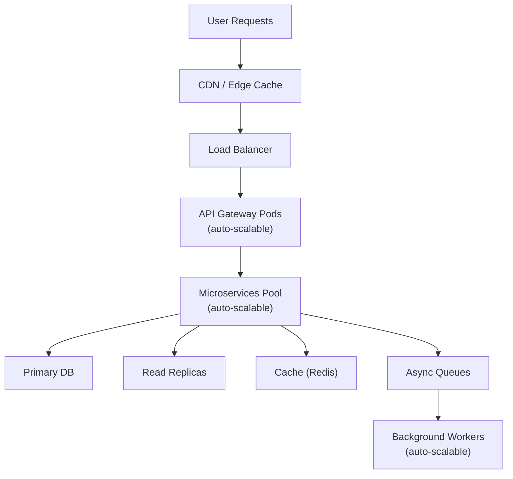

**Scalability & Performance (Section 10)**

```markdown
---
title: "Scalability & Performance"
tags: [architecture, scalability, performance, optimization, reliability]
aliases: ["Moneta Scalability", "Performance Tuning", "High Performance"]
created: 2025-04-02 07:45:30
updated: 2025-04-02 07:45:30
---
# Scalability & Performance

Moneta’s architecture is engineered to deliver fast, responsive user experiences and to scale as the user base and data volume grow. This section describes how the system handles increasing load, ensures low-latency interactions, and maintains performance under heavy usage (such as peak market hours). Both software strategies (like efficient algorithms and caching) and infrastructure strategies (like horizontal scaling and load balancing) are employed to achieve the desired scalability and performance.

## Horizontal Scaling and Load Distribution

Scalability in Moneta is primarily addressed by horizontal scaling — adding more instances rather than solely relying on bigger servers:
- **Stateless Microservices:** As described in the back-end architecture, services are kept stateless where possible, which makes it straightforward to run multiple instances behind load balancers. When traffic increases, Kubernetes (or underlying auto-scaling groups) can spin up more instances of, say, the API Gateway or the Trading Service to handle the load. Each instance operates independently, pulling data from shared databases or caches.
- **Load Balancers:** At the entry point, a cloud load balancer or cluster ingress controller evenly distributes incoming requests among API Gateway instances. Similarly, internal service requests are balanced. If using a service mesh, it handles distributing calls among microservice pods. This prevents any single instance from becoming a bottleneck.
- **Geographical Distribution:** Though initially focused on Europe/UK, if Moneta grows, edge locations or additional regions can be added to serve users closer to their locale. For example, having an EU (Frankfurt) and UK (London) deployment with requests from each region served locally. They would share certain data (with consideration to data residency rules), but read operations like getting market data or general info can be served regionally, reducing latency.

## Caching and Data Access Optimization

To ensure quick responses, Moneta employs caching at multiple levels:
- **Client-side Caching:** The web and mobile apps cache certain data (like the last portfolio view, or static content such as educational articles). This means the app can instantly show something while fetching updates in the background. HTTP caching headers are used for static resources to let browsers and the CDN cache them.
- **API Gateway Caching:** For some GET requests that are heavy but do not change frequently (e.g., a list of available investment options, or an AI-generated market summary updated hourly), the API gateway or an intermediary cache (like Varnish or Cloudflare CDN in front of the API) might cache responses for a short time. This offloads repeated queries from hitting the backend.
- **Service Level Caching:** Services like the Portfolio Service might cache computed results in memory or an in-memory store. For instance, after calculating a portfolio performance metric, it can store it in Redis with a TTL of a few minutes. If multiple parts of the system or multiple user requests need the same data, they can get it quickly from cache.
- **Database Optimization:** Proper indexing of databases ensures queries are fast. Frequently accessed read-heavy data might be served from read replicas of the database to spread load (for example, an analytics dashboard could query a replica so as not to impact the main transactional DB). For complex analytical queries, the data warehouse is used instead of the operational DB.
- **Asynchronous Processing:** For tasks that are heavy or could slow down user interactions, Moneta uses async workflows. For instance, generating a detailed financial report might take a few seconds; instead of making the user wait on a loading screen, the system triggers the generation asynchronously and notifies the user (or emails them) when ready. This keeps the UI snappy for critical interactions while handling heavy lifting in the background.
- **Rate Limiting Expensive Operations:** If some operations are inherently slow (like querying an external API or doing a large computation), those are carefully managed. The system might limit how often they can be triggered (e.g., not letting a user request a full AI portfolio redesign more than a certain number of times per minute) or queue them.

## Performance Engineering and Optimization

Moneta’s development includes a focus on performance:
- **Efficient Algorithms:** The AI and analytic computations are optimized with algorithms appropriate for large data. For example, analyzing portfolio risk might use vectorized operations or optimized libraries (NumPy/Pandas in Python) rather than naive loops. The choice of data structures is mindful — e.g., using tries or hash maps for quick lookups in rule engines, or using bulk operations to the database instead of many small queries.
- **Profiling and Load Testing:** The team regularly profiles services to find bottlenecks (CPU, memory, I/O). Tools and APM (Application Performance Monitoring) are used to see where time is spent on each request. Before major releases, load testing is performed (using tools like JMeter or Gatling or k6) to simulate high user load and ensure response times meet targets (for example, the goal might be that 95% of user interactions complete in < 2 seconds).
- **Garbage Collection and Tuning:** If using languages with GC (like Java or even Node’s V8), the runtime parameters are tuned to avoid GC pauses during trading peaks. Alternatively, performance-critical components might use languages like Go or Rust for predictable performance.
- **Connection Management:** Database connections and external API connections are pooled. This avoids overhead of setting up/tearing down connections frequently. For instance, the API gateway or services maintain a pool of DB connections, reusing them efficiently.
- **Parallelism:** Where possible, operations are done in parallel. Microservices architecture naturally allows parallel processing of different requests. Within a single request, the orchestration might fetch data from multiple services concurrently (as the API gateway can do when aggregating). Also, multi-threading or async I/O is used in services (for example, the AI service could parallelize computations for different users or different model components).
  
## Stress Cases and Scaling Limits

The architecture contemplates worst-case scenarios:
- **Peak Market Activity:** When markets are highly volatile, users might flood the app to check and trade. The system is tested to handle say 10x normal traffic for short bursts. Auto-scaling policies are configured to react quickly (increase capacity within a minute or two of detecting the surge).
- **Mass AI Computation:** If a global event triggers the AI to re-evaluate advice for all users around the same time (e.g., a sudden market crash at market close), the system would have a lot of AI tasks at once. The design uses work queues to spread this load, ensuring critical ones (for users currently online) might be prioritized, while others are processed slightly later but still timely. The AI service could have a fallback mode to handle an extreme load: e.g., prioritize high-value accounts or randomize starts by a few seconds to avoid thundering herd problem.
- **Database Scaling:** If the user base grows massively, the databases might need sharding or partitioning. The data architecture is built with domain separation, which aids this (maybe initially by service). If needed, further sharding (like by user region or user ID ranges) can be introduced. Using cloud DB services that can scale read/write IOPS easily is an advantage.
- **Front-End Load:** The CDN ensures static content is not a bottleneck. For dynamic content, because most is API-driven, the scaling of the back-end covers it. In case of heavy WebSocket usage (for live updates), the system may use a scalable Pub/Sub service (like socket clusters or a service like Azure SignalR or AWS AppSync) that can fan out messages to many users without stressing the core servers.

## Performance Metrics and Goals

Moneta defines clear performance metrics (SLIs/SLOs):
- **Latency:** e.g., API response times for key endpoints (login, viewing portfolio, placing trade) should be under 500ms on average, and perhaps < 2s for the 99th percentile even under load.
- **Throughput:** The system should support X transactions per second (TPS) of trade executions or AI recommendations. If expecting, say, 100k users and maybe 5% trade during peak, that's 5k trades in a short window — architecture should handle that with headroom.
- **Resource Utilization:** Aim to keep servers at healthy utilization (not maxed out, to handle bursts). Auto-scaling tries to keep, say, CPU around 60-70% usage on average.
- **Scalability Margin:** It's designed such that to double the capacity, one can roughly double the resources (linear scalability within reasonable limits), thanks to statelessness and partitioning. Non-linear components (like a single DB instance) are identified and plans in place (read replicas, partitioning) to avoid them becoming choke points.

> [!diagram] Scalability & Performance Tactics  
> The diagram highlights key tactics for scalability and performance: load balancers for distribution, auto-scaling groups for services, caching layers for speed, and a content delivery network. It shows the flow of requests through these layers and how scaling out occurs on demand.


```
In this diagram, user requests first hit a CDN (which caches static content and maybe some API responses), then go to a load balancer that distributes to multiple API Gateway pods. Those in turn call the needed microservices (Service Pool) which are also scalable. They retrieve/write data to the primary database or read from replicas to spread load. They also use the cache for quick data. Some tasks go into async queues which are processed by a separate pool of workers (also scalable). This shows multiple layers where scaling can happen to maintain performance.

**In summary,** Moneta’s scalability and performance strategy is comprehensive: it not only can grow to handle more users or data, but it remains efficient and fast at each step. By combining horizontal scaling, intelligent caching, and continuous performance optimization, the platform can provide real-time, responsive AI-driven advice and trade execution even under heavy load. This ensures that as Moneta’s user base grows or when markets get busy, users continue to get a smooth and quick experience without delays or downtime.