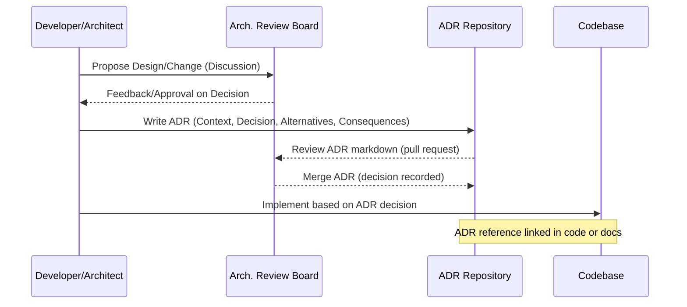

---
title: "Architecture & Design Decision Recording"
tags: [architecture, decisions, documentation, adr, governance]
aliases: ["Design Decisions", "ADR", "Decision Log"]
created: 2025-04-02 07:45:30
updated: 2025-04-02 07:45:30
---
# Architecture & Design Decision Recording

In a complex project like Moneta, it's crucial to keep track of the rationale behind key architectural and design choices. This is achieved through a structured practice of recording Architecture Decision Records (ADRs) and maintaining design documentation. This section explains how Moneta's team captures decisions, the format and tools used, and how this practice ties into the development workflow, ensuring the architecture remains coherent and well-justified over time.

## Purpose of Decision Recording

Architecture and design decisions often involve choosing between alternatives, each with pros and cons. By recording these decisions:
- **Knowledge Preservation:** New team members or stakeholders can understand why certain choices were made (e.g., why we chose a microservice approach over monolith, or why PostgreSQL was selected for user data store). They don't have to rediscover or second-guess past decisions.
- **Avoid Repeating Debates:** When constraints or context haven't changed, revisiting a closed decision can waste time. ADRs help signal that a thorough analysis was done. If context *has* changed, the ADR provides a baseline so the team knows what assumptions to revisit.
- **Accountability and Approval:** Some decisions, especially in a regulated environment, might need sign-off from compliance or security teams. Having a written record means there's a clear artifact that such stakeholders agreed to the approach (for example, an ADR on "Use of AWS cloud vs On-Premises" might show that the security team approved cloud with certain conditions).
- **Impact Analysis:** When planning changes, reading relevant ADRs can reveal ripple effects. If an ADR mentions "Service X depends on technology Y", then changing Y later needs careful thought.

## ADR Process and Format

Moneta's team adopts the well-known ADR format (pioneered by Michael Nygard) for consistency:
- Each decision is documented as a short markdown file (since the project likely uses markdown in an Obsidian vault or repository). The file includes:
  - **Title:** A short, active phrase like "Adopt Microservice Architecture" or "Use GraphQL for External API".
  - **Context:** Background and the forces at play – what problem are we trying to solve? What constraints or requirements affect this decision (e.g., "We need to ensure scalability and independent deployment of features").
  - **Decision:** The concrete choice made. E.g., "We will use a microservices architecture with domain-driven boundaries. We'll have an API Gateway to aggregate services for clients."
  - **Status:** e.g., Proposed, Accepted (with date), Deprecated (if later overturned).
  - **Consequences:** Implications of the decision – both positive (benefits we're getting) and negative (trade-offs or new issues introduced). For instance, a consequence of microservices might be "Higher operational complexity, need for DevOps investment".
  - **Alternatives Considered:** Briefly note other options that were considered and why they were not chosen (this helps future readers understand that those alternatives were not overlooked).
- The ADRs are numbered or timestamped and stored in a dedicated folder in the code repository or knowledge base. The YAML frontmatter (in Obsidian vault context) or simple metadata on top helps cross-link them to related topics.

Each ADR can have tags or links to related decisions (like an ADR deciding on microservices might link to another deciding on Kubernetes deployment, etc.).

## Decision Governance and Workflow

Decisions are typically made and recorded at different levels:
- **Major Architectural Decisions:** These involve broad system structure, choice of fundamental tech or patterns (e.g., monolith vs microservices, on-prem vs cloud, relational vs NoSQL for core data). Such decisions often involve architects, tech leads, and sometimes business stakeholders. They are recorded early in the project, but can also occur as big changes are proposed later.
- **Design Decisions at Feature Level:** These might be smaller in scope (like how to design a particular module or whether to use an existing service or create a new one for a feature). Tech leads or feature architects record these if they feel the decision is non-trivial and worth documenting for posterity.
- **Emergent Decisions:** Sometimes, decisions emerge during implementation (e.g., discovering a library doesn’t work as expected, so choosing another). Engineers can propose an ADR for these as well, to document why a change was made mid-flight.
- The team might convene **Architecture Review Meetings** for significant proposals. In these, a proposal is discussed, possibly alternatives weighed (sometimes captured as an RFC or design doc). Once a direction is agreed, an ADR is written to formalize it. The ADR is then PR'd into the repo and reviewed, so it has visibility and version control.
- **Linking to Implementation:** Ideally, ADRs are referenced in code or documentation. For instance, in a repository README or architecture overview, you might see "We chose a microservices approach (see ADR-002 for details)". Developers fixing a bug might mention an ADR if they have to ensure the fix aligns with design.

## Tools and Integration

Moneta’s project, by using Obsidian for knowledge management, can leverage internal linking and tagging:
- Each ADR or design doc can be cross-linked to relevant sections of this architecture spec vault. E.g., an ADR on "Choice of Database for Portfolio Service" can be linked from the Data Architecture section or vice versa, so one can navigate between high-level description and decision details.
- The tags like #ADR or #decision help in Obsidian to see all decisions at a glance.
- The created/updated timestamps and aliases (like synonyms or decision identifiers) help with searchability.
- For day-to-day, if the team uses a task tracking or wiki system (Jira/Confluence or GitHub issues), they ensure that any new epic that might require an architectural decision explicitly has a step to either find an existing ADR or create a new one if needed. This keeps the practice active.

## Evolving and Reversing Decisions

Recording a decision doesn’t mean it’s set in stone forever:
- If a decision becomes obsolete or suboptimal (perhaps technology changed or assumptions were wrong), the team can revisit it. In such cases, a new ADR might be written that supersedes the old one. The old one is marked as “Deprecated” or “Superseded by ADR-XYZ” with a reference. This way, historical context is still preserved (we see what changed and why).
- Example: If years later, monolithic architectures become favorable again for some reason (hypothetically), the team could evaluate and maybe decide to merge some services. They’d record a new ADR stating “Consolidate Services X, Y, Z into a Monolith” with rationale (e.g., operational overhead too high, modern hardware handles monolith scaling, etc.), and they'd reference the original microservices ADR to explain why the change of heart in context.
- All these are captured so that the design documentation is a living document, just like the code. 

## Documentation of Designs

Beyond ADRs, other design documentation is maintained:
- **High-Level Diagrams and Specs:** Like the ones in this document, updated when system evolves. The architecture vault likely contains not just these 14 sections but also additional design docs for specific subsystems or user flows (e.g., "Onboarding Flow Design" or "AI Model Architecture Deep Dive").
- **Runbooks and Operational Decisions:** SRE/DevOps decisions (like how to handle failovers, or how to monitor X) might also be recorded similarly or in runbook format. Although more operational than design, they intersect with architecture (for example, an SRE decision to use a certain chaos testing tool could be considered a design decision in reliability engineering).
- Keeping the documentation in sync with the system is an ongoing effort. The team likely assigns someone (like an architecture owner or tech lead) to periodically review and update docs/ADRs, especially after major releases.

> [!diagram] Architecture Decision Workflow  
> The diagram depicts how an idea or issue leads to a decision and how it gets recorded. It shows team collaboration, decision documentation (ADR), and feedback into implementation. This demonstrates the cyclical process of decision-making and recording.

In this sequence, a developer or architect brings up a design decision needed. The team or an architecture board reviews it. The developer writes the ADR, it's reviewed and merged into the repository, then the implementation follows the recorded decision. The note indicates that ADRs are kept connected to the code (through comments or documentation cross-references).

**In summary,** Moneta’s approach to architecture and design decision recording ensures a disciplined and transparent evolution of the system. By maintaining a living knowledge base of **why** things are the way they are, the team can move faster in the future (leveraging past wisdom), maintain consistency in design, and more easily onboard new engineers or stakeholders. This practice is a cornerstone of sustainable architecture – treating decisions as important artifacts just like code or test cases, subject to review and iteration.