**AI-Enhanced SDLC (Section 13)**

---
title: "AI-Enhanced SDLC"
tags: [architecture, sdlc, ai, devops, mlops, automation]
aliases: ["AI SDLC", "AI in Development", "AI-Assisted Development"]
created: 2025-04-02 07:45:30
updated: 2025-04-02 07:45:30
---
# AI-Enhanced SDLC

Moneta not only *uses* AI to serve its end-users, but also leverages AI to improve its own software development life cycle (SDLC). This forward-looking approach infuses the development and operations process with AI and machine learning to automate repetitive tasks, improve code quality, and speed up delivery. Additionally, since Moneta’s platform includes AI components (like the advisor), the SDLC extends to managing the machine learning lifecycle (MLOps). This section describes how AI technologies assist Moneta’s developers and DevOps, and how the development process is structured to incorporate continuous learning and improvement of AI models.

## AI-Assisted Development

From coding to testing, AI tools are integrated into the developer workflow:
- **Code Generation & Pair Programming:** Moneta’s developers use AI coding assistants (similar to GitHub Copilot or GPT-based tools) within their IDEs. These tools can suggest code snippets, generate boilerplate, or even implement functions based on comments. This speeds up development especially for standard patterns (like writing a new microservice following the existing template) and frees developers to focus on complex logic.
- **Intelligent Code Reviews:** AI-based static analysis tools are run as part of code reviews/CI. These go beyond linting; they can detect common security vulnerabilities or inefficient code by learning from large codebases. For instance, an AI might flag that a particular method is similar to one known to cause memory leaks or that an API usage doesn’t handle a certain error.
- **Automated Documentation:** Documenting APIs and code can be accelerated by AI. When developers write new functions or endpoints, an AI tool can draft documentation comments or even user-facing docs by analyzing the code and context. The team then refines these drafts. This ensures the documentation stays fairly up-to-date with code changes.
- **Requirements to Code Suggestions:** In early design phases, if product managers or architects write user stories or requirements in natural language, AI tools can suggest possible models or designs. For example, an AI might parse "As a user, I want to see my investment risk" and suggest using a certain risk model or the need for a new API. While final decisions are made by humans, it sparks ideas and ensures no requirement is overlooked in design.

## AI in Testing and QA

Quality assurance is another area greatly enhanced by AI:
- **Test Case Generation:** Based on code changes or even requirements, AI tools can propose unit test cases that developers might not think of (including edge cases). For instance, if a new function is added, an AI can generate multiple unit tests covering typical inputs, boundary values, and likely error conditions. This helps increase test coverage with minimal manual effort.
- **Automated Regression Testing:** Moneta’s CI pipeline uses AI to analyze test results and code changes to prioritize which tests to run. If a change only affects the Portfolio service, the AI might decide not to run unrelated test suites, speeding up CI. Conversely, an AI might detect a pattern of a certain test flaking only when a certain file is touched and alert the team to a hidden dependency.
- **UI Testing with AI:** Instead of writing brittle UI test scripts, Moneta employs AI-driven UI testing where a bot learns how to navigate the application and can detect anomalies in the UI or errors. For example, using computer vision to ensure that pages render correctly or using NLP to verify chatbot responses are coherent after a change.
- **Performance Anomaly Detection:** During load tests, AI monitors the metrics patterns. It can spot if the performance curve deviates from historical ones (maybe indicating a memory leak or inefficiency introduced). Instead of manually poring over graphs, the AI points the team to suspicious trends.

## MLOps: Integrating AI Model Development

Since Moneta’s features rely on AI models, the development lifecycle includes MLOps for those models:
- **Data Versioning & Feature Stores:** The data used for training AI (market data, user interaction logs) is continuously collected. Moneta has a feature store where features (like user risk score, or volatility metrics) are computed and versioned. AI engineers use this to train models consistently across versions. Tools like DVC (Data Version Control) or MLflow track datasets and model parameters.
- **Model Training Pipeline:** There is an automated pipeline (possibly using Kubeflow Pipelines or Azure ML, etc.) that periodically retrains models or trains new ones when data or code changes. For example, the AI team might set up a nightly job to retrain the recommendation model with the latest data. This pipeline includes steps for data preparation, training, evaluation, and pushing the model to a registry.
- **Continuous Integration for Models:** Just as code goes through CI, models do too. Whenever the AI team makes changes to model code (say, trying a new algorithm), the CI runs training on a subset of data or runs unit tests on the model functions. It can also run a suite of benchmark scenarios to ensure the new model meets baseline accuracy or performance metrics.
- **Model Deployment (CD):** When a model is ready (approved if it meets criteria), it’s automatically deployed to production (or a canary environment) using the same infrastructure (containerized model servers or a serverless inference service). The deployment might be a shadow deployment initially – running new model in parallel with old to compare results quietly until confidence is gained, then switching.
- **Monitoring Model Performance:** After deployment, AI performance is monitored (e.g., is the model’s prediction quality degrading? Are users not following new advice as much as before, indicating perhaps a trust or accuracy issue?). This feedback loop informs whether to roll back a model or collect more data. The Observability stack (Section 14) includes specific metrics for AI, like distribution of predictions, frequency of alerts triggered, etc. Possibly anomaly detection is in place to catch if a model starts behaving oddly (like outputs going out of expected range).

## DevOps and AIOps

Operations also benefit from AI, often termed AIOps (Artificial Intelligence for IT Operations):
- **Intelligent Alerts:** Not every anomaly should wake an engineer at 2 AM. AI can correlate alerts or log patterns to decide if an incident is real and urgent. For example, if a spike in error logs coincides with a deploy, the AI might note it's likely a deployment issue and page the on-call with that context. Or if multiple microservices show minor errors but they correspond to a known third-party outage (learned from past incidents), it can group them into one incident.
- **Predictive Scaling:** Beyond reactive auto-scaling, AI can predict load based on historical trends or external signals. If Moneta knows that every day at 9 AM there’s a spike when markets open, an AI model could suggest scaling up 10 minutes before to be ready (instead of waiting for CPU to hit thresholds). Similarly, it might predict higher loads on certain days (like during an economic event) and alert the team to prepare.
- **Automated Maintenance:** AI can optimize cloud costs by analyzing usage patterns and resizing instances or re-scheduling batch jobs to cheaper time windows automatically. It could also manage backups and disk usage – e.g., predicting when a database will hit capacity and alerting before it becomes an issue.
- **Incident Analysis:** After incidents, AI can assist in root cause analysis by sifting through huge volumes of logs and metrics to find what changed or what correlates with the failure. This augments the SRE team’s efforts by pointing them to likely culprits faster.

## Continuous Improvement and Learning Culture

Moneta’s team culture around AI in SDLC is one of experimentation and learning:
- Developers and ops engineers are encouraged to suggest new AI tools or scripts that could simplify their work. Maybe someone writes a small ML model to optimize SQL queries based on patterns, etc.
- There is an ongoing review of how effective the AI enhancements are. For example, do AI-generated tests actually catch bugs or do they produce a lot of noise? Metrics are used to evaluate this (like reduction in production bugs, faster cycle times) and adjust the approach.
- Training is provided so team members trust and understand these AI tools. A risk with AI assistance is over-reliance or misinterpretation, so the team treats suggestions as helpers, not absolute truth. Code reviews still involve human judgment, with AI as a second pair of eyes.
- Ethical considerations: When using AI tools (especially third-party ones), Moneta ensures no sensitive code or data is inadvertently leaked. For instance, self-hosted AI solutions might be preferred for code, or proper agreements in place if using cloud AI services for development. The team is mindful of biases even in development tools (for instance, AI suggestions can reflect biases from training data, which could inadvertently introduce non-inclusive language or insecure patterns, so they remain vigilant).

> [!diagram] AI in the Development Pipeline  
> The diagram shows how AI integrates at various points of the SDLC pipeline: from coding (IDE assistants), through testing (AI test generation), to deployment and operations (AIOps). It illustrates an end-to-end flow with AI elements boosting each phase.

```mermaid
flowchart LR
    Ideas["Requirements/Design (natural language)"] -- "NLP Analysis" --> Code["Coding (IDE with AI assistant)"]
    Code -- "AI Code Review & CI" --> Test["Testing (AI-generated tests)"]
    Test -- "Intelligent QA" --> BuildDeploy["Build & Deploy (CI/CD)"]
    BuildDeploy -- "MLOps pipeline" --> ModelTrain["Model Training"]
    ModelTrain -- "Auto Model Deploy" --> Production["Production Environment"]
    Production -- "AIOps Monitoring" --> Feedback["Feedback & Analysis"]
    Feedback -- "Insights" --> Ideas
```

In this flow, requirements feed into design where NLP might highlight keywords or suggest existing solutions. Coding is aided by AI. Testing uses AI for generating tests and analyzing results. The build/deploy includes MLOps where models are trained and deployed. Once in production, AIOps monitors and feeds back insights (like performance data, user behavior) into the next iteration of requirements and improvements, closing the loop with continuous learning.

**In summary,** Moneta's software development lifecycle itself harnesses AI at every stage to improve productivity, quality, and agility. This meta-use of AI ensures that the platform can evolve rapidly and reliably, keeping pace with the cutting-edge nature of the product's domain. Moreover, by integrating MLOps into the SDLC, Moneta treats its AI models as first-class deliverables, maintaining and upgrading them with the same rigor as the rest of the software. The result is a development process that is smarter and more efficient, echoing the intelligent ethos of the Moneta platform itself.