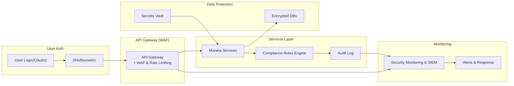

**Security and Compliance (Section 7)**

---
title: "Security and Compliance"
tags: [architecture, security, compliance, privacy, GDPR, FCA]
aliases: ["Moneta Security", "Compliance by Design", "Fintech Compliance"]
created: 2025-04-02 07:45:30
updated: 2025-04-02 07:45:30
---
# Security and Compliance

Security and regulatory compliance are paramount in Moneta’s design. Handling personal financial data and providing investment advice means Moneta must safeguard user information against threats and strictly adhere to laws like GDPR (for data protection) and regulations from financial authorities (FCA in the UK, ESMA/EU directives, etc.). This section outlines the security measures across the stack and how compliance requirements are met through architecture and automation.

## Secure by Design Principles

From the ground up, Moneta follows “Secure by Design” principles:
- **Least Privilege:** Every component, service, and user only has the minimum access necessary. Microservices have separate credentials for their databases; an AI service, for example, cannot directly query the user database except through controlled APIs. Internal roles (like an admin interface) are partitioned so no one (not even admins) can perform actions without proper authorization checks.
- **End-to-End Encryption:** All data in transit is encrypted using TLS. This includes client-server communication (HTTPS), inter-service calls within the cluster (service mesh can enforce mTLS between microservices), and connections to external APIs. Sensitive data at rest, as mentioned, is encrypted in databases and in backups.
- **Secret Management:** API keys, encryption keys, and credentials are never hardcoded. They are stored in a secure vault (like HashiCorp Vault or a cloud key management service) and injected into services at runtime. This vault is tightly controlled and audited.
- **Secure Coding & Testing:** Developers are trained in secure coding practices. The SDLC (see Section 13) includes code analysis (static and dynamic analysis) to catch vulnerabilities like SQL injection, XSS, etc. Dependencies are scanned for known vulnerabilities using tools (like OWASP dependency-check). Before deployment, penetration tests and threat modeling are conducted for new features.
- **Network Security:** The cloud infrastructure is set up with network segmentation. Sensitive services (databases, internal APIs) are on private subnets not exposed to the internet. Only the API Gateway and specific endpoints are exposed publicly. Web Application Firewalls (WAFs) protect against common web attacks, and DDOS protection services are in place to mitigate denial of service attacks.

## Identity, Authentication, and Authorization

Robust identity and access management ensures only legitimate users and actions occur:
- **User Authentication:** As mentioned in Front-End, Moneta uses OAuth2/OIDC for user login. This can integrate with strong customer authentication (like requiring 2FA for certain actions, in line with PSD2 requirements for financial apps). Session management is secure, with short-lived access tokens and refresh tokens, to minimize risk if a token is compromised.
- **Role-Based Access Control (RBAC):** Within Moneta, different roles have different permissions. Example roles: End-user (default, can only access their own data), Support agent (can view limited user info when helping a customer, with that access being logged and consent-based where needed), Admin (system maintenance tasks, not directly accessing user data). The architecture includes an Authorization service or leverages the identity provider’s capabilities to enforce these roles on each request (the JWT might carry roles/claims that the API Gateway and services check).
- **Multi-Factor & Biometric Auth:** Users can enable MFA for account login. Mobile apps leverage device biometrics (Face ID, Touch ID) as a convenient yet secure way to authenticate or confirm transactions, abstracted through the identity service.
- **Device Trust:** New device logins trigger email/SMS alerts to users (and possibly require additional verification). The system remembers trusted devices to enhance security UX balance. 

## Compliance Automation and Monitoring

Moneta integrates compliance into its operation so that adhering to laws is not an afterthought but an automated process:
- **GDPR Compliance Features:** 
  - Consent Management: Users must explicitly opt-in for data processing that isn’t strictly necessary (e.g., using their data for improving AI models). The system tracks these consents and only allows the relevant data flows if consent exists. A Consent service or module stores these preferences and is checked by other services.
  - Data Subject Rights: As described in Data Architecture, there are APIs/tools to fulfill data access and deletion requests. Moneta can compile all of a user’s data and provide it in a machine-readable format (JSON/CSV) on request (portability right). For erasure, a workflow is triggered that scrubs personal identifiers from all systems (with a grace period if required to allow for settlements of pending transactions, etc., while still eventually deleting).
  - Privacy by Design: The architecture minimizes data collection (only what’s needed for service). For example, if the AI can function by using trend data that’s anonymized, it does so without storing the raw personal data.
- **Financial Regulations (FCA, EU):** 
  - **KYC/AML:** At account creation, Moneta requires identity verification (this could be integrated via a third-party verification service). The Compliance service ensures that every user is verified before they can invest (meeting AML rules). It also screens against sanction lists. This is automated via integration with services or databases provided by regulators.
  - **Suitability and Appropriateness (MiFID II):** The platform asks users about their investment experience and risk tolerance during onboarding. Based on this, the AI and trading functionalities are scoped (e.g., a user marked as not experienced with derivatives would not be allowed or advised to trade complex options). The compliance rules engine encodes these restrictions.
  - **Audit Trails:** Every piece of advice given and transaction executed is logged with timestamp, user, and rationale. These logs are stored immutably (using WORM storage or append-only logs) to satisfy regulators that the platform can recreate the chain of events leading to any decision or trade.
  - **Reporting:** Moneta can automatically generate reports needed by regulators, such as transaction reports, suspicious activity reports, or periodic statements to users (MiFID II requires certain disclosures). The architecture likely includes a reporting module or uses the analytics data warehouse to compile these on schedule. This reduces manual work and errors in compliance reporting.
- **AI Ethics & Upcoming AI Regulations:** Anticipating the EU AI Act (which might classify financial advisory algorithms as high-risk AI), Moneta has built-in compliance for AI:
  - The AI models are documented (data sources, logic) for transparency. There is a process for human review of the AI’s decisions, especially unusual ones, fulfilling a “human in the loop” requirement if needed.
  - Bias and fairness are regularly tested in AI outputs. For example, ensure the AI doesn’t systematically give different quality of advice based on gender or other attributes (which it ideally doesn’t even consider).
  - Users are informed they are interacting with an AI and not a human when advice is given (this is an expected requirement: transparency that an algorithm is making recommendations).
  
## Infrastructure Security and Monitoring

Securing the infrastructure layer is equally important:
- **Container Security:** Each service runs in a container, and those images are scanned for vulnerabilities. Kubernetes is configured with proper pod security policies (limiting privileges, using network policies to restrict which service can talk to which).
- **Cloud Security Posture:** If on cloud, use cloud-native security features: e.g., security groups, firewall rules, encrypted storage volumes, and regular audits of configurations. Identity and Access Management (IAM) roles on cloud ensure that if a service in Kubernetes needs to access an S3 bucket (for backups or models), it has an IAM role with narrow scope to do so.
- **Continuous Monitoring:** The platform uses a SIEM (Security Information and Event Management) system to aggregate security logs (from the WAF, from authentication events, from OS-level logs). Alerts are configured for suspicious patterns such as multiple failed logins (potential brute force attack), unusual admin access times, or anomalies in system performance that could indicate an attack (like sudden spikes that could be a DDoS).
- **Incident Response Plan:** Moneta has an incident response playbook. If a breach is suspected, there are procedures to contain and investigate. This includes having backups and the ability to redeploy clean infrastructure, communication plans to notify users/regulators if a data breach were to occur (as required by GDPR's 72-hour notification rule).
- **Penetration Testing and Bug Bounties:** Regular pen tests by external experts are scheduled (e.g., quarterly or at major releases). Moneta could also run a bug bounty program to encourage ethical hackers to find vulnerabilities, adding an extra layer of security review on an ongoing basis.

> [!diagram] Security & Compliance Overview  
> The diagram summarizes key security and compliance components in Moneta: identity management, secure enclaves for data, compliance engines, and monitoring. It shows how data flows through security checkpoints and how compliance rules are enforced at multiple stages.

In this schematic, the user authentication flows through MFA into the API Gateway which is protected by a WAF. The services then process requests but always consult the **Compliance Rules Engine** (for actions like trades or advice) and log important events to the **Audit Log**. Data in databases is encrypted and secrets are pulled from a secure vault. Meanwhile, the security monitoring gathers logs from the gateway, audit logs, etc., feeding into a SIEM which generates alerts for the SRE/devops team to address (incident response). This layered approach ensures from entry to storage to monitoring, security and compliance are woven into Moneta’s operations.

**In summary,** Moneta’s architecture treats security and compliance as first-class citizens. By incorporating robust security measures and automating compliance checks and audits, the platform not only protects user data and assets but also builds the trust necessary for a financial service. Users and regulators alike can have confidence that Moneta is doing the right things behind the scenes: keeping data safe, respecting user privacy, and operating within the bounds of financial laws and guidelines at all times.