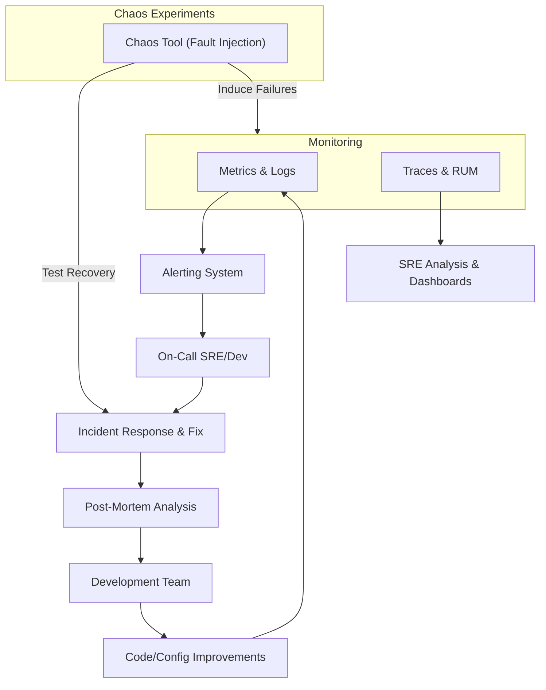

**Observability, SRE & Chaos Engineering (Section 14)**

---
title: "Observability, SRE & Chaos Engineering"
tags: [architecture, observability, sre, monitoring, chaos-engineering, reliability]
aliases: ["Observability", "SRE", "Chaos Engineering", "Reliability"]
created: 2025-04-02 07:45:30
updated: 2025-04-02 07:45:30
---
# Observability, SRE & Chaos Engineering

Running a high-stakes fintech platform like Moneta requires rigorous practices to ensure reliability and resilience. This section covers how Moneta achieves observability (making the system's inner workings visible and understandable), how Site Reliability Engineering (SRE) principles are applied to maintain service levels, and how Chaos Engineering is used to proactively test and improve the system's robustness. Together, these practices help Moneta deliver a stable and trustworthy experience, even under unexpected conditions.

## Observability Framework

Observability in Moneta is built on the three pillars: logs, metrics, and traces, along with user experience monitoring:
- **Centralized Logging:** Every service in Moneta emits structured logs (in JSON format) that include context like request IDs, user IDs (where appropriate, and anonymized if containing PII), and other metadata (version, instance ID). These logs are shipped to a central logging system (for example, an ELK stack or a cloud logging service). This enables developers and SREs to search across all logs, correlate events across services, and perform forensic analysis when something goes wrong. Sensitive data is either omitted or masked in logs to protect privacy.
- **Metrics & Monitoring:** Key performance and business metrics are collected via tools like **Prometheus** (with exporters in each service) or cloud monitor services. These include:
  - Infrastructure metrics (CPU, memory, disk, network for each container and database).
  - Application metrics (e.g., number of logins per minute, trade executions per minute, latency of AI recommendations, success/error rates of API calls).
  - Custom business metrics (portfolio growth rates, user engagement with AI suggestions, etc., which might be used internally to judge feature success).
  These metrics feed into dashboards (using Grafana or Datadog, etc.) where the team has real-time visibility. They also form the basis of alerts (like if error rate > X or response time > Y for Z minutes, page someone).
- **Distributed Tracing:** Given the microservices architecture, a single user request may traverse multiple services. Moneta implements tracing (using **OpenTelemetry** or Jaeger/Zipkin) so that each request has a trace ID propagated through all calls. This way, if a user experienced a slow screen, the team can trace that specific request through the gateway, into say the portfolio service, then to the database, and pinpoint where the delay was. Tracing is invaluable to debug inter-service latency and to optimize complex flows.
- **User Experience Monitoring:** Apart from backend, Moneta monitors from the user perspective:
  - Synthetic transactions: Scripts or bots simulate user actions (login, view portfolio, etc.) periodically and measure if everything works and how long it takes. This catches issues even when no real user is active (especially off hours or in new deployments).
  - Real user monitoring (RUM): The web app might include a snippet to report performance metrics (like page load time, or any JS errors) back to a monitoring service, giving insight into client-side issues and variations across geographies or browsers.
  - Uptime checks: External services ping critical endpoints (health checks, key user flows) from various regions to ensure Moneta is reachable and functioning (like a login-check from London, a portfolio-load from Paris, etc.).

## SRE Practices and Reliability Management

Moneta adopts SRE principles (as championed by Google and others) to keep the system reliable:
- **Service Level Objectives (SLOs):** For each major user journey, SLOs are defined. For example, “99.9% of login attempts succeed within 2 seconds” or “Daily portfolio report generation completes by 6 AM 99% of the time”. These SLOs are derived from business requirements (and tied to SLAs if any are promised to users or partners). SREs continuously monitor these and any breach or near-breach triggers investigation.
- **Error Budgets:** The team agrees on acceptable error rates (the "budget"). If the system is too error-prone (budget exhausted), the focus shifts from releasing new features to improving stability. Conversely, if the system is performing well below error budget, it indicates there's room to push out changes faster. This balances innovation with reliability.
- **On-Call Rotation & Incident Response:** An on-call rotation of SREs/engineers is in place to respond to alerts 24/7. Runbooks are prepared for common issues (e.g., “DB connection pool exhaustion” or “Cache cluster node failure”). The incident response process is clearly defined: what to do first, how to escalate, how to communicate status (both internally and to possibly affected users or on status page).
- **Post-Mortems and Blameless Culture:** After any major incident or SLO miss, the team holds a post-mortem to analyze the root cause and what can be improved. This is done in a blameless manner – focusing on system and process improvements, not individual fault. Action items might include adding a dashboard, improving an alert, adjusting a design, or even updating ADRs if it surfaces a design decision that needs rethinking.
- **Capacity Planning:** Regular load tests (maybe quarterly or before anticipated big user growth events) and analysis of usage trends help forecast when capacity will need to be increased. The SRE team works with business to anticipate events (like marketing campaigns or market volatility periods) to ensure the system is scaled up in advance if needed. This ties back to the scalability approach in section 10.
- **Backup & Recovery Drills:** SRE ensures backups (of databases, etc.) are not only taken but also regularly tested. For example, they might perform a restore test from backup in a staging environment to ensure data integrity and that the process is well-understood. Disaster Recovery (DR) plans, like failing over to another region, are also rehearsed to validate RTO/RPO (Recovery Time and Point Objectives) can be met.

## Chaos Engineering and Resilience Testing

To truly be confident in Moneta’s resilience, the team practices Chaos Engineering:
- **Chaos Experiments:** These are controlled tests where certain failures are induced in the system to verify it behaves as expected (i.e., it’s resilient). Examples include:
  - Shutting down a random instance of a microservice during peak load (shouldn’t affect users if load balancers and retries are correct).
  - Cutting off the connection between services and the database for a short time (should trigger failover or graceful degradation).
  - Simulating high latency or errors on an external API like the market data feed (Moneta’s AI should maybe use cached data or flag the data as stale).
  - Corrupting a message in the event queue or duplicating it to see if idempotency and error handling work.
- **GameDays:** The team schedules “game day” exercises where multiple chaos experiments run, often without the on-call knowing exactly what will happen, to practice incident response and reveal weaknesses. This can involve cross-functional teams (dev, SRE, even business continuity folks) to ensure all aspects (technical and communication) are tested.
- **Gradual Ramp-up:** Initially, chaos tests are done in staging environments. Once confidence grows, some are run in production in a careful manner (like using tools such as Gremlin or Chaos Monkey which can target just one instance at a time, etc.). Of course, production experiments are done on non-critical paths or during lower traffic if possible, and with instant rollback if something goes off.
- **Resilience Patterns:** The architecture incorporates patterns to handle chaos: timeouts, retries with backoff, circuit breakers (if a service is failing, stop hammering it and degrade gracefully), bulkheads (isolating parts so a failure in one doesn’t cascade). Chaos tests validate these patterns. For instance, a circuit breaker’s effectiveness might be confirmed by simulating a dependency failure and seeing that the service trips the breaker and serves a fallback response.
- **Learnings from Chaos:** Every chaos test yields information. Maybe an alert was missing or too slow, maybe a fallback wasn’t working as thought. Those get fed back into improving the system. Over time, the goal is a system that can withstand even unanticipated failures gracefully.

## Feedback into Development

The insights from observability, SLO tracking, and chaos testing are continuously fed back to the development process:
- If certain parts of the system are frequently causing pain (say the AI service’s memory usage is often at risk), it might trigger a redesign or optimization task for engineering.
- SREs and developers collaborate; often SREs contribute to code (like adding more instrumentation or optimizing queries) and developers contribute to reliability (like writing better health checks).
- The culture is one where reliability is a shared responsibility. The SRE team often pairs with dev teams when launching new features to ensure observability and failure handling are baked in from the start (sometimes called "Golden Path" development: you can’t deploy a new service without certain telemetry and fallback features).
- The chaos engineering mindset also influences design: developers think “what if this call fails” by default and use the patterns that are in place rather than assuming everything works perfectly.

> [!diagram] Reliability Architecture & Feedback Loop  
> The diagram shows how monitoring feeds into alerting and incident response, which then loops back as improvements. It also highlights chaos engineering injecting failures and the system recovering. This visualizes the continuous loop of observation, detection, response, and improvement.

In the diagram, monitoring flows into alerting and analysis. On-call handles incidents, leading to post-mortems and then improvements by the dev team, which ultimately enhance the system (closing the loop back into monitoring better metrics or fewer errors). Separately, chaos experiments inject failures to test the system and also invoke incident response processes to ensure they work well when it's practice rather than a real incident.

**In summary,** Moneta’s approach to observability, SRE, and chaos engineering ensures that the platform isn’t just designed well, but also operated well. The team can detect issues quickly, respond effectively, and continually harden the system against failures. By intentionally simulating adversity through chaos engineering, Moneta builds confidence that it can withstand real-world unpredictability — whether it’s a sudden surge in users or a partial outage of an external service — thereby safeguarding user trust and maintaining a high quality of service.