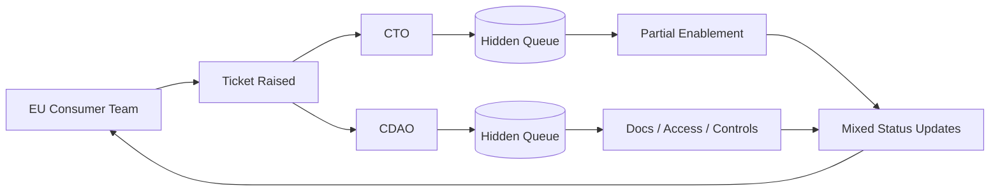
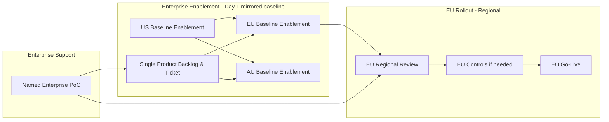
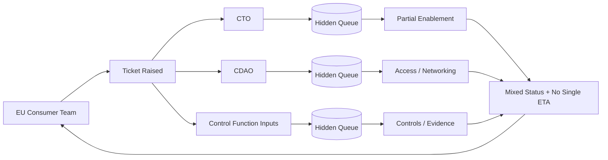
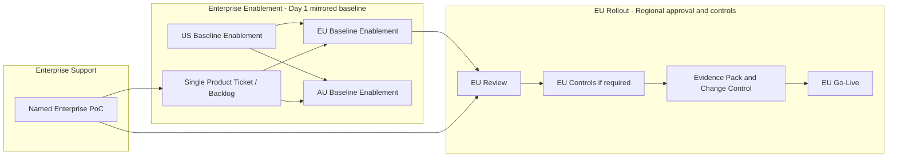

## 1) Naming candidates (C-level safe)

Neutral:

- **Dependency Drag** (recommended)
    
- **Hidden Queueing**
    
- **Cross-Team Latency**
    
- **Enablement Friction**
    
- **Shared-Service Lead Time**
    
- **Operational Handover Tax**
    

Lightly witty (still safe):

- **The Invisible Waiting Room**
    
- **The Relay Race Problem**
    
- **The Queue Behind the Queue**
    
- **The “Not Quite Global” Launch**
    

**Chosen term for the paper:** **Dependency Drag** (simple, non-accusatory, memorable).

---

# Deliverable 1 (v1) — 2-page pre-read draft

## Dependency Drag in AI Enablement

_Pre-read for C-level discussion: improving time-to-value for AI platforms in EU (using Bedrock as the learning case; Claude Code as downstream impact)._

### Executive summary

- We see a recurring **Dependency Drag** pattern in enterprise enablement—especially for EU/International—where multi-team dependencies create hidden queues, unclear ownership, and inconsistent messaging.
    
- This paper focuses on **AI enablement**, where delays have an outsized impact on competitiveness and our ability to become **AI-first**.
    
- **Bedrock** illustrates the problem: “global announcements” without mirrored enablement leads to long EU lead times and loss of momentum.
    
- The primary recommendation is to separate **Enablement** (baseline capability available everywhere) from **Rollout** (regional approvals/controls), with a **single regional owner** and a **named enterprise PoC**.
    
- A complementary option is to treat enablement as a **platform product** with one intake queue, roadmap by region, SLAs, and the product team owning cross-team coordination.
    
- These are not final designs; they’re starting points to **trial**, learn, and iterate.
    
- Success looks like: predictable lead times, single source of truth, clear ownership, and EU controls implemented locally without blocking baseline enablement.
    

### Problem statement

Today’s enablement journey often spans multiple enterprise functions (security patterns, accounts, network boundaries, guardrails, documentation, approvals). The consumer experience is:

- **No single “owner”** accountable for the end-to-end outcome.
    
- **Hidden dependency chains** (work appears “in progress” but is effectively queued elsewhere).
    
- **Mixed messaging** and difficulty aligning priorities once the original launch window has passed.
    
- **EU requirements** become conflated with enablement delays (even when the delay is mostly operating-model friction).
    

In AI enablement, this translates into **lost fluency, slower adoption, and slower delivery of AI-enabled capabilities** to customers and colleagues.

### Evidence from our use cases

**Bedrock**

- EU/International playground accounts arrived **September**, following a US “global announcement” in **March** (≈6 months gap).
    
- Bedrock workload accounts remain unavailable in **EU** (and AU) with **no published timeline**; AI EOPs require workload accounts.
    

**Claude Code (downstream product on Bedrock)**

- US in **August**
    
- AU in **December**
    
- EU in **January**
    

### Recommendation (starting point): Separate Enablement from Rollout

**Enablement (enterprise, Day-1 mirrored):**

- Baseline capability enabled in EU/AU when enabled in US (mirrored infrastructure and standard patterns).
    
- Single intake ticket for enablement status, dependencies, and timeline visibility.
    

**Rollout (regional, owned locally):**

- EU team owns EU regulatory review and any incremental controls.
    
- Enterprise provides a **named PoC** for enablement support and product backlog.
    
- Regions can **inner-source** controls (e.g., guardrails) or submit a request with ETA + SLA.
    

### Complementary option: Productised enablement (“platform as a product”)

- One intake queue, published roadmap by region, support model + SLAs, and product ownership of internal dependencies.
    
- Clear NFR scope: observability/metrics, documentation, contact points.
    

### Before/after (what changes in practice)

**Current Claude Code outcome:** Aug (US) → Jan (EU)  
**Proposed:** Aug enablement in EU (baseline) → EU rollout Sept/Oct with EU-specific guardrail if required (4–6 weeks delay vs ~4 months).

### Business risk / cost-of-delay (qualitative + simple model)

AI enablement delays compound because adoption is a **learning curve**:

- Delay reduces experimentation time, tooling fluency, and internal capability building.
    
- It slows product delivery cycles and the feedback loop needed to operationalise safe AI.
    
- It risks positioning us as “AI-later” while peers become “AI-first”.
    

**Simple placeholder model (no internal numbers required):**  
Cost of delay ≈ (people impacted × time delayed × adoption uplift lost) + (customer value delayed × competitive impact).  
We can validate with a lightweight internal pilot and telemetry.

### Decision points (for the meeting)

- Do we agree **Dependency Drag** is a material issue for EU AI enablement?
    
- Do we endorse **Enablement vs Rollout split** as the first trial?
    
- Do we want a **productised enablement** roadmap/SLAs model now, or as phase 2?
    
- What is the minimum viable service model (owner, ticketing, roadmap hygiene, support)?
    

### Proposed next step / trial (4–8 weeks)

- Choose one AI capability to pilot (e.g., Bedrock workload accounts path or Claude Code enablement pattern).
    
- Stand up one **end-to-end ticket** with dependency tracking and an agreed regional owner + enterprise PoC.
    
- Publish a one-page **EU enablement/rollout checklist** and a lightweight regional roadmap.
    
- Capture metrics: lead time, number of handoffs, clarity of comms, and adoption indicators.
    

### What success looks like (leading indicators)

- EU baseline enablement available at (or near) US launch windows.
    
- Single ticket with dependency visibility and predictable timelines.
    
- Regional controls delivered without blocking baseline enablement.
    
- Increased adoption and reduced “time to first useful outcome” for EU teams.
    

### Discussion prompts

1. Where should end-to-end accountability sit for EU enablement outcomes?
    
2. What must be mirrored Day-1 across regions for AI platforms?
    
3. What is the minimum EU rollout control set we can standardise?
    
4. How do we make dependencies “visible by default” without adding bureaucracy?
    
5. What should the SLA/roadmap commitment look like for enablement?
    
6. How do we scale this pattern beyond AI over time (without boiling the ocean)?
    

---

### Diagram 1 — Current state (fragmented enablement)

### Diagram 2 — Proposed state (Enablement vs Rollout split)

---

# Deliverable 2 (v1) — Appendix draft (deeper detail)

## A1. Taxonomy of failure modes (what “Dependency Drag” looks like)

- **Ownership ambiguity:** no single accountable owner for end-to-end enablement outcome.
    
- **Hidden queues:** dependencies managed across functions with limited consumer visibility.
    
- **Priority misalignment:** when EU enablement starts months after US, teams have moved on and context is lost.
    
- **Roadmap hygiene gaps:** “global announcements” without region-specific roadmap and delivery commitments.
    
- **Comms fragmentation:** inconsistent updates, different interpretations of “done”.
    
- **Support ambiguity:** unclear SLAs and unclear escalation paths; consumers chase multiple contact points.
    
- **Conflation of EU regs with operating-model delay:** regional controls become the explanation for delays even when baseline enablement itself is lagging.
    

## A2. Expanded solution options

### Option 1 (Primary): Enablement vs Rollout split

**Value proposition**

- Faster baseline availability in EU while preserving regional regulatory ownership.
    
- Clear separation of concerns: enterprise enables; region governs rollout.
    

**Service design (minimum viable)**

- One **enablement product owner** (enterprise) for the platform capability.
    
- One **regional rollout owner** (EU) for approvals/controls.
    
- One **named PoC** to coordinate enterprise dependencies for EU.
    
- One ticket (or parent ticket) that is the **system of record**.
    

**NFR expectations**

- Observability and usage metrics for the platform (what’s enabled, who’s using, reliability signals).
    
- Documentation: “how to start”, “known constraints”, “support contacts”, “regional variances”.
    

**Risks / mitigations**

- Risk: mirrored infra increases upfront effort → mitigate with a minimal baseline template and automation.
    
- Risk: regions diverge too much → mitigate with a standard control library + inner source contributions.
    

### Option 2: Productised enablement (“platform as a product”)

**Value proposition**

- Consumers interact with a product interface, not a web of dependencies.
    
- Predictable delivery: roadmap by region + SLAs.
    

**What changes**

- Product team owns dependency management and communicates a single integrated plan.
    

**What stays the same**

- Regional compliance still owned locally; product integrates requirements into backlog transparently.
    

**When to adopt**

- As phase 2 after the enablement/rollout split proves value, or immediately if appetite exists for stronger product operating model.
    

## A3. RACI (illustrative, adapt to your org terms)

- **Enterprise Enablement Product Owner:** Accountable for baseline capability across regions, backlog, roadmap.
    
- **EU Rollout Owner:** Accountable for EU approvals, control requirements, go-live decision.
    
- **Enterprise PoC:** Responsible for coordinating shared-service dependencies; provides status and escalations.
    
- **Shared Services:** Responsible for delivering their components to an agreed timeline.
    
- **Consumer Teams:** Responsible for adoption, feedback, and regional requirements input.
    

## A4. Timeline walkthroughs (current vs proposed)

### Bedrock (playground + workload accounts)

**Current observed**

- March: US “global announcement”
    
- September: International playground availability
    
- Workload accounts: not available in EU/AU; no published timeline (blocks AI EOPs)
    

**Under Option 1**

- March: baseline enablement mirrored into EU/AU alongside US (playground + foundational workload path)
    
- EU rollout proceeds with EU-specific controls where needed, without blocking baseline readiness
    
- Workload accounts become a tracked product roadmap item with EU delivery visibility
    

### Claude Code (on Bedrock)

**Current observed**

- August (US) → January (EU)
    

**Under Option 1 (illustrative)**

- August: EU baseline enablement ready (mirrored infra)
    
- September: EU review identifies any additional guardrail requirements
    
- Early October: controls tested; approval path completed; go-live thereafter  
    (4–6 weeks vs ~4 months)
    

## A5. Cost-of-delay model (explicit assumptions + placeholders)

We avoid forcing internal numbers in the main doc; this model is for internal validation.

**Assumptions (placeholders)**

- P = number of EU engineers/teams affected
    
- D = delay duration (weeks/months)
    
- U = adoption uplift from AI tooling (time saved, throughput, reduced cognitive load)
    
- V = value per unit time of earlier delivery (customer outcomes, adviser efficiency, reduced backlog)
    

**Cost of delay (conceptual)**

- Internal capability cost ≈ P × D × (lost learning + missed reuse)
    
- Delivery cost ≈ delayed cycle time improvements and slower product iteration
    
- Risk cost ≈ slower maturation of guardrails, operational patterns, and safe usage in EU
    

## A6. External evidence on productivity & adoption (balanced)

**Positive / uplift signals (self-reported + task-level estimation)**

- Anthropic reports internal survey-based findings on how AI is changing work, with self-reported productivity improvements and important caveats about measurement. ([Anthropic](https://www.anthropic.com/research/how-ai-is-transforming-work-at-anthropic?utm_source=chatgpt.com "How AI Is Transforming Work at Anthropic"))
    
- Anthropic’s analysis of 100k Claude conversations estimates substantial time reduction on tasks, using model-based evaluation and occupational wage mapping—useful directional signal, but not a controlled trial. ([Anthropic](https://www.anthropic.com/research/estimating-productivity-gains?utm_source=chatgpt.com "Estimating AI productivity gains from Claude conversations"))
    
- Anthropic Economic Index work discusses how AI is being used in software development tasks and where AI concentrates in workflows. ([Anthropic](https://www.anthropic.com/research/impact-software-development?utm_source=chatgpt.com "AI's impact on software development"))
    

**Cautionary / measurement reality checks**

- METR ran a randomised controlled trial with experienced open-source developers using early-2025 AI tools and found developers **took longer** with AI assistance in that setting—highlighting that “feels faster” can diverge from measured throughput, and that task selection and workflow integration matter. ([METR](https://metr.org/blog/2025-07-10-early-2025-ai-experienced-os-dev-study/?utm_source=chatgpt.com "Measuring the Impact of Early-2025 AI on Experienced ..."))
    

**What the evidence suggests (and why we should validate locally)**

- AI tools can deliver meaningful gains in many knowledge tasks and coding workflows, but outcomes depend on task type, workflow design, and guardrails.
    
- Therefore: our operating model should minimise **enablement delay**, and we should run a short EU pilot with telemetry to measure adoption and value under our constraints (security, EU regs, walled gardens).
    

---

# Panel review (v1 critique)

## 1) C-level Chief of Staff

**Strengths**

- Clear framing: system issue, not people.
    
- Crisp recommendation hierarchy (Option 1 first).
    
- Meeting-ready prompts and decision points.
    

**Risks / weaknesses**

- Needs a sharper “why now” competitiveness hook in the first 3 lines.
    
- Executive summary could be tighter and more action-oriented.
    
- Add a clearer ask: what approval/endorsement is needed today?
    

**Actionable edits**

- Add “why now” as a single paragraph after title.
    
- Rewrite exec summary as 6–8 bullets with an explicit ask.
    
- Move the trial proposal into a more concrete mini-plan.
    

## 2) Enterprise Platform Product Lead

**Strengths**

- Productised enablement option is well described.
    
- Correct emphasis on roadmap hygiene and SLAs.
    
- Good “single ticket as system of record” concept.
    

**Risks / weaknesses**

- Needs clearer definition of “baseline enablement” scope to avoid ambiguity.
    
- Risk of duplicated effort if every region builds bespoke controls.
    

**Actionable edits**

- Define baseline enablement components explicitly (accounts, networking pattern, docs, support, telemetry).
    
- Add a “control library + inner source” mechanism and governance.
    
- Add a minimal “definition of done” checklist for enablement.
    

## 3) EU Risk & Compliance Lead

**Strengths**

- Explicitly keeps EU regulatory ownership with EU.
    
- Avoids blaming EU controls for delays.
    
- Mentions auditability and guardrails.
    

**Risks / weaknesses**

- Needs a clearer statement that enablement doesn’t imply approval to use for regulated workloads.
    
- Clarify how evidence, logging, and control effectiveness will be demonstrated.
    

**Actionable edits**

- Add a sentence: “enabled ≠ approved for production use”.
    
- Add a small “audit artefacts” bullet list (policy mapping, testing evidence, change control).
    
- Keep EU AI Act mention out of the main body except as an example.
    

## 4) Engineering Productivity Lead

**Strengths**

- Strong adoption framing (“learning curve” and fluency).
    
- Good diagrams and leading indicators.
    
- Pragmatic trial approach.
    

**Risks / weaknesses**

- Needs a more explicit link from enablement delay to developer experience (DX) and throughput.
    
- Add 2–3 concrete adoption metrics (e.g., time to first successful run, weekly active users).
    

**Actionable edits**

- Add “DX metrics” to success criteria.
    
- Add “golden path” language (paved road).
    
- Add a lightweight enablement playbook artefact list.
    

## 5) Strategy / Value Partner

**Strengths**

- Competitiveness framing is directionally strong.
    
- Cost-of-delay model avoids contentious numbers in the main doc.
    
- Balanced evidence section in appendix.
    

**Risks / weaknesses**

- Needs a stronger statement of consequence: “4 months is a lifetime” but in executive language.
    
- Tie to strategic aim: “becoming an AI-first company” with clearer implications.
    

**Actionable edits**

- Add a one-paragraph “strategic impact” section early.
    
- Include a short “what we risk if we don’t act” bullet list.
    
- Add a sentence on opportunity cost vs peers.
    

---

# Revised final (v2) — 2-page pre-read

## Dependency Drag in EU AI Enablement

_Pre-read for C-level discussion: reducing time-to-value for AI platforms in EU (Bedrock as the learning case; Claude Code as downstream impact)._

### Why now

AI enablement is no longer “a tooling upgrade”; it is a **capability flywheel**. Delays don’t just defer a feature—they defer EU fluency, safe operating patterns, and delivery speed. In an environment where tools and workflows evolve month-to-month, a multi-month enablement lag becomes a structural competitiveness drag.

---

## Executive summary (and the ask)

- We see a recurring **Dependency Drag** pattern in enterprise enablement for EU/International: hidden queues, unclear ownership, and inconsistent status/timelines.
    
- This paper focuses on **AI enablement**, where delay compounds through lost learning, slower adoption, and slower product iteration.
    
- **Bedrock** illustrates the problem: March “global announcement” → September International playground availability; workload accounts still not available in EU/AU with no published timeline (AI EOPs require workload accounts).
    
- **Claude Code** shows downstream impact: US August → EU January.
    
- **Recommendation (starting point to trial):** separate **Enablement** (Day-1 baseline mirrored across regions) from **Rollout** (regional approvals/controls owned locally).
    
- Complementary phase-2 option: run enablement as a **platform product** with one intake queue, regional roadmap, SLAs, and product ownership of cross-team coordination.
    
- **Ask of this session:** agree the issue is material, endorse Option 1 as a 4–8 week pilot, and nominate accountable owners for the pilot (enterprise enablement owner, EU rollout owner, named enterprise PoC).
    

---

## The operating-model problem (system, not teams)

Enablement currently requires coordination across multiple shared services and control functions. The consumer experience often has:

- **No end-to-end accountable owner** for the EU outcome.
    
- **Multiple hidden queues** across dependencies (status exists, but timeline predictability does not).
    
- **Roadmap gaps by region**: “global” announcements without mirrored readiness.
    
- **Context loss over time**: when EU work starts months later, original launch energy and priority alignment have moved on.
    

In AI enablement, this pattern is amplified: adoption is a **learning curve**, and time-to-value depends on a paved road (docs, access, guardrails, support), not just the tool existing somewhere.

---

## Proposed options (with a clear recommendation)

### Option 1 (Recommended first): Separate **Enablement** from **Rollout**

**Principle:** _Enabled everywhere ≠ approved for production use everywhere._

**Enablement (enterprise; Day-1 mirrored baseline)**

- When enabled in US, a **baseline EU enablement** is created in parallel (mirrored infrastructure).
    
- Baseline includes (minimum):
    
    - account / access pattern, network pattern, model invocation path
        
    - initial documentation (“golden path”)
        
    - support contact + escalation
        
    - basic telemetry/observability for usage and reliability
        
- A **single ticket** is the system of record for dependencies, status, and timeline.
    

**Rollout (regional; EU-owned)**

- EU owns EU approvals and any incremental controls (e.g., guardrails), with enterprise support via a **named PoC**.
    
- Regions can **inner-source** controls into a shared control library or request changes with ETA + SLA.
    

**What this achieves**

- Baseline readiness is not blocked by regional controls.
    
- EU can move at EU regulatory speed, without being held behind enablement inertia.
    

---

### Option 2 (Complementary / phase-2): Productised enablement (“platform as a product”)

- Single intake queue; product team manages cross-team dependencies as an internal concern.
    
- One ticket with accurate timeline; published roadmap by region; support model + SLAs.
    
- Clear NFR scope: observability/metrics, documentation, contact points.
    

**How options fit together**

- Option 1 is the fastest path to reduce EU lag immediately.
    
- Option 2 institutionalises the pattern and scales it across platforms once proven.
    

---

## Use cases (before/after)

### Bedrock (learning case)

**Observed**

- March: US “global announcement”
    
- September: International playground availability
    
- Workload accounts: not available in EU/AU; no published timeline (blocks AI EOPs)
    

**Under Option 1**

- March: baseline enablement mirrored in EU/AU alongside US
    
- EU rollout proceeds with EU controls where needed, without blocking baseline readiness
    
- Workload accounts tracked as a transparent product roadmap item with EU delivery visibility
    

### Claude Code (downstream impact)

**Observed**

- US August → EU January
    

**Under Option 1 (illustrative)**

- August: EU baseline enablement ready
    
- September: EU review identifies incremental controls (if required)
    
- Early October: controls tested, approvals complete, go-live thereafter  
    (4–6 weeks vs ~4 months)
    

---

## Business risk / cost-of-delay (qualitative + placeholder model)

**Risk:** AI enablement lag becomes a structural drag on becoming an **AI-first company**—slower learning, slower safe adoption, slower delivery, and reduced competitive pace.

**Placeholder model (for validation, not debate):**  
Cost of delay ≈ (EU teams impacted × delay duration × lost adoption uplift) + (customer value delayed × opportunity cost).  
We propose to validate through an EU pilot with telemetry rather than argue assumptions.

---

## Decision points (today)

- Do we agree Dependency Drag is materially affecting EU AI enablement outcomes?
    
- Do we endorse **Enablement vs Rollout split** as the first pilot pattern?
    
- Who owns the pilot end-to-end (enterprise enablement owner, EU rollout owner, named enterprise PoC)?
    
- What is the minimum “baseline enablement definition of done” we will standardise?
    

---

## Proposed next step / trial (4–8 weeks)

Pilot Option 1 on one concrete capability:

- **Pilot scope:** Bedrock EU workload-account path _or_ Claude Code EU enablement path (choose one).
    
- **Operating model:** one end-to-end ticket + weekly status note + named owners.
    
- **Artefacts:** baseline enablement checklist, EU rollout checklist, and a shared control library approach (inner source).
    
- **Telemetry:** adoption and reliability measures captured from day one.
    

---

## What success looks like (leading indicators)

- EU baseline enablement lands close to US launch windows.
    
- Single ticket provides predictable timelines and dependency visibility.
    
- Time to first successful EU usage drops (paved road).
    
- EU controls delivered locally without blocking baseline enablement.
    
- Adoption indicators rise (e.g., weekly active users, tasks completed, time-to-first-value).
    

---

## Discussion prompts

1. What must be in “baseline enablement” for an AI platform to be meaningfully usable?
    
2. Where does end-to-end accountability sit for EU outcomes?
    
3. What is the minimum EU rollout control set we can standardise and reuse?
    
4. How do we make dependencies visible by default without adding bureaucracy?
    
5. What SLAs/roadmap commitments are appropriate for enablement as a service?
    
6. How do we scale this pattern beyond AI once proven?
    

### Diagram 1 — Current state (fragmented enablement; EU view)

### Diagram 2 — Proposed state (Enablement vs Rollout split)

---

# Revised final (v2) — Appendix

## A1. Failure modes (expanded)

- **End-to-end accountability gap:** “many responsible parties” → “no accountable outcome owner”.
    
- **Hidden queueing:** progress occurs but lead time is non-transparent to the consumer.
    
- **Region-as-afterthought sequencing:** US first → International later; by then priorities and context drift.
    
- **Roadmap/communication mismatch:** global announcements without region-specific delivery commitments.
    
- **Support ambiguity:** unclear SLAs, unclear escalation; consumers chase multiple contacts.
    
- **Regulatory conflation:** EU requirements become a catch-all explanation even when baseline enablement is lagging.
    

## A2. Option details

### Option 1: Enablement vs Rollout split

**Baseline enablement (definition of done — MVP)**

- Access pattern + account model (playground/workload path as applicable)
    
- Network pattern + invocation routing (documented)
    
- Core documentation: “golden path” start guide, known constraints
    
- Support model: named PoC + escalation path
    
- Telemetry: usage/reliability signals; status of enablement by region
    

**Control library (to avoid bespoke per region)**

- Establish a shared “EU controls” library and inner-source contributions where feasible.
    
- Publish minimal interfaces: what evidence is required, how controls are tested, how changes are approved.
    

**Audit artefacts (EU)**

- Control mapping to EU requirements (high-level)
    
- Test evidence + change control records
    
- Operational logging/monitoring expectations (what is captured, retention, access)
    

### Option 2: Productised enablement

**Service model**

- One intake queue; one system-of-record ticket.
    
- Published regional roadmap and delivery windows (updated, not aspirational).
    
- Support SLAs (response and resolution targets appropriate to criticality).
    
- Platform NFR ownership: documentation, observability, reliability posture.
    

**When to adopt**

- Start with Option 1 pilot for speed; evolve into Option 2 once baseline definition and governance are proven.
    

## A3. Timeline walkthroughs

### Bedrock

**Observed**

- March: US “global announcement”
    
- September: International playground availability
    
- Workload accounts: not available in EU/AU; no published timeline (blocks AI EOPs)
    

**Under Option 1**

- March: EU baseline enablement created in parallel with US enablement
    
- EU rollout proceeds for regulated usage with EU ownership
    
- Workload account availability becomes a tracked roadmap item with EU visibility and predictable comms
    

### Claude Code

**Observed**

- US August → AU December → EU January
    

**Under Option 1 (illustrative)**

- August: baseline enablement ready in EU
    
- September: EU review identifies incremental needs
    
- Early October: control implementation/testing complete; approvals and go-live  
    (4–6 weeks vs ~4 months)
    

## A4. Cost-of-delay model (expanded; no internal numbers required)

**Conceptual drivers**

- **Capability drag:** delayed tool fluency and safe operating patterns in EU.
    
- **Delivery drag:** longer cycle times; fewer experiments; slower iteration.
    
- **Opportunity cost:** delayed customer and colleague value; peers compound learning faster.
    

**Model (placeholders)**

- P = number of EU teams impacted
    
- D = delay duration
    
- U = adoption uplift (throughput/quality/learning)
    
- V = customer/business value deferred
    
- **Cost of delay** ≈ (P × D × U) + V + competitive opportunity cost
    

**Validation approach**

- Use pilot telemetry + structured feedback, not theoretical debate:
    
    - time-to-first-value, weekly active users, adoption funnel, defect/rework signals, support ticket volume.
        

## A5. External evidence: productivity & adoption (balanced)

**Directional uplift signals**

- Anthropic’s internal survey-based research describes how AI is changing work at Anthropic and reports self-reported productivity gains alongside important measurement caveats. ([Anthropic](https://www.anthropic.com/research/how-ai-is-transforming-work-at-anthropic?utm_source=chatgpt.com "How AI Is Transforming Work at Anthropic"))
    
- Anthropic’s analysis of 100,000 Claude conversations estimates large reductions in task completion time using model-based evaluation and occupational wage mapping (useful as directional evidence; not a controlled trial). ([Anthropic](https://www.anthropic.com/research/estimating-productivity-gains?utm_source=chatgpt.com "Estimating AI productivity gains from Claude conversations"))
    
- Anthropic Economic Index work outlines how AI is used in software development tasks and where it concentrates within development workflows. ([Anthropic](https://www.anthropic.com/research/impact-software-development?utm_source=chatgpt.com "AI's impact on software development"))
    

**Cautionary counterpoint**

- METR’s randomised controlled trial on experienced open-source developers found slower completion times with early-2025 AI tools in that setting, illustrating that productivity impact depends on workflow, task choice, and integration. ([METR](https://metr.org/blog/2025-07-10-early-2025-ai-experienced-os-dev-study/?utm_source=chatgpt.com "Measuring the Impact of Early-2025 AI on Experienced ..."))
    

**Implication for our operating model**

- Whether uplift is +20% or −20% in any given micro-workflow, the operating-model conclusion is stable:
    
    - We should remove **enablement delay** as a bottleneck,
        
    - enable safe experimentation quickly in EU,
        
    - and measure outcomes through an EU pilot under our guardrails and constraints.
        

---

## Change log (v1 → v2)

- Added a stronger **“Why now”** competitiveness hook and made the **ask explicit** (endorse a pilot + nominate owners).
    
- Clarified **“enabled ≠ approved”** and strengthened EU compliance boundary language.
    
- Defined **baseline enablement “definition of done”** to remove ambiguity.
    
- Added “control library + inner source” mechanism to avoid bespoke regional divergence.
    
- Strengthened **success metrics** with DX/adoption indicators and added “paved road/golden path” framing.
    
- Kept EU AI Act detail primarily in appendix; minimal mention in main doc.
    

If you want, I can now convert the v2 2-pager into a **single-slide meeting opener** (same story: problem → recommendation → pilot plan → metrics) with one simplified diagram and a sharp “ask” banner.